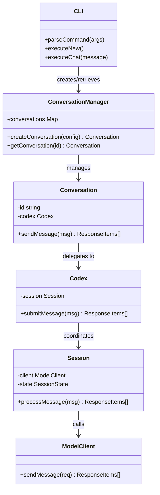
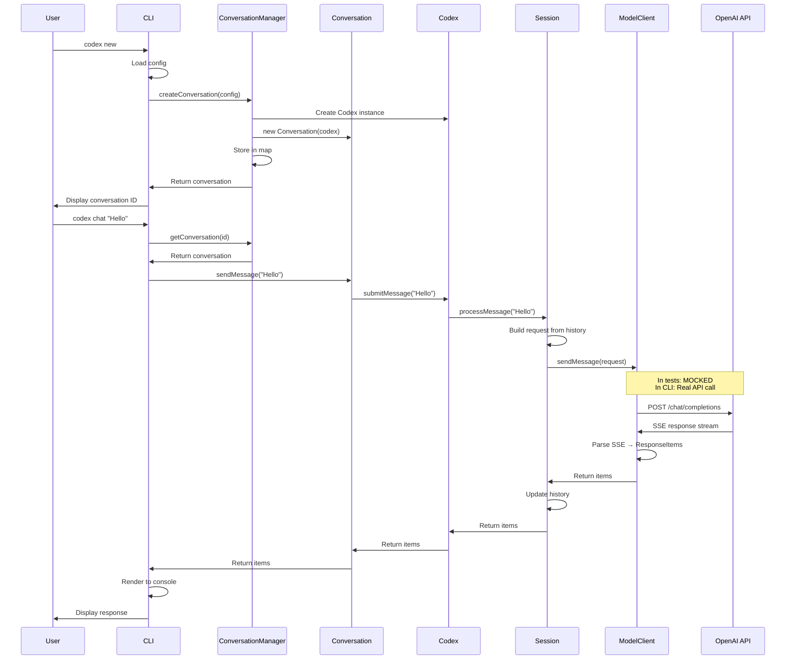

## ASSISTANT

✅ **Refinement plan captured and committed.**

**Brain dump now complete with:**
- Core principles (~13k tokens)
- Two-tier refinement structure (Constitutional + Reference layers)
- Productization vision (open source, MCP, education)
- Processing plan (7 steps to refined docs)

**Total: ~15k tokens of methodology.**

**Ready to continue planning. Should we:**
1. Finish TECH-APPROACH Section 1 (Current State & Deltas)?
2. Move to Phase 1 section (diagram + technical approach)?
3. Take a break and come back to planning?


## USER

how big is your context. when you get close to 500k I want to do another careful custom trim job to bring you back to 150-200 ish


## ASSISTANT


## ASSISTANT

**296k / 1M tokens used (30%)**

704k tokens remaining.

Still plenty of room - I'll let you know when I hit 450-500k.

Continue with TECH-APPROACH planning?


## USER

perfect. yup let's continue with tech-approach planning


## ASSISTANT


## ASSISTANT

**Writing Section 1 Current State & Deltas to TECH-APPROACH.md:**


## ASSISTANT

```json
// TOOL: Edit (id: toolu_01P1mefrXEn6rPxy4EM3KEXX)
{
  "file_path": "/Users/leemoore/code/codex-port-02/docs/projects/02-ui-integration-phases/TECH-APPROACH.md",
  "old_string": "**Testing boundary:** Library layer (ConversationManager and below). External boundaries mocked. CLI tested separately with mocked library.\n\n---\n\n## [Remaining sections TBD]\n\n",
  "new_string": "**Testing boundary:** Library layer (ConversationManager and below). External boundaries mocked. CLI tested separately with mocked library.\n\n### Current State & Deltas\n\n**Post-Port Foundation**\n\nThe Rust → TypeScript port (Phases 1-6) delivered a complete but unintegrated library. Core functionality exists—conversation management, multi-provider LLM clients, tool execution, persistence, authentication—but these components have never been wired together for actual user interaction. Each module has unit tests validating isolated behavior, but no end-to-end workflows verify the system works as a whole.\n\n**Port Completion Metrics**\n\n75 modules ported across 6 phases, 1,876 tests passing with zero TypeScript errors and zero ESLint errors. Complete library layer functional, ready for integration. All ported code maintains strict type safety, follows Rust patterns, and preserves original behavior.\n\n**Ported components include:**\n- Protocol layer (8 modules): Types, message formats, configuration schemas, event definitions\n- Core orchestration (3 modules): ConversationManager, Codex, Session state management\n- Persistence (2 modules): Config loader (TOML), Rollout recorder (JSONL)\n- Client layer (15+ modules): ModelClient with Responses, Chat, Messages API adapters, SSE parsing, provider abstraction\n- Tool system (12+ modules): ToolRegistry, ToolRouter, 12 tool handlers, MCP integration, approval flow\n- Auth (6 modules): AuthManager, API key storage, ChatGPT OAuth, keyring integration\n- Utilities (20+ modules): Git operations, file operations, execution engine, sandboxing\n\n**Core Codex Integration Points**\n\nThis project wires the core integration chain for the first time: CLI commands invoke ConversationManager methods, ConversationManager delegates to Codex orchestrator, Codex coordinates Session state and manages the conversation loop, Session routes to ModelClient for LLM communication and ToolRouter for tool execution, results flow back through the layers to CLI display. These integration points are defined in ported code but never exercised together. This project validates the integration works and exposes any gaps in the design.\n\n**What's Being Added**\n\nWe're layering new capabilities onto the ported foundation while preserving the core library unchanged. The additions fall into four categories: a new CLI layer for user interaction, enhancements to ported capabilities, a new testing infrastructure, and API specifications for future extension.\n\n**CLI Layer (Greenfield)**\n\nThe original Codex CLI uses Ratatui (Rust terminal UI library) which doesn't port to TypeScript without significant rework. Rather than attempt a Ratatui port immediately, we're building a simple baseline CLI with three interaction modes: interactive REPL for human users, one-shot command mode for agent and script usage, and JSON output mode for programmatic consumption. This multi-mode approach makes the CLI testable from day one (agents can drive it via commands, assert on JSON output) while keeping the implementation straightforward (plain console output, no complex terminal rendering).\n\nThe simple baseline serves multiple purposes: provides immediate user access for validation, establishes patterns for future UI enhancements, maintains modes suitable for automation and testing, and avoids locking us into a specific terminal UI framework. Later, we can layer Rich-TS features (Tables, Panels, Markdown rendering) incrementally on top of this foundation without changing the core modes. The testable, agent-accessible foundation remains stable while presentation evolves.\n\n**CLI components being built:**\n- Command parser using Commander.js (handles arguments, flags, help text)\n- Interactive REPL loop (read-eval-print for conversational usage)\n- One-shot command execution (single command, execute, exit)\n- JSON output formatter (structured output for automation)\n- Display renderer (console output with tool execution visibility)\n- Approval prompts (CLI-based approval for dangerous tools)\n- Dual-mode configuration (batch text display, no token-by-token streaming)\n\n**Enhancements to Ported Code**\n\nWhile most ported modules remain unchanged, we're adding targeted capabilities that extend Phase 4-5 work. The Messages API adapter (Phase 4.2) exists but hasn't been used in complete conversation workflows—this project tests it end-to-end. ChatGPT OAuth (Phase 5) works, but we're adding Claude OAuth by reading tokens from ~/.claude keyring (no flow implementation, just token retrieval). Provider switching exists in config but has no CLI interface—we're adding commands to switch providers at runtime.\n\n**Specific additions:**\n- Anthropic OAuth token retrieval from ~/.claude keyring\n- CLI commands for provider switching (set-provider, list-providers)\n- CLI commands for auth method switching (login, set-auth)\n- Tool execution display (print tools as they execute, not just final results)\n\n**Testing Infrastructure (New Strategy)**\n\nTraditional unit tests worked for porting (Rust tests provided known-good reference), but integration testing requires a different approach. We're implementing mocked-service tests: integration-level tests written at library API boundaries with all external dependencies mocked (ModelClient API calls, JSONL filesystem writes, tool process execution). These tests exercise complete workflows through the library while remaining fast, deterministic, and runnable offline.\n\n**Testing components:**\n- tests/mocked-service/ directory (integration tests at library contracts)\n- tests/mocks/ directory (reusable mock implementations for external services)\n- Mock ModelClient (returns predefined responses, no network)\n- Mock RolloutRecorder (in-memory JSONL, no filesystem)\n- Mock AuthManager (stub token retrieval, no keyring/OAuth)\n- Mock tool execution (stub exec/apply/read, no actual process/file operations)\n- Contract test templates (patterns for testing library boundaries)\n\n**API Specifications (Documentation)**\n\nAs we wire the system, we're documenting two API surfaces: the TypeScript library API for developers building on @openai/codex-core, and the REST API design for future HTTP wrapper implementation. Library API documents public exports, method signatures, usage examples, and contract boundaries. REST API documents endpoints, request/response formats, and authentication patterns (design only, implementation deferred).\n\n**Documentation being created:**\n- docs/api/library-api.md (TypeScript library public surface)\n- docs/api/rest-api.md (HTTP wrapper endpoint design)\n- Integration examples (create conversation, send message, execute tools, persist/resume)\n- Contract boundary documentation (what to test, what to mock)\n\n---\n\n## [Remaining sections TBD]\n\n"
}
```


## USER

[
  {
    "tool_use_id": "toolu_01P1mefrXEn6rPxy4EM3KEXX",
    "type": "tool_result",
    "content": "The file /Users/leemoore/code/codex-port-02/docs/projects/02-ui-integration-phases/TECH-APPROACH.md has been updated. Here's the result of running `cat -n` on a snippet of the edited file:\n    80→4. External calls (API, filesystem, tools) cross boundaries\n    81→5. Results flow back through layers\n    82→6. CLI displays to user\n    83→\n    84→**Testing boundary:** Library layer (ConversationManager and below). External boundaries mocked. CLI tested separately with mocked library.\n    85→\n    86→### Current State & Deltas\n    87→\n    88→**Post-Port Foundation**\n    89→\n    90→The Rust → TypeScript port (Phases 1-6) delivered a complete but unintegrated library. Core functionality exists—conversation management, multi-provider LLM clients, tool execution, persistence, authentication—but these components have never been wired together for actual user interaction. Each module has unit tests validating isolated behavior, but no end-to-end workflows verify the system works as a whole.\n    91→\n    92→**Port Completion Metrics**\n    93→\n    94→75 modules ported across 6 phases, 1,876 tests passing with zero TypeScript errors and zero ESLint errors. Complete library layer functional, ready for integration. All ported code maintains strict type safety, follows Rust patterns, and preserves original behavior.\n    95→\n    96→**Ported components include:**\n    97→- Protocol layer (8 modules): Types, message formats, configuration schemas, event definitions\n    98→- Core orchestration (3 modules): ConversationManager, Codex, Session state management\n    99→- Persistence (2 modules): Config loader (TOML), Rollout recorder (JSONL)\n   100→- Client layer (15+ modules): ModelClient with Responses, Chat, Messages API adapters, SSE parsing, provider abstraction\n   101→- Tool system (12+ modules): ToolRegistry, ToolRouter, 12 tool handlers, MCP integration, approval flow\n   102→- Auth (6 modules): AuthManager, API key storage, ChatGPT OAuth, keyring integration\n   103→- Utilities (20+ modules): Git operations, file operations, execution engine, sandboxing\n   104→\n   105→**Core Codex Integration Points**\n   106→\n   107→This project wires the core integration chain for the first time: CLI commands invoke ConversationManager methods, ConversationManager delegates to Codex orchestrator, Codex coordinates Session state and manages the conversation loop, Session routes to ModelClient for LLM communication and ToolRouter for tool execution, results flow back through the layers to CLI display. These integration points are defined in ported code but never exercised together. This project validates the integration works and exposes any gaps in the design.\n   108→\n   109→**What's Being Added**\n   110→\n   111→We're layering new capabilities onto the ported foundation while preserving the core library unchanged. The additions fall into four categories: a new CLI layer for user interaction, enhancements to ported capabilities, a new testing infrastructure, and API specifications for future extension.\n   112→\n   113→**CLI Layer (Greenfield)**\n   114→\n   115→The original Codex CLI uses Ratatui (Rust terminal UI library) which doesn't port to TypeScript without significant rework. Rather than attempt a Ratatui port immediately, we're building a simple baseline CLI with three interaction modes: interactive REPL for human users, one-shot command mode for agent and script usage, and JSON output mode for programmatic consumption. This multi-mode approach makes the CLI testable from day one (agents can drive it via commands, assert on JSON output) while keeping the implementation straightforward (plain console output, no complex terminal rendering).\n   116→\n   117→The simple baseline serves multiple purposes: provides immediate user access for validation, establishes patterns for future UI enhancements, maintains modes suitable for automation and testing, and avoids locking us into a specific terminal UI framework. Later, we can layer Rich-TS features (Tables, Panels, Markdown rendering) incrementally on top of this foundation without changing the core modes. The testable, agent-accessible foundation remains stable while presentation evolves.\n   118→\n   119→**CLI components being built:**\n   120→- Command parser using Commander.js (handles arguments, flags, help text)\n   121→- Interactive REPL loop (read-eval-print for conversational usage)\n   122→- One-shot command execution (single command, execute, exit)\n   123→- JSON output formatter (structured output for automation)\n   124→- Display renderer (console output with tool execution visibility)\n   125→- Approval prompts (CLI-based approval for dangerous tools)\n   126→- Dual-mode configuration (batch text display, no token-by-token streaming)\n   127→\n   128→**Enhancements to Ported Code**\n   129→\n   130→While most ported modules remain unchanged, we're adding targeted capabilities that extend Phase 4-5 work. The Messages API adapter (Phase 4.2) exists but hasn't been used in complete conversation workflows—this project tests it end-to-end. ChatGPT OAuth (Phase 5) works, but we're adding Claude OAuth by reading tokens from ~/.claude keyring (no flow implementation, just token retrieval). Provider switching exists in config but has no CLI interface—we're adding commands to switch providers at runtime.\n   131→\n   132→**Specific additions:**\n   133→- Anthropic OAuth token retrieval from ~/.claude keyring\n   134→- CLI commands for provider switching (set-provider, list-providers)\n   135→- CLI commands for auth method switching (login, set-auth)\n   136→- Tool execution display (print tools as they execute, not just final results)\n   137→\n   138→**Testing Infrastructure (New Strategy)**\n   139→\n   140→Traditional unit tests worked for porting (Rust tests provided known-good reference), but integration testing requires a different approach. We're implementing mocked-service tests: integration-level tests written at library API boundaries with all external dependencies mocked (ModelClient API calls, JSONL filesystem writes, tool process execution). These tests exercise complete workflows through the library while remaining fast, deterministic, and runnable offline.\n   141→\n   142→**Testing components:**\n   143→- tests/mocked-service/ directory (integration tests at library contracts)\n   144→- tests/mocks/ directory (reusable mock implementations for external services)\n   145→- Mock ModelClient (returns predefined responses, no network)\n   146→- Mock RolloutRecorder (in-memory JSONL, no filesystem)\n   147→- Mock AuthManager (stub token retrieval, no keyring/OAuth)\n   148→- Mock tool execution (stub exec/apply/read, no actual process/file operations)\n   149→- Contract test templates (patterns for testing library boundaries)\n   150→\n   151→**API Specifications (Documentation)**\n   152→\n   153→As we wire the system, we're documenting two API surfaces: the TypeScript library API for developers building on @openai/codex-core, and the REST API design for future HTTP wrapper implementation. Library API documents public exports, method signatures, usage examples, and contract boundaries. REST API documents endpoints, request/response formats, and authentication patterns (design only, implementation deferred).\n   154→\n   155→**Documentation being created:**\n   156→- docs/api/library-api.md (TypeScript library public surface)\n   157→- docs/api/rest-api.md (HTTP wrapper endpoint design)\n   158→- Integration examples (create conversation, send message, execute tools, persist/resume)\n   159→- Contract boundary documentation (what to test, what to mock)\n   160→\n   161→---\n   162→\n   163→## [Remaining sections TBD]\n   164→\n   165→"
  }
]


## ASSISTANT


## ASSISTANT

**Section 1 complete. Now Section 2: Phase 1 Deep Dive**

Here's my draft:

---

## 2. Phase 1: Basic Chat Flow

### Phase 1 Target State

```
User Terminal
     ↓
┌─────────────────────────────────────┐
│  CLI Commands (NEW)                 │
│  ┌─────────┐  ┌─────────────┐      │
│  │  codex  │  │    codex    │      │
│  │   new   │  │  chat "msg" │      │
│  └────┬────┘  └─────┬───────┘      │
│       │             │               │
│       └─────────────┘               │
│              ▼                       │
│       Command Handler (NEW)         │
└─────────────┬───────────────────────┘
              ▼
┌─────────────────────────────────────┐
│  ConversationManager (EXISTS)       │
│  ┌─────────────────────────────┐   │
│  │  createConversation()       │   │
│  │  ┌──────────────────────┐   │   │
│  │  │  NEW: Initial wiring │   │   │
│  │  └──────────────────────┘   │   │
│  └──────────┬──────────────────┘   │
└─────────────┼──────────────────────┘
              ▼
┌─────────────────────────────────────┐
│  Codex / Session (EXISTS)           │
│  conversation loop                  │
└─────────────┬───────────────────────┘
              ▼
┌─────────────────────────────────────┐
│  ModelClient (EXISTS)               │
│  Responses API only (Phase 1)       │
│  ┌─────────────────────────────┐   │
│  │  ACTIVATED: First real use  │   │
│  └─────────────────────────────┘   │
└─────────────┬───────────────────────┘
              ▼
        OpenAI API
       (MOCKED in tests)
```

**Highlighted (NEW/ACTIVATED):** CLI commands, command handler, initial ConversationManager wiring, first real ModelClient usage.

### Integration Approach

Phase 1 proves the core conversation flow works end-to-end. We wire CLI commands to ConversationManager, Manager to Codex, Codex to Session, Session to ModelClient (Responses API only). This is the first time these pieces talk to each other. Start with single provider (OpenAI Responses) and single auth method (API key) to minimize variables. Once basic flow works, subsequent phases add providers and auth methods.

The integration happens in layers. First, build CLI command parser that accepts `new` and `chat` commands. Commands call thin handler functions. Handlers import ConversationManager and call its methods. ConversationManager already knows how to delegate to Codex—that wiring exists from port. Codex already knows how to use ModelClient—that exists too. Our job is to wire the CLI → Manager connection and verify the Manager → Codex → Client chain actually works.

Testing uses mocked ModelClient. No real API calls during test. Mock returns predefined responses for any message. This lets us verify conversation flow (create → send → receive → history updated) without network dependencies, API keys, or rate limits. Fast, deterministic, repeatable.

### Technical Deltas

**New code (CLI layer):**
- src/cli/index.ts: Main CLI entry, Commander.js setup
- src/cli/commands/new.ts: Create conversation command
- src/cli/commands/chat.ts: Send message command
- src/cli/display.ts: Console rendering (batch mode)
- src/cli/config.ts: Load ~/.codex/config.toml

**New code (testing):**
- tests/mocked-service/conversation-flow.test.ts: End-to-end conversation tests
- tests/mocks/model-client.ts: Mock ModelClient with preset responses

**Wiring points:**
- CLI command handlers → ConversationManager.createConversation()
- CLI chat command → Conversation.sendMessage()
- Display renderer subscribes to... wait, we're not using events. Display just prints response after await.

**Configuration:**
- Read provider + model from config
- Read API key from config
- Single provider: openai, single API: responses

**Estimated new code:** ~400 lines (CLI layer ~300, tests ~100)

### Contracts Defined

**ConversationManager.createConversation():**
```
Input: ConversationConfig {provider: 'openai', model: string, auth: {type: 'api-key', key: string}}
Output: Promise<Conversation>
Side effects: Conversation stored in manager, Codex session initialized
Errors: ConfigurationError if config invalid
```

**Conversation.sendMessage():**
```
Input: message: string
Output: Promise<ResponseItems[]>
Side effects: Message added to history, sent to ModelClient, response added to history
Errors: NetworkError if API call fails, AuthError if unauthorized
```

**Mocks required:**
- ModelClient.sendMessage() → returns mock ResponseItems
- No filesystem mocks yet (not using persistence in Phase 1)
- No tool mocks yet (not using tools in Phase 1)

### Verification Approach

**Functional verification (manual):**
1. Run `codex new` → conversation created, ID displayed
2. Run `codex chat "Hello"` → response received, displayed to console
3. Run `codex chat "Tell me a joke"` → second response, maintains context
4. Verify: Can have multi-turn conversation

**Technical verification (automated):**
```typescript
// tests/mocked-service/conversation-flow.test.ts
it('creates conversation and sends message', async () => {
  const mockClient = createMockClient([
    {items: [{type: 'message', role: 'assistant', content: 'Hi there'}]}
  ]);

  const manager = new ConversationManager({client: mockClient});
  const conv = await manager.createConversation(config);
  const response = await conv.sendMessage("Hello");

  expect(conv.id).toBeDefined();
  expect(response.length).toBeGreaterThan(0);
  expect(mockClient.sendMessage).toHaveBeenCalled();
});
```

**Quality gates:**
- Tests pass: mocked-service/conversation-flow.test.ts
- TypeScript: 0 errors
- ESLint: 0 errors
- CLI commands work: `codex new`, `codex chat "test"`

**Code review:** Run 2-stage review (traditional + port validation) before marking complete.

---

**That's Section 2 (Phase 1). Good structure for the remaining phase sections?**


## USER

this is good. move the diagram between Integration approach and technical delta's. also  can you put a mermaid UML diagram after delta's defined  to lay out how the actual modules/classes go together. This kind of document at the right level for me is what my eye goes right towards to grasp key elements of a tech design. Namely what are the components. what are the public members of that component and how do they talk to other pbulic members of other components. This is key info that quickly tells me how coherent and comprehendable a core deesign is and how well it will hold up over time. Then after the mermaid uml class/modeule diagram a detailed sections going through the connection points and then after all that a sequence diagram end to end. This is all high signal bridging down in tech and if you handed an good agent that, they could probably deliver it most of the time. and it's easier to think through and create while we are laying out phase 1. then after sequence diagram go into verification approach. I'm usually not a fan of code examples in these docs but I see why this is good here so let's keep it. let's also define that as vitest, a seperate grouping of tests from the unit tests and we refer back to our service-mock testing approach. 


## ASSISTANT


## ASSISTANT

**Restructuring Phase 1 section with diagrams at optimal points:**

---

## 2. Phase 1: Basic Chat Flow

### Integration Approach

Phase 1 proves the core conversation flow works end-to-end. We wire CLI commands to ConversationManager, Manager to Codex, Codex to Session, Session to ModelClient (Responses API only). This is the first time these pieces talk to each other. Start with single provider (OpenAI Responses) and single auth method (API key) to minimize variables. Once basic flow works, subsequent phases add providers and auth methods.

The integration happens in layers. First, build CLI command parser that accepts `new` and `chat` commands. Commands call thin handler functions. Handlers import ConversationManager and call its methods. ConversationManager already knows how to delegate to Codex—that wiring exists from port. Codex already knows how to use ModelClient—that exists too. Our job is to wire the CLI → Manager connection and verify the Manager → Codex → Client chain actually works.

Testing uses mocked ModelClient. No real API calls during test. Mock returns predefined responses for any message. This lets us verify conversation flow (create → send → receive → history updated) without network dependencies, API keys, or rate limits. Fast, deterministic, repeatable.

### Phase 1 Target State

```
User Terminal
     ↓
┌─────────────────────────────────────┐
│  CLI Commands (NEW)                 │
│  ┌─────────┐  ┌─────────────┐      │
│  │  codex  │  │    codex    │      │
│  │   new   │  │  chat "msg" │      │
│  └────┬────┘  └─────┬───────┘      │
│       │             │               │
│       └─────────────┘               │
│              ▼                       │
│       Command Handler (NEW)         │
└─────────────┬───────────────────────┘
              ▼
┌─────────────────────────────────────┐
│  ConversationManager (EXISTS)       │
│  ┌─────────────────────────────┐   │
│  │  createConversation()       │   │
│  │  ┌──────────────────────┐   │   │
│  │  │  NEW: Initial wiring │   │   │
│  │  └──────────────────────┘   │   │
│  └──────────┬──────────────────┘   │
└─────────────┼──────────────────────┘
              ▼
┌─────────────────────────────────────┐
│  Codex / Session (EXISTS)           │
│  conversation loop                  │
└─────────────┬───────────────────────┘
              ▼
┌─────────────────────────────────────┐
│  ModelClient (EXISTS)               │
│  Responses API only (Phase 1)       │
│  ┌─────────────────────────────┐   │
│  │  ACTIVATED: First real use  │   │
│  └─────────────────────────────┘   │
└─────────────┬───────────────────────┘
              ▼
        OpenAI API
       (MOCKED in tests)
```

**Highlighted:** CLI commands (NEW), command handler (NEW), ConversationManager wiring (NEW), ModelClient activation (first real use).

### Technical Deltas

**New code (CLI layer):**
- src/cli/index.ts: Main CLI entry, Commander.js setup
- src/cli/commands/new.ts: Create conversation command
- src/cli/commands/chat.ts: Send message command
- src/cli/display.ts: Console rendering (batch mode)
- src/cli/config.ts: Load ~/.codex/config.toml

**New code (testing):**
- tests/mocked-service/phase-1-conversation-flow.test.ts: End-to-end conversation tests (vitest, separate from unit tests)
- tests/mocks/model-client.ts: Mock ModelClient with preset responses

**Wiring points:**
- CLI command handlers → ConversationManager.createConversation()
- CLI chat command → Conversation.sendMessage()
- Display renderer prints response after await (simple async/await, no events)

**Configuration:**
- Read provider + model from config.toml
- Read OpenAI API key from config
- Single provider: openai, single API: responses

**Estimated new code:** ~400 lines (CLI layer ~300, mocked-service tests ~100)

### Contracts Defined

**ConversationManager.createConversation():**
```typescript
Input: ConversationConfig {
  provider: 'openai',
  model: string,
  auth: {type: 'api-key', key: string}
}
Output: Promise<Conversation>
Side effects: Conversation stored in manager, Codex session initialized
Errors: ConfigurationError if config invalid
```

**Conversation.sendMessage():**
```typescript
Input: message: string
Output: Promise<ResponseItems[]>
Side effects: Message added to history, sent to ModelClient, response added to history
Errors: NetworkError if API call fails, AuthError if unauthorized
```

**Mocks required:**
- ModelClient.sendMessage() → returns mock ResponseItems (no network)
- Config loader → returns test config (no filesystem)

### Component Integration



### Connection Points

**CLI → ConversationManager:**
- CLI imports ConversationManager class
- `new` command calls `manager.createConversation(config)`
- Returns Conversation instance, CLI stores reference
- `chat` command retrieves Conversation, calls `sendMessage()`

**ConversationManager → Conversation:**
- Manager creates Conversation instance during createConversation()
- Passes Codex instance to Conversation constructor
- Stores in internal Map keyed by conversation ID
- getConversation() retrieves from Map

**Conversation → Codex:**
- Conversation holds reference to Codex instance
- sendMessage() delegates to Codex.submitMessage()
- Awaits response, returns to caller (CLI)

**Codex → Session:**
- Codex manages Session lifecycle
- Session coordinates ModelClient calls
- Session maintains conversation state
- Session returns ResponseItems to Codex

**Session → ModelClient:**
- Session constructs request from conversation history
- Calls ModelClient.sendMessage(request)
- Receives ResponseItems[] (parsed from SSE)
- Updates conversation history with items

**Key integration point: ConversationManager initialization.**
Must provide ModelClient instance. CLI creates client based on config (provider, model, auth). Passes to Manager constructor. This is the critical wiring—CLI must construct dependencies correctly.

### End-to-End Flow



### Verification Approach

**Functional verification (manual CLI testing):**
1. Run `codex new` with valid config → conversation ID displayed, no errors
2. Run `codex chat "Hello"` → response from model displayed
3. Run `codex chat "What did I just say?"` → model has context from previous turn
4. Verify: Multi-turn conversation maintains history

**Mocked-service testing (automated, vitest):**

Tests located in `tests/mocked-service/phase-1-conversation-flow.test.ts`, using vitest framework in separate test suite from unit tests. See `docs/core/contract-testing-tdd-philosophy.md` for mocked-service testing approach.

```typescript
describe('Phase 1: Basic Conversation Flow', () => {
  let mockClient: MockModelClient;
  let manager: ConversationManager;

  beforeEach(() => {
    mockClient = createMockClient([
      {items: [{type: 'message', role: 'assistant', content: [{type: 'text', text: 'Hello!'}]}]}
    ]);
    manager = new ConversationManager({client: mockClient});
  });

  it('creates conversation and sends message', async () => {
    const config = {provider: 'openai', model: 'gpt-4', auth: {type: 'api-key', key: 'test'}};
    const conv = await manager.createConversation(config);
    
    expect(conv.id).toBeDefined();
    
    const response = await conv.sendMessage("Hello");
    
    expect(mockClient.sendMessage).toHaveBeenCalled();
    expect(response.length).toBeGreaterThan(0);
    expect(response[0].type).toBe('message');
  });

  it('maintains conversation history across turns', async () => {
    const conv = await manager.createConversation(config);
    
    await conv.sendMessage("First message");
    await conv.sendMessage("Second message");
    
    expect(mockClient.sendMessage).toHaveBeenCalledTimes(2);
    // Verify second call included first message in history
    const secondCall = mockClient.sendMessage.mock.calls[1][0];
    expect(secondCall.messages.length).toBeGreaterThan(1);
  });
});
```

**Quality gates:**
- Mocked-service tests: All passing (conversation-flow.test.ts)
- Unit tests: Baseline maintained (1,876 still passing)
- TypeScript: `npx tsc --noEmit` → 0 errors
- ESLint: `npm run lint` → 0 errors
- Format: `npm run format` → no changes
- Combined: All checks pass in sequence

**Code review (2-stage with GPT-5-Codex):**
- Stage 1: Traditional review (standards, security, maintainability)
- Stage 2: Port validation (integration points match Rust patterns, no missed functionality)

---

**Better flow with diagrams positioned for maximum clarity?**

