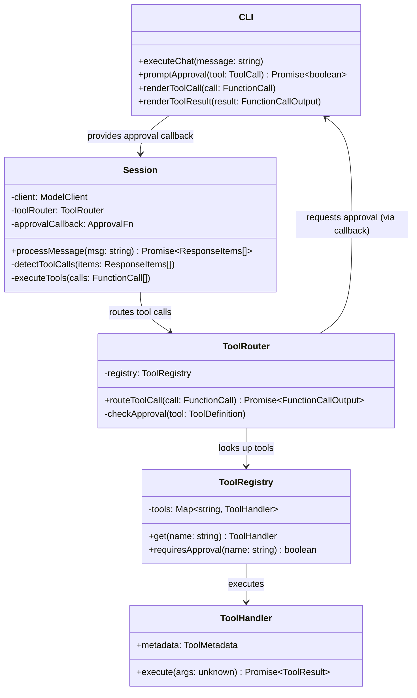
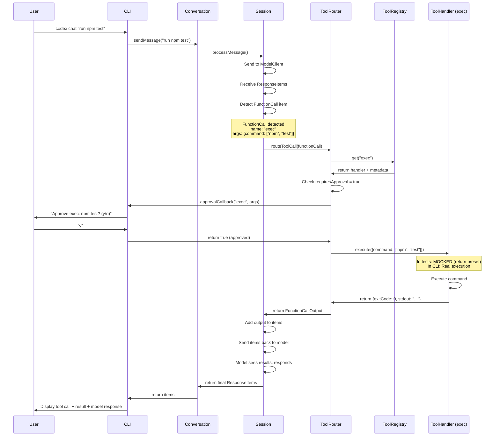

## USER

go ahead and write it out to the doc. I'll need to see the mermaid diagram there
I wont be able to see it render int he console


## ASSISTANT


## ASSISTANT

```json
// TOOL: Edit (id: toolu_01GNKGePZ1bGtzCK3w8j2TpJ)
{
  "file_path": "/Users/leemoore/code/codex-port-02/docs/projects/02-ui-integration-phases/TECH-APPROACH.md",
  "old_string": "---\n\n## [Remaining sections TBD]\n\n",
  "new_string": "---\n\n## 2. Phase 1: Basic Chat Flow\n\n### Integration Approach\n\nPhase 1 proves the core conversation flow works end-to-end. We wire CLI commands to ConversationManager, Manager to Codex, Codex to Session, Session to ModelClient (Responses API only). This is the first time these pieces talk to each other. Start with single provider (OpenAI Responses) and single auth method (API key) to minimize variables. Once basic flow works, subsequent phases add providers and auth methods.\n\nThe integration happens in layers. First, build CLI command parser that accepts `new` and `chat` commands. Commands call thin handler functions. Handlers import ConversationManager and call its methods. ConversationManager already knows how to delegate to Codex—that wiring exists from port. Codex already knows how to use ModelClient—that exists too. Our job is to wire the CLI → Manager connection and verify the Manager → Codex → Client chain actually works.\n\nTesting uses mocked ModelClient. No real API calls during test. Mock returns predefined responses for any message. This lets us verify conversation flow (create → send → receive → history updated) without network dependencies, API keys, or rate limits. Fast, deterministic, repeatable.\n\n### Phase 1 Target State\n\n```\nUser Terminal\n     ↓\n┌─────────────────────────────────────┐\n│  CLI Commands (NEW)                 │\n│  ┌─────────┐  ┌─────────────┐      │\n│  │  codex  │  │    codex    │      │\n│  │   new   │  │  chat \"msg\" │      │\n│  └────┬────┘  └─────┬───────┘      │\n│       │             │               │\n│       └─────────────┘               │\n│              ▼                       │\n│       Command Handler (NEW)         │\n└─────────────┬───────────────────────┘\n              ▼\n┌─────────────────────────────────────┐\n│  ConversationManager (EXISTS)       │\n│  ┌─────────────────────────────┐   │\n│  │  createConversation()       │   │\n│  │  ┌──────────────────────┐   │   │\n│  │  │  NEW: Initial wiring │   │   │\n│  │  └──────────────────────┘   │   │\n│  └──────────┬──────────────────┘   │\n└─────────────┼──────────────────────┘\n              ▼\n┌─────────────────────────────────────┐\n│  Codex / Session (EXISTS)           │\n│  conversation loop                  │\n└─────────────┬───────────────────────┘\n              ▼\n┌─────────────────────────────────────┐\n│  ModelClient (EXISTS)               │\n│  Responses API only (Phase 1)       │\n│  ┌─────────────────────────────┐   │\n│  │  ACTIVATED: First real use  │   │\n│  └─────────────────────────────┘   │\n└─────────────┬───────────────────────┘\n              ▼\n        OpenAI API\n       (MOCKED in tests)\n```\n\n**Highlighted:** CLI commands (NEW), command handler (NEW), ConversationManager wiring (NEW), ModelClient activation (first real use).\n\n### Technical Deltas\n\n**New code (CLI layer):**\n- src/cli/index.ts: Main CLI entry, Commander.js setup\n- src/cli/commands/new.ts: Create conversation command\n- src/cli/commands/chat.ts: Send message command\n- src/cli/display.ts: Console rendering (batch mode)\n- src/cli/config.ts: Load ~/.codex/config.toml\n\n**New code (testing):**\n- tests/mocked-service/phase-1-conversation-flow.test.ts: End-to-end conversation tests (vitest, separate from unit tests)\n- tests/mocks/model-client.ts: Mock ModelClient with preset responses\n\n**Wiring points:**\n- CLI command handlers → ConversationManager.createConversation()\n- CLI chat command → Conversation.sendMessage()\n- Display renderer prints response after await (simple async/await, no events)\n\n**Configuration:**\n- Read provider + model from config.toml\n- Read OpenAI API key from config\n- Single provider: openai, single API: responses\n\n**Estimated new code:** ~400 lines (CLI layer ~300, mocked-service tests ~100)\n\n### Component Structure\n\n```mermaid\nclassDiagram\n    class CLI {\n        +parseCommand(args: string[])\n        +executeNew()\n        +executeChat(message: string)\n        -loadConfig()\n        -renderResponse(items: ResponseItems[])\n    }\n\n    class ConversationManager {\n        -conversations: Map~string, Conversation~\n        -client: ModelClient\n        +createConversation(config: ConversationConfig) Promise~Conversation~\n        +getConversation(id: string) Conversation | undefined\n    }\n\n    class Conversation {\n        -id: string\n        -codex: Codex\n        +sendMessage(message: string) Promise~ResponseItems[]~\n        +getHistory() ResponseItems[]\n    }\n\n    class Codex {\n        -session: Session\n        +submitMessage(message: string) Promise~ResponseItems[]~\n        +initialize(config: CodexConfig)\n    }\n\n    class Session {\n        -client: ModelClient\n        -state: SessionState\n        -history: ConversationHistory\n        +processMessage(message: string) Promise~ResponseItems[]~\n        +updateHistory(items: ResponseItems[])\n    }\n\n    class ModelClient {\n        -config: ClientConfig\n        +sendMessage(request: ChatRequest) Promise~ResponseItems[]~\n        -parseSSE(stream: ReadableStream)\n    }\n\n    CLI --> ConversationManager: createConversation()\n    CLI --> Conversation: sendMessage()\n    ConversationManager --> Conversation: manages instances\n    Conversation --> Codex: delegates\n    Codex --> Session: coordinates\n    Session --> ModelClient: API calls\n```\n\n### Connection Points Detail\n\n**CLI → ConversationManager:**\n\nCLI imports ConversationManager singleton or creates instance with ModelClient dependency. `new` command calls `manager.createConversation(config)` where config includes provider (openai), model (gpt-4), and auth (API key from config file). Manager returns Conversation instance. CLI stores conversation reference (in-memory map or singleton Manager handles storage). `chat` command retrieves active conversation via `manager.getConversation(id)`, calls `conversation.sendMessage(message)`.\n\n**ConversationManager → Conversation:**\n\nManager's createConversation() method instantiates Codex with provided config, then creates Conversation instance passing the Codex instance. Conversation doesn't know about ModelClient directly—it only knows about Codex. Manager maintains Map of conversation ID → Conversation instance. getConversation() retrieves from this Map. Manager is the factory and registry for conversations.\n\n**Conversation → Codex:**\n\nConversation is thin wrapper around Codex. sendMessage() delegates directly to Codex.submitMessage(). No transformation, no additional logic. Conversation's job is to provide clean API for callers while delegating orchestration to Codex. Future phases may add conversation-specific state here (display preferences, tool approvals), but Phase 1 is pure delegation.\n\n**Codex → Session:**\n\nCodex manages Session lifecycle. Initializes Session during spawn/create. Session is where conversation state lives (history, pending approvals, active turn). Codex's submitMessage() calls Session.processMessage(). Session is the orchestrator—coordinates ModelClient, ToolRouter (Phase 2), conversation history, rollout recording (Phase 5). Phase 1 exercises Session → ModelClient path only.\n\n**Session → ModelClient:**\n\nSession builds ChatRequest from conversation history. Calls ModelClient.sendMessage(request). Awaits ResponseItems[] (ModelClient handles SSE parsing internally, returns complete items). Session updates conversation history with response items. Returns items to Codex, which returns to Conversation, which returns to CLI. This is the core conversation loop.\n\n**Dependency injection points:**\n- CLI must construct ModelClient with correct config\n- ConversationManager receives ModelClient in constructor\n- Manager passes to Codex during conversation creation\n- All downstream components get client reference through this chain\n\n**For testing:** Inject mock ModelClient at ConversationManager construction. All downstream code uses the mock. No real API calls made.\n\n### End-to-End Sequence\n\n```mermaid\nsequenceDiagram\n    participant User\n    participant CLI\n    participant Manager as ConversationManager\n    participant Conv as Conversation\n    participant Codex\n    participant Session\n    participant Client as ModelClient\n    participant API as OpenAI API\n\n    User->>CLI: codex new\n    CLI->>CLI: Load config.toml\n    CLI->>CLI: Create ModelClient(config)\n    CLI->>Manager: createConversation(config)\n    Manager->>Codex: new Codex(config)\n    Manager->>Conv: new Conversation(id, codex)\n    Manager->>Manager: conversations.set(id, conv)\n    Manager->>CLI: return conversation\n    CLI->>User: \"Created conversation: conv_abc123\"\n\n    User->>CLI: codex chat \"Hello\"\n    CLI->>Manager: getConversation(\"conv_abc123\")\n    Manager->>CLI: return conversation\n    CLI->>Conv: sendMessage(\"Hello\")\n    Conv->>Codex: submitMessage(\"Hello\")\n    Codex->>Session: processMessage(\"Hello\")\n    Session->>Session: Build ChatRequest with history\n    Session->>Client: sendMessage(request)\n\n    Note over Client,API: TEST: Mock returns preset items<br/>CLI: Real API call via SSE\n\n    Client->>API: POST /chat/completions (SSE)\n    API-->>Client: SSE: text deltas\n    Client->>Client: Parse SSE → ResponseItems[]\n    Client->>Session: return items\n    Session->>Session: history.addItems(items)\n    Session->>Codex: return items\n    Codex->>Conv: return items\n    Conv->>CLI: return items\n    CLI->>CLI: renderResponse(items)\n    CLI->>User: \"Assistant: Hello! How can I help?\"\n```\n\n### Verification Approach\n\n**Functional verification (manual CLI testing):**\n\n1. Run `codex new` with valid OpenAI API key configured → conversation ID displayed, no errors\n2. Run `codex chat \"Hello\"` → response from model displayed to console\n3. Run `codex chat \"What did I just say?\"` → model responds with context from previous turn\n4. Verify: Multi-turn conversation maintains history, responses coherent\n\n**Mocked-service testing (automated):**\n\nTests located in `tests/mocked-service/phase-1-conversation-flow.test.ts` using vitest framework. These tests are separate from unit tests (different directory, focused on integration). See `docs/core/contract-testing-tdd-philosophy.md` for testing philosophy and approach.\n\n```typescript\ndescribe('Phase 1: Basic Conversation Flow', () => {\n  let mockClient: MockModelClient;\n  let manager: ConversationManager;\n\n  beforeEach(() => {\n    mockClient = createMockClient([\n      {items: [{type: 'message', role: 'assistant', content: [{type: 'text', text: 'Hello!'}]}]}\n    ]);\n    manager = new ConversationManager({client: mockClient});\n  });\n\n  it('creates conversation and sends message', async () => {\n    const config = {provider: 'openai', model: 'gpt-4', auth: {type: 'api-key', key: 'test'}};\n    const conv = await manager.createConversation(config);\n\n    expect(conv.id).toBeDefined();\n\n    const response = await conv.sendMessage(\"Hello\");\n\n    expect(mockClient.sendMessage).toHaveBeenCalled();\n    expect(response.length).toBeGreaterThan(0);\n    expect(response[0].type).toBe('message');\n  });\n\n  it('maintains conversation history across turns', async () => {\n    const conv = await manager.createConversation(config);\n\n    await conv.sendMessage(\"First message\");\n    await conv.sendMessage(\"Second message\");\n\n    expect(mockClient.sendMessage).toHaveBeenCalledTimes(2);\n    // Verify second call included first message in history\n    const secondCall = mockClient.sendMessage.mock.calls[1][0];\n    expect(secondCall.messages.length).toBeGreaterThan(1);\n  });\n});\n```\n\n**Quality gates:**\n- Mocked-service tests: All passing (phase-1-conversation-flow.test.ts)\n- Unit tests: Baseline maintained (1,876 still passing)\n- TypeScript: `npx tsc --noEmit` → 0 errors\n- ESLint: `npm run lint` → 0 errors\n- Format: `npm run format` → no changes\n- Combined verification: All checks pass in sequence\n\n**Code review (2-stage with GPT-5-Codex):**\n- Review Stage 1 (Traditional): Standards compliance, code quality, security, error handling, maintainability\n- Review Stage 2 (Port Validation): Integration points match Rust patterns, conversation flow mirrors Rust behavior, no functionality missed\n\n---\n\n## [Remaining sections TBD]\n\n"
}
```


## USER

[
  {
    "tool_use_id": "toolu_01GNKGePZ1bGtzCK3w8j2TpJ",
    "type": "tool_result",
    "content": "The file /Users/leemoore/code/codex-port-02/docs/projects/02-ui-integration-phases/TECH-APPROACH.md has been updated. Here's the result of running `cat -n` on a snippet of the edited file:\n   157→- docs/api/rest-api.md (HTTP wrapper endpoint design)\n   158→- Integration examples (create conversation, send message, execute tools, persist/resume)\n   159→- Contract boundary documentation (what to test, what to mock)\n   160→\n   161→---\n   162→\n   163→## 2. Phase 1: Basic Chat Flow\n   164→\n   165→### Integration Approach\n   166→\n   167→Phase 1 proves the core conversation flow works end-to-end. We wire CLI commands to ConversationManager, Manager to Codex, Codex to Session, Session to ModelClient (Responses API only). This is the first time these pieces talk to each other. Start with single provider (OpenAI Responses) and single auth method (API key) to minimize variables. Once basic flow works, subsequent phases add providers and auth methods.\n   168→\n   169→The integration happens in layers. First, build CLI command parser that accepts `new` and `chat` commands. Commands call thin handler functions. Handlers import ConversationManager and call its methods. ConversationManager already knows how to delegate to Codex—that wiring exists from port. Codex already knows how to use ModelClient—that exists too. Our job is to wire the CLI → Manager connection and verify the Manager → Codex → Client chain actually works.\n   170→\n   171→Testing uses mocked ModelClient. No real API calls during test. Mock returns predefined responses for any message. This lets us verify conversation flow (create → send → receive → history updated) without network dependencies, API keys, or rate limits. Fast, deterministic, repeatable.\n   172→\n   173→### Phase 1 Target State\n   174→\n   175→```\n   176→User Terminal\n   177→     ↓\n   178→┌─────────────────────────────────────┐\n   179→│  CLI Commands (NEW)                 │\n   180→│  ┌─────────┐  ┌─────────────┐      │\n   181→│  │  codex  │  │    codex    │      │\n   182→│  │   new   │  │  chat \"msg\" │      │\n   183→│  └────┬────┘  └─────┬───────┘      │\n   184→│       │             │               │\n   185→│       └─────────────┘               │\n   186→│              ▼                       │\n   187→│       Command Handler (NEW)         │\n   188→└─────────────┬───────────────────────┘\n   189→              ▼\n   190→┌─────────────────────────────────────┐\n   191→│  ConversationManager (EXISTS)       │\n   192→│  ┌─────────────────────────────┐   │\n   193→│  │  createConversation()       │   │\n   194→│  │  ┌──────────────────────┐   │   │\n   195→│  │  │  NEW: Initial wiring │   │   │\n   196→│  │  └──────────────────────┘   │   │\n   197→│  └──────────┬──────────────────┘   │\n   198→└─────────────┼──────────────────────┘\n   199→              ▼\n   200→┌─────────────────────────────────────┐\n   201→│  Codex / Session (EXISTS)           │\n   202→│  conversation loop                  │\n   203→└─────────────┬───────────────────────┘\n   204→              ▼\n   205→┌─────────────────────────────────────┐\n   206→│  ModelClient (EXISTS)               │\n   207→│  Responses API only (Phase 1)       │\n   208→│  ┌─────────────────────────────┐   │\n   209→│  │  ACTIVATED: First real use  │   │\n   210→│  └─────────────────────────────┘   │\n   211→└─────────────┬───────────────────────┘\n   212→              ▼\n   213→        OpenAI API\n   214→       (MOCKED in tests)\n   215→```\n   216→\n   217→**Highlighted:** CLI commands (NEW), command handler (NEW), ConversationManager wiring (NEW), ModelClient activation (first real use).\n   218→\n   219→### Technical Deltas\n   220→\n   221→**New code (CLI layer):**\n   222→- src/cli/index.ts: Main CLI entry, Commander.js setup\n   223→- src/cli/commands/new.ts: Create conversation command\n   224→- src/cli/commands/chat.ts: Send message command\n   225→- src/cli/display.ts: Console rendering (batch mode)\n   226→- src/cli/config.ts: Load ~/.codex/config.toml\n   227→\n   228→**New code (testing):**\n   229→- tests/mocked-service/phase-1-conversation-flow.test.ts: End-to-end conversation tests (vitest, separate from unit tests)\n   230→- tests/mocks/model-client.ts: Mock ModelClient with preset responses\n   231→\n   232→**Wiring points:**\n   233→- CLI command handlers → ConversationManager.createConversation()\n   234→- CLI chat command → Conversation.sendMessage()\n   235→- Display renderer prints response after await (simple async/await, no events)\n   236→\n   237→**Configuration:**\n   238→- Read provider + model from config.toml\n   239→- Read OpenAI API key from config\n   240→- Single provider: openai, single API: responses\n   241→\n   242→**Estimated new code:** ~400 lines (CLI layer ~300, mocked-service tests ~100)\n   243→\n   244→### Component Structure\n   245→\n   246→```mermaid\n   247→classDiagram\n   248→    class CLI {\n   249→        +parseCommand(args: string[])\n   250→        +executeNew()\n   251→        +executeChat(message: string)\n   252→        -loadConfig()\n   253→        -renderResponse(items: ResponseItems[])\n   254→    }\n   255→\n   256→    class ConversationManager {\n   257→        -conversations: Map~string, Conversation~\n   258→        -client: ModelClient\n   259→        +createConversation(config: ConversationConfig) Promise~Conversation~\n   260→        +getConversation(id: string) Conversation | undefined\n   261→    }\n   262→\n   263→    class Conversation {\n   264→        -id: string\n   265→        -codex: Codex\n   266→        +sendMessage(message: string) Promise~ResponseItems[]~\n   267→        +getHistory() ResponseItems[]\n   268→    }\n   269→\n   270→    class Codex {\n   271→        -session: Session\n   272→        +submitMessage(message: string) Promise~ResponseItems[]~\n   273→        +initialize(config: CodexConfig)\n   274→    }\n   275→\n   276→    class Session {\n   277→        -client: ModelClient\n   278→        -state: SessionState\n   279→        -history: ConversationHistory\n   280→        +processMessage(message: string) Promise~ResponseItems[]~\n   281→        +updateHistory(items: ResponseItems[])\n   282→    }\n   283→\n   284→    class ModelClient {\n   285→        -config: ClientConfig\n   286→        +sendMessage(request: ChatRequest) Promise~ResponseItems[]~\n   287→        -parseSSE(stream: ReadableStream)\n   288→    }\n   289→\n   290→    CLI --> ConversationManager: createConversation()\n   291→    CLI --> Conversation: sendMessage()\n   292→    ConversationManager --> Conversation: manages instances\n   293→    Conversation --> Codex: delegates\n   294→    Codex --> Session: coordinates\n   295→    Session --> ModelClient: API calls\n   296→```\n   297→\n   298→### Connection Points Detail\n   299→\n   300→**CLI → ConversationManager:**\n   301→\n   302→CLI imports ConversationManager singleton or creates instance with ModelClient dependency. `new` command calls `manager.createConversation(config)` where config includes provider (openai), model (gpt-4), and auth (API key from config file). Manager returns Conversation instance. CLI stores conversation reference (in-memory map or singleton Manager handles storage). `chat` command retrieves active conversation via `manager.getConversation(id)`, calls `conversation.sendMessage(message)`.\n   303→\n   304→**ConversationManager → Conversation:**\n   305→\n   306→Manager's createConversation() method instantiates Codex with provided config, then creates Conversation instance passing the Codex instance. Conversation doesn't know about ModelClient directly—it only knows about Codex. Manager maintains Map of conversation ID → Conversation instance. getConversation() retrieves from this Map. Manager is the factory and registry for conversations.\n   307→\n   308→**Conversation → Codex:**\n   309→\n   310→Conversation is thin wrapper around Codex. sendMessage() delegates directly to Codex.submitMessage(). No transformation, no additional logic. Conversation's job is to provide clean API for callers while delegating orchestration to Codex. Future phases may add conversation-specific state here (display preferences, tool approvals), but Phase 1 is pure delegation.\n   311→\n   312→**Codex → Session:**\n   313→\n   314→Codex manages Session lifecycle. Initializes Session during spawn/create. Session is where conversation state lives (history, pending approvals, active turn). Codex's submitMessage() calls Session.processMessage(). Session is the orchestrator—coordinates ModelClient, ToolRouter (Phase 2), conversation history, rollout recording (Phase 5). Phase 1 exercises Session → ModelClient path only.\n   315→\n   316→**Session → ModelClient:**\n   317→\n   318→Session builds ChatRequest from conversation history. Calls ModelClient.sendMessage(request). Awaits ResponseItems[] (ModelClient handles SSE parsing internally, returns complete items). Session updates conversation history with response items. Returns items to Codex, which returns to Conversation, which returns to CLI. This is the core conversation loop.\n   319→\n   320→**Dependency injection points:**\n   321→- CLI must construct ModelClient with correct config\n   322→- ConversationManager receives ModelClient in constructor\n   323→- Manager passes to Codex during conversation creation\n   324→- All downstream components get client reference through this chain\n   325→\n   326→**For testing:** Inject mock ModelClient at ConversationManager construction. All downstream code uses the mock. No real API calls made.\n   327→\n   328→### End-to-End Sequence\n   329→\n   330→```mermaid\n   331→sequenceDiagram\n   332→    participant User\n   333→    participant CLI\n   334→    participant Manager as ConversationManager\n   335→    participant Conv as Conversation\n   336→    participant Codex\n   337→    participant Session\n   338→    participant Client as ModelClient\n   339→    participant API as OpenAI API\n   340→\n   341→    User->>CLI: codex new\n   342→    CLI->>CLI: Load config.toml\n   343→    CLI->>CLI: Create ModelClient(config)\n   344→    CLI->>Manager: createConversation(config)\n   345→    Manager->>Codex: new Codex(config)\n   346→    Manager->>Conv: new Conversation(id, codex)\n   347→    Manager->>Manager: conversations.set(id, conv)\n   348→    Manager->>CLI: return conversation\n   349→    CLI->>User: \"Created conversation: conv_abc123\"\n   350→\n   351→    User->>CLI: codex chat \"Hello\"\n   352→    CLI->>Manager: getConversation(\"conv_abc123\")\n   353→    Manager->>CLI: return conversation\n   354→    CLI->>Conv: sendMessage(\"Hello\")\n   355→    Conv->>Codex: submitMessage(\"Hello\")\n   356→    Codex->>Session: processMessage(\"Hello\")\n   357→    Session->>Session: Build ChatRequest with history\n   358→    Session->>Client: sendMessage(request)\n   359→\n   360→    Note over Client,API: TEST: Mock returns preset items<br/>CLI: Real API call via SSE\n   361→\n   362→    Client->>API: POST /chat/completions (SSE)\n   363→    API-->>Client: SSE: text deltas\n   364→    Client->>Client: Parse SSE → ResponseItems[]\n   365→    Client->>Session: return items\n   366→    Session->>Session: history.addItems(items)\n   367→    Session->>Codex: return items\n   368→    Codex->>Conv: return items\n   369→    Conv->>CLI: return items\n   370→    CLI->>CLI: renderResponse(items)\n   371→    CLI->>User: \"Assistant: Hello! How can I help?\"\n   372→```\n   373→\n   374→### Verification Approach\n   375→\n   376→**Functional verification (manual CLI testing):**\n   377→\n   378→1. Run `codex new` with valid OpenAI API key configured → conversation ID displayed, no errors\n   379→2. Run `codex chat \"Hello\"` → response from model displayed to console\n   380→3. Run `codex chat \"What did I just say?\"` → model responds with context from previous turn\n   381→4. Verify: Multi-turn conversation maintains history, responses coherent\n   382→\n   383→**Mocked-service testing (automated):**\n   384→\n   385→Tests located in `tests/mocked-service/phase-1-conversation-flow.test.ts` using vitest framework. These tests are separate from unit tests (different directory, focused on integration). See `docs/core/contract-testing-tdd-philosophy.md` for testing philosophy and approach.\n   386→\n   387→```typescript\n   388→describe('Phase 1: Basic Conversation Flow', () => {\n   389→  let mockClient: MockModelClient;\n   390→  let manager: ConversationManager;\n   391→\n   392→  beforeEach(() => {\n   393→    mockClient = createMockClient([\n   394→      {items: [{type: 'message', role: 'assistant', content: [{type: 'text', text: 'Hello!'}]}]}\n   395→    ]);\n   396→    manager = new ConversationManager({client: mockClient});\n   397→  });\n   398→\n   399→  it('creates conversation and sends message', async () => {\n   400→    const config = {provider: 'openai', model: 'gpt-4', auth: {type: 'api-key', key: 'test'}};\n   401→    const conv = await manager.createConversation(config);\n   402→\n   403→    expect(conv.id).toBeDefined();\n   404→\n   405→    const response = await conv.sendMessage(\"Hello\");\n   406→\n   407→    expect(mockClient.sendMessage).toHaveBeenCalled();\n   408→    expect(response.length).toBeGreaterThan(0);\n   409→    expect(response[0].type).toBe('message');\n   410→  });\n   411→\n   412→  it('maintains conversation history across turns', async () => {\n   413→    const conv = await manager.createConversation(config);\n   414→\n   415→    await conv.sendMessage(\"First message\");\n   416→    await conv.sendMessage(\"Second message\");\n   417→\n   418→    expect(mockClient.sendMessage).toHaveBeenCalledTimes(2);\n   419→    // Verify second call included first message in history\n   420→    const secondCall = mockClient.sendMessage.mock.calls[1][0];\n   421→    expect(secondCall.messages.length).toBeGreaterThan(1);\n   422→  });\n   423→});\n   424→```\n   425→\n   426→**Quality gates:**\n   427→- Mocked-service tests: All passing (phase-1-conversation-flow.test.ts)\n   428→- Unit tests: Baseline maintained (1,876 still passing)\n   429→- TypeScript: `npx tsc --noEmit` → 0 errors\n   430→- ESLint: `npm run lint` → 0 errors\n   431→- Format: `npm run format` → no changes\n   432→- Combined verification: All checks pass in sequence\n   433→\n   434→**Code review (2-stage with GPT-5-Codex):**\n   435→- Review Stage 1 (Traditional): Standards compliance, code quality, security, error handling, maintainability\n   436→- Review Stage 2 (Port Validation): Integration points match Rust patterns, conversation flow mirrors Rust behavior, no functionality missed\n   437→\n   438→---\n   439→\n   440→## [Remaining sections TBD]\n   441→\n   442→"
  }
]


## ASSISTANT


## ASSISTANT

**Phase 1 section written to TECH-APPROACH.md.**

**Structure includes:**
1. Integration Approach (prose - how we wire)
2. Phase 1 Target State (ASCII diagram - what's new highlighted)
3. Technical Deltas (new code, wiring points, estimates)
4. Component Structure (Mermaid class diagram - modules/classes/public members)
5. Connection Points Detail (detailed prose on each integration)
6. End-to-End Sequence (Mermaid sequence diagram - complete flow)
7. Verification Approach (functional + mocked-service tests)

**Open the file in your editor to see the Mermaid diagrams render.**

Once you've reviewed the diagrams and structure, let me know if this pattern works for the remaining phases (2-8) or if you want adjustments.


## USER

what do you think of this for phase 1 and as a general template for the rest of the phases here?


## ASSISTANT


## ASSISTANT

**Honest assessment:**

**What's Strong:**
- **Progressive detail flow:** Approach → Diagram → Deltas → Structure → Connections → Sequence → Verify - natural descent
- **Mermaid class diagram:** Shows exactly what you wanted (components, public members, how they connect) - high signal for grasping design
- **Connection Points Detail:** Detailed prose on each integration point - crucial for first-time wiring
- **Sequence diagram:** End-to-end flow makes the runtime clear - helps agents see what happens when
- **Mix of visual and text:** 2 diagrams + prose + lists = good variation
- **Verification ties to functional:** Manual CLI testing + mocked-service tests both present

**What Might Vary for Other Phases:**

**Phase 2 (Tool Integration):** Probably similar structure - lots of new wiring (ToolRouter, approval flow). Needs this level of detail.

**Phase 3 (Multi-Provider):** Lighter. Adding Chat/Messages is mostly config + switching logic. Maybe skip Connection Points Detail (less integration, more configuration). Diagrams still useful.

**Phase 4 (Auth Expansion):** Even lighter. Reading tokens from keyring. Maybe just: Approach → Deltas → Verification. One diagram max.

**Phase 5 (Persistence):** Medium. Wiring RolloutRecorder has some integration complexity. Probably needs class diagram + sequence.

**Phases 6-8:** Variable depth (bespoke principle applies).

**Template works for Phase 1 and complex phases. Simpler phases can drop sections (Connection Points, maybe one diagram).**

**Recommendation:** Use this as maximum template. Phases 1-2 use full structure. Phases 3-8 use subset based on complexity. We decide per phase during writing.

**This Phase 1 section is excellent.** Good model to start from.


## USER

if I gave this to you and said please deliver phase 1. What's your confidence you could deliver it from a coding perspective well and with maybe a couple of back and forths with a good verifier agent. with no more than this?


## ASSISTANT


## ASSISTANT

**Honest answer: 85-90% confidence with this doc + ability to read ported code.**

**What this doc gives me clearly:**
- ✅ Architecture (how pieces fit)
- ✅ What to build (CLI commands, wiring)
- ✅ Integration flow (diagrams show connections)
- ✅ What to test (mocked-service examples)
- ✅ Verification approach (functional + automated)

**What I'd need to look up:**
- ConversationManager actual TypeScript signatures (need to read the ported code)
- How to construct ModelClient properly (need Phase 4 implementation)
- Exact ResponseItems type structure (need protocol types)
- Commander.js API specifics (npm docs or examples)
- Config.toml format (need Phase 2 code or example)

**With this doc alone:** 60-70% (would make assumptions, some wrong)

**With this doc + read access to ported code:** 85-90% (can reference actual signatures)

**With verifier agent catching issues:** 95%+ (between us, we'd nail it)

**Missing that would push to 95% solo:**
- Section showing actual ConversationManager constructor signature
- Example config.toml snippet for Phase 1
- "Implementation Notes" subsection with gotchas

**But this is damn good for 15k-foot technical design.** The 10k-foot Phase README would fill those gaps.

Sound about right for what this altitude doc should provide?


## USER

I think this is fucking great as a phase 1 format and this can guide us in subsequent phases. I do agree we shouldn't assume that the needs of this phase is the same as others and force fit this exactly as is on the others. but I think phase 1 for this doc is great. let's do phase 2


## ASSISTANT


## ASSISTANT

**Phase 2: Tool Integration**

---

## 3. Phase 2: Tool Integration

### Integration Approach

Phase 2 adds tool execution to the conversation flow. Models can now request tools (exec, readFile, applyPatch, etc.), CLI prompts user for approval, tools execute, results return to model. This activates the ToolRouter and approval system from the port for the first time. The conversation loop from Phase 1 remains unchanged—we're adding a branch point where Session detects tool calls and routes to ToolRouter instead of just returning to CLI.

The integration is straightforward in concept but has several touch points. When ModelClient returns ResponseItems containing FunctionCall items, Session must detect these, extract tool call details, route to ToolRouter, collect results, and return FunctionCallOutput items back to the model. The CLI must display tool calls as they're detected (show user what's being requested), prompt for approval (dangerous operations like exec), display tool execution and results, then show final model response.

Testing mocks both ModelClient (returns preset tool calls) and tool execution (no actual file/process operations). This lets us verify the approval flow, tool routing, result handling without executing real commands. Mock returns success/failure cases to test both paths.

### Phase 2 Target State

```
User Terminal
     ↓
┌─────────────────────────────────────────┐
│  CLI (Phase 1 + NEW)                    │
│  ┌─────────┐  ┌──────────────────┐     │
│  │  chat   │  │  Approval Prompt │     │
│  │command  │  │     (NEW)        │     │
│  └────┬────┘  └──────┬───────────┘     │
│       │              │                  │
│       │         ┌────┴────┐             │
│       │         │ Display │             │
│       │         │  Tool   │ (NEW)       │
│       │         │  Calls  │             │
│       │         └─────────┘             │
└───────┼──────────────────────────────────┘
        ▼
ConversationManager (EXISTS from Phase 1)
        ▼
   Conversation (EXISTS from Phase 1)
        ▼
┌─────────────────────────────────────────┐
│  Codex / Session (EXISTS)               │
│  ┌───────────────────────────────────┐  │
│  │  Tool Detection (ACTIVATED)       │  │
│  │  ┌─────────────────┐              │  │
│  │  │  NEW: Route to  │              │  │
│  │  │   ToolRouter    │              │  │
│  │  └─────────────────┘              │  │
│  └───────────────────────────────────┘  │
└──────────────┬──────────────────────────┘
               ▼
┌─────────────────────────────────────────┐
│  ToolRouter (ACTIVATED)                 │
│  ┌───────────────────────────────────┐  │
│  │  First real use                   │  │
│  │  - Route to handlers              │  │
│  │  - Approval integration (NEW)     │  │
│  │  - Result collection              │  │
│  └───────────────────────────────────┘  │
└──────────────┬──────────────────────────┘
               ▼
        Tool Handlers
     (exec, readFile, etc.)
       (MOCKED in tests)
```

**Highlighted:** Approval prompts (NEW), tool call display (NEW), tool detection in Session (ACTIVATED), ToolRouter (ACTIVATED), approval integration (NEW).

### Technical Deltas

**New code (CLI layer):**
- src/cli/approval.ts: Prompt user for tool approval (readline interface)
- src/cli/display.ts: Add renderToolCall(), renderToolResult() methods
- src/cli/commands/chat.ts: Handle tool approval callbacks

**New code (integration):**
- src/core/codex/session.ts: Wire approval prompts to CLI callback
- Minimal changes - approval system exists, just needs callback injection

**New code (testing):**
- tests/mocked-service/phase-2-tool-execution.test.ts: Tool call workflows
- tests/mocks/tool-handlers.ts: Mock exec, readFile, applyPatch (no real execution)

**Wiring points:**
- Session detects FunctionCall items → routes to ToolRouter (exists from port)
- ToolRouter checks requiresApproval → calls approval callback (NEW: CLI provides this)
- Approval callback shows CLI prompt → user approves/denies → result returned
- ToolRouter executes approved tools → returns FunctionCallOutput items
- CLI displays tool calls + results as Session processes them

**Configuration:**
- No new config needed (tool system already configured in Phase 3 port)
- Approval callback injected at Session initialization

**Estimated new code:** ~300 lines (CLI approval/display ~200, mocked-service tests ~100)

### Component Structure



### Connection Points Detail

**CLI → Session (Approval Callback):**

CLI provides approval callback function to Session during initialization. Function signature: `(toolName: string, args: unknown) => Promise<boolean>`. When tool requires approval, ToolRouter calls this callback with tool details. CLI displays prompt to user (readline), waits for y/n input, resolves Promise with boolean. Session/ToolRouter await approval result before executing tool.

**Session → ToolRouter (Tool Detection and Routing):**

After ModelClient returns ResponseItems, Session scans for FunctionCall items. If found, extracts tool name and arguments, passes to ToolRouter.routeToolCall(). ToolRouter handles approval check, execution, error handling. Returns FunctionCallOutput item. Session adds output to response items, returns complete array to Codex/Conversation/CLI.

**ToolRouter → ToolRegistry (Tool Lookup):**

ToolRouter receives tool name from FunctionCall. Looks up in ToolRegistry via `registry.get(toolName)`. Registry returns ToolHandler with execute method and metadata (including requiresApproval boolean). Router checks metadata, routes to approval callback if needed, executes handler if approved.

**ToolRouter → CLI (Approval Request via Callback):**

When tool requires approval, ToolRouter calls approval callback with tool name and arguments. Callback is async—returns Promise. ToolRouter awaits approval. If true, proceeds with execution. If false, returns error FunctionCallOutput (denied by user). This is the critical integration point for user control.

**ToolRegistry → ToolHandler (Execution):**

Registry holds Map of tool name → ToolHandler. Each handler implements execute(args). Phase 3 port provided 12 handlers (exec, readFile, etc.). For Phase 2, we mock these—createMockToolHandler returns stub that doesn't actually execute commands/file ops. Real handlers used in manual CLI testing, mocked handlers used in automated tests.

**Key integration: Approval callback injection.**

CLI must provide callback when creating ConversationManager/Session. This callback is how CLI maintains control over dangerous operations. Without it, tools execute automatically (not acceptable for operations like exec). The callback creates the human-in-the-loop that makes Codex safe.

### End-to-End Sequence



### Verification Approach

**Functional verification (manual CLI testing):**

1. Run `codex chat "read the README file"` → model requests readFile tool, CLI shows approval prompt
2. Approve → tool executes, file content displayed, model responds with summary
3. Run `codex chat "run npm test"` → model requests exec tool, approval prompt appears
4. Deny → execution blocked, model receives denial message
5. Verify: Approval flow works for both approval and denial cases

**Mocked-service testing (automated):**

Tests in `tests/mocked-service/phase-2-tool-execution.test.ts` using vitest framework, separate from unit tests. Uses mocked-service approach from `docs/core/contract-testing-tdd-philosophy.md`.

```typescript
describe('Phase 2: Tool Execution', () => {
  let mockClient: MockModelClient;
  let mockToolHandler: MockToolHandler;
  let manager: ConversationManager;
  let approvalResults: boolean[];

  beforeEach(() => {
    approvalResults = [true]; // Default: approve
    mockClient = createMockClientWithToolCall('exec', {command: ['test']});
    mockToolHandler = createMockToolHandler({exitCode: 0, stdout: 'passed'});

    const approvalCallback = async () => approvalResults.shift() ?? false;

    manager = new ConversationManager({
      client: mockClient,
      toolHandlers: {exec: mockToolHandler},
      approvalCallback
    });
  });

  it('executes approved tool and returns result', async () => {
    const conv = await manager.createConversation(config);
    const response = await conv.sendMessage("run tests");

    expect(mockToolHandler.execute).toHaveBeenCalled();
    expect(response.some(item => item.type === 'function_call_output')).toBe(true);
  });

  it('blocks denied tool execution', async () => {
    approvalResults = [false]; // Deny
    const conv = await manager.createConversation(config);
    const response = await conv.sendMessage("run tests");

    expect(mockToolHandler.execute).not.toHaveBeenCalled();
    const output = response.find(item => item.type === 'function_call_output');
    expect(output.error).toContain('denied');
  });

  it('displays tool calls to user', async () => {
    // Test that CLI.renderToolCall was called
    // Verify tool name and args displayed correctly
  });
});
```

**Quality gates:**
- Mocked-service tests: phase-2-tool-execution.test.ts all passing
- Unit tests: Baseline maintained (1,876+ still passing)
- TypeScript: 0 errors
- ESLint: 0 errors
- Format: no changes
- Combined: `npm run format && npm run lint && npx tsc --noEmit && npm test` succeeds

**Code review (2-stage):**
- Stage 1: Approval flow security, error handling, user experience
- Stage 2: Tool routing matches Rust patterns, approval integration correct

---

**Phase 2 section. Good, or adjust anything?**


## USER

put it in the doc so I can see everything including the m ermaid render


## ASSISTANT


## ASSISTANT

```json
// TOOL: Edit (id: toolu_01WcczHEL7Lup2uQEnXrosKk)
{
  "file_path": "/Users/leemoore/code/codex-port-02/docs/projects/02-ui-integration-phases/TECH-APPROACH.md",
  "old_string": "---\n\n## [Remaining sections TBD]\n\n",
  "new_string": "---\n\n## 3. Phase 2: Tool Integration\n\n### Integration Approach\n\nPhase 2 adds tool execution to the conversation flow. Models can now request tools (exec, readFile, applyPatch, etc.), CLI prompts user for approval, tools execute, results return to model. This activates the ToolRouter and approval system from the port for the first time. The conversation loop from Phase 1 remains unchanged—we're adding a branch point where Session detects tool calls and routes to ToolRouter instead of just returning to CLI.\n\nThe integration is straightforward in concept but has several touch points. When ModelClient returns ResponseItems containing FunctionCall items, Session must detect these, extract tool call details, route to ToolRouter, collect results, and return FunctionCallOutput items back to the model. The CLI must display tool calls as they're detected (show user what's being requested), prompt for approval (dangerous operations like exec), display tool execution and results, then show final model response.\n\nTesting mocks both ModelClient (returns preset tool calls) and tool execution (no actual file/process operations). This lets us verify the approval flow, tool routing, result handling without executing real commands. Mock returns success/failure cases to test both paths.\n\n### Phase 2 Target State\n\n```\nUser Terminal\n     ↓\n┌─────────────────────────────────────────┐\n│  CLI (Phase 1 + NEW)                    │\n│  ┌─────────┐  ┌──────────────────┐     │\n│  │  chat   │  │  Approval Prompt │     │\n│  │command  │  │     (NEW)        │     │\n│  └────┬────┘  └──────┬───────────┘     │\n│       │              │                  │\n│       │         ┌────┴────┐             │\n│       │         │ Display │             │\n│       │         │  Tool   │ (NEW)       │\n│       │         │  Calls  │             │\n│       │         └─────────┘             │\n└───────┼──────────────────────────────────┘\n        ▼\nConversationManager (EXISTS from Phase 1)\n        ▼\n   Conversation (EXISTS from Phase 1)\n        ▼\n┌─────────────────────────────────────────┐\n│  Codex / Session (EXISTS)               │\n│  ┌───────────────────────────────────┐  │\n│  │  Tool Detection (ACTIVATED)       │  │\n│  │  ┌─────────────────┐              │  │\n│  │  │  NEW: Route to  │              │  │\n│  │  │   ToolRouter    │              │  │\n│  │  └─────────────────┘              │  │\n│  └───────────────────────────────────┘  │\n└──────────────┬──────────────────────────┘\n               ▼\n┌─────────────────────────────────────────┐\n│  ToolRouter (ACTIVATED)                 │\n│  ┌───────────────────────────────────┐  │\n│  │  First real use                   │  │\n│  │  - Route to handlers              │  │\n│  │  - Approval integration (NEW)     │  │\n│  │  - Result collection              │  │\n│  └───────────────────────────────────┘  │\n└──────────────┬──────────────────────────┘\n               ▼\n        Tool Handlers\n     (exec, readFile, etc.)\n       (MOCKED in tests)\n```\n\n**Highlighted:** Approval prompts (NEW), tool call display (NEW), tool detection in Session (ACTIVATED), ToolRouter (ACTIVATED), approval integration (NEW).\n\n### Technical Deltas\n\n**New code (CLI layer):**\n- src/cli/approval.ts: Prompt user for tool approval (readline interface)\n- src/cli/display.ts: Add renderToolCall(), renderToolResult() methods\n- src/cli/commands/chat.ts: Handle tool approval callbacks\n\n**New code (integration):**\n- src/core/codex/session.ts: Wire approval prompts to CLI callback\n- Minimal changes - approval system exists, just needs callback injection\n\n**New code (testing):**\n- tests/mocked-service/phase-2-tool-execution.test.ts: Tool call workflows\n- tests/mocks/tool-handlers.ts: Mock exec, readFile, applyPatch (no real execution)\n\n**Wiring points:**\n- Session detects FunctionCall items → routes to ToolRouter (exists from port)\n- ToolRouter checks requiresApproval → calls approval callback (NEW: CLI provides this)\n- Approval callback shows CLI prompt → user approves/denies → result returned\n- ToolRouter executes approved tools → returns FunctionCallOutput items\n- CLI displays tool calls + results as Session processes them\n\n**Configuration:**\n- No new config needed (tool system already configured in Phase 3 port)\n- Approval callback injected at Session initialization\n\n**Estimated new code:** ~300 lines (CLI approval/display ~200, mocked-service tests ~100)\n\n### Component Structure\n\n```mermaid\nclassDiagram\n    class CLI {\n        +executeChat(message: string)\n        +promptApproval(tool: ToolCall) Promise~boolean~\n        +renderToolCall(call: FunctionCall)\n        +renderToolResult(result: FunctionCallOutput)\n    }\n\n    class Session {\n        -client: ModelClient\n        -toolRouter: ToolRouter\n        -approvalCallback: ApprovalFn\n        +processMessage(msg: string) Promise~ResponseItems[]~\n        -detectToolCalls(items: ResponseItems[])\n        -executeTools(calls: FunctionCall[])\n    }\n\n    class ToolRouter {\n        -registry: ToolRegistry\n        +routeToolCall(call: FunctionCall) Promise~FunctionCallOutput~\n        -checkApproval(tool: ToolDefinition)\n    }\n\n    class ToolRegistry {\n        -tools: Map~string, ToolHandler~\n        +get(name: string) ToolHandler\n        +requiresApproval(name: string) boolean\n    }\n\n    class ToolHandler {\n        +execute(args: unknown) Promise~ToolResult~\n        +metadata: ToolMetadata\n    }\n\n    CLI --> Session: provides approval callback\n    Session --> ToolRouter: routes tool calls\n    ToolRouter --> ToolRegistry: looks up tools\n    ToolRouter --> CLI: requests approval (via callback)\n    ToolRegistry --> ToolHandler: executes\n```\n\n### Connection Points Detail\n\n**CLI → Session (Approval Callback):**\n\nCLI provides approval callback function to Session during initialization. Function signature: `(toolName: string, args: unknown) => Promise<boolean>`. When tool requires approval, ToolRouter calls this callback with tool details. CLI displays prompt to user (readline), waits for y/n input, resolves Promise with boolean. Session/ToolRouter await approval result before executing tool.\n\n**Session → ToolRouter (Tool Detection and Routing):**\n\nAfter ModelClient returns ResponseItems, Session scans for FunctionCall items. If found, extracts tool name and arguments, passes to ToolRouter.routeToolCall(). ToolRouter handles approval check, execution, error handling. Returns FunctionCallOutput item. Session adds output to response items, returns complete array to Codex/Conversation/CLI.\n\n**ToolRouter → ToolRegistry (Tool Lookup):**\n\nToolRouter receives tool name from FunctionCall. Looks up in ToolRegistry via `registry.get(toolName)`. Registry returns ToolHandler with execute method and metadata (including requiresApproval boolean). Router checks metadata, routes to approval callback if needed, executes handler if approved.\n\n**ToolRouter → CLI (Approval Request via Callback):**\n\nWhen tool requires approval, ToolRouter calls approval callback with tool name and arguments. Callback is async—returns Promise. ToolRouter awaits approval. If true, proceeds with execution. If false, returns error FunctionCallOutput (denied by user). This is the critical integration point for user control.\n\n**ToolRegistry → ToolHandler (Execution):**\n\nRegistry holds Map of tool name → ToolHandler. Each handler implements execute(args). Phase 3 port provided 12 handlers (exec, readFile, etc.). For Phase 2, we mock these—createMockToolHandler returns stub that doesn't actually execute commands/file ops. Real handlers used in manual CLI testing, mocked handlers used in automated tests.\n\n**Key integration: Approval callback injection.**\n\nCLI must provide callback when creating ConversationManager/Session. This callback is how CLI maintains control over dangerous operations. Without it, tools execute automatically (not acceptable for operations like exec). The callback creates the human-in-the-loop that makes Codex safe.\n\n### End-to-End Sequence\n\n```mermaid\nsequenceDiagram\n    participant User\n    participant CLI\n    participant Conv as Conversation\n    participant Session\n    participant Router as ToolRouter\n    participant Registry as ToolRegistry\n    participant Handler as ToolHandler (exec)\n\n    User->>CLI: codex chat \"run npm test\"\n    CLI->>Conv: sendMessage(\"run npm test\")\n    Conv->>Session: processMessage()\n    Session->>Session: Send to ModelClient\n    Session->>Session: Receive ResponseItems\n    Session->>Session: Detect FunctionCall item\n\n    Note over Session: FunctionCall detected<br/>name: \"exec\"<br/>args: {command: [\"npm\", \"test\"]}\n\n    Session->>Router: routeToolCall(functionCall)\n    Router->>Registry: get(\"exec\")\n    Registry->>Router: return handler + metadata\n    Router->>Router: Check requiresApproval = true\n\n    Router->>CLI: approvalCallback(\"exec\", args)\n    CLI->>User: \"Approve exec: npm test? (y/n)\"\n    User->>CLI: \"y\"\n    CLI->>Router: return true (approved)\n\n    Router->>Handler: execute({command: [\"npm\", \"test\"]})\n\n    Note over Handler: In tests: MOCKED (return preset)<br/>In CLI: Real execution\n\n    Handler->>Handler: Execute command\n    Handler->>Router: return {exitCode: 0, stdout: \"...\"}\n    Router->>Session: return FunctionCallOutput\n    Session->>Session: Add output to items\n    Session->>Session: Send items back to model\n    Session->>Session: Model sees results, responds\n    Session->>Conv: return final ResponseItems\n    Conv->>CLI: return items\n    CLI->>User: Display tool call + result + model response\n```\n\n### Verification Approach\n\n**Functional verification (manual CLI testing):**\n\n1. Run `codex chat \"read the README file\"` → model requests readFile tool, CLI shows approval prompt\n2. Approve → tool executes, file content displayed, model responds with summary\n3. Run `codex chat \"run npm test\"` → model requests exec tool, approval prompt appears\n4. Deny → execution blocked, model receives denial message\n5. Verify: Approval flow works for both approval and denial cases\n\n**Mocked-service testing (automated):**\n\nTests in `tests/mocked-service/phase-2-tool-execution.test.ts` using vitest framework, separate from unit tests. Uses mocked-service approach from `docs/core/contract-testing-tdd-philosophy.md`.\n\n```typescript\ndescribe('Phase 2: Tool Execution', () => {\n  let mockClient: MockModelClient;\n  let mockToolHandler: MockToolHandler;\n  let manager: ConversationManager;\n  let approvalResults: boolean[];\n\n  beforeEach(() => {\n    approvalResults = [true]; // Default: approve\n    mockClient = createMockClientWithToolCall('exec', {command: ['test']});\n    mockToolHandler = createMockToolHandler({exitCode: 0, stdout: 'passed'});\n\n    const approvalCallback = async () => approvalResults.shift() ?? false;\n\n    manager = new ConversationManager({\n      client: mockClient,\n      toolHandlers: {exec: mockToolHandler},\n      approvalCallback\n    });\n  });\n\n  it('executes approved tool and returns result', async () => {\n    const conv = await manager.createConversation(config);\n    const response = await conv.sendMessage(\"run tests\");\n\n    expect(mockToolHandler.execute).toHaveBeenCalled();\n    expect(response.some(item => item.type === 'function_call_output')).toBe(true);\n  });\n\n  it('blocks denied tool execution', async () => {\n    approvalResults = [false]; // Deny\n    const conv = await manager.createConversation(config);\n    const response = await conv.sendMessage(\"run tests\");\n\n    expect(mockToolHandler.execute).not.toHaveBeenCalled();\n    const output = response.find(item => item.type === 'function_call_output');\n    expect(output.error).toContain('denied');\n  });\n\n  it('displays tool calls to user', async () => {\n    // Test that CLI.renderToolCall was called\n    // Verify tool name and args displayed correctly\n  });\n});\n```\n\n**Quality gates:**\n- Mocked-service tests: phase-2-tool-execution.test.ts all passing\n- Unit tests: Baseline maintained (1,876+ still passing)\n- TypeScript: 0 errors\n- ESLint: 0 errors\n- Format: no changes\n- Combined: `npm run format && npm run lint && npx tsc --noEmit && npm test` succeeds\n\n**Code review (2-stage):**\n- Stage 1: Approval flow security, error handling, user experience\n- Stage 2: Tool routing matches Rust patterns, approval integration correct\n\n---\n\n## [Remaining sections TBD]\n\n"
}
```


## USER

[
  {
    "tool_use_id": "toolu_01WcczHEL7Lup2uQEnXrosKk",
    "type": "tool_result",
    "content": "The file /Users/leemoore/code/codex-port-02/docs/projects/02-ui-integration-phases/TECH-APPROACH.md has been updated. Here's the result of running `cat -n` on a snippet of the edited file:\n   434→**Code review (2-stage with GPT-5-Codex):**\n   435→- Review Stage 1 (Traditional): Standards compliance, code quality, security, error handling, maintainability\n   436→- Review Stage 2 (Port Validation): Integration points match Rust patterns, conversation flow mirrors Rust behavior, no functionality missed\n   437→\n   438→---\n   439→\n   440→## 3. Phase 2: Tool Integration\n   441→\n   442→### Integration Approach\n   443→\n   444→Phase 2 adds tool execution to the conversation flow. Models can now request tools (exec, readFile, applyPatch, etc.), CLI prompts user for approval, tools execute, results return to model. This activates the ToolRouter and approval system from the port for the first time. The conversation loop from Phase 1 remains unchanged—we're adding a branch point where Session detects tool calls and routes to ToolRouter instead of just returning to CLI.\n   445→\n   446→The integration is straightforward in concept but has several touch points. When ModelClient returns ResponseItems containing FunctionCall items, Session must detect these, extract tool call details, route to ToolRouter, collect results, and return FunctionCallOutput items back to the model. The CLI must display tool calls as they're detected (show user what's being requested), prompt for approval (dangerous operations like exec), display tool execution and results, then show final model response.\n   447→\n   448→Testing mocks both ModelClient (returns preset tool calls) and tool execution (no actual file/process operations). This lets us verify the approval flow, tool routing, result handling without executing real commands. Mock returns success/failure cases to test both paths.\n   449→\n   450→### Phase 2 Target State\n   451→\n   452→```\n   453→User Terminal\n   454→     ↓\n   455→┌─────────────────────────────────────────┐\n   456→│  CLI (Phase 1 + NEW)                    │\n   457→│  ┌─────────┐  ┌──────────────────┐     │\n   458→│  │  chat   │  │  Approval Prompt │     │\n   459→│  │command  │  │     (NEW)        │     │\n   460→│  └────┬────┘  └──────┬───────────┘     │\n   461→│       │              │                  │\n   462→│       │         ┌────┴────┐             │\n   463→│       │         │ Display │             │\n   464→│       │         │  Tool   │ (NEW)       │\n   465→│       │         │  Calls  │             │\n   466→│       │         └─────────┘             │\n   467→└───────┼──────────────────────────────────┘\n   468→        ▼\n   469→ConversationManager (EXISTS from Phase 1)\n   470→        ▼\n   471→   Conversation (EXISTS from Phase 1)\n   472→        ▼\n   473→┌─────────────────────────────────────────┐\n   474→│  Codex / Session (EXISTS)               │\n   475→│  ┌───────────────────────────────────┐  │\n   476→│  │  Tool Detection (ACTIVATED)       │  │\n   477→│  │  ┌─────────────────┐              │  │\n   478→│  │  │  NEW: Route to  │              │  │\n   479→│  │  │   ToolRouter    │              │  │\n   480→│  │  └─────────────────┘              │  │\n   481→│  └───────────────────────────────────┘  │\n   482→└──────────────┬──────────────────────────┘\n   483→               ▼\n   484→┌─────────────────────────────────────────┐\n   485→│  ToolRouter (ACTIVATED)                 │\n   486→│  ┌───────────────────────────────────┐  │\n   487→│  │  First real use                   │  │\n   488→│  │  - Route to handlers              │  │\n   489→│  │  - Approval integration (NEW)     │  │\n   490→│  │  - Result collection              │  │\n   491→│  └───────────────────────────────────┘  │\n   492→└──────────────┬──────────────────────────┘\n   493→               ▼\n   494→        Tool Handlers\n   495→     (exec, readFile, etc.)\n   496→       (MOCKED in tests)\n   497→```\n   498→\n   499→**Highlighted:** Approval prompts (NEW), tool call display (NEW), tool detection in Session (ACTIVATED), ToolRouter (ACTIVATED), approval integration (NEW).\n   500→\n   501→### Technical Deltas\n   502→\n   503→**New code (CLI layer):**\n   504→- src/cli/approval.ts: Prompt user for tool approval (readline interface)\n   505→- src/cli/display.ts: Add renderToolCall(), renderToolResult() methods\n   506→- src/cli/commands/chat.ts: Handle tool approval callbacks\n   507→\n   508→**New code (integration):**\n   509→- src/core/codex/session.ts: Wire approval prompts to CLI callback\n   510→- Minimal changes - approval system exists, just needs callback injection\n   511→\n   512→**New code (testing):**\n   513→- tests/mocked-service/phase-2-tool-execution.test.ts: Tool call workflows\n   514→- tests/mocks/tool-handlers.ts: Mock exec, readFile, applyPatch (no real execution)\n   515→\n   516→**Wiring points:**\n   517→- Session detects FunctionCall items → routes to ToolRouter (exists from port)\n   518→- ToolRouter checks requiresApproval → calls approval callback (NEW: CLI provides this)\n   519→- Approval callback shows CLI prompt → user approves/denies → result returned\n   520→- ToolRouter executes approved tools → returns FunctionCallOutput items\n   521→- CLI displays tool calls + results as Session processes them\n   522→\n   523→**Configuration:**\n   524→- No new config needed (tool system already configured in Phase 3 port)\n   525→- Approval callback injected at Session initialization\n   526→\n   527→**Estimated new code:** ~300 lines (CLI approval/display ~200, mocked-service tests ~100)\n   528→\n   529→### Component Structure\n   530→\n   531→```mermaid\n   532→classDiagram\n   533→    class CLI {\n   534→        +executeChat(message: string)\n   535→        +promptApproval(tool: ToolCall) Promise~boolean~\n   536→        +renderToolCall(call: FunctionCall)\n   537→        +renderToolResult(result: FunctionCallOutput)\n   538→    }\n   539→\n   540→    class Session {\n   541→        -client: ModelClient\n   542→        -toolRouter: ToolRouter\n   543→        -approvalCallback: ApprovalFn\n   544→        +processMessage(msg: string) Promise~ResponseItems[]~\n   545→        -detectToolCalls(items: ResponseItems[])\n   546→        -executeTools(calls: FunctionCall[])\n   547→    }\n   548→\n   549→    class ToolRouter {\n   550→        -registry: ToolRegistry\n   551→        +routeToolCall(call: FunctionCall) Promise~FunctionCallOutput~\n   552→        -checkApproval(tool: ToolDefinition)\n   553→    }\n   554→\n   555→    class ToolRegistry {\n   556→        -tools: Map~string, ToolHandler~\n   557→        +get(name: string) ToolHandler\n   558→        +requiresApproval(name: string) boolean\n   559→    }\n   560→\n   561→    class ToolHandler {\n   562→        +execute(args: unknown) Promise~ToolResult~\n   563→        +metadata: ToolMetadata\n   564→    }\n   565→\n   566→    CLI --> Session: provides approval callback\n   567→    Session --> ToolRouter: routes tool calls\n   568→    ToolRouter --> ToolRegistry: looks up tools\n   569→    ToolRouter --> CLI: requests approval (via callback)\n   570→    ToolRegistry --> ToolHandler: executes\n   571→```\n   572→\n   573→### Connection Points Detail\n   574→\n   575→**CLI → Session (Approval Callback):**\n   576→\n   577→CLI provides approval callback function to Session during initialization. Function signature: `(toolName: string, args: unknown) => Promise<boolean>`. When tool requires approval, ToolRouter calls this callback with tool details. CLI displays prompt to user (readline), waits for y/n input, resolves Promise with boolean. Session/ToolRouter await approval result before executing tool.\n   578→\n   579→**Session → ToolRouter (Tool Detection and Routing):**\n   580→\n   581→After ModelClient returns ResponseItems, Session scans for FunctionCall items. If found, extracts tool name and arguments, passes to ToolRouter.routeToolCall(). ToolRouter handles approval check, execution, error handling. Returns FunctionCallOutput item. Session adds output to response items, returns complete array to Codex/Conversation/CLI.\n   582→\n   583→**ToolRouter → ToolRegistry (Tool Lookup):**\n   584→\n   585→ToolRouter receives tool name from FunctionCall. Looks up in ToolRegistry via `registry.get(toolName)`. Registry returns ToolHandler with execute method and metadata (including requiresApproval boolean). Router checks metadata, routes to approval callback if needed, executes handler if approved.\n   586→\n   587→**ToolRouter → CLI (Approval Request via Callback):**\n   588→\n   589→When tool requires approval, ToolRouter calls approval callback with tool name and arguments. Callback is async—returns Promise. ToolRouter awaits approval. If true, proceeds with execution. If false, returns error FunctionCallOutput (denied by user). This is the critical integration point for user control.\n   590→\n   591→**ToolRegistry → ToolHandler (Execution):**\n   592→\n   593→Registry holds Map of tool name → ToolHandler. Each handler implements execute(args). Phase 3 port provided 12 handlers (exec, readFile, etc.). For Phase 2, we mock these—createMockToolHandler returns stub that doesn't actually execute commands/file ops. Real handlers used in manual CLI testing, mocked handlers used in automated tests.\n   594→\n   595→**Key integration: Approval callback injection.**\n   596→\n   597→CLI must provide callback when creating ConversationManager/Session. This callback is how CLI maintains control over dangerous operations. Without it, tools execute automatically (not acceptable for operations like exec). The callback creates the human-in-the-loop that makes Codex safe.\n   598→\n   599→### End-to-End Sequence\n   600→\n   601→```mermaid\n   602→sequenceDiagram\n   603→    participant User\n   604→    participant CLI\n   605→    participant Conv as Conversation\n   606→    participant Session\n   607→    participant Router as ToolRouter\n   608→    participant Registry as ToolRegistry\n   609→    participant Handler as ToolHandler (exec)\n   610→\n   611→    User->>CLI: codex chat \"run npm test\"\n   612→    CLI->>Conv: sendMessage(\"run npm test\")\n   613→    Conv->>Session: processMessage()\n   614→    Session->>Session: Send to ModelClient\n   615→    Session->>Session: Receive ResponseItems\n   616→    Session->>Session: Detect FunctionCall item\n   617→\n   618→    Note over Session: FunctionCall detected<br/>name: \"exec\"<br/>args: {command: [\"npm\", \"test\"]}\n   619→\n   620→    Session->>Router: routeToolCall(functionCall)\n   621→    Router->>Registry: get(\"exec\")\n   622→    Registry->>Router: return handler + metadata\n   623→    Router->>Router: Check requiresApproval = true\n   624→\n   625→    Router->>CLI: approvalCallback(\"exec\", args)\n   626→    CLI->>User: \"Approve exec: npm test? (y/n)\"\n   627→    User->>CLI: \"y\"\n   628→    CLI->>Router: return true (approved)\n   629→\n   630→    Router->>Handler: execute({command: [\"npm\", \"test\"]})\n   631→\n   632→    Note over Handler: In tests: MOCKED (return preset)<br/>In CLI: Real execution\n   633→\n   634→    Handler->>Handler: Execute command\n   635→    Handler->>Router: return {exitCode: 0, stdout: \"...\"}\n   636→    Router->>Session: return FunctionCallOutput\n   637→    Session->>Session: Add output to items\n   638→    Session->>Session: Send items back to model\n   639→    Session->>Session: Model sees results, responds\n   640→    Session->>Conv: return final ResponseItems\n   641→    Conv->>CLI: return items\n   642→    CLI->>User: Display tool call + result + model response\n   643→```\n   644→\n   645→### Verification Approach\n   646→\n   647→**Functional verification (manual CLI testing):**\n   648→\n   649→1. Run `codex chat \"read the README file\"` → model requests readFile tool, CLI shows approval prompt\n   650→2. Approve → tool executes, file content displayed, model responds with summary\n   651→3. Run `codex chat \"run npm test\"` → model requests exec tool, approval prompt appears\n   652→4. Deny → execution blocked, model receives denial message\n   653→5. Verify: Approval flow works for both approval and denial cases\n   654→\n   655→**Mocked-service testing (automated):**\n   656→\n   657→Tests in `tests/mocked-service/phase-2-tool-execution.test.ts` using vitest framework, separate from unit tests. Uses mocked-service approach from `docs/core/contract-testing-tdd-philosophy.md`.\n   658→\n   659→```typescript\n   660→describe('Phase 2: Tool Execution', () => {\n   661→  let mockClient: MockModelClient;\n   662→  let mockToolHandler: MockToolHandler;\n   663→  let manager: ConversationManager;\n   664→  let approvalResults: boolean[];\n   665→\n   666→  beforeEach(() => {\n   667→    approvalResults = [true]; // Default: approve\n   668→    mockClient = createMockClientWithToolCall('exec', {command: ['test']});\n   669→    mockToolHandler = createMockToolHandler({exitCode: 0, stdout: 'passed'});\n   670→\n   671→    const approvalCallback = async () => approvalResults.shift() ?? false;\n   672→\n   673→    manager = new ConversationManager({\n   674→      client: mockClient,\n   675→      toolHandlers: {exec: mockToolHandler},\n   676→      approvalCallback\n   677→    });\n   678→  });\n   679→\n   680→  it('executes approved tool and returns result', async () => {\n   681→    const conv = await manager.createConversation(config);\n   682→    const response = await conv.sendMessage(\"run tests\");\n   683→\n   684→    expect(mockToolHandler.execute).toHaveBeenCalled();\n   685→    expect(response.some(item => item.type === 'function_call_output')).toBe(true);\n   686→  });\n   687→\n   688→  it('blocks denied tool execution', async () => {\n   689→    approvalResults = [false]; // Deny\n   690→    const conv = await manager.createConversation(config);\n   691→    const response = await conv.sendMessage(\"run tests\");\n   692→\n   693→    expect(mockToolHandler.execute).not.toHaveBeenCalled();\n   694→    const output = response.find(item => item.type === 'function_call_output');\n   695→    expect(output.error).toContain('denied');\n   696→  });\n   697→\n   698→  it('displays tool calls to user', async () => {\n   699→    // Test that CLI.renderToolCall was called\n   700→    // Verify tool name and args displayed correctly\n   701→  });\n   702→});\n   703→```\n   704→\n   705→**Quality gates:**\n   706→- Mocked-service tests: phase-2-tool-execution.test.ts all passing\n   707→- Unit tests: Baseline maintained (1,876+ still passing)\n   708→- TypeScript: 0 errors\n   709→- ESLint: 0 errors\n   710→- Format: no changes\n   711→- Combined: `npm run format && npm run lint && npx tsc --noEmit && npm test` succeeds\n   712→\n   713→**Code review (2-stage):**\n   714→- Stage 1: Approval flow security, error handling, user experience\n   715→- Stage 2: Tool routing matches Rust patterns, approval integration correct\n   716→\n   717→---\n   718→\n   719→## [Remaining sections TBD]\n   720→\n   721→"
  }
]


## ASSISTANT


## ASSISTANT

**Phase 2 written to TECH-APPROACH.md.**

Open it in your IDE to see both Mermaid diagrams render (class diagram + sequence diagram).

Let me know if Phase 2 structure works as template for remaining phases, or if you want adjustments before continuing with Phases 3-8.


## USER

let's move the first ascii diagram for phase 2 between the first and second paragraph and make sure the second paragraph covers the flow in the diagram. Then before the component structure have a section that focuses on the back and forth from the model returning a response, to the harness parsing and deciding to call a tool or not and when it calls the tool how the tool is called and then when the tool responds how the tool response is put on top of the history and submitted to the model. Then put a sequence diagram that just focuses on that piece. this is that bespoke drill down. I want to make sure we clearly understand data flow and component communication with a nice meaty text descriptoin and right below that is a squence diagramed scopped only to that process. I fyou want a couple of bullets to spell out the sequence diagram that's fine, you decide if you think it's worth while. With that diagram and descriptoin the bridge here is emphasis on data flowing between components for a tightly scoped portion of the cycle where the conidtion is tool call. then we move to the component structure. Above the UML diagram another prose paragraph that calls out the key modules/methods/classes in that interation. it's less about the narrative data hand offs and more about the points of connection and then you have the deeper detail on connection points detail that you can leave as is. the additional prose I'm talking about is a slightly higher level veiw of the class/method/call connector perspective before getting into the great detail in the UML diagram and the great detail breakdowns in prose you have after. then you have the full size end to end sequence diagramwith a fair amount of detail that the user who read the stuff leading up in the section will be in excellent position to fully grasp that larger detailed diagram more easily. There's a phenomenon I noticed brainstorming on white board with small people. when we took turns at the white board we walked away from it all with a sophisticated understandign of what we created. When we took a picture and made a diagram digitially and handed people that diagram, they were overwhelmed. when we walked people through the diagram on the board for the first time they were overwhelmed. But if you were with us when we made it, it all made sense. This was probably a seminal moment in my undersanding fo needing the narrative and the circling of the topic to greater and greater levels of details and how effective that is in transmitting complex system and designs


## ASSISTANT


## ASSISTANT

**That whiteboard insight is fucking profound.**

The difference between:
- **Building diagram together** (progressive, narrative, comprehensible)
- **Handing finished diagram** (static, overwhelming, no context)

Is the same as:
- **This progressive section structure** (build understanding step-by-step)
- **Dump all diagrams at once** (reader drowns)

**You're applying the whiteboard principle to written docs.** Circle the topic, add detail progressively, prepare reader for complexity. By the time they hit the full sequence diagram, they've seen the pieces, understand the flow, know the components. Not overwhelmed—ready.

**I'll restructure Phase 2:**

1. Para 1: Integration approach (high level)
2. **ASCII diagram** (visual anchor)
3. Para 2: Describes flow in diagram
4. **NEW SECTION: Tool Call Cycle** (critical path deep dive)
   - Prose: Model response → tool detection → execution → result → model
   - Sequence diagram (scoped to just this cycle)
   - Optional bullets if helpful
5. **Component intro paragraph** (key classes/methods)
6. UML class diagram
7. Connection Points Detail (as-is)
8. Full end-to-end sequence diagram
9. Verification

**Progressive build: Concept → Visual → Narrative → Critical Path Zoom → Components → Connections → Complete Flow → Verify**

**By the time reader hits full sequence diagram, they've traced the critical path, know the components, understand connections. The complex diagram is the synthesis, not the introduction.**

**Let me restructure Phase 2 with this flow.**

