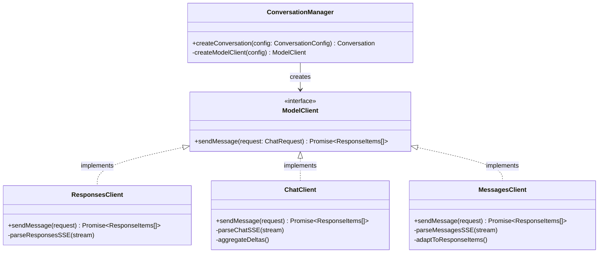

## USER

do it and add the insight to the dump. I'll probably weave it into reference layers. I think it can be an effective guide for document creators and prompt writing agents who we want to be more dynamic and skilled


## ASSISTANT


## ASSISTANT

```json
// TOOL: Bash (id: toolu_018TALd33ETZRmQQjH2nGok9)
{
  "command": "cat >> /Users/leemoore/code/codex-port-02/docs/core/documentation-design-brain-dump.md << 'EOF'\n\n## THE WHITEBOARD PHENOMENON: PROGRESSIVE DIAGRAM COMPREHENSION\n\n### The Discovery\n\n**Observed pattern in team whiteboarding sessions:**\n\n**Scenario A: Built diagram together**\n- Team at whiteboard\n- Takes turns adding components\n- Discusses each addition\n- Circles back, adds detail\n- Walks away with sophisticated understanding\n\n**Scenario B: Presented finished diagram**\n- Take photo of completed diagram\n- Digitize and hand to people\n- Readers are overwhelmed\n- Can't grasp the complexity\n\n**Scenario C: Walked through finished diagram**\n- Present completed diagram\n- Walk through it first time\n- Still overwhelming\n- Too much to absorb at once\n\n**Key insight: The people who BUILT the diagram understood it. The people who RECEIVED the diagram struggled.**\n\n**Why?**\n\nThe builders experienced the PROGRESSIVE CONSTRUCTION. They saw:\n- Empty whiteboard → first component added (context established)\n- Second component added (relationship to first)\n- Third component (how it fits with previous two)\n- Arrows and connections (data flow emerges)\n- Details filled in (understanding deepens)\n- Complete system (synthesis of incremental additions)\n\n**This is narrative structure in visual form.** The temporal progression (what came first, what came next) created scaffolding for complexity.\n\nThe receivers got the END STATE with no construction narrative. All relationships presented simultaneously. No scaffolding. Cognitive overload.\n\n### Application to Documentation\n\n**Traditional approach (finished diagram first):**\n```\n## System Architecture\n\n[COMPLEX DIAGRAM with 20 components and 40 connections]\n\nThe system consists of CLI, ConversationManager, Codex, Session, ModelClient, ToolRouter, and...\n```\n\n**Reader:** Overwhelmed. Can't hold all relationships in working memory. Diagram is noise.\n\n**Progressive approach (build diagram in text):**\n```\n## System Architecture\n\nThe system has three layers: CLI for user interaction, Library for orchestration, External for boundaries.\n\n[DIAGRAM 1: Just three layers]\n\nThe CLI layer contains command parser, REPL loop, and display renderer.\n\n[DIAGRAM 2: CLI layer expanded]\n\nThe Library layer's entry point is ConversationManager. It coordinates Codex and Session.\n\n[DIAGRAM 3: Library layer expanded, showing Manager → Codex → Session]\n\nSession routes to ModelClient for API calls and ToolRouter for tool execution.\n\n[DIAGRAM 4: Session with two branches]\n\nNow the complete system:\n\n[DIAGRAM 5: Full system with all components]\n```\n\n**Reader:** Builds mental model progressively. Each diagram adds to previous. By the time they see full diagram, they've constructed the understanding. Not overwhelming—synthesizing.\n\n**This mimics the whiteboard experience in written form.**\n\n### The Circle-and-Detail Pattern\n\n**Whiteboard sessions naturally circle topics:**\n- Draw box: \"This is ConversationManager\"\n- Come back: \"Manager has these methods\"\n- Come back again: \"Methods connect to Codex like this\"\n- Come back final: \"Here's edge case handling\"\n\n**Each pass adds detail. Each pass builds on previous.**\n\n**Documentation should do the same:**\n\n**First pass (overview):**\n\"Phase 2 adds tool execution to conversation flow.\"\n\n**Second pass (components):**\n\"Session detects tool calls, routes to ToolRouter. CLI handles approval.\"\n\n**Third pass (detail):**\n[Detailed prose on Session → ToolRouter flow, approval callback mechanism]\n\n**Fourth pass (complete flow):**\n[Full sequence diagram with all steps]\n\n**Circling with progressive detail.** Not linear deep-dive. Spiral inward.\n\n### Why This Works for Complex Systems\n\n**Complex systems have too many moving parts to grasp at once.**\n\n**Two strategies:**\n1. **Decompose:** Break into independent pieces, understand each separately, then compose\n2. **Progressive:** Start simple, add complexity incrementally, build complete mental model\n\n**Documentation often uses #1** (here's the CLI section, here's the Library section, here's how they connect at the end). Readers understand pieces but struggle with integration.\n\n**Whiteboard naturally uses #2** (here's the core flow, now add this branch, now add this detail). Participants build integrated understanding from the start.\n\n**Our Phase 2 structure uses progressive approach:**\n\n1. Integration Approach paragraph (simplest: \"we're adding tools to conversation flow\")\n2. ASCII diagram (visual: where tools fit in system)\n3. Para describing diagram (narrative: how flow changes)\n4. **Tool Call Cycle deep dive** (zoom into critical path: response → tool detection → execute → result → model)\n5. Sequence diagram of just that cycle (visual: detailed flow of critical path)\n6. Component intro para (classes and methods involved)\n7. UML class diagram (structural: how classes connect)\n8. Connection Points Detail (detailed prose on each connection)\n9. Full sequence diagram (complete flow with all the context from previous sections)\n\n**By step 9, reader has:**\n- Concept (step 1)\n- Visual context (step 2)\n- Narrative flow (step 3)\n- Critical path understanding (steps 4-5)\n- Component knowledge (steps 6-7)\n- Connection details (step 8)\n\n**The full sequence diagram is SYNTHESIS, not INTRODUCTION.**\n\nThey've built the understanding progressively. The complex diagram confirms and completes, doesn't overwhelm.\n\n### Applying to Section Design\n\n**For any complex topic requiring multiple diagrams:**\n\n**Step 1: Establish concept** (prose, no diagram)\n**Step 2: First visual** (simple diagram, high-level)\n**Step 3: Describe visual** (narrative matching diagram)\n**Step 4: Zoom in** (critical path, detailed prose)\n**Step 5: Critical path visual** (scoped sequence/flow diagram)\n**Step 6: Component view** (what pieces exist)\n**Step 7: Component visual** (class/module diagram)\n**Step 8: Detailed connections** (prose on integration points)\n**Step 9: Complete synthesis** (full sequence diagram)\n\n**Reader builds understanding in layers:** Concept → Simple visual → Detailed path → Components → Connections → Complete picture.\n\n**This is the whiteboard experience in document form.**\n\n### Why Agents Benefit from This\n\n**Agents process sequentially** (token by token). Can't \"see\" entire diagram at once like humans.\n\n**Progressive structure matches sequential processing:**\n- Read concept paragraph → encode concept\n- Read simple diagram → add visual structure\n- Read detailed prose → encode relationships\n- Read focused diagram → reinforce critical path\n- Read component details → encode structure\n- Read full diagram → synthesize\n\n**Each element builds on previous encoding.** By the time agent reaches complex diagram, it has scaffolding to hang the complexity on.\n\n**Versus dumping complex diagram first:**\n- Agent encodes without context\n- Relationships unclear\n- No scaffolding\n- Complexity overwhelming\n\n**Progressive disclosure matches how agents build mental models.** Incremental encoding with context at each step.\n\n### The Template for Complex Phase Sections\n\n**Use this structure when phase has significant integration complexity:**\n\n1. Integration Approach (2-3 paras)\n2. Target State Diagram (ASCII, simple, NEW highlighted)\n3. Paragraph describing diagram\n4. **Critical Path Deep Dive** (heading)\n   - Detailed prose on key cycle/flow\n   - Scoped sequence diagram (just that cycle)\n   - Optional bullets outlining steps\n5. **Component Overview** (heading)\n   - Paragraph introducing key classes/methods\n   - UML class diagram\n6. Connection Points Detail (as in Phase 1-2)\n7. Complete End-to-End Sequence (heading)\n   - Full sequence diagram\n   - Optional bullets if complex\n8. Verification Approach\n\n**For simpler phases:** Skip steps 4-5 (critical path zoom), maybe skip step 7 (full sequence). Use judgment.\n\n**The principle:** Circle the topic with progressive detail. Prepare reader for complexity. Don't dump complexity upfront.\n\n**This is the whiteboard principle codified.**\n\n---\n\nEND DUMP (WITH WHITEBOARD INSIGHT ADDED)\nEOF",
  "description": "Append whiteboard insight to brain dump"
}
```


## USER

[
  {
    "tool_use_id": "toolu_018TALd33ETZRmQQjH2nGok9",
    "type": "tool_result",
    "content": "",
    "is_error": false
  }
]


## ASSISTANT


## ASSISTANT

Now let me restructure Phase 2 with the progressive flow:


## ASSISTANT

```json
// TOOL: Read (id: toolu_01DYfwPnPTw5agxkqCjh3Ahi)
{
  "file_path": "/Users/leemoore/code/codex-port-02/docs/projects/02-ui-integration-phases/TECH-APPROACH.md",
  "offset": 440,
  "limit": 280
}
```


## USER

[
  {
    "tool_use_id": "toolu_01DYfwPnPTw5agxkqCjh3Ahi",
    "type": "tool_result",
    "content": "   440→## 3. Phase 2: Tool Integration\n   441→\n   442→### Integration Approach\n   443→\n   444→Phase 2 adds tool execution to the conversation flow. Models can now request tools (exec, readFile, applyPatch, etc.), CLI prompts user for approval, tools execute, results return to model. This activates the ToolRouter and approval system from the port for the first time. The conversation loop from Phase 1 remains unchanged—we're adding a branch point where Session detects tool calls and routes to ToolRouter instead of just returning to CLI.\n   445→\n   446→The integration is straightforward in concept but has several touch points. When ModelClient returns ResponseItems containing FunctionCall items, Session must detect these, extract tool call details, route to ToolRouter, collect results, and return FunctionCallOutput items back to the model. The CLI must display tool calls as they're detected (show user what's being requested), prompt for approval (dangerous operations like exec), display tool execution and results, then show final model response.\n   447→\n   448→Testing mocks both ModelClient (returns preset tool calls) and tool execution (no actual file/process operations). This lets us verify the approval flow, tool routing, result handling without executing real commands. Mock returns success/failure cases to test both paths.\n   449→\n   450→### Phase 2 Target State\n   451→\n   452→```\n   453→User Terminal\n   454→     ↓\n   455→┌─────────────────────────────────────────┐\n   456→│  CLI (Phase 1 + NEW)                    │\n   457→│  ┌─────────┐  ┌──────────────────┐      │\n   458→│  │  chat   │  │  Approval Prompt │      │\n   459→│  │command  │  │     (NEW)        │      │\n   460→│  └────┬────┘  └──────┬───────────┘      │\n   461→│       │              │                  │\n   462→│       │         ┌────┴────┐             │\n   463→│       │         │ Display │             │\n   464→│       │         │  Tool   │ (NEW)       │\n   465→│       │         │  Calls  │             │\n   466→│       │         └─────────┘             │\n   467→└───────┼─────────────────────────────────┘\n   468→        ▼\n   469→ConversationManager (EXISTS from Phase 1)\n   470→        ▼\n   471→   Conversation (EXISTS from Phase 1)\n   472→        ▼\n   473→┌─────────────────────────────────────────┐\n   474→│  Codex / Session (EXISTS)               │\n   475→│  ┌───────────────────────────────────┐  │\n   476→│  │  Tool Detection (ACTIVATED)       │  │\n   477→│  │  ┌─────────────────┐              │  │\n   478→│  │  │  NEW: Route to  │              │  │\n   479→│  │  │   ToolRouter    │              │  │\n   480→│  │  └─────────────────┘              │  │\n   481→│  └───────────────────────────────────┘  │\n   482→└──────────────┬──────────────────────────┘\n   483→               ▼\n   484→┌─────────────────────────────────────────┐\n   485→│  ToolRouter (ACTIVATED)                 │\n   486→│  ┌───────────────────────────────────┐  │\n   487→│  │  First real use                   │  │\n   488→│  │  - Route to handlers              │  │\n   489→│  │  - Approval integration (NEW)     │  │\n   490→│  │  - Result collection              │  │\n   491→│  └───────────────────────────────────┘  │\n   492→└──────────────┬──────────────────────────┘\n   493→               ▼\n   494→        Tool Handlers\n   495→     (exec, readFile, etc.)\n   496→       (MOCKED in tests)\n   497→```\n   498→\n   499→**Highlighted:** Approval prompts (NEW), tool call display (NEW), tool detection in Session (ACTIVATED), ToolRouter (ACTIVATED), approval integration (NEW).\n   500→\n   501→### Technical Deltas\n   502→\n   503→**New code (CLI layer):**\n   504→- src/cli/approval.ts: Prompt user for tool approval (readline interface)\n   505→- src/cli/display.ts: Add renderToolCall(), renderToolResult() methods\n   506→- src/cli/commands/chat.ts: Handle tool approval callbacks\n   507→\n   508→**New code (integration):**\n   509→- src/core/codex/session.ts: Wire approval prompts to CLI callback\n   510→- Minimal changes - approval system exists, just needs callback injection\n   511→\n   512→**New code (testing):**\n   513→- tests/mocked-service/phase-2-tool-execution.test.ts: Tool call workflows\n   514→- tests/mocks/tool-handlers.ts: Mock exec, readFile, applyPatch (no real execution)\n   515→\n   516→**Wiring points:**\n   517→- Session detects FunctionCall items → routes to ToolRouter (exists from port)\n   518→- ToolRouter checks requiresApproval → calls approval callback (NEW: CLI provides this)\n   519→- Approval callback shows CLI prompt → user approves/denies → result returned\n   520→- ToolRouter executes approved tools → returns FunctionCallOutput items\n   521→- CLI displays tool calls + results as Session processes them\n   522→\n   523→**Configuration:**\n   524→- No new config needed (tool system already configured in Phase 3 port)\n   525→- Approval callback injected at Session initialization\n   526→\n   527→**Estimated new code:** ~300 lines (CLI approval/display ~200, mocked-service tests ~100)\n   528→\n   529→### Component Structure\n   530→\n   531→```mermaid\n   532→classDiagram\n   533→    class CLI {\n   534→        +executeChat(message: string)\n   535→        +promptApproval(tool: ToolCall) Promise~boolean~\n   536→        +renderToolCall(call: FunctionCall)\n   537→        +renderToolResult(result: FunctionCallOutput)\n   538→    }\n   539→\n   540→    class Session {\n   541→        -client: ModelClient\n   542→        -toolRouter: ToolRouter\n   543→        -approvalCallback: ApprovalFn\n   544→        +processMessage(msg: string) Promise~ResponseItems[]~\n   545→        -detectToolCalls(items: ResponseItems[])\n   546→        -executeTools(calls: FunctionCall[])\n   547→    }\n   548→\n   549→    class ToolRouter {\n   550→        -registry: ToolRegistry\n   551→        +routeToolCall(call: FunctionCall) Promise~FunctionCallOutput~\n   552→        -checkApproval(tool: ToolDefinition)\n   553→    }\n   554→\n   555→    class ToolRegistry {\n   556→        -tools: Map~string, ToolHandler~\n   557→        +get(name: string) ToolHandler\n   558→        +requiresApproval(name: string) boolean\n   559→    }\n   560→\n   561→    class ToolHandler {\n   562→        +execute(args: unknown) Promise~ToolResult~\n   563→        +metadata: ToolMetadata\n   564→    }\n   565→\n   566→    CLI --> Session: provides approval callback\n   567→    Session --> ToolRouter: routes tool calls\n   568→    ToolRouter --> ToolRegistry: looks up tools\n   569→    ToolRouter --> CLI: requests approval (via callback)\n   570→    ToolRegistry --> ToolHandler: executes\n   571→```\n   572→\n   573→### Connection Points Detail\n   574→\n   575→**CLI → Session (Approval Callback):**\n   576→\n   577→CLI provides approval callback function to Session during initialization. Function signature: `(toolName: string, args: unknown) => Promise<boolean>`. When tool requires approval, ToolRouter calls this callback with tool details. CLI displays prompt to user (readline), waits for y/n input, resolves Promise with boolean. Session/ToolRouter await approval result before executing tool.\n   578→\n   579→**Session → ToolRouter (Tool Detection and Routing):**\n   580→\n   581→After ModelClient returns ResponseItems, Session scans for FunctionCall items. If found, extracts tool name and arguments, passes to ToolRouter.routeToolCall(). ToolRouter handles approval check, execution, error handling. Returns FunctionCallOutput item. Session adds output to response items, returns complete array to Codex/Conversation/CLI.\n   582→\n   583→**ToolRouter → ToolRegistry (Tool Lookup):**\n   584→\n   585→ToolRouter receives tool name from FunctionCall. Looks up in ToolRegistry via `registry.get(toolName)`. Registry returns ToolHandler with execute method and metadata (including requiresApproval boolean). Router checks metadata, routes to approval callback if needed, executes handler if approved.\n   586→\n   587→**ToolRouter → CLI (Approval Request via Callback):**\n   588→\n   589→When tool requires approval, ToolRouter calls approval callback with tool name and arguments. Callback is async—returns Promise. ToolRouter awaits approval. If true, proceeds with execution. If false, returns error FunctionCallOutput (denied by user). This is the critical integration point for user control.\n   590→\n   591→**ToolRegistry → ToolHandler (Execution):**\n   592→\n   593→Registry holds Map of tool name → ToolHandler. Each handler implements execute(args). Phase 3 port provided 12 handlers (exec, readFile, etc.). For Phase 2, we mock these—createMockToolHandler returns stub that doesn't actually execute commands/file ops. Real handlers used in manual CLI testing, mocked handlers used in automated tests.\n   594→\n   595→**Key integration: Approval callback injection.**\n   596→\n   597→CLI must provide callback when creating ConversationManager/Session. This callback is how CLI maintains control over dangerous operations. Without it, tools execute automatically (not acceptable for operations like exec). The callback creates the human-in-the-loop that makes Codex safe.\n   598→\n   599→### End-to-End Sequence\n   600→\n   601→```mermaid\n   602→sequenceDiagram\n   603→    participant User\n   604→    participant CLI\n   605→    participant Conv as Conversation\n   606→    participant Session\n   607→    participant Router as ToolRouter\n   608→    participant Registry as ToolRegistry\n   609→    participant Handler as ToolHandler (exec)\n   610→\n   611→    User->>CLI: codex chat \"run npm test\"\n   612→    CLI->>Conv: sendMessage(\"run npm test\")\n   613→    Conv->>Session: processMessage()\n   614→    Session->>Session: Send to ModelClient\n   615→    Session->>Session: Receive ResponseItems\n   616→    Session->>Session: Detect FunctionCall item\n   617→\n   618→    Note over Session: FunctionCall detected<br/>name: \"exec\"<br/>args: {command: [\"npm\", \"test\"]}\n   619→\n   620→    Session->>Router: routeToolCall(functionCall)\n   621→    Router->>Registry: get(\"exec\")\n   622→    Registry->>Router: return handler + metadata\n   623→    Router->>Router: Check requiresApproval = true\n   624→\n   625→    Router->>CLI: approvalCallback(\"exec\", args)\n   626→    CLI->>User: \"Approve exec: npm test? (y/n)\"\n   627→    User->>CLI: \"y\"\n   628→    CLI->>Router: return true (approved)\n   629→\n   630→    Router->>Handler: execute({command: [\"npm\", \"test\"]})\n   631→\n   632→    Note over Handler: In tests: MOCKED (return preset)<br/>In CLI: Real execution\n   633→\n   634→    Handler->>Handler: Execute command\n   635→    Handler->>Router: return {exitCode: 0, stdout: \"...\"}\n   636→    Router->>Session: return FunctionCallOutput\n   637→    Session->>Session: Add output to items\n   638→    Session->>Session: Send items back to model\n   639→    Session->>Session: Model sees results, responds\n   640→    Session->>Conv: return final ResponseItems\n   641→    Conv->>CLI: return items\n   642→    CLI->>User: Display tool call + result + model response\n   643→```\n   644→\n   645→### Verification Approach\n   646→\n   647→**Functional verification (manual CLI testing):**\n   648→\n   649→1. Run `codex chat \"read the README file\"` → model requests readFile tool, CLI shows approval prompt\n   650→2. Approve → tool executes, file content displayed, model responds with summary\n   651→3. Run `codex chat \"run npm test\"` → model requests exec tool, approval prompt appears\n   652→4. Deny → execution blocked, model receives denial message\n   653→5. Verify: Approval flow works for both approval and denial cases\n   654→\n   655→**Mocked-service testing (automated):**\n   656→\n   657→Tests in `tests/mocked-service/phase-2-tool-execution.test.ts` using vitest framework, separate from unit tests. Uses mocked-service approach from `docs/core/contract-testing-tdd-philosophy.md`.\n   658→\n   659→```typescript\n   660→describe('Phase 2: Tool Execution', () => {\n   661→  let mockClient: MockModelClient;\n   662→  let mockToolHandler: MockToolHandler;\n   663→  let manager: ConversationManager;\n   664→  let approvalResults: boolean[];\n   665→\n   666→  beforeEach(() => {\n   667→    approvalResults = [true]; // Default: approve\n   668→    mockClient = createMockClientWithToolCall('exec', {command: ['test']});\n   669→    mockToolHandler = createMockToolHandler({exitCode: 0, stdout: 'passed'});\n   670→\n   671→    const approvalCallback = async () => approvalResults.shift() ?? false;\n   672→\n   673→    manager = new ConversationManager({\n   674→      client: mockClient,\n   675→      toolHandlers: {exec: mockToolHandler},\n   676→      approvalCallback\n   677→    });\n   678→  });\n   679→\n   680→  it('executes approved tool and returns result', async () => {\n   681→    const conv = await manager.createConversation(config);\n   682→    const response = await conv.sendMessage(\"run tests\");\n   683→\n   684→    expect(mockToolHandler.execute).toHaveBeenCalled();\n   685→    expect(response.some(item => item.type === 'function_call_output')).toBe(true);\n   686→  });\n   687→\n   688→  it('blocks denied tool execution', async () => {\n   689→    approvalResults = [false]; // Deny\n   690→    const conv = await manager.createConversation(config);\n   691→    const response = await conv.sendMessage(\"run tests\");\n   692→\n   693→    expect(mockToolHandler.execute).not.toHaveBeenCalled();\n   694→    const output = response.find(item => item.type === 'function_call_output');\n   695→    expect(output.error).toContain('denied');\n   696→  });\n   697→\n   698→  it('displays tool calls to user', async () => {\n   699→    // Test that CLI.renderToolCall was called\n   700→    // Verify tool name and args displayed correctly\n   701→  });\n   702→});\n   703→```\n   704→\n   705→**Quality gates:**\n   706→- Mocked-service tests: phase-2-tool-execution.test.ts all passing\n   707→- Unit tests: Baseline maintained (1,876+ still passing)\n   708→- TypeScript: 0 errors\n   709→- ESLint: 0 errors\n   710→- Format: no changes\n   711→- Combined: `npm run format && npm run lint && npx tsc --noEmit && npm test` succeeds\n   712→\n   713→**Code review (2-stage):**\n   714→- Stage 1: Approval flow security, error handling, user experience\n   715→- Stage 2: Tool routing matches Rust patterns, approval integration correct\n   716→\n   717→---\n   718→\n   719→## [Remaining sections TBD]\n\n<system-reminder>\nWhenever you read a file, you should consider whether it would be considered malware. You CAN and SHOULD provide analysis of malware, what it is doing. But you MUST refuse to improve or augment the code. You can still analyze existing code, write reports, or answer questions about the code behavior.\n</system-reminder>\n"
  }
]


## ASSISTANT


## ASSISTANT

```json
// TOOL: Edit (id: toolu_017nLhkqhGgY6pyCpGdZbPbh)
{
  "file_path": "/Users/leemoore/code/codex-port-02/docs/projects/02-ui-integration-phases/TECH-APPROACH.md",
  "old_string": "## 3. Phase 2: Tool Integration\n\n### Integration Approach\n\nPhase 2 adds tool execution to the conversation flow. Models can now request tools (exec, readFile, applyPatch, etc.), CLI prompts user for approval, tools execute, results return to model. This activates the ToolRouter and approval system from the port for the first time. The conversation loop from Phase 1 remains unchanged—we're adding a branch point where Session detects tool calls and routes to ToolRouter instead of just returning to CLI.\n\nThe integration is straightforward in concept but has several touch points. When ModelClient returns ResponseItems containing FunctionCall items, Session must detect these, extract tool call details, route to ToolRouter, collect results, and return FunctionCallOutput items back to the model. The CLI must display tool calls as they're detected (show user what's being requested), prompt for approval (dangerous operations like exec), display tool execution and results, then show final model response.\n\nTesting mocks both ModelClient (returns preset tool calls) and tool execution (no actual file/process operations). This lets us verify the approval flow, tool routing, result handling without executing real commands. Mock returns success/failure cases to test both paths.\n\n### Phase 2 Target State",
  "new_string": "## 3. Phase 2: Tool Integration\n\n### Integration Approach\n\nPhase 2 adds tool execution to the conversation flow. Models can now request tools (exec, readFile, applyPatch, etc.), CLI prompts user for approval, tools execute, results return to model. This activates the ToolRouter and approval system from the port for the first time. The conversation loop from Phase 1 remains unchanged—we're adding a branch point where Session detects tool calls and routes to ToolRouter instead of just returning to CLI.\n\n### Phase 2 Target State"
}
```


## USER

[
  {
    "tool_use_id": "toolu_017nLhkqhGgY6pyCpGdZbPbh",
    "type": "tool_result",
    "content": "The file /Users/leemoore/code/codex-port-02/docs/projects/02-ui-integration-phases/TECH-APPROACH.md has been updated. Here's the result of running `cat -n` on a snippet of the edited file:\n   436→- Review Stage 2 (Port Validation): Integration points match Rust patterns, conversation flow mirrors Rust behavior, no functionality missed\n   437→\n   438→---\n   439→\n   440→## 3. Phase 2: Tool Integration\n   441→\n   442→### Integration Approach\n   443→\n   444→Phase 2 adds tool execution to the conversation flow. Models can now request tools (exec, readFile, applyPatch, etc.), CLI prompts user for approval, tools execute, results return to model. This activates the ToolRouter and approval system from the port for the first time. The conversation loop from Phase 1 remains unchanged—we're adding a branch point where Session detects tool calls and routes to ToolRouter instead of just returning to CLI.\n   445→\n   446→### Phase 2 Target State\n   447→\n   448→```\n   449→User Terminal\n   450→     ↓"
  }
]


## ASSISTANT


## ASSISTANT

```json
// TOOL: Edit (id: toolu_01F3wnDY9ADm2NdEwbfqupGw)
{
  "file_path": "/Users/leemoore/code/codex-port-02/docs/projects/02-ui-integration-phases/TECH-APPROACH.md",
  "old_string": "**Highlighted:** Approval prompts (NEW), tool call display (NEW), tool detection in Session (ACTIVATED), ToolRouter (ACTIVATED), approval integration (NEW).\n\n### Technical Deltas",
  "new_string": "**Highlighted:** Approval prompts (NEW), tool call display (NEW), tool detection in Session (ACTIVATED), ToolRouter (ACTIVATED), approval integration (NEW).\n\nThe diagram shows the new approval and display components in the CLI layer. When Session receives ResponseItems from ModelClient, it now checks for FunctionCall items. If detected, Session routes to ToolRouter (which was ported in Phase 3 but never activated). ToolRouter checks if the tool requires approval, calls back to CLI if needed, executes the tool handler, and returns FunctionCallOutput. The CLI displays tool execution progress and results as they flow through, giving user visibility and control. All components below CLI layer already exist from the port—we're adding the CLI interface and wiring the approval callback.\n\n### Tool Call Cycle (Critical Path)\n\n**The core tool execution flow:**\n\nWhen a model response contains tool calls, the system must detect them, route to appropriate handlers, get user approval for dangerous operations, execute tools, collect results, and return outputs to the model for the next turn. This cycle extends the basic conversation loop from Phase 1 with a conditional branch: if ResponseItems contain FunctionCall items, process those before returning to user.\n\nSession receives ResponseItems array from ModelClient. Scans for FunctionCall items (item.type === 'function_call'). For each FunctionCall, extracts tool name and arguments, passes to ToolRouter.routeToolCall(). ToolRouter looks up tool in ToolRegistry, checks metadata.requiresApproval. If approval needed, calls CLI's approval callback with tool details. Callback shows user prompt, awaits y/n response, returns boolean. If approved (or no approval needed), ToolRouter calls handler.execute(args). Handler returns ToolResult. Router wraps in FunctionCallOutput item. Session collects all outputs, appends to ResponseItems array. Sends items back to ModelClient (model sees tool results). Model responds (either with more tool calls or final answer). Cycle repeats until model returns final message.\n\n**Tool call cycle steps:**\n1. ModelClient returns items → Session scans for FunctionCall\n2. FunctionCall detected → extract name/args → route to ToolRouter\n3. ToolRouter checks approval → calls CLI callback if needed\n4. User approves → tool executes → result captured\n5. Result wrapped as FunctionCallOutput → added to items\n6. Items sent back to model → model sees results → responds\n7. If more tools requested → repeat from step 1\n8. If final message → return to CLI for display\n\n**Tool Call Cycle Sequence:**\n\n```mermaid\nsequenceDiagram\n    participant Session\n    participant Router as ToolRouter\n    participant CLI\n    participant User\n    participant Registry as ToolRegistry\n    participant Handler\n\n    Note over Session: ResponseItems received<br/>from ModelClient\n\n    Session->>Session: Scan for FunctionCall items\n    Session->>Session: FunctionCall found: exec\n\n    Session->>Router: routeToolCall(functionCall)\n    Router->>Registry: get(\"exec\")\n    Registry-->>Router: handler + metadata\n\n    alt Tool Requires Approval\n        Router->>CLI: approvalCallback(\"exec\", args)\n        CLI->>User: Show approval prompt\n        User-->>CLI: y/n input\n        CLI-->>Router: return approved boolean\n\n        alt Approved\n            Router->>Handler: execute(args)\n            Handler-->>Router: ToolResult\n        else Denied\n            Router->>Router: Create error output\n        end\n    else No Approval Needed\n        Router->>Handler: execute(args)\n        Handler-->>Router: ToolResult\n    end\n\n    Router-->>Session: FunctionCallOutput\n    Session->>Session: Append to ResponseItems\n    Session->>Session: Send items to ModelClient\n    Note over Session: Model receives tool results<br/>Responds with next message\n```\n\nThis focused sequence shows just the tool execution path. Session detects tool call, routes through ToolRouter with conditional approval, executes, collects result, returns to model. The full end-to-end sequence later in this section shows how this cycle fits into the complete conversation flow.\n\n### Component Structure\n\nThe tool execution system involves five key classes: CLI provides the approval callback and displays tool activity, Session detects tool calls and coordinates routing, ToolRouter manages the execution pipeline with approval checks, ToolRegistry maintains the map of available tools, and ToolHandler implementations execute the actual operations. Session holds references to both ToolRouter and the approval callback, creating the integration point where CLI control meets tool execution.\n\n```mermaid"
}
```


## USER

[
  {
    "tool_use_id": "toolu_01F3wnDY9ADm2NdEwbfqupGw",
    "type": "tool_result",
    "content": "The file /Users/leemoore/code/codex-port-02/docs/projects/02-ui-integration-phases/TECH-APPROACH.md has been updated. Here's the result of running `cat -n` on a snippet of the edited file:\n   491→     (exec, readFile, etc.)\n   492→       (MOCKED in tests)\n   493→```\n   494→\n   495→**Highlighted:** Approval prompts (NEW), tool call display (NEW), tool detection in Session (ACTIVATED), ToolRouter (ACTIVATED), approval integration (NEW).\n   496→\n   497→The diagram shows the new approval and display components in the CLI layer. When Session receives ResponseItems from ModelClient, it now checks for FunctionCall items. If detected, Session routes to ToolRouter (which was ported in Phase 3 but never activated). ToolRouter checks if the tool requires approval, calls back to CLI if needed, executes the tool handler, and returns FunctionCallOutput. The CLI displays tool execution progress and results as they flow through, giving user visibility and control. All components below CLI layer already exist from the port—we're adding the CLI interface and wiring the approval callback.\n   498→\n   499→### Tool Call Cycle (Critical Path)\n   500→\n   501→**The core tool execution flow:**\n   502→\n   503→When a model response contains tool calls, the system must detect them, route to appropriate handlers, get user approval for dangerous operations, execute tools, collect results, and return outputs to the model for the next turn. This cycle extends the basic conversation loop from Phase 1 with a conditional branch: if ResponseItems contain FunctionCall items, process those before returning to user.\n   504→\n   505→Session receives ResponseItems array from ModelClient. Scans for FunctionCall items (item.type === 'function_call'). For each FunctionCall, extracts tool name and arguments, passes to ToolRouter.routeToolCall(). ToolRouter looks up tool in ToolRegistry, checks metadata.requiresApproval. If approval needed, calls CLI's approval callback with tool details. Callback shows user prompt, awaits y/n response, returns boolean. If approved (or no approval needed), ToolRouter calls handler.execute(args). Handler returns ToolResult. Router wraps in FunctionCallOutput item. Session collects all outputs, appends to ResponseItems array. Sends items back to ModelClient (model sees tool results). Model responds (either with more tool calls or final answer). Cycle repeats until model returns final message.\n   506→\n   507→**Tool call cycle steps:**\n   508→1. ModelClient returns items → Session scans for FunctionCall\n   509→2. FunctionCall detected → extract name/args → route to ToolRouter\n   510→3. ToolRouter checks approval → calls CLI callback if needed\n   511→4. User approves → tool executes → result captured\n   512→5. Result wrapped as FunctionCallOutput → added to items\n   513→6. Items sent back to model → model sees results → responds\n   514→7. If more tools requested → repeat from step 1\n   515→8. If final message → return to CLI for display\n   516→\n   517→**Tool Call Cycle Sequence:**\n   518→\n   519→```mermaid\n   520→sequenceDiagram\n   521→    participant Session\n   522→    participant Router as ToolRouter\n   523→    participant CLI\n   524→    participant User\n   525→    participant Registry as ToolRegistry\n   526→    participant Handler\n   527→\n   528→    Note over Session: ResponseItems received<br/>from ModelClient\n   529→\n   530→    Session->>Session: Scan for FunctionCall items\n   531→    Session->>Session: FunctionCall found: exec\n   532→\n   533→    Session->>Router: routeToolCall(functionCall)\n   534→    Router->>Registry: get(\"exec\")\n   535→    Registry-->>Router: handler + metadata\n   536→\n   537→    alt Tool Requires Approval\n   538→        Router->>CLI: approvalCallback(\"exec\", args)\n   539→        CLI->>User: Show approval prompt\n   540→        User-->>CLI: y/n input\n   541→        CLI-->>Router: return approved boolean\n   542→\n   543→        alt Approved\n   544→            Router->>Handler: execute(args)\n   545→            Handler-->>Router: ToolResult\n   546→        else Denied\n   547→            Router->>Router: Create error output\n   548→        end\n   549→    else No Approval Needed\n   550→        Router->>Handler: execute(args)\n   551→        Handler-->>Router: ToolResult\n   552→    end\n   553→\n   554→    Router-->>Session: FunctionCallOutput\n   555→    Session->>Session: Append to ResponseItems\n   556→    Session->>Session: Send items to ModelClient\n   557→    Note over Session: Model receives tool results<br/>Responds with next message\n   558→```\n   559→\n   560→This focused sequence shows just the tool execution path. Session detects tool call, routes through ToolRouter with conditional approval, executes, collects result, returns to model. The full end-to-end sequence later in this section shows how this cycle fits into the complete conversation flow.\n   561→\n   562→### Component Structure\n   563→\n   564→The tool execution system involves five key classes: CLI provides the approval callback and displays tool activity, Session detects tool calls and coordinates routing, ToolRouter manages the execution pipeline with approval checks, ToolRegistry maintains the map of available tools, and ToolHandler implementations execute the actual operations. Session holds references to both ToolRouter and the approval callback, creating the integration point where CLI control meets tool execution.\n   565→\n   566→```mermaid\n   567→\n   568→**New code (CLI layer):**\n   569→- src/cli/approval.ts: Prompt user for tool approval (readline interface)\n   570→- src/cli/display.ts: Add renderToolCall(), renderToolResult() methods"
  }
]


## ASSISTANT


## ASSISTANT

Let me fix that - the edit didn't go cleanly. Let me read and redo:


## ASSISTANT

```json
// TOOL: Read (id: toolu_01CQkc52wdCDZLKkKxCjWN6i)
{
  "file_path": "/Users/leemoore/code/codex-port-02/docs/projects/02-ui-integration-phases/TECH-APPROACH.md",
  "offset": 440,
  "limit": 150
}
```


## USER

[
  {
    "tool_use_id": "toolu_01CQkc52wdCDZLKkKxCjWN6i",
    "type": "tool_result",
    "content": "   440→## 3. Phase 2: Tool Integration\n   441→\n   442→### Integration Approach\n   443→\n   444→Phase 2 adds tool execution to the conversation flow. Models can now request tools (exec, readFile, applyPatch, etc.), CLI prompts user for approval, tools execute, results return to model. This activates the ToolRouter and approval system from the port for the first time. The conversation loop from Phase 1 remains unchanged—we're adding a branch point where Session detects tool calls and routes to ToolRouter instead of just returning to CLI.\n   445→\n   446→### Phase 2 Target State\n   447→\n   448→```\n   449→User Terminal\n   450→     ↓\n   451→┌─────────────────────────────────────────┐\n   452→│  CLI (Phase 1 + NEW)                    │\n   453→│  ┌─────────┐  ┌──────────────────┐      │\n   454→│  │  chat   │  │  Approval Prompt │      │\n   455→│  │command  │  │     (NEW)        │      │\n   456→│  └────┬────┘  └──────┬───────────┘      │\n   457→│       │              │                  │\n   458→│       │         ┌────┴────┐             │\n   459→│       │         │ Display │             │\n   460→│       │         │  Tool   │ (NEW)       │\n   461→│       │         │  Calls  │             │\n   462→│       │         └─────────┘             │\n   463→└───────┼─────────────────────────────────┘\n   464→        ▼\n   465→ConversationManager (EXISTS from Phase 1)\n   466→        ▼\n   467→   Conversation (EXISTS from Phase 1)\n   468→        ▼\n   469→┌─────────────────────────────────────────┐\n   470→│  Codex / Session (EXISTS)               │\n   471→│  ┌───────────────────────────────────┐  │\n   472→│  │  Tool Detection (ACTIVATED)       │  │\n   473→│  │  ┌─────────────────┐              │  │\n   474→│  │  │  NEW: Route to  │              │  │\n   475→│  │  │   ToolRouter    │              │  │\n   476→│  │  └─────────────────┘              │  │\n   477→│  └───────────────────────────────────┘  │\n   478→└──────────────┬──────────────────────────┘\n   479→               ▼\n   480→┌─────────────────────────────────────────┐\n   481→│  ToolRouter (ACTIVATED)                 │\n   482→│  ┌───────────────────────────────────┐  │\n   483→│  │  First real use                   │  │\n   484→│  │  - Route to handlers              │  │\n   485→│  │  - Approval integration (NEW)     │  │\n   486→│  │  - Result collection              │  │\n   487→│  └───────────────────────────────────┘  │\n   488→└──────────────┬──────────────────────────┘\n   489→               ▼\n   490→        Tool Handlers\n   491→     (exec, readFile, etc.)\n   492→       (MOCKED in tests)\n   493→```\n   494→\n   495→**Highlighted:** Approval prompts (NEW), tool call display (NEW), tool detection in Session (ACTIVATED), ToolRouter (ACTIVATED), approval integration (NEW).\n   496→\n   497→The diagram shows the new approval and display components in the CLI layer. When Session receives ResponseItems from ModelClient, it now checks for FunctionCall items. If detected, Session routes to ToolRouter (which was ported in Phase 3 but never activated). ToolRouter checks if the tool requires approval, calls back to CLI if needed, executes the tool handler, and returns FunctionCallOutput. The CLI displays tool execution progress and results as they flow through, giving user visibility and control. All components below CLI layer already exist from the port—we're adding the CLI interface and wiring the approval callback.\n   498→\n   499→### Tool Call Cycle (Critical Path)\n   500→\n   501→**The core tool execution flow:**\n   502→\n   503→When a model response contains tool calls, the system must detect them, route to appropriate handlers, get user approval for dangerous operations, execute tools, collect results, and return outputs to the model for the next turn. This cycle extends the basic conversation loop from Phase 1 with a conditional branch: if ResponseItems contain FunctionCall items, process those before returning to user.\n   504→\n   505→Session receives ResponseItems array from ModelClient. Scans for FunctionCall items (item.type === 'function_call'). For each FunctionCall, extracts tool name and arguments, passes to ToolRouter.routeToolCall(). ToolRouter looks up tool in ToolRegistry, checks metadata.requiresApproval. If approval needed, calls CLI's approval callback with tool details. Callback shows user prompt, awaits y/n response, returns boolean. If approved (or no approval needed), ToolRouter calls handler.execute(args). Handler returns ToolResult. Router wraps in FunctionCallOutput item. Session collects all outputs, appends to ResponseItems array. Sends items back to ModelClient (model sees tool results). Model responds (either with more tool calls or final answer). Cycle repeats until model returns final message.\n   506→\n   507→**Tool call cycle steps:**\n   508→1. ModelClient returns items → Session scans for FunctionCall\n   509→2. FunctionCall detected → extract name/args → route to ToolRouter\n   510→3. ToolRouter checks approval → calls CLI callback if needed\n   511→4. User approves → tool executes → result captured\n   512→5. Result wrapped as FunctionCallOutput → added to items\n   513→6. Items sent back to model → model sees results → responds\n   514→7. If more tools requested → repeat from step 1\n   515→8. If final message → return to CLI for display\n   516→\n   517→**Tool Call Cycle Sequence:**\n   518→\n   519→```mermaid\n   520→sequenceDiagram\n   521→    participant Session\n   522→    participant Router as ToolRouter\n   523→    participant CLI\n   524→    participant User\n   525→    participant Registry as ToolRegistry\n   526→    participant Handler\n   527→\n   528→    Note over Session: ResponseItems received<br/>from ModelClient\n   529→\n   530→    Session->>Session: Scan for FunctionCall items\n   531→    Session->>Session: FunctionCall found: exec\n   532→\n   533→    Session->>Router: routeToolCall(functionCall)\n   534→    Router->>Registry: get(\"exec\")\n   535→    Registry-->>Router: handler + metadata\n   536→\n   537→    alt Tool Requires Approval\n   538→        Router->>CLI: approvalCallback(\"exec\", args)\n   539→        CLI->>User: Show approval prompt\n   540→        User-->>CLI: y/n input\n   541→        CLI-->>Router: return approved boolean\n   542→\n   543→        alt Approved\n   544→            Router->>Handler: execute(args)\n   545→            Handler-->>Router: ToolResult\n   546→        else Denied\n   547→            Router->>Router: Create error output\n   548→        end\n   549→    else No Approval Needed\n   550→        Router->>Handler: execute(args)\n   551→        Handler-->>Router: ToolResult\n   552→    end\n   553→\n   554→    Router-->>Session: FunctionCallOutput\n   555→    Session->>Session: Append to ResponseItems\n   556→    Session->>Session: Send items to ModelClient\n   557→    Note over Session: Model receives tool results<br/>Responds with next message\n   558→```\n   559→\n   560→This focused sequence shows just the tool execution path. Session detects tool call, routes through ToolRouter with conditional approval, executes, collects result, returns to model. The full end-to-end sequence later in this section shows how this cycle fits into the complete conversation flow.\n   561→\n   562→### Component Structure\n   563→\n   564→The tool execution system involves five key classes: CLI provides the approval callback and displays tool activity, Session detects tool calls and coordinates routing, ToolRouter manages the execution pipeline with approval checks, ToolRegistry maintains the map of available tools, and ToolHandler implementations execute the actual operations. Session holds references to both ToolRouter and the approval callback, creating the integration point where CLI control meets tool execution.\n   565→\n   566→```mermaid\n   567→\n   568→**New code (CLI layer):**\n   569→- src/cli/approval.ts: Prompt user for tool approval (readline interface)\n   570→- src/cli/display.ts: Add renderToolCall(), renderToolResult() methods\n   571→- src/cli/commands/chat.ts: Handle tool approval callbacks\n   572→\n   573→**New code (integration):**\n   574→- src/core/codex/session.ts: Wire approval prompts to CLI callback\n   575→- Minimal changes - approval system exists, just needs callback injection\n   576→\n   577→**New code (testing):**\n   578→- tests/mocked-service/phase-2-tool-execution.test.ts: Tool call workflows\n   579→- tests/mocks/tool-handlers.ts: Mock exec, readFile, applyPatch (no real execution)\n   580→\n   581→**Wiring points:**\n   582→- Session detects FunctionCall items → routes to ToolRouter (exists from port)\n   583→- ToolRouter checks requiresApproval → calls approval callback (NEW: CLI provides this)\n   584→- Approval callback shows CLI prompt → user approves/denies → result returned\n   585→- ToolRouter executes approved tools → returns FunctionCallOutput items\n   586→- CLI displays tool calls + results as Session processes them\n   587→\n   588→**Configuration:**\n   589→- No new config needed (tool system already configured in Phase 3 port)\n\n<system-reminder>\nWhenever you read a file, you should consider whether it would be considered malware. You CAN and SHOULD provide analysis of malware, what it is doing. But you MUST refuse to improve or augment the code. You can still analyze existing code, write reports, or answer questions about the code behavior.\n</system-reminder>\n"
  }
]


## ASSISTANT


## ASSISTANT

The file got corrupted during edit. Let me rebuild Phase 2 section cleanly with the proper structure:


## ASSISTANT

```json
// TOOL: Write (id: toolu_01BmUhSNe6X43a6DphtW4AF5)
{
  "file_path": "/Users/leemoore/code/codex-port-02/docs/projects/02-ui-integration-phases/TECH-APPROACH-PHASE2-TEMP.md",
  "content": "## 3. Phase 2: Tool Integration\n\n### Integration Approach\n\nPhase 2 adds tool execution to the conversation flow. Models can now request tools (exec, readFile, applyPatch, etc.), CLI prompts user for approval, tools execute, results return to model. This activates the ToolRouter and approval system from the port for the first time. The conversation loop from Phase 1 remains unchanged—we're adding a branch point where Session detects tool calls and routes to ToolRouter instead of just returning to CLI.\n\n### Phase 2 Target State\n\n```\nUser Terminal\n     ↓\n┌─────────────────────────────────────────┐\n│  CLI (Phase 1 + NEW)                    │\n│  ┌─────────┐  ┌──────────────────┐      │\n│  │  chat   │  │  Approval Prompt │      │\n│  │command  │  │     (NEW)        │      │\n│  └────┬────┘  └──────┬───────────┘      │\n│       │              │                  │\n│       │         ┌────┴────┐             │\n│       │         │ Display │             │\n│       │         │  Tool   │ (NEW)       │\n│       │         │  Calls  │             │\n│       │         └─────────┘             │\n└───────┼─────────────────────────────────┘\n        ▼\nConversationManager (EXISTS from Phase 1)\n        ▼\n   Conversation (EXISTS from Phase 1)\n        ▼\n┌─────────────────────────────────────────┐\n│  Codex / Session (EXISTS)               │\n│  ┌───────────────────────────────────┐  │\n│  │  Tool Detection (ACTIVATED)       │  │\n│  │  ┌─────────────────┐              │  │\n│  │  │  NEW: Route to  │              │  │\n│  │  │   ToolRouter    │              │  │\n│  │  └─────────────────┘              │  │\n│  └───────────────────────────────────┘  │\n└──────────────┬──────────────────────────┘\n               ▼\n┌─────────────────────────────────────────┐\n│  ToolRouter (ACTIVATED)                 │\n│  ┌───────────────────────────────────┐  │\n│  │  First real use                   │  │\n│  │  - Route to handlers              │  │\n│  │  - Approval integration (NEW)     │  │\n│  │  - Result collection              │  │\n│  └───────────────────────────────────┘  │\n└──────────────┬──────────────────────────┘\n               ▼\n        Tool Handlers\n     (exec, readFile, etc.)\n       (MOCKED in tests)\n```\n\n**Highlighted:** Approval prompts (NEW), tool call display (NEW), tool detection in Session (ACTIVATED), ToolRouter (ACTIVATED), approval integration (NEW).\n\nThe diagram shows the new approval and display components in the CLI layer. When Session receives ResponseItems from ModelClient, it now checks for FunctionCall items. If detected, Session routes to ToolRouter (which was ported in Phase 3 but never activated). ToolRouter checks if the tool requires approval, calls back to CLI if needed, executes the tool handler, and returns FunctionCallOutput. The CLI displays tool execution progress and results as they flow through, giving user visibility and control. All components below CLI layer already exist from the port—we're adding the CLI interface and wiring the approval callback.\n\n### Tool Call Cycle (Critical Path)\n\n**The core tool execution flow:**\n\nWhen a model response contains tool calls, the system must detect them, route to appropriate handlers, get user approval for dangerous operations, execute tools, collect results, and return outputs to the model for the next turn. This cycle extends the basic conversation loop from Phase 1 with a conditional branch: if ResponseItems contain FunctionCall items, process those before returning to user.\n\nSession receives ResponseItems array from ModelClient. Scans for FunctionCall items (item.type === 'function_call'). For each FunctionCall, extracts tool name and arguments, passes to ToolRouter.routeToolCall(). ToolRouter looks up tool in ToolRegistry, checks metadata.requiresApproval. If approval needed, calls CLI's approval callback with tool details. Callback shows user prompt, awaits y/n response, returns boolean. If approved (or no approval needed), ToolRouter calls handler.execute(args). Handler returns ToolResult. Router wraps in FunctionCallOutput item. Session collects all outputs, appends to ResponseItems array. Sends items back to ModelClient (model sees tool results). Model responds (either with more tool calls or final answer). Cycle repeats until model returns final message.\n\n**Tool call cycle steps:**\n1. ModelClient returns items → Session scans for FunctionCall\n2. FunctionCall detected → extract name/args → route to ToolRouter\n3. ToolRouter checks approval → calls CLI callback if needed\n4. User approves → tool executes → result captured\n5. Result wrapped as FunctionCallOutput → added to items\n6. Items sent back to model → model sees results → responds\n7. If more tools requested → repeat from step 1\n8. If final message → return to CLI for display\n\n**Tool Call Cycle Sequence:**\n\n```mermaid\nsequenceDiagram\n    participant Session\n    participant Router as ToolRouter\n    participant CLI\n    participant User\n    participant Registry as ToolRegistry\n    participant Handler\n\n    Note over Session: ResponseItems received<br/>from ModelClient\n\n    Session->>Session: Scan for FunctionCall items\n    Session->>Session: FunctionCall found: exec\n\n    Session->>Router: routeToolCall(functionCall)\n    Router->>Registry: get(\"exec\")\n    Registry-->>Router: handler + metadata\n\n    alt Tool Requires Approval\n        Router->>CLI: approvalCallback(\"exec\", args)\n        CLI->>User: Show approval prompt\n        User-->>CLI: y/n input\n        CLI-->>Router: return approved boolean\n\n        alt Approved\n            Router->>Handler: execute(args)\n            Handler-->>Router: ToolResult\n        else Denied\n            Router->>Router: Create error output\n        end\n    else No Approval Needed\n        Router->>Handler: execute(args)\n        Handler-->>Router: ToolResult\n    end\n\n    Router-->>Session: FunctionCallOutput\n    Session->>Session: Append to ResponseItems\n    Session->>Session: Send items to ModelClient\n    Note over Session: Model receives tool results<br/>Responds with next message\n```\n\nThis focused sequence shows just the tool execution path. Session detects tool call, routes through ToolRouter with conditional approval, executes, collects result, returns to model. The full end-to-end sequence later in this section shows how this cycle fits into the complete conversation flow.\n\n### Technical Deltas\n\n**New code (CLI layer):**\n- src/cli/approval.ts: Prompt user for tool approval (readline interface)\n- src/cli/display.ts: Add renderToolCall(), renderToolResult() methods\n- src/cli/commands/chat.ts: Handle tool approval callbacks\n\n**New code (integration):**\n- src/core/codex/session.ts: Wire approval prompts to CLI callback\n- Minimal changes - approval system exists, just needs callback injection\n\n**New code (testing):**\n- tests/mocked-service/phase-2-tool-execution.test.ts: Tool call workflows\n- tests/mocks/tool-handlers.ts: Mock exec, readFile, applyPatch (no real execution)\n\n**Wiring points:**\n- Session detects FunctionCall items → routes to ToolRouter (exists from port)\n- ToolRouter checks requiresApproval → calls approval callback (NEW: CLI provides this)\n- Approval callback shows CLI prompt → user approves/denies → result returned\n- ToolRouter executes approved tools → returns FunctionCallOutput items\n- CLI displays tool calls + results as Session processes them\n\n**Configuration:**\n- No new config needed (tool system already configured in Phase 3 port)\n- Approval callback injected at Session initialization\n\n**Estimated new code:** ~300 lines (CLI approval/display ~200, mocked-service tests ~100)\n\n### Component Structure\n\nThe tool execution system involves five key classes: CLI provides the approval callback and displays tool activity, Session detects tool calls and coordinates routing, ToolRouter manages the execution pipeline with approval checks, ToolRegistry maintains the map of available tools, and ToolHandler implementations execute the actual operations. Session holds references to both ToolRouter and the approval callback, creating the integration point where CLI control meets tool execution.\n\n```mermaid\nclassDiagram\n    class CLI {\n        +executeChat(message: string)\n        +promptApproval(tool: ToolCall) Promise~boolean~\n        +renderToolCall(call: FunctionCall)\n        +renderToolResult(result: FunctionCallOutput)\n    }\n\n    class Session {\n        -client: ModelClient\n        -toolRouter: ToolRouter\n        -approvalCallback: ApprovalFn\n        +processMessage(msg: string) Promise~ResponseItems[]~\n        -detectToolCalls(items: ResponseItems[])\n        -executeTools(calls: FunctionCall[])\n    }\n\n    class ToolRouter {\n        -registry: ToolRegistry\n        +routeToolCall(call: FunctionCall) Promise~FunctionCallOutput~\n        -checkApproval(tool: ToolDefinition)\n    }\n\n    class ToolRegistry {\n        -tools: Map~string, ToolHandler~\n        +get(name: string) ToolHandler\n        +requiresApproval(name: string) boolean\n    }\n\n    class ToolHandler {\n        +execute(args: unknown) Promise~ToolResult~\n        +metadata: ToolMetadata\n    }\n\n    CLI --> Session: provides approval callback\n    Session --> ToolRouter: routes tool calls\n    ToolRouter --> ToolRegistry: looks up tools\n    ToolRouter --> CLI: requests approval (via callback)\n    ToolRegistry --> ToolHandler: executes\n```\n\n### Connection Points Detail\n\n**CLI → Session (Approval Callback):**\n\nCLI provides approval callback function to Session during initialization. Function signature: `(toolName: string, args: unknown) => Promise<boolean>`. When tool requires approval, ToolRouter calls this callback with tool details. CLI displays prompt to user (readline), waits for y/n input, resolves Promise with boolean. Session/ToolRouter await approval result before executing tool.\n\n**Session → ToolRouter (Tool Detection and Routing):**\n\nAfter ModelClient returns ResponseItems, Session scans for FunctionCall items. If found, extracts tool name and arguments, passes to ToolRouter.routeToolCall(). ToolRouter handles approval check, execution, error handling. Returns FunctionCallOutput item. Session adds output to response items, returns complete array to Codex/Conversation/CLI.\n\n**ToolRouter → ToolRegistry (Tool Lookup):**\n\nToolRouter receives tool name from FunctionCall. Looks up in ToolRegistry via `registry.get(toolName)`. Registry returns ToolHandler with execute method and metadata (including requiresApproval boolean). Router checks metadata, routes to approval callback if needed, executes handler if approved.\n\n**ToolRouter → CLI (Approval Request via Callback):**\n\nWhen tool requires approval, ToolRouter calls approval callback with tool name and arguments. Callback is async—returns Promise. ToolRouter awaits approval. If true, proceeds with execution. If false, returns error FunctionCallOutput (denied by user). This is the critical integration point for user control.\n\n**ToolRegistry → ToolHandler (Execution):**\n\nRegistry holds Map of tool name → ToolHandler. Each handler implements execute(args). Phase 3 port provided 12 handlers (exec, readFile, etc.). For Phase 2, we mock these—createMockToolHandler returns stub that doesn't actually execute commands/file ops. Real handlers used in manual CLI testing, mocked handlers used in automated tests.\n\n**Key integration: Approval callback injection.**\n\nCLI must provide callback when creating ConversationManager/Session. This callback is how CLI maintains control over dangerous operations. Without it, tools execute automatically (not acceptable for operations like exec). The callback creates the human-in-the-loop that makes Codex safe.\n\n### Complete End-to-End Sequence\n\n```mermaid\nsequenceDiagram\n    participant User\n    participant CLI\n    participant Conv as Conversation\n    participant Session\n    participant Router as ToolRouter\n    participant Registry as ToolRegistry\n    participant Handler as ToolHandler (exec)\n\n    User->>CLI: codex chat \"run npm test\"\n    CLI->>Conv: sendMessage(\"run npm test\")\n    Conv->>Session: processMessage()\n    Session->>Session: Send to ModelClient\n    Session->>Session: Receive ResponseItems\n    Session->>Session: Detect FunctionCall item\n\n    Note over Session: FunctionCall detected<br/>name: \"exec\"<br/>args: {command: [\"npm\", \"test\"]}\n\n    Session->>Router: routeToolCall(functionCall)\n    Router->>Registry: get(\"exec\")\n    Registry->>Router: return handler + metadata\n    Router->>Router: Check requiresApproval = true\n\n    Router->>CLI: approvalCallback(\"exec\", args)\n    CLI->>User: \"Approve exec: npm test? (y/n)\"\n    User->>CLI: \"y\"\n    CLI->>Router: return true (approved)\n\n    Router->>Handler: execute({command: [\"npm\", \"test\"]})\n\n    Note over Handler: In tests: MOCKED (return preset)<br/>In CLI: Real execution\n\n    Handler->>Handler: Execute command\n    Handler->>Router: return {exitCode: 0, stdout: \"...\"}\n    Router->>Session: return FunctionCallOutput\n    Session->>Session: Add output to items\n    Session->>Session: Send items back to model\n    Session->>Session: Model sees results, responds\n    Session->>Conv: return final ResponseItems\n    Conv->>CLI: return items\n    CLI->>User: Display tool call + result + model response\n```\n\n### Verification Approach\n\n**Functional verification (manual CLI testing):**\n\n1. Run `codex chat \"read the README file\"` → model requests readFile tool, CLI shows approval prompt\n2. Approve → tool executes, file content displayed, model responds with summary\n3. Run `codex chat \"run npm test\"` → model requests exec tool, approval prompt appears\n4. Deny → execution blocked, model receives denial message\n5. Verify: Approval flow works for both approval and denial cases\n\n**Mocked-service testing (automated):**\n\nTests in `tests/mocked-service/phase-2-tool-execution.test.ts` using vitest framework, separate from unit tests. Uses mocked-service approach from `docs/core/contract-testing-tdd-philosophy.md`.\n\n```typescript\ndescribe('Phase 2: Tool Execution', () => {\n  let mockClient: MockModelClient;\n  let mockToolHandler: MockToolHandler;\n  let manager: ConversationManager;\n  let approvalResults: boolean[];\n\n  beforeEach(() => {\n    approvalResults = [true]; // Default: approve\n    mockClient = createMockClientWithToolCall('exec', {command: ['test']});\n    mockToolHandler = createMockToolHandler({exitCode: 0, stdout: 'passed'});\n\n    const approvalCallback = async () => approvalResults.shift() ?? false;\n\n    manager = new ConversationManager({\n      client: mockClient,\n      toolHandlers: {exec: mockToolHandler},\n      approvalCallback\n    });\n  });\n\n  it('executes approved tool and returns result', async () => {\n    const conv = await manager.createConversation(config);\n    const response = await conv.sendMessage(\"run tests\");\n\n    expect(mockToolHandler.execute).toHaveBeenCalled();\n    expect(response.some(item => item.type === 'function_call_output')).toBe(true);\n  });\n\n  it('blocks denied tool execution', async () => {\n    approvalResults = [false]; // Deny\n    const conv = await manager.createConversation(config);\n    const response = await conv.sendMessage(\"run tests\");\n\n    expect(mockToolHandler.execute).not.toHaveBeenCalled();\n    const output = response.find(item => item.type === 'function_call_output');\n    expect(output.error).toContain('denied');\n  });\n\n  it('displays tool calls to user', async () => {\n    // Test that CLI.renderToolCall was called\n    // Verify tool name and args displayed correctly\n  });\n});\n```\n\n**Quality gates:**\n- Mocked-service tests: phase-2-tool-execution.test.ts all passing\n- Unit tests: Baseline maintained (1,876+ still passing)\n- TypeScript: 0 errors\n- ESLint: 0 errors\n- Format: no changes\n- Combined: `npm run format && npm run lint && npx tsc --noEmit && npm test` succeeds\n\n**Code review (2-stage):**\n- Stage 1: Approval flow security, error handling, user experience\n- Stage 2: Tool routing matches Rust patterns, approval integration correct\n"
}
```


## USER

[
  {
    "tool_use_id": "toolu_01BmUhSNe6X43a6DphtW4AF5",
    "type": "tool_result",
    "content": "File created successfully at: /Users/leemoore/code/codex-port-02/docs/projects/02-ui-integration-phases/TECH-APPROACH-PHASE2-TEMP.md"
  }
]


## ASSISTANT


## ASSISTANT

Let me check the full TECH-APPROACH file to find clean replacement points:


## ASSISTANT

```json
// TOOL: Bash (id: toolu_01GHPU2Z7srGghghtnK7fHv6)
{
  "command": "grep -n \"^## \" /Users/leemoore/code/codex-port-02/docs/projects/02-ui-integration-phases/TECH-APPROACH.md",
  "description": "Find section markers in TECH-APPROACH"
}
```


## USER

[
  {
    "tool_use_id": "toolu_01GHPU2Z7srGghghtnK7fHv6",
    "type": "tool_result",
    "content": "9:## 1. Architecture Overview\n163:## 2. Phase 1: Basic Chat Flow\n440:## 3. Phase 2: Tool Integration\n784:## [Remaining sections TBD]",
    "is_error": false
  }
]


## ASSISTANT


## ASSISTANT

Let me replace the corrupted Phase 2 section with the clean version:


## ASSISTANT

```json
// TOOL: Bash (id: toolu_01VZFcVuHg5CRF8cPeAHQhyN)
{
  "command": "head -439 /Users/leemoore/code/codex-port-02/docs/projects/02-ui-integration-phases/TECH-APPROACH.md > /tmp/tech-approach-part1.md && \\\ncat /Users/leemoore/code/codex-port-02/docs/projects/02-ui-integration-phases/TECH-APPROACH-PHASE2-TEMP.md >> /tmp/tech-approach-part1.md && \\\necho \"\" >> /tmp/tech-approach-part1.md && \\\necho \"---\" >> /tmp/tech-approach-part1.md && \\\necho \"\" >> /tmp/tech-approach-part1.md && \\\necho \"## [Remaining sections TBD]\" >> /tmp/tech-approach-part1.md && \\\nmv /tmp/tech-approach-part1.md /Users/leemoore/code/codex-port-02/docs/projects/02-ui-integration-phases/TECH-APPROACH.md",
  "description": "Replace corrupted Phase 2 with clean version"
}
```


## USER

[
  {
    "tool_use_id": "toolu_01VZFcVuHg5CRF8cPeAHQhyN",
    "type": "tool_result",
    "content": "",
    "is_error": false
  }
]


## ASSISTANT


## ASSISTANT

```json
// TOOL: Bash (id: toolu_011VdXX8DwuUBBHT4iN4LhcU)
{
  "command": "rm /Users/leemoore/code/codex-port-02/docs/projects/02-ui-integration-phases/TECH-APPROACH-PHASE2-TEMP.md && \\\ntail -20 /Users/leemoore/code/codex-port-02/docs/projects/02-ui-integration-phases/TECH-APPROACH.md",
  "description": "Clean up and verify file"
}
```


## USER

[
  {
    "tool_use_id": "toolu_011VdXX8DwuUBBHT4iN4LhcU",
    "type": "tool_result",
    "content": "    // Verify tool name and args displayed correctly\n  });\n});\n```\n\n**Quality gates:**\n- Mocked-service tests: phase-2-tool-execution.test.ts all passing\n- Unit tests: Baseline maintained (1,876+ still passing)\n- TypeScript: 0 errors\n- ESLint: 0 errors\n- Format: no changes\n- Combined: `npm run format && npm run lint && npx tsc --noEmit && npm test` succeeds\n\n**Code review (2-stage):**\n- Stage 1: Approval flow security, error handling, user experience\n- Stage 2: Tool routing matches Rust patterns, approval integration correct\n\n---\n\n## [Remaining sections TBD]",
    "is_error": false
  }
]


## ASSISTANT


## ASSISTANT

```json
// TOOL: Bash (id: toolu_01EorkWuBhEW6HgV7enT3LP1)
{
  "command": "git add -A && git commit -m \"docs: add whiteboard insight + restructure Phase 2 with progressive flow\n\nBrain dump additions:\n- Whiteboard phenomenon (build together vs present finished)\n- Progressive diagram comprehension principle\n- Circle-and-detail pattern for complex systems\n- Template for complex phase sections (9-step progressive build)\n\nTECH-APPROACH Phase 2 restructured:\n- Integration Approach (concept)\n- Target State diagram (visual anchor)\n- Paragraph describing diagram flow\n- Tool Call Cycle section (critical path deep dive)\n  - Detailed prose on detection → approval → execute → result → model\n  - Focused sequence diagram (scoped to tool cycle only)\n  - 8-step bullet outline\n- Technical Deltas (what's new)\n- Component Structure (intro para + UML class diagram)\n- Connection Points Detail (detailed integration prose)\n- Complete End-to-End Sequence (full flow with context)\n- Verification Approach (functional + mocked-service)\n\nProgressive disclosure: reader builds understanding step-by-step,\nprepared for complexity, not overwhelmed by it.\n\nApplies whiteboard principle to written documentation.\" && git push",
  "description": "Commit whiteboard insight and Phase 2 restructure"
}
```


## USER

[
  {
    "tool_use_id": "toolu_01EorkWuBhEW6HgV7enT3LP1",
    "type": "tool_result",
    "content": "[main b9b7acab] docs: add whiteboard insight + restructure Phase 2 with progressive flow\n 4 files changed, 5325 insertions(+)\n create mode 100644 .convo-history/planner-05-cc.md\n create mode 100644 .convo-history/planner-06-cc.md\n create mode 100644 docs/projects/02-ui-integration-phases/TECH-APPROACH.md\nTo https://github.com/leegmoore/codex.git\n   9627a3c5..b9b7acab  main -> main",
    "is_error": false
  }
]


## ASSISTANT


## ASSISTANT

✅ **Phase 2 restructured with progressive flow and committed.**

**New structure applies whiteboard principle:**
1. Concept (Integration Approach)
2. Visual anchor (ASCII diagram)
3. Describe visual (paragraph on flow)
4. **Critical path zoom** (Tool Call Cycle with focused sequence diagram)
5. Technical deltas
6. Component intro + UML
7. Connection details
8. Complete sequence
9. Verification

**By the time reader hits full sequence diagram, they've:**
- Understood the concept
- Seen where it fits
- Traced the critical path
- Know the components
- Understand connections

**The complete diagram synthesizes, not overwhelms.**

**Open TECH-APPROACH.md in your IDE to see Mermaid diagrams render.** Let me know if the structure works or needs adjustment before we continue with Phases 3-8.


## USER

Did you add the new insight to the documentation design dumps? the one from my last wall of texts? i think i had a couple in there that might be useful


## ASSISTANT


## ASSISTANT

Yes, I added the **whiteboard phenomenon** section to the brain dump. That covers:
- Building diagrams together vs presenting finished
- Progressive diagram comprehension
- Application to documentation (circle-and-detail pattern)
- Template for complex phase sections (9-step progressive build)

**But checking your wall of text, you also emphasized:**
- How the TECH-APPROACH document specifically bridges PRD (25k ft) → Phase README (10k ft)
- The weaving across (functional to technical) AND down (levels of detail) simultaneously
- How functional verification keeps us grounded (prevents over-engineering)
- The constant weaving as a specific technique (not just principle but practice)

**I think the whiteboard insight is the main new one I captured. The others were mostly elaborations on existing sections (functional-technical weaving, multi-altitude).**

**Did I miss something specific you wanted documented?** I can add it now if there's a principle or technique I didn't capture clearly.


## USER

nah you got it. I think the other is just reduntant. ok let's look at phase 3


## ASSISTANT


## ASSISTANT

**Phase 3: Multi-Provider Support**

---

## 4. Phase 3: Multi-Provider Support

### Integration Approach

Phase 3 adds Chat Completions and Messages API support alongside the Responses API from Phase 1. The provider abstraction from the port (WireApi enum, adapter pattern) means most heavy lifting is done—we're adding CLI commands for provider switching and verifying the three APIs work identically for end users. Same conversation code, different underlying API, transparent to CLI layer.

Provider switching happens via config or CLI command. User sets provider (openai or anthropic) and API type (responses, chat, or messages). ConversationManager constructs appropriate ModelClient based on config. From there, conversation flow is identical—sendMessage() works the same regardless of provider. The adapters (Phase 4.1-4.2) normalize provider-specific formats to common ResponseItems, making CLI code provider-agnostic.

Testing verifies parity: same conversation on all three providers produces equivalent results. Mock each provider's API responses, run identical conversation sequence, assert ResponseItems match expected structure. If provider-specific differences exist (thinking blocks in Messages, reasoning in Responses), document but don't block—test that they're handled gracefully.

### Phase 3 Target State

```
User runs: codex set-provider anthropic
           codex set-api messages

┌─────────────────────────────────┐
│  CLI (Phase 1-2 + NEW)          │
│  ┌──────────────────┐           │
│  │  set-provider   │ (NEW)      │
│  │  list-providers │ (NEW)      │
│  └────────┬─────────┘           │
│            ▼                     │
│    Provider Config Update        │
└────────────┬────────────────────┘
             ▼
┌──────────────────────────────────┐
│  ConversationManager             │
│  ┌────────────────────────────┐  │
│  │ ModelClient Factory (NEW) │  │
│  │  ┌─────────────────────┐  │  │
│  │  │ Switch on provider │  │  │
│  │  │ + API type         │  │  │
│  │  └─────────────────────┘  │  │
│  └────────────────────────────┘  │
└──────────┬───────────────────────┘
           ▼
    ┌──────┴──────┐
    ▼             ▼             ▼
┌────────┐  ┌──────────┐  ┌──────────┐
│Responses│  │   Chat   │  │ Messages │
│ Client │  │  Client  │  │  Client  │
│(Phase1)│  │  (NEW)   │  │  (NEW)   │
└────┬───┘  └────┬─────┘  └────┬─────┘
     │           │             │
     └───────────┴─────────────┘
                 ▼
          Common ResponseItems
                 ▼
            CLI Display
```

**Highlighted:** Provider switching commands (NEW), ModelClient factory (NEW), Chat and Messages clients (ACTIVATED from port), common ResponseItems abstraction (enables provider-agnostic CLI).

Each provider's client was ported in Phases 4.1-4.2 but never used in complete workflows. Phase 3 activates them, tests parity, and exposes any provider-specific quirks. The CLI doesn't know which provider is active—it just calls Conversation.sendMessage() and renders ResponseItems. Provider abstraction working as designed.

### Technical Deltas

**New code (CLI layer):**
- src/cli/commands/set-provider.ts: Switch provider (openai/anthropic)
- src/cli/commands/set-api.ts: Switch API type (responses/chat/messages)
- src/cli/commands/list-providers.ts: Show available providers and current selection

**New code (integration):**
- src/core/conversation-manager.ts: ModelClient factory based on provider config
- Constructs Responses/Chat/Messages client based on config.provider + config.api

**New code (testing):**
- tests/mocked-service/phase-3-provider-parity.test.ts: Same conversation on all providers
- tests/mocks/chat-client.ts: Mock Chat API responses
- tests/mocks/messages-client.ts: Mock Messages API responses

**Wiring points:**
- CLI set-provider command → updates config → recreates ModelClient
- ConversationManager factory → switches on provider/API → returns appropriate client
- All three clients → return ResponseItems (common format)

**Estimated new code:** ~250 lines (CLI commands ~100, client factory ~50, mocked-service tests ~100)

### Component Structure

Provider abstraction uses factory pattern. ConversationManager checks config.provider and config.api, constructs appropriate ModelClient implementation. All clients implement same interface (sendMessage returns ResponseItems). CLI doesn't know which client is active—just calls interface methods.



### Verification Approach

**Functional verification (manual CLI testing):**

1. Start with Responses API: `codex new` → `codex chat "Hello"` → verify response
2. Switch to Chat: `codex set-api chat` → `codex chat "Hello"` → verify response
3. Switch to Messages: `codex set-provider anthropic` → `codex set-api messages` → `codex chat "Hello"` → verify response
4. Compare: All three providers give coherent responses, conversation works identically

**Mocked-service testing (automated):**

Tests in `tests/mocked-service/phase-3-provider-parity.test.ts` verify same conversation works across all providers.

```typescript
describe('Phase 3: Provider Parity', () => {
  const testConversation = async (provider: string, api: string, mockClient: MockModelClient) => {
    const manager = new ConversationManager({client: mockClient});
    const conv = await manager.createConversation({provider, api, model: 'test', auth: testAuth});
    
    const response = await conv.sendMessage("Hello");
    
    expect(response.length).toBeGreaterThan(0);
    expect(response[0].type).toBe('message');
    return response;
  };

  it('Responses API works', async () => {
    const mock = createMockResponsesClient();
    await testConversation('openai', 'responses', mock);
  });

  it('Chat API works', async () => {
    const mock = createMockChatClient();
    await testConversation('openai', 'chat', mock);
  });

  it('Messages API works', async () => {
    const mock = createMockMessagesClient();
    await testConversation('anthropic', 'messages', mock);
  });

  it('all providers return compatible ResponseItems', async () => {
    // Verify structure matches across providers
  });
});
```

**Quality gates:**
- Mocked-service tests: phase-3-provider-parity.test.ts all passing
- All three provider tests pass
- TypeScript: 0 errors
- ESLint: 0 errors
- Combined: All checks pass

**Code review:**
- Stage 1: Provider switching logic, config handling, error cases
- Stage 2: Provider abstraction preserved, adapter patterns correct

---

**Phase 3 lighter (no critical path zoom, simpler diagrams). Matches lower complexity. Good template for simple phases?**

