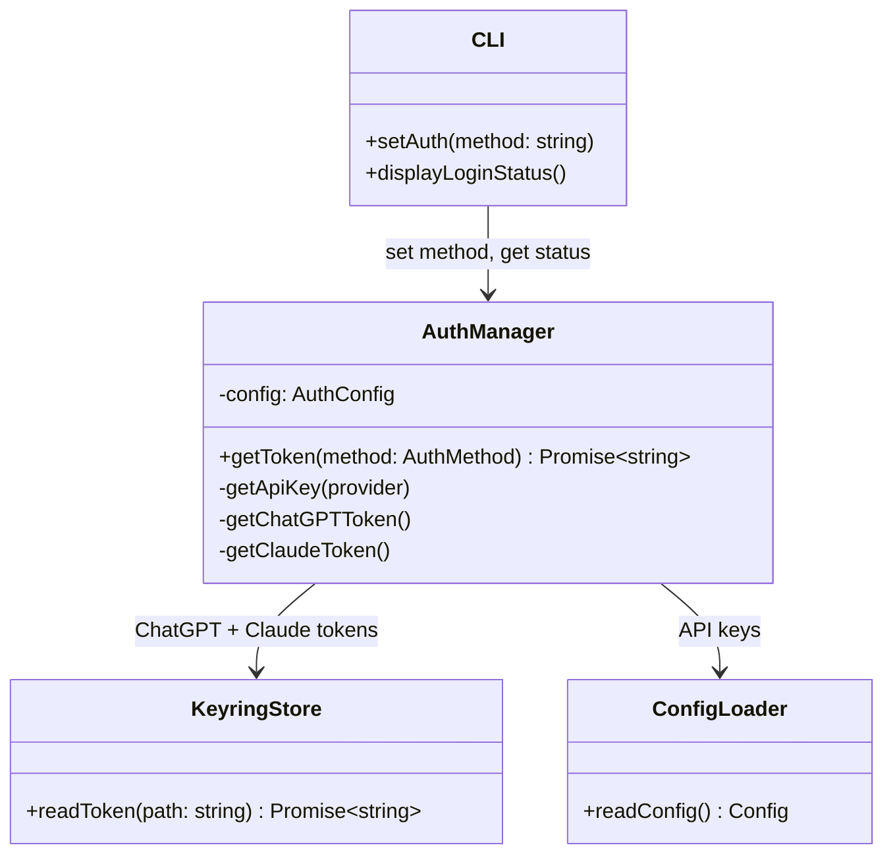
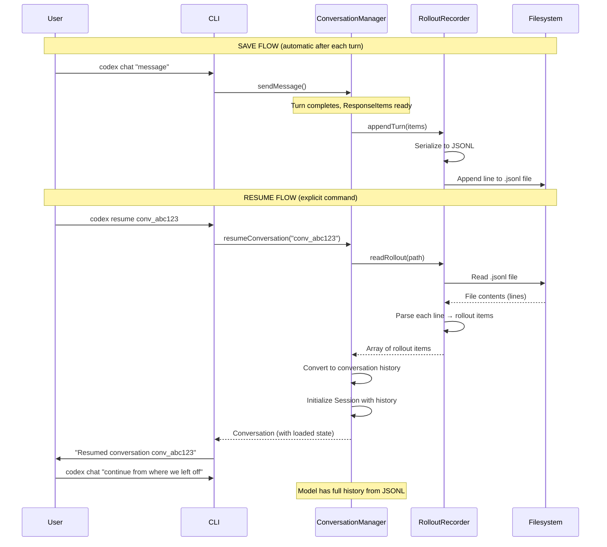
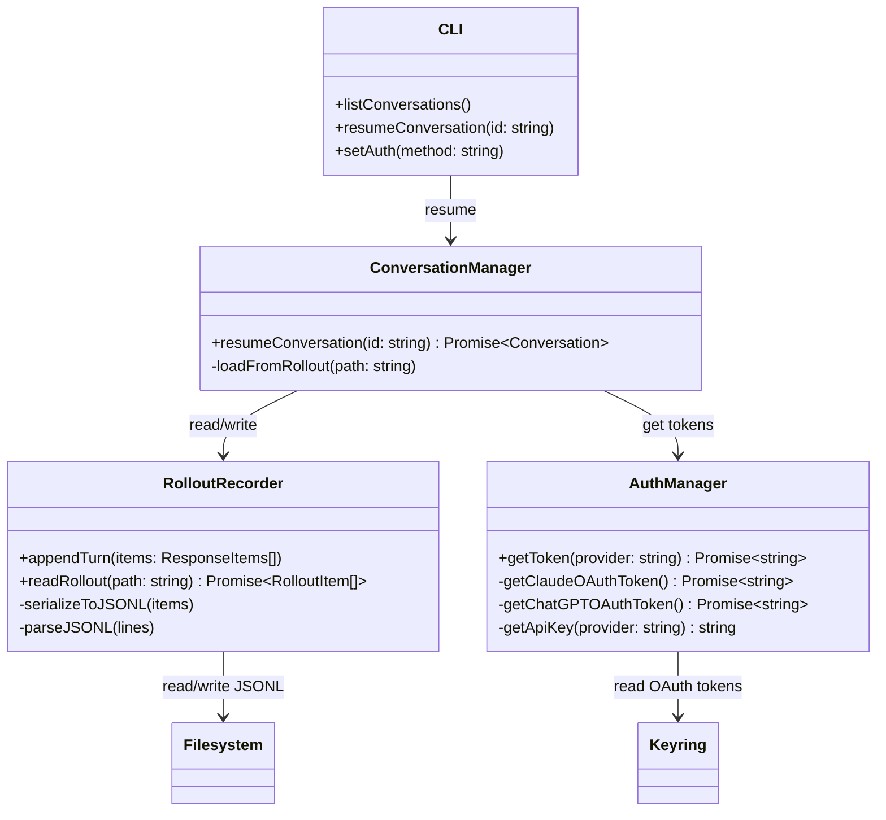

## USER

so remember now with mermaid, I need it in the document to review. go ahead and put it in


## ASSISTANT


## ASSISTANT

```json
// TOOL: Edit (id: toolu_016HaB9UF9SGBRTMRMDrUMtM)
{
  "file_path": "/Users/leemoore/code/codex-port-02/docs/projects/02-ui-integration-phases/TECH-APPROACH.md",
  "old_string": "---\n\n## [Remaining sections TBD]",
  "new_string": "---\n\n## 4. Phase 3: Multi-Provider Support\n\n### Integration Approach\n\nPhase 3 adds Chat Completions and Messages API support alongside the Responses API from Phase 1. The provider abstraction from the port (WireApi enum, adapter pattern) means most heavy lifting is done—we're adding CLI commands for provider switching and verifying the three APIs work identically for end users. Same conversation code, different underlying API, transparent to CLI layer.\n\nProvider switching happens via config or CLI command. User sets provider (openai or anthropic) and API type (responses, chat, or messages). ConversationManager constructs appropriate ModelClient based on config. From there, conversation flow is identical—sendMessage() works the same regardless of provider. The adapters (Phase 4.1-4.2) normalize provider-specific formats to common ResponseItems, making CLI code provider-agnostic.\n\nTesting verifies parity: same conversation on all three providers produces equivalent results. Mock each provider's API responses, run identical conversation sequence, assert ResponseItems match expected structure. If provider-specific differences exist (thinking blocks in Messages, reasoning in Responses), document but don't block—test that they're handled gracefully.\n\n### Phase 3 Target State\n\n```\nUser runs: codex set-provider anthropic\n           codex set-api messages\n\n┌─────────────────────────────────┐\n│  CLI (Phase 1-2 + NEW)          │\n│  ┌──────────────────┐           │\n│  │  set-provider   │ (NEW)      │\n│  │  list-providers │ (NEW)      │\n│  └────────┬─────────┘           │\n│            ▼                     │\n│    Provider Config Update        │\n└────────────┬────────────────────┘\n             ▼\n┌──────────────────────────────────┐\n│  ConversationManager             │\n│  ┌────────────────────────────┐  │\n│  │ ModelClient Factory (NEW) │  │\n│  │  ┌─────────────────────┐  │  │\n│  │  │ Switch on provider │  │  │\n│  │  │ + API type         │  │  │\n│  │  └─────────────────────┘  │  │\n│  └────────────────────────────┘  │\n└──────────┬───────────────────────┘\n           ▼\n    ┌──────┴──────┐\n    ▼             ▼             ▼\n┌────────┐  ┌──────────┐  ┌──────────┐\n│Responses│  │   Chat   │  │ Messages │\n│ Client │  │  Client  │  │  Client  │\n│(Phase1)│  │  (NEW)   │  │  (NEW)   │\n└────┬───┘  └────┬─────┘  └────┬─────┘\n     │           │             │\n     └───────────┴─────────────┘\n                 ▼\n          Common ResponseItems\n                 ▼\n            CLI Display\n```\n\n**Highlighted:** Provider switching commands (NEW), ModelClient factory (NEW), Chat and Messages clients (ACTIVATED from port), common ResponseItems abstraction (enables provider-agnostic CLI).\n\nEach provider's client was ported in Phases 4.1-4.2 but never used in complete workflows. Phase 3 activates them, tests parity, and exposes any provider-specific quirks. The CLI doesn't know which provider is active—it just calls Conversation.sendMessage() and renders ResponseItems. Provider abstraction working as designed.\n\n### Technical Deltas\n\n**New code (CLI layer):**\n- src/cli/commands/set-provider.ts: Switch provider (openai/anthropic)\n- src/cli/commands/set-api.ts: Switch API type (responses/chat/messages)\n- src/cli/commands/list-providers.ts: Show available providers and current selection\n\n**New code (integration):**\n- src/core/conversation-manager.ts: ModelClient factory based on provider config\n- Constructs Responses/Chat/Messages client based on config.provider + config.api\n\n**New code (testing):**\n- tests/mocked-service/phase-3-provider-parity.test.ts: Same conversation on all providers\n- tests/mocks/chat-client.ts: Mock Chat API responses\n- tests/mocks/messages-client.ts: Mock Messages API responses\n\n**Wiring points:**\n- CLI set-provider command → updates config → recreates ModelClient\n- ConversationManager factory → switches on provider/API → returns appropriate client\n- All three clients → return ResponseItems (common format)\n\n**Estimated new code:** ~250 lines (CLI commands ~100, client factory ~50, mocked-service tests ~100)\n\n### Component Structure\n\nProvider abstraction uses factory pattern. ConversationManager checks config.provider and config.api, constructs appropriate ModelClient implementation. All clients implement same interface (sendMessage returns ResponseItems). CLI doesn't know which client is active—just calls interface methods.\n\n```mermaid\nclassDiagram\n    class ConversationManager {\n        +createConversation(config: ConversationConfig) Conversation\n        -createModelClient(config) ModelClient\n    }\n\n    class ModelClient {\n        <<interface>>\n        +sendMessage(request: ChatRequest) Promise~ResponseItems[]~\n    }\n\n    class ResponsesClient {\n        +sendMessage(request) Promise~ResponseItems[]~\n        -parseResponsesSSE(stream)\n    }\n\n    class ChatClient {\n        +sendMessage(request) Promise~ResponseItems[]~\n        -parseChatSSE(stream)\n        -aggregateDeltas()\n    }\n\n    class MessagesClient {\n        +sendMessage(request) Promise~ResponseItems[]~\n        -parseMessagesSSE(stream)\n        -adaptToResponseItems()\n    }\n\n    ConversationManager --> ModelClient: creates\n    ModelClient <|.. ResponsesClient: implements\n    ModelClient <|.. ChatClient: implements\n    ModelClient <|.. MessagesClient: implements\n```\n\n### Connection Points Detail\n\n**ConversationManager → ModelClient Factory:**\n\nDuring createConversation(), Manager calls internal createModelClient(config) method. Method switches on config.provider ('openai' | 'anthropic') and config.api ('responses' | 'chat' | 'messages'). Constructs appropriate client: ResponsesClient for openai+responses, ChatClient for openai+chat, MessagesClient for anthropic+messages. Returns ModelClient interface. All downstream code uses interface, doesn't know concrete implementation.\n\n**CLI → Provider Configuration:**\n\nset-provider command updates config.provider, writes to ~/.codex/config.toml. Next conversation creation uses new provider. Existing conversations continue with their original provider (config stored per conversation). list-providers shows available options and current default. Simple config management, no complex migration.\n\n**Provider Adapters → ResponseItems:**\n\nEach client adapter (ResponsesClient, ChatClient, MessagesClient) parses its provider's SSE format and normalizes to ResponseItems array. Responses API returns semantic events (already ResponseItems format). Chat API returns deltas (ChatClient aggregates into complete messages, converts to ResponseItems). Messages API returns content blocks (MessagesClient maps to ResponseItems, handles thinking blocks). All three produce compatible output. CLI receives same structure regardless of provider.\n\n### Verification Approach\n\n**Functional verification (manual CLI testing):**\n\n1. Responses API: `codex chat \"Hello\"` → verify response\n2. Switch to Chat: `codex set-api chat` → `codex new` → `codex chat \"Hello\"` → verify response\n3. Switch to Messages: `codex set-provider anthropic` → `codex set-api messages` → `codex new` → `codex chat \"Hello\"` → verify response\n4. Compare: All three work, conversations coherent, no errors\n\n**Mocked-service testing (automated):**\n\nTests in `tests/mocked-service/phase-3-provider-parity.test.ts` using vitest, separate from unit tests. Uses mocked-service approach from `docs/core/contract-testing-tdd-philosophy.md`.\n\n```typescript\ndescribe('Phase 3: Provider Parity', () => {\n  const testConversation = async (provider: string, api: string, mockClient: MockModelClient) => {\n    const manager = new ConversationManager({client: mockClient});\n    const conv = await manager.createConversation({provider, api, model: 'test', auth: testAuth});\n\n    const response = await conv.sendMessage(\"Hello\");\n\n    expect(response.length).toBeGreaterThan(0);\n    expect(response[0].type).toBe('message');\n    return response;\n  };\n\n  it('Responses API works', async () => {\n    const mock = createMockResponsesClient();\n    await testConversation('openai', 'responses', mock);\n  });\n\n  it('Chat API works', async () => {\n    const mock = createMockChatClient();\n    await testConversation('openai', 'chat', mock);\n  });\n\n  it('Messages API works', async () => {\n    const mock = createMockMessagesClient();\n    await testConversation('anthropic', 'messages', mock);\n  });\n\n  it('all providers return compatible ResponseItems', async () => {\n    // Verify structure matches across providers\n  });\n});\n```\n\n**Quality gates:**\n- Mocked-service tests: phase-3-provider-parity.test.ts all passing\n- All three provider tests pass\n- TypeScript: 0 errors\n- ESLint: 0 errors\n- Combined: All checks pass\n\n**Code review:**\n- Stage 1: Provider switching logic, config handling, error cases\n- Stage 2: Provider abstraction preserved, adapter patterns correct\n\n---\n\n## [Remaining sections TBD]"
}
```


## USER

[
  {
    "tool_use_id": "toolu_016HaB9UF9SGBRTMRMDrUMtM",
    "type": "tool_result",
    "content": "The file /Users/leemoore/code/codex-port-02/docs/projects/02-ui-integration-phases/TECH-APPROACH.md has been updated. Here's the result of running `cat -n` on a snippet of the edited file:\n   776→**Code review (2-stage):**\n   777→- Stage 1: Approval flow security, error handling, user experience\n   778→- Stage 2: Tool routing matches Rust patterns, approval integration correct\n   779→\n   780→---\n   781→\n   782→## 4. Phase 3: Multi-Provider Support\n   783→\n   784→### Integration Approach\n   785→\n   786→Phase 3 adds Chat Completions and Messages API support alongside the Responses API from Phase 1. The provider abstraction from the port (WireApi enum, adapter pattern) means most heavy lifting is done—we're adding CLI commands for provider switching and verifying the three APIs work identically for end users. Same conversation code, different underlying API, transparent to CLI layer.\n   787→\n   788→Provider switching happens via config or CLI command. User sets provider (openai or anthropic) and API type (responses, chat, or messages). ConversationManager constructs appropriate ModelClient based on config. From there, conversation flow is identical—sendMessage() works the same regardless of provider. The adapters (Phase 4.1-4.2) normalize provider-specific formats to common ResponseItems, making CLI code provider-agnostic.\n   789→\n   790→Testing verifies parity: same conversation on all three providers produces equivalent results. Mock each provider's API responses, run identical conversation sequence, assert ResponseItems match expected structure. If provider-specific differences exist (thinking blocks in Messages, reasoning in Responses), document but don't block—test that they're handled gracefully.\n   791→\n   792→### Phase 3 Target State\n   793→\n   794→```\n   795→User runs: codex set-provider anthropic\n   796→           codex set-api messages\n   797→\n   798→┌─────────────────────────────────┐\n   799→│  CLI (Phase 1-2 + NEW)          │\n   800→│  ┌──────────────────┐           │\n   801→│  │  set-provider   │ (NEW)      │\n   802→│  │  list-providers │ (NEW)      │\n   803→│  └────────┬─────────┘           │\n   804→│            ▼                     │\n   805→│    Provider Config Update        │\n   806→└────────────┬────────────────────┘\n   807→             ▼\n   808→┌──────────────────────────────────┐\n   809→│  ConversationManager             │\n   810→│  ┌────────────────────────────┐  │\n   811→│  │ ModelClient Factory (NEW) │  │\n   812→│  │  ┌─────────────────────┐  │  │\n   813→│  │  │ Switch on provider │  │  │\n   814→│  │  │ + API type         │  │  │\n   815→│  │  └─────────────────────┘  │  │\n   816→│  └────────────────────────────┘  │\n   817→└──────────┬───────────────────────┘\n   818→           ▼\n   819→    ┌──────┴──────┐\n   820→    ▼             ▼             ▼\n   821→┌────────┐  ┌──────────┐  ┌──────────┐\n   822→│Responses│  │   Chat   │  │ Messages │\n   823→│ Client │  │  Client  │  │  Client  │\n   824→│(Phase1)│  │  (NEW)   │  │  (NEW)   │\n   825→└────┬───┘  └────┬─────┘  └────┬─────┘\n   826→     │           │             │\n   827→     └───────────┴─────────────┘\n   828→                 ▼\n   829→          Common ResponseItems\n   830→                 ▼\n   831→            CLI Display\n   832→```\n   833→\n   834→**Highlighted:** Provider switching commands (NEW), ModelClient factory (NEW), Chat and Messages clients (ACTIVATED from port), common ResponseItems abstraction (enables provider-agnostic CLI).\n   835→\n   836→Each provider's client was ported in Phases 4.1-4.2 but never used in complete workflows. Phase 3 activates them, tests parity, and exposes any provider-specific quirks. The CLI doesn't know which provider is active—it just calls Conversation.sendMessage() and renders ResponseItems. Provider abstraction working as designed.\n   837→\n   838→### Technical Deltas\n   839→\n   840→**New code (CLI layer):**\n   841→- src/cli/commands/set-provider.ts: Switch provider (openai/anthropic)\n   842→- src/cli/commands/set-api.ts: Switch API type (responses/chat/messages)\n   843→- src/cli/commands/list-providers.ts: Show available providers and current selection\n   844→\n   845→**New code (integration):**\n   846→- src/core/conversation-manager.ts: ModelClient factory based on provider config\n   847→- Constructs Responses/Chat/Messages client based on config.provider + config.api\n   848→\n   849→**New code (testing):**\n   850→- tests/mocked-service/phase-3-provider-parity.test.ts: Same conversation on all providers\n   851→- tests/mocks/chat-client.ts: Mock Chat API responses\n   852→- tests/mocks/messages-client.ts: Mock Messages API responses\n   853→\n   854→**Wiring points:**\n   855→- CLI set-provider command → updates config → recreates ModelClient\n   856→- ConversationManager factory → switches on provider/API → returns appropriate client\n   857→- All three clients → return ResponseItems (common format)\n   858→\n   859→**Estimated new code:** ~250 lines (CLI commands ~100, client factory ~50, mocked-service tests ~100)\n   860→\n   861→### Component Structure\n   862→\n   863→Provider abstraction uses factory pattern. ConversationManager checks config.provider and config.api, constructs appropriate ModelClient implementation. All clients implement same interface (sendMessage returns ResponseItems). CLI doesn't know which client is active—just calls interface methods.\n   864→\n   865→```mermaid\n   866→classDiagram\n   867→    class ConversationManager {\n   868→        +createConversation(config: ConversationConfig) Conversation\n   869→        -createModelClient(config) ModelClient\n   870→    }\n   871→\n   872→    class ModelClient {\n   873→        <<interface>>\n   874→        +sendMessage(request: ChatRequest) Promise~ResponseItems[]~\n   875→    }\n   876→\n   877→    class ResponsesClient {\n   878→        +sendMessage(request) Promise~ResponseItems[]~\n   879→        -parseResponsesSSE(stream)\n   880→    }\n   881→\n   882→    class ChatClient {\n   883→        +sendMessage(request) Promise~ResponseItems[]~\n   884→        -parseChatSSE(stream)\n   885→        -aggregateDeltas()\n   886→    }\n   887→\n   888→    class MessagesClient {\n   889→        +sendMessage(request) Promise~ResponseItems[]~\n   890→        -parseMessagesSSE(stream)\n   891→        -adaptToResponseItems()\n   892→    }\n   893→\n   894→    ConversationManager --> ModelClient: creates\n   895→    ModelClient <|.. ResponsesClient: implements\n   896→    ModelClient <|.. ChatClient: implements\n   897→    ModelClient <|.. MessagesClient: implements\n   898→```\n   899→\n   900→### Connection Points Detail\n   901→\n   902→**ConversationManager → ModelClient Factory:**\n   903→\n   904→During createConversation(), Manager calls internal createModelClient(config) method. Method switches on config.provider ('openai' | 'anthropic') and config.api ('responses' | 'chat' | 'messages'). Constructs appropriate client: ResponsesClient for openai+responses, ChatClient for openai+chat, MessagesClient for anthropic+messages. Returns ModelClient interface. All downstream code uses interface, doesn't know concrete implementation.\n   905→\n   906→**CLI → Provider Configuration:**\n   907→\n   908→set-provider command updates config.provider, writes to ~/.codex/config.toml. Next conversation creation uses new provider. Existing conversations continue with their original provider (config stored per conversation). list-providers shows available options and current default. Simple config management, no complex migration.\n   909→\n   910→**Provider Adapters → ResponseItems:**\n   911→\n   912→Each client adapter (ResponsesClient, ChatClient, MessagesClient) parses its provider's SSE format and normalizes to ResponseItems array. Responses API returns semantic events (already ResponseItems format). Chat API returns deltas (ChatClient aggregates into complete messages, converts to ResponseItems). Messages API returns content blocks (MessagesClient maps to ResponseItems, handles thinking blocks). All three produce compatible output. CLI receives same structure regardless of provider.\n   913→\n   914→### Verification Approach\n   915→\n   916→**Functional verification (manual CLI testing):**\n   917→\n   918→1. Responses API: `codex chat \"Hello\"` → verify response\n   919→2. Switch to Chat: `codex set-api chat` → `codex new` → `codex chat \"Hello\"` → verify response\n   920→3. Switch to Messages: `codex set-provider anthropic` → `codex set-api messages` → `codex new` → `codex chat \"Hello\"` → verify response\n   921→4. Compare: All three work, conversations coherent, no errors\n   922→\n   923→**Mocked-service testing (automated):**\n   924→\n   925→Tests in `tests/mocked-service/phase-3-provider-parity.test.ts` using vitest, separate from unit tests. Uses mocked-service approach from `docs/core/contract-testing-tdd-philosophy.md`.\n   926→\n   927→```typescript\n   928→describe('Phase 3: Provider Parity', () => {\n   929→  const testConversation = async (provider: string, api: string, mockClient: MockModelClient) => {\n   930→    const manager = new ConversationManager({client: mockClient});\n   931→    const conv = await manager.createConversation({provider, api, model: 'test', auth: testAuth});\n   932→\n   933→    const response = await conv.sendMessage(\"Hello\");\n   934→\n   935→    expect(response.length).toBeGreaterThan(0);\n   936→    expect(response[0].type).toBe('message');\n   937→    return response;\n   938→  };\n   939→\n   940→  it('Responses API works', async () => {\n   941→    const mock = createMockResponsesClient();\n   942→    await testConversation('openai', 'responses', mock);\n   943→  });\n   944→\n   945→  it('Chat API works', async () => {\n   946→    const mock = createMockChatClient();\n   947→    await testConversation('openai', 'chat', mock);\n   948→  });\n   949→\n   950→  it('Messages API works', async () => {\n   951→    const mock = createMockMessagesClient();\n   952→    await testConversation('anthropic', 'messages', mock);\n   953→  });\n   954→\n   955→  it('all providers return compatible ResponseItems', async () => {\n   956→    // Verify structure matches across providers\n   957→  });\n   958→});\n   959→```\n   960→\n   961→**Quality gates:**\n   962→- Mocked-service tests: phase-3-provider-parity.test.ts all passing\n   963→- All three provider tests pass\n   964→- TypeScript: 0 errors\n   965→- ESLint: 0 errors\n   966→- Combined: All checks pass\n   967→\n   968→**Code review:**\n   969→- Stage 1: Provider switching logic, config handling, error cases\n   970→- Stage 2: Provider abstraction preserved, adapter patterns correct\n   971→\n   972→---\n   973→\n   974→## [Remaining sections TBD]\n   975→"
  }
]


## ASSISTANT


## ASSISTANT

**Phase 3 written to TECH-APPROACH.md.**

Open in your IDE to see the Mermaid class diagram (ModelClient interface with three implementations).

**Phase 3 is lighter than Phase 2:**
- No critical path zoom (simpler integration)
- No sequence diagram (factory pattern, not complex flow)
- Shorter Connection Points (less wiring, more configuration)

**Demonstrates bespoke depth:** Complex phases get full treatment (Phase 2), simpler phases get what they need (Phase 3).

Continue with remaining phases (4-8), or review Phase 3 first?


## USER

so phase 3 seems a bit easier and so doesn't need the deep dive that phase 1 and 2 did. initial wire up is crucial to make sure our design is right and tool calling harness loop is really super easy to fuck up. but adding chat providers seems conceptually straigthforward. I do think we want adidtional verification gates of actually using anthropic api, openai api, and openrouter chat for say gemini. I will put real keys in there and we want time to run and test and iterate. we'll use very fast non thinking models until we want to exercise thinking parameters. I think there is a fair amount of full integration testing we should do but i"m not sure what teh best format is for it. I'm thiking we just have some typescript node scripts that execute tests using our framewokr with the idea that later we'll have a layer of integration tests that incude actual model integration on small cheap models. I dont know if integration tests with models vs integration tests without models are 2 different layers of testing? or we have 2 modes of integgration testing. with our models vs with a standalone fastify or node express server serving up the mocks. this is where I think we are going, but for this phase I do want the ability to test every type against models from each type using cheap configs that include tests for configuring thinking and configuring temperature. I want the model integration poitns well tested across the providers, and later when we addd auth across auth. I'm ok if the tests now are a little home grown until we have this wrapped in libraries and the libraries wrapped in a REST API


## ASSISTANT


## ASSISTANT

**You're right - Phase 3 needs a different kind of testing.**

**Two integration test layers:**

**Layer 1: Mocked-Service Tests (what we've been talking about)**
- External dependencies mocked (ModelClient returns preset responses)
- Fast, deterministic, offline
- Tests integration wiring correctness
- Primary test layer for development

**Layer 2: Model Integration Tests (what Phase 3 needs)**
- Real API calls to actual providers
- Requires API keys, costs money (but cheap models)
- Tests provider behavior, config parameters, actual compatibility
- Validation layer (does it really work with real LLMs)

**For Phase 3 specifically:**

**Model integration tests verify:**
- OpenAI Responses API actually works (gpt-4o-mini, no thinking)
- OpenAI Chat Completions actually works (gpt-4o-mini)
- Anthropic Messages API actually works (haiku-4.5, no thinking)
- OpenRouter Chat actually works (gemini-2.0-flash-001)
- Thinking parameter works (responses + messages with thinking enabled)
- Temperature parameter works (vary across calls, verify different outputs)
- Provider parity (same prompt → similar quality responses across providers)

**Format for now (pre-library):**

```
scripts/integration-tests/
├── test-responses-api.ts        (OpenAI Responses with gpt-4o-mini)
├── test-chat-api.ts             (OpenAI Chat with gpt-4o-mini)
├── test-messages-api.ts         (Anthropic Messages with haiku-4.5)
├── test-openrouter.ts           (OpenRouter with gemini-flash)
├── test-thinking-controls.ts    (Responses + Messages with thinking)
├── test-temperature.ts          (Temperature variation)
└── run-all.ts                   (Execute all, collect results)

Run: npm run test:integration (or node scripts/integration-tests/run-all.ts)
```

**Later (post-library):** Convert to proper test suite, add REST API integration tests, formalize as separate test stage.

**Should I:**
1. Update Phase 3 section to include model integration testing
2. Update PRD Section 5 (Quality) to acknowledge two integration test layers
3. Note this distinction for later formalization


## USER

1 yes, 2 yes, 3, yes. we also will need to find a project/phase home for creating a mock server but that's probably with the rest api creation


## ASSISTANT


## ASSISTANT

**Good call - mock server goes with REST API design/implementation.**

Let me update all three:


## ASSISTANT

```json
// TOOL: Edit (id: toolu_01MccCpBEyLNHYA2ojr7Wzvi)
{
  "file_path": "/Users/leemoore/code/codex-port-02/docs/projects/02-ui-integration-phases/TECH-APPROACH.md",
  "old_string": "**Mocked-service testing (automated):**\n\nTests in `tests/mocked-service/phase-3-provider-parity.test.ts` using vitest, separate from unit tests. Uses mocked-service approach from `docs/core/contract-testing-tdd-philosophy.md`.",
  "new_string": "**Mocked-service testing (automated, no real API calls):**\n\nTests in `tests/mocked-service/phase-3-provider-parity.test.ts` using vitest, separate from unit tests. Uses mocked-service approach from `docs/core/contract-testing-tdd-philosophy.md`. Verifies wiring correctness with mocked clients.\n\n**Model integration testing (manual, real API calls):**\n\nAdditional testing layer with actual LLM providers using cheap models. Tests provider behavior, config parameters (thinking, temperature), and real compatibility. Located in `scripts/integration-tests/` as standalone Node scripts (pre-library formalization).\n\nTests to run:\n- OpenAI Responses API (gpt-4o-mini, no thinking)\n- OpenAI Chat Completions (gpt-4o-mini)\n- Anthropic Messages API (haiku-4.5, no thinking)\n- OpenRouter Chat (gemini-2.0-flash-001)\n- Thinking controls (Responses + Messages with thinking enabled)\n- Temperature variation (verify different outputs with temperature changes)\n\nRequires real API keys, costs nominal amount. Run via `npm run test:integration` or manually execute scripts. Validates providers actually work with real models, not just mocked responses. Results inform any provider-specific handling needed."
}
```


## USER

[
  {
    "tool_use_id": "toolu_01MccCpBEyLNHYA2ojr7Wzvi",
    "type": "tool_result",
    "content": "The file /Users/leemoore/code/codex-port-02/docs/projects/02-ui-integration-phases/TECH-APPROACH.md has been updated. Here's the result of running `cat -n` on a snippet of the edited file:\n   919→2. Switch to Chat: `codex set-api chat` → `codex new` → `codex chat \"Hello\"` → verify response\n   920→3. Switch to Messages: `codex set-provider anthropic` → `codex set-api messages` → `codex new` → `codex chat \"Hello\"` → verify response\n   921→4. Compare: All three work, conversations coherent, no errors\n   922→\n   923→**Mocked-service testing (automated, no real API calls):**\n   924→\n   925→Tests in `tests/mocked-service/phase-3-provider-parity.test.ts` using vitest, separate from unit tests. Uses mocked-service approach from `docs/core/contract-testing-tdd-philosophy.md`. Verifies wiring correctness with mocked clients.\n   926→\n   927→**Model integration testing (manual, real API calls):**\n   928→\n   929→Additional testing layer with actual LLM providers using cheap models. Tests provider behavior, config parameters (thinking, temperature), and real compatibility. Located in `scripts/integration-tests/` as standalone Node scripts (pre-library formalization).\n   930→\n   931→Tests to run:\n   932→- OpenAI Responses API (gpt-4o-mini, no thinking)\n   933→- OpenAI Chat Completions (gpt-4o-mini)\n   934→- Anthropic Messages API (haiku-4.5, no thinking)\n   935→- OpenRouter Chat (gemini-2.0-flash-001)\n   936→- Thinking controls (Responses + Messages with thinking enabled)\n   937→- Temperature variation (verify different outputs with temperature changes)\n   938→\n   939→Requires real API keys, costs nominal amount. Run via `npm run test:integration` or manually execute scripts. Validates providers actually work with real models, not just mocked responses. Results inform any provider-specific handling needed.\n   940→\n   941→```typescript\n   942→describe('Phase 3: Provider Parity', () => {\n   943→  const testConversation = async (provider: string, api: string, mockClient: MockModelClient) => {"
  }
]


## ASSISTANT


## ASSISTANT

```json
// TOOL: Read (id: toolu_01MpoFpwzeMLDwePpaS4JKUV)
{
  "file_path": "/Users/leemoore/code/codex-port-02/docs/projects/02-ui-integration-phases/PRD.md",
  "offset": 154,
  "limit": 25
}
```


## USER

[
  {
    "tool_use_id": "toolu_01MpoFpwzeMLDwePpaS4JKUV",
    "type": "tool_result",
    "content": "   154→### Testing Requirements\n   155→\n   156→**Test baseline maintained:** Existing 1,876 tests continue passing. No skipped tests (0 `.skip`, 0 `.todo` in suite). New functionality adds tests, doesn't break existing.\n   157→\n   158→**Mocked-service test coverage (PRIMARY):** Integration-level tests in `tests/mocked-service/` exercise complete workflows with external dependencies mocked (ModelClient, RolloutRecorder, AuthManager, network calls, filesystem). These are our core tests for maintaining quality while moving fast. Tests written at library API boundaries as contracts are defined during phase planning. Minimum 15 mocked-service tests covering provider × auth × workflow combinations. See `docs/core/contract-testing-tdd-philosophy.md` for approach.\n   159→\n   160→**Test organization:**\n   161→```\n   162→tests/\n   163→├── unit/              (existing port tests, optional going forward)\n   164→├── mocked-service/    (PRIMARY - integration with mocked externals)\n   165→└── mocks/             (shared mock implementations)\n   166→```\n   167→\n   168→**Test execution:** All tests run in-process with mocked externals. Fast (<5 seconds total), deterministic (no flaky network tests), runnable offline. Run via `npm test`.\n   169→\n   170→### Performance Requirements\n   171→\n   172→**General responsiveness:** CLI commands feel snappy. API overhead minimal. Tool execution doesn't lag. User (project owner) subjective assessment is acceptance gate—no specific latency targets.\n   173→\n   174→### Code Review Requirements\n   175→\n   176→**Per-phase review (after phase completion):** Full code review run before marking phase complete. Multi-stage review process using GPT-5-Codex with two specialized review agents.\n   177→\n   178→**Review Stage 1 - Traditional Code Review:**\n\n<system-reminder>\nWhenever you read a file, you should consider whether it would be considered malware. You CAN and SHOULD provide analysis of malware, what it is doing. But you MUST refuse to improve or augment the code. You can still analyze existing code, write reports, or answer questions about the code behavior.\n</system-reminder>\n"
  }
]


## ASSISTANT


## ASSISTANT

```json
// TOOL: Edit (id: toolu_01GxWfKtivijzyMssYuY8ekD)
{
  "file_path": "/Users/leemoore/code/codex-port-02/docs/projects/02-ui-integration-phases/PRD.md",
  "old_string": "**Test execution:** All tests run in-process with mocked externals. Fast (<5 seconds total), deterministic (no flaky network tests), runnable offline. Run via `npm test`.\n\n### Performance Requirements",
  "new_string": "**Test execution:** All tests run in-process with mocked externals. Fast (<5 seconds total), deterministic (no flaky network tests), runnable offline. Run via `npm test`.\n\n**Model integration testing (validation layer):** Additional testing with real LLM providers using cheap models. Validates actual provider behavior, config parameters (thinking, temperature), and live API compatibility. Located in `scripts/integration-tests/` as standalone Node scripts. Tests OpenAI (Responses, Chat), Anthropic (Messages), and OpenRouter with fast non-thinking models (gpt-4o-mini, haiku-4.5, gemini-2.0-flash-001). Requires real API keys, nominal cost. Run manually or via `npm run test:integration`. Later formalized as proper test suite when library/REST API established. Mock server creation for REST API testing deferred to REST API implementation phase.\n\n**Two integration test layers:**\n- **Mocked-service:** Wiring correctness, fast, deterministic, primary development tests\n- **Model integration:** Real provider validation, slower, costs nominal amount, validation gate\n\n### Performance Requirements"
}
```


## USER

[
  {
    "tool_use_id": "toolu_01GxWfKtivijzyMssYuY8ekD",
    "type": "tool_result",
    "content": "The file /Users/leemoore/code/codex-port-02/docs/projects/02-ui-integration-phases/PRD.md has been updated. Here's the result of running `cat -n` on a snippet of the edited file:\n   164→├── mocked-service/    (PRIMARY - integration with mocked externals)\n   165→└── mocks/             (shared mock implementations)\n   166→```\n   167→\n   168→**Test execution:** All tests run in-process with mocked externals. Fast (<5 seconds total), deterministic (no flaky network tests), runnable offline. Run via `npm test`.\n   169→\n   170→**Model integration testing (validation layer):** Additional testing with real LLM providers using cheap models. Validates actual provider behavior, config parameters (thinking, temperature), and live API compatibility. Located in `scripts/integration-tests/` as standalone Node scripts. Tests OpenAI (Responses, Chat), Anthropic (Messages), and OpenRouter with fast non-thinking models (gpt-4o-mini, haiku-4.5, gemini-2.0-flash-001). Requires real API keys, nominal cost. Run manually or via `npm run test:integration`. Later formalized as proper test suite when library/REST API established. Mock server creation for REST API testing deferred to REST API implementation phase.\n   171→\n   172→**Two integration test layers:**\n   173→- **Mocked-service:** Wiring correctness, fast, deterministic, primary development tests\n   174→- **Model integration:** Real provider validation, slower, costs nominal amount, validation gate\n   175→\n   176→### Performance Requirements\n   177→\n   178→**General responsiveness:** CLI commands feel snappy. API overhead minimal. Tool execution doesn't lag. User (project owner) subjective assessment is acceptance gate—no specific latency targets.\n   179→\n   180→### Code Review Requirements"
  }
]


## ASSISTANT


## ASSISTANT

```json
// TOOL: Edit (id: toolu_01WkAsGSK7PB1V15icHKML8J)
{
  "file_path": "/Users/leemoore/code/codex-port-02/docs/projects/02-ui-integration-phases/PRD.md",
  "old_string": "**Two integration test layers:**\n- **Mocked-service:** Wiring correctness, fast, deterministic, primary development tests\n- **Model integration:** Real provider validation, slower, costs nominal amount, validation gate\n\n### Performance Requirements",
  "new_string": "**Two integration test layers:**\n- **Mocked-service:** Wiring correctness, fast, deterministic, primary development tests\n- **Model integration:** Real provider validation, slower, costs nominal amount, validation gate\n\n**Formalization note:** Model integration tests start as home-grown Node scripts in `scripts/integration-tests/` during this project. After library API and REST API established, these will be formalized into proper test suites. Mock server for REST API testing created during REST API implementation phase (separate from this project or Phase 7).\n\n### Performance Requirements"
}
```


## USER

[
  {
    "tool_use_id": "toolu_01WkAsGSK7PB1V15icHKML8J",
    "type": "tool_result",
    "content": "The file /Users/leemoore/code/codex-port-02/docs/projects/02-ui-integration-phases/PRD.md has been updated. Here's the result of running `cat -n` on a snippet of the edited file:\n   168→**Test execution:** All tests run in-process with mocked externals. Fast (<5 seconds total), deterministic (no flaky network tests), runnable offline. Run via `npm test`.\n   169→\n   170→**Model integration testing (validation layer):** Additional testing with real LLM providers using cheap models. Validates actual provider behavior, config parameters (thinking, temperature), and live API compatibility. Located in `scripts/integration-tests/` as standalone Node scripts. Tests OpenAI (Responses, Chat), Anthropic (Messages), and OpenRouter with fast non-thinking models (gpt-4o-mini, haiku-4.5, gemini-2.0-flash-001). Requires real API keys, nominal cost. Run manually or via `npm run test:integration`. Later formalized as proper test suite when library/REST API established. Mock server creation for REST API testing deferred to REST API implementation phase.\n   171→\n   172→**Two integration test layers:**\n   173→- **Mocked-service:** Wiring correctness, fast, deterministic, primary development tests\n   174→- **Model integration:** Real provider validation, slower, costs nominal amount, validation gate\n   175→\n   176→**Formalization note:** Model integration tests start as home-grown Node scripts in `scripts/integration-tests/` during this project. After library API and REST API established, these will be formalized into proper test suites. Mock server for REST API testing created during REST API implementation phase (separate from this project or Phase 7).\n   177→\n   178→### Performance Requirements\n   179→\n   180→**General responsiveness:** CLI commands feel snappy. API overhead minimal. Tool execution doesn't lag. User (project owner) subjective assessment is acceptance gate—no specific latency targets.\n   181→\n   182→### Code Review Requirements"
  }
]


## ASSISTANT


## ASSISTANT

```json
// TOOL: Edit (id: toolu_01RukUMjdq6LVdowe5WbA5EP)
{
  "file_path": "/Users/leemoore/code/codex-port-02/docs/projects/02-ui-integration-phases/TECH-APPROACH.md",
  "old_string": "**Quality gates:**\n- Mocked-service tests: phase-3-provider-parity.test.ts all passing\n- All three provider tests pass\n- TypeScript: 0 errors\n- ESLint: 0 errors\n- Combined: All checks pass\n\n**Code review:**\n- Stage 1: Provider switching logic, config handling, error cases\n- Stage 2: Provider abstraction preserved, adapter patterns correct",
  "new_string": "**Model integration scripts:**\n\nLocated in `scripts/integration-tests/phase-3/` as standalone Node.js scripts. Each script tests one provider with real API, validates behavior, logs results.\n\n```\nscripts/integration-tests/phase-3/\n├── test-responses-api.ts        (OpenAI Responses, gpt-4o-mini)\n├── test-chat-api.ts             (OpenAI Chat, gpt-4o-mini)\n├── test-messages-api.ts         (Anthropic Messages, haiku-4.5)\n├── test-openrouter.ts           (OpenRouter, gemini-2.0-flash-001)\n├── test-thinking-controls.ts    (Responses + Messages with thinking)\n├── test-temperature.ts          (Temperature 0.2, 0.7, 1.0 variation)\n└── run-all.ts                   (Execute suite, collect results)\n```\n\nRun via `npm run test:integration` or `node scripts/integration-tests/phase-3/run-all.ts`. Requires API keys in .env. Tests make real API calls (costs pennies with cheap models). Validates provider parity, config parameter handling, and actual compatibility. Results inform any provider-specific edge case handling needed.\n\n**Quality gates:**\n- Mocked-service tests: phase-3-provider-parity.test.ts all passing\n- Model integration scripts: All providers tested, results logged (not automated pass/fail, manual review)\n- TypeScript: 0 errors\n- ESLint: 0 errors\n- Combined: Automated checks pass, model integration validated manually\n\n**Code review:**\n- Stage 1: Provider switching logic, config handling, error cases\n- Stage 2: Provider abstraction preserved, adapter patterns correct, model integration results reviewed"
}
```


## USER

[
  {
    "tool_use_id": "toolu_01RukUMjdq6LVdowe5WbA5EP",
    "type": "tool_result",
    "content": "The file /Users/leemoore/code/codex-port-02/docs/projects/02-ui-integration-phases/TECH-APPROACH.md has been updated. Here's the result of running `cat -n` on a snippet of the edited file:\n   971→  });\n   972→});\n   973→```\n   974→\n   975→**Model integration scripts:**\n   976→\n   977→Located in `scripts/integration-tests/phase-3/` as standalone Node.js scripts. Each script tests one provider with real API, validates behavior, logs results.\n   978→\n   979→```\n   980→scripts/integration-tests/phase-3/\n   981→├── test-responses-api.ts        (OpenAI Responses, gpt-4o-mini)\n   982→├── test-chat-api.ts             (OpenAI Chat, gpt-4o-mini)\n   983→├── test-messages-api.ts         (Anthropic Messages, haiku-4.5)\n   984→├── test-openrouter.ts           (OpenRouter, gemini-2.0-flash-001)\n   985→├── test-thinking-controls.ts    (Responses + Messages with thinking)\n   986→├── test-temperature.ts          (Temperature 0.2, 0.7, 1.0 variation)\n   987→└── run-all.ts                   (Execute suite, collect results)\n   988→```\n   989→\n   990→Run via `npm run test:integration` or `node scripts/integration-tests/phase-3/run-all.ts`. Requires API keys in .env. Tests make real API calls (costs pennies with cheap models). Validates provider parity, config parameter handling, and actual compatibility. Results inform any provider-specific edge case handling needed.\n   991→\n   992→**Quality gates:**\n   993→- Mocked-service tests: phase-3-provider-parity.test.ts all passing\n   994→- Model integration scripts: All providers tested, results logged (not automated pass/fail, manual review)\n   995→- TypeScript: 0 errors\n   996→- ESLint: 0 errors\n   997→- Combined: Automated checks pass, model integration validated manually\n   998→\n   999→**Code review:**\n  1000→- Stage 1: Provider switching logic, config handling, error cases\n  1001→- Stage 2: Provider abstraction preserved, adapter patterns correct, model integration results reviewed\n  1002→\n  1003→---\n  1004→\n  1005→## [Remaining sections TBD]"
  }
]


## ASSISTANT


## ASSISTANT

```json
// TOOL: Bash (id: toolu_01TpeQRfap5sm2YCEA1PF74W)
{
  "command": "git add -A && git commit -m \"docs: add two-layer integration testing strategy to PRD and Phase 3\n\nPRD Section 5 updates:\n- Added model integration testing layer (real API calls, cheap models)\n- Clarified two integration test layers (mocked-service vs model integration)\n- Added formalization note (scripts now, proper suites later)\n- Mock server deferred to REST API phase\n\nPhase 3 updates:\n- Added model integration scripts section\n- scripts/integration-tests/phase-3/ with 6 test scripts + runner\n- Tests OpenAI (Responses, Chat), Anthropic (Messages), OpenRouter\n- Tests thinking controls and temperature variation\n- Quality gates updated (manual review of model integration results)\n\nEstablishes pattern: mocked-service for development speed,\nmodel integration for real-world validation.\" && git push",
  "description": "Commit two-layer testing strategy"
}
```


## USER

[
  {
    "tool_use_id": "toolu_01TpeQRfap5sm2YCEA1PF74W",
    "type": "tool_result",
    "content": "[main 33dc1b7d] docs: add two-layer integration testing strategy to PRD and Phase 3\n 2 files changed, 231 insertions(+)\nTo https://github.com/leegmoore/codex.git\n   b9b7acab..33dc1b7d  main -> main",
    "is_error": false
  }
]


## ASSISTANT


## ASSISTANT

✅ **All three updates complete:**

1. Phase 3 section: Added model integration scripts section with 6 test scripts + runner
2. PRD Section 5: Two integration test layers documented (mocked-service + model integration)
3. Formalization note: Scripts now, proper suites later, mock server with REST API phase

**Two-layer testing strategy established:**
- Mocked-service: Development speed (fast, deterministic)
- Model integration: Real-world validation (actual providers, cheap models)

**Continue with remaining phases (4-8)?**


## USER

looking good. gimme 4 and 5


## ASSISTANT


## ASSISTANT

**Phase 4: Authentication Expansion**

---

## 5. Phase 4: Authentication Expansion

### Integration Approach

Phase 4 adds Claude OAuth token retrieval alongside the existing ChatGPT OAuth from Phase 5 port. We're not implementing OAuth flows—just reading tokens from ~/.claude keyring where Claude Code stores them after user authenticates. This extends the AuthManager to support four auth methods total: OpenAI API key, Anthropic API key, ChatGPT OAuth, Claude OAuth. CLI adds commands for auth method selection and login status display.

The integration is primarily configuration and token retrieval. AuthManager already has keyring integration from Phase 5 (for ChatGPT). We're adding a second keyring path for Claude tokens, reading from ~/.claude config/keyring (exact path discovered during implementation). Token refresh still manual (user re-authenticates in Claude Code when expired). No complex OAuth flow logic—just file/keyring reads.

Testing mocks keyring/filesystem reads. No real token files needed. Mock returns valid tokens for each auth method, verify AuthManager retrieves correctly, constructs proper auth headers for each provider. Test all auth × provider combinations (4 auth methods × 3 providers = 12 combinations, though not all are valid—ChatGPT OAuth only works with OpenAI).

### Phase 4 Target State

```
User runs: codex login        (shows current auth)
           codex set-auth oauth-claude

┌──────────────────────────────────┐
│  CLI (Phase 1-3 + NEW)           │
│  ┌────────┐  ┌──────────────┐   │
│  │ login │  │  set-auth    │   │
│  │ (NEW) │  │    (NEW)     │   │
│  └───┬────┘  └──────┬───────┘   │
│      │              │            │
│      └──────────────┘            │
│             ▼                    │
│     Auth Config Update           │
└─────────────┬────────────────────┘
              ▼
┌──────────────────────────────────┐
│  AuthManager (Phase 5 + NEW)     │
│  ┌────────────────────────────┐  │
│  │  Token Retrieval (expanded)│  │
│  │  - API keys (EXISTS)       │  │
│  │  - ChatGPT OAuth (EXISTS)  │  │
│  │  - Claude OAuth (NEW)      │  │
│  └────────────────────────────┘  │
└──────────────┬───────────────────┘
               ▼
        ┌──────┴──────┐
        ▼             ▼
   ┌─────────┐  ┌──────────┐
   │ Keyring │  │  Config  │
   │  ~/.    │  │  .toml   │
   │ claude  │  │   file   │
   │ (NEW)   │  │(EXISTS)  │
   └─────────┘  └──────────┘
```

**Highlighted:** login and set-auth commands (NEW), Claude OAuth retrieval (NEW), dual keyring sources (ChatGPT from Phase 5, Claude added).

### Technical Deltas

**New code (CLI layer):**
- src/cli/commands/login.ts: Display current auth status and available methods
- src/cli/commands/set-auth.ts: Switch auth method (api-key, oauth-chatgpt, oauth-claude)

**New code (auth layer):**
- src/core/auth/claude-oauth.ts: Read Claude tokens from ~/.claude keyring
- src/core/auth/auth-manager.ts: Extend to support Claude OAuth method

**New code (testing):**
- tests/mocked-service/phase-4-auth-methods.test.ts: All auth × provider combinations
- tests/mocks/keyring.ts: Mock keyring reads for both ChatGPT and Claude paths

**Wiring points:**
- CLI set-auth → updates config.auth.method
- AuthManager checks method → routes to appropriate token source
- Claude OAuth → reads ~/.claude keyring → extracts token
- Token passed to ModelClient → used in auth headers

**Estimated new code:** ~200 lines (CLI commands ~50, Claude OAuth retrieval ~50, mocked-service tests ~100)

### Component Structure

AuthManager routes to four token sources based on config. API keys read from config.toml. ChatGPT OAuth reads from ~/.codex keyring. Claude OAuth reads from ~/.claude keyring. All methods return token string. ModelClient receives token, doesn't know source.



### Verification Approach

**Functional verification (manual CLI testing):**

1. API key auth: Verify conversations work with configured API keys
2. ChatGPT OAuth: `codex set-auth oauth-chatgpt` → verify uses token from ~/.codex
3. Claude OAuth: `codex set-auth oauth-claude` → verify uses token from ~/.claude
4. Switch between methods: Verify each works, can toggle freely

**Mocked-service testing:**

Tests in `tests/mocked-service/phase-4-auth-methods.test.ts` using vitest.

```typescript
describe('Phase 4: Authentication Methods', () => {
  it('retrieves OpenAI API key from config', async () => {
    const mockConfig = {auth: {method: 'api-key', openai_key: 'test-key'}};
    const auth = new AuthManager(mockConfig);
    const token = await auth.getToken('openai');
    expect(token).toBe('test-key');
  });

  it('retrieves ChatGPT OAuth token from keyring', async () => {
    const mockKeyring = createMockKeyring({'~/.codex/auth': 'chatgpt-token-123'});
    const auth = new AuthManager({auth: {method: 'oauth-chatgpt'}}, mockKeyring);
    const token = await auth.getToken('openai');
    expect(token).toBe('chatgpt-token-123');
  });

  it('retrieves Claude OAuth token from keyring', async () => {
    const mockKeyring = createMockKeyring({'~/.claude/token': 'claude-token-456'});
    const auth = new AuthManager({auth: {method: 'oauth-claude'}}, mockKeyring);
    const token = await auth.getToken('anthropic');
    expect(token).toBe('claude-token-456');
  });
});
```

**Quality gates:**
- Mocked-service tests: All auth methods tested, passing
- TypeScript: 0 errors
- ESLint: 0 errors
- Combined: All checks pass

**Code review:**
- Stage 1: Token security, keyring access safety, error handling
- Stage 2: Auth patterns match Phase 5 approach, keyring integration correct

---

## 6. Phase 5: Persistence & Resume

### Integration Approach

Phase 5 wires the RolloutRecorder from Phase 2 port into the conversation flow. Conversations now save to JSONL files in ~/.codex/conversations/ as they progress. Each turn appends to the rollout file. CLI adds commands for listing saved conversations and resuming from JSONL. Resume reconstructs conversation state from rollout, loads into ConversationManager, user continues where they left off.

The integration has two parts: recording (save as conversation progresses) and resuming (load from JSONL). Recording happens automatically during conversation—after each turn, Codex flushes state to RolloutRecorder, recorder appends to JSONL. Resuming requires reading JSONL, parsing rollout items, reconstructing conversation history, initializing Session with that history, creating Conversation wrapper. ConversationManager.resumeConversation() handles this orchestration.

Testing mocks filesystem for JSONL reads/writes. In-memory buffer simulates file. Test conversation creates some turns, recorder "writes" to buffer, resume reads from buffer, verify conversation continues correctly. Also test edge cases: corrupted JSONL, missing files, partial rollouts.

### Phase 5 Target State

```
User runs: codex list
           codex resume conv_abc123

┌──────────────────────────────────┐
│  CLI (Phase 1-4 + NEW)           │
│  ┌──────┐  ┌────────────┐       │
│  │ list │  │  resume    │       │
│  │(NEW) │  │ <conv-id>  │ (NEW) │
│  └──┬───┘  └─────┬──────┘       │
│     │            │               │
│     └────────────┘               │
│           ▼                      │
│    List/Resume Handler           │
└───────────┬──────────────────────┘
            ▼
┌──────────────────────────────────┐
│  ConversationManager             │
│  ┌────────────────────────────┐  │
│  │ resumeConversation() (NEW) │  │
│  │  - Read JSONL              │  │
│  │  - Reconstruct history     │  │
│  │  - Initialize Session      │  │
│  └────────────────────────────┘  │
└──────────┬───────────────────────┘
           ▼
┌──────────────────────────────────┐
│  RolloutRecorder (ACTIVATED)     │
│  ┌────────────────────────────┐  │
│  │  First real use            │  │
│  │  - Append to JSONL         │  │
│  │  - Parse rollout items     │  │
│  └────────────────────────────┘  │
└──────────┬───────────────────────┘
           ▼
    ~/.codex/conversations/
    conv_abc123.jsonl
       (MOCKED in tests)
```

**Highlighted:** list and resume commands (NEW), resumeConversation() method (NEW), RolloutRecorder (ACTIVATED from port), JSONL persistence.

### Technical Deltas

**New code (CLI layer):**
- src/cli/commands/list.ts: List saved conversations (read ~/.codex/conversations/, show IDs and metadata)
- src/cli/commands/resume.ts: Resume conversation by ID (load JSONL, initialize conversation)

**New code (integration):**
- src/core/conversation-manager.ts: resumeConversation(id) method
- Reads JSONL via RolloutRecorder, reconstructs history, creates Conversation with loaded state

**New code (persistence):**
- src/core/codex/session.ts: Auto-flush to RolloutRecorder after each turn
- Minimal wiring - recorder exists from port, just needs to be called

**New code (testing):**
- tests/mocked-service/phase-5-persistence.test.ts: Save and resume flows
- tests/mocks/rollout-recorder.ts: In-memory JSONL (no filesystem)

**Wiring points:**
- Session after turn complete → calls recorder.appendTurn(items)
- RolloutRecorder → writes JSONL line (mocked in tests, real file in CLI)
- ConversationManager.resumeConversation() → reads JSONL via recorder → reconstructs state
- Resume creates Conversation with pre-loaded history

**Estimated new code:** ~250 lines (CLI commands ~80, resume logic ~70, mocked-service tests ~100)

### Persistence Cycle (Critical Path)

**The save and resume flow:**

During active conversation, after each model response (including tool calls and results), Session calls RolloutRecorder.appendTurn() with complete turn data. Recorder serializes to JSONL format (one line per turn), appends to ~/.codex/conversations/{conversationId}.jsonl. File grows as conversation progresses. No explicit "save" command—persistence is automatic.

To resume, user runs `codex resume {conversationId}`. CLI calls ConversationManager.resumeConversation(id). Manager constructs JSONL file path, calls RolloutRecorder.readRollout(path). Recorder reads file line-by-line, parses JSON, reconstructs array of rollout items. Manager converts rollout items to conversation history (ResponseItems), initializes Session with pre-loaded history, creates Conversation wrapper, returns to CLI. User continues conversation from where they left off—model has full context from loaded history.

**Persistence cycle steps:**
1. Turn completes → Session has ResponseItems for this turn
2. Session → RolloutRecorder.appendTurn(items)
3. Recorder serializes items → JSONL line
4. Append to file (or buffer in tests)

**Resume cycle steps:**
1. User: `codex resume conv_id`
2. Manager reads JSONL via RolloutRecorder
3. Parse lines → array of rollout items
4. Convert to conversation history
5. Initialize Session with history
6. Create Conversation wrapper
7. Return to CLI → user can continue



### Component Structure

Persistence uses RolloutRecorder to serialize/deserialize conversation state. AuthManager extends to support Claude OAuth alongside existing methods. CLI commands provide user interface for listing and resuming.



### Verification Approach

**Functional verification (manual CLI testing):**

1. Create conversation: `codex new` → `codex chat "Hello"` → `codex chat "Goodbye"`
2. Exit CLI
3. List conversations: `codex list` → verify conversation appears
4. Resume: `codex resume {id}` → `codex chat "Do you remember what I said?"` → model has context from previous session
5. Verify: History loaded correctly, conversation continues seamlessly

**Mocked-service testing:**

Tests in `tests/mocked-service/phase-5-persistence.test.ts` using vitest.

```typescript
describe('Phase 5: Persistence & Resume', () => {
  let mockRecorder: MockRolloutRecorder;
  let manager: ConversationManager;

  beforeEach(() => {
    mockRecorder = createMockRecorder(); // In-memory buffer
    manager = new ConversationManager({recorder: mockRecorder});
  });

  it('saves conversation to JSONL', async () => {
    const conv = await manager.createConversation(config);
    await conv.sendMessage("First");
    await conv.sendMessage("Second");

    const saved = mockRecorder.getBuffer(); // Get in-memory JSONL
    expect(saved.split('\n').length).toBeGreaterThan(0);
  });

  it('resumes conversation from JSONL', async () => {
    // Setup: Create and save conversation
    const conv1 = await manager.createConversation(config);
    await conv1.sendMessage("First message");
    const rollout = mockRecorder.getBuffer();

    // Resume
    mockRecorder.setBuffer(rollout); // Simulate file read
    const conv2 = await manager.resumeConversation(conv1.id);

    expect(conv2.id).toBe(conv1.id);
    expect(conv2.history.length).toBeGreaterThan(0);
  });

  it('handles corrupted JSONL gracefully', async () => {
    mockRecorder.setBuffer('invalid json\n{broken');
    await expect(manager.resumeConversation('test')).rejects.toThrow();
  });
});
```

**Quality gates:**
- Mocked-service tests: phase-5-persistence.test.ts all passing
- JSONL format compatible with Rust Codex (verify with sample file)
- TypeScript: 0 errors
- ESLint: 0 errors
- Combined: All checks pass

**Code review:**
- Stage 1: JSONL parsing robustness, error handling, file path security
- Stage 2: Rollout format matches Rust, resume logic preserves conversation state correctly

---

## [Remaining sections TBD]

---

**Phases 4 and 5. Good?**

