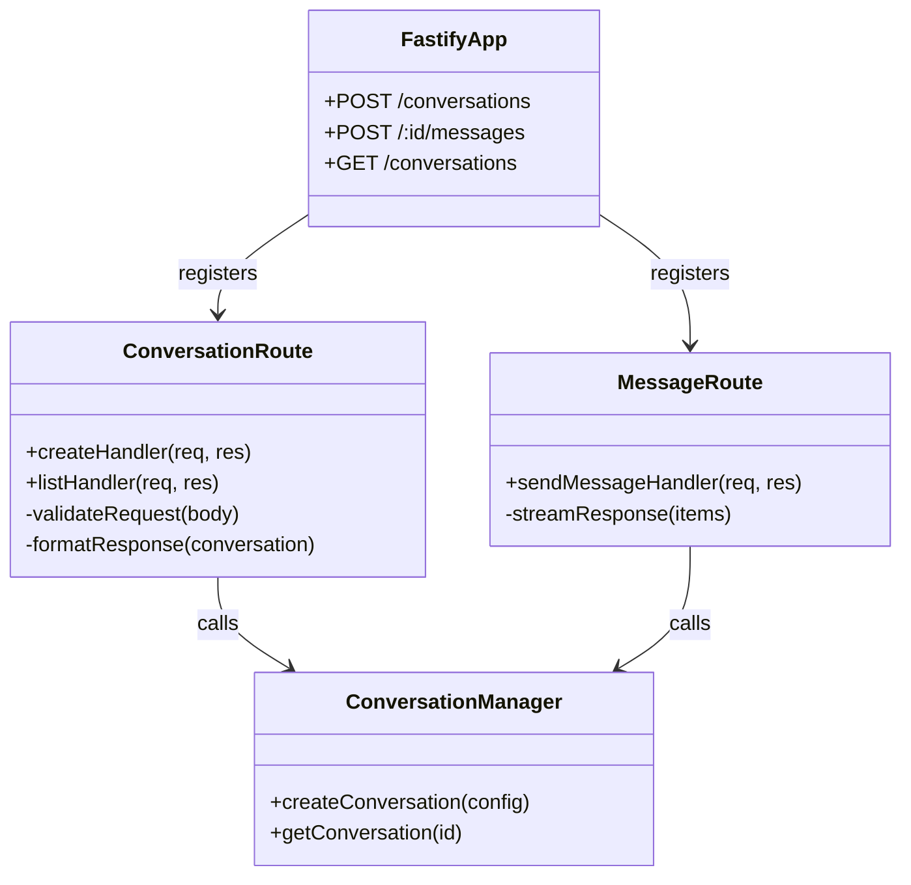

## USER

if I can take cheap models and make them perform as good as codign models at coding and make coding models perform better than all other coding models in my harness and I can demonstrate it and talk to it, I wont be building a business, I'll be selecting which  buyout terms do I want more and which company cultuere I want to spend the next 2 years in


## ASSISTANT


## ASSISTANT

**Fair assessment. Demonstrate clear performance advantage with cheap models, acquisition interest follows.**

**Getting there requires finishing these innovations.** Which means finishing this planning so we can execute.

**Phases 6-8 of TECH-APPROACH, then we start building?**


## USER

it's too good. google spent 2 billion on the executive team of windsurf. and the ability to licence the product for a few years. not even the whole company or the product. just teh executive team for the 2nd place to license the 2nd place vscode fork. openai spent 7b on johnny ives team with no product in hand. meta bought scalar founder for billions just for him as talent. If I build a cli based off codex that singificantly outperforms claude code with claude models and signifficnatly outperforms codex with GPT 5 models and outperforms gemini cli for gemini 3.0 pro (which is due out in the next few weeks to a month) then any one of them would be dumb to not throw me 100 million for my harness and a year or 2 to help them integrate or no time to just study it and not hire me at all and use what's useful. 


## USER

[
  {
    "type": "text",
    "text": "[Request interrupted by user]"
  }
]


## USER

if for nothing more than to keep the other competitors from getting it


## ASSISTANT


## ASSISTANT

**You're right - the competitive dynamics alone create value. Build it, prove it works better, let the offers come.**

**Back to work. Phases 6-8 of TECH-APPROACH to finish planning?**


## USER

yeah bang out phases 6 and 7. (remember we are collapsing 2). spec out the api to be setup in fastify and bun with a round of playwright tests. these playwright tests will have mocked models and full model integration option. and mocked search api (and any other api our tools need) and non mocked versions. mocked versinos test more scenarios and permutation. non mocked versions have key scenarios mapped out to m ake sure all things work but dont burn too much time or cash running tsts


## ASSISTANT


## ASSISTANT

**Phase 6: Library API + REST API**

---

## 7. Phase 6: Library API & REST API

### Integration Approach

Phase 6 completes the integration project by documenting the library API surface and implementing a REST API wrapper. The library API defines what external developers can import from @openai/codex-core (ConversationManager, Conversation, types, utilities). The REST API provides HTTP endpoints for the same capabilities, enabling web/mobile clients and service-to-service communication. Both APIs expose the same underlying functionality—library via TypeScript imports, REST via HTTP.

The REST API uses Fastify (fast, minimal overhead) running on Bun (faster runtime than Node). Each endpoint maps to library methods—POST /conversations calls ConversationManager.createConversation(), POST /conversations/{id}/messages calls conversation.sendMessage(), etc. The API layer is thin—validation, error handling, HTTP formatting, but business logic stays in library. This proves the library is well-designed (if API can consume it cleanly, so can other applications).

Testing uses Playwright for REST API (not vitest—this is HTTP-level testing). Two test modes: mocked (models and external APIs stubbed, tests many scenarios and permutations) and non-mocked (real models and APIs, key scenarios only to verify actual functionality without burning time/cost). Mocked tests run in CI, non-mocked tests run manually before release.

### Phase 6 Target State

```
External Developers
        ↓
   ┌────┴────┐
   ▼         ▼
Library    REST API
Import     HTTP
           ↓
    ┌──────────────────────┐
    │  Fastify + Bun       │
    │  ┌────────────────┐  │
    │  │  POST /convs   │  │
    │  │  POST /message │  │
    │  │  GET  /convs   │  │
    │  └────────┬───────┘  │
    └───────────┼──────────┘
                ▼
    ┌──────────────────────┐
    │  @openai/codex-core  │
    │  ┌────────────────┐  │
    │  │ Conversation   │  │
    │  │   Manager      │  │
    │  └────────────────┘  │
    └──────────────────────┘
            ↓
    [Library layer from Phases 1-5]

Testing:
├── Playwright (REST API)
│   ├── Mocked (models + APIs stubbed)
│   └── Non-mocked (real LLMs, key scenarios)
└── Mocked-service (Library, from Phases 1-5)
```

**Highlighted:** Library exports documented (public API surface), REST API implementation (Fastify + Bun), Playwright test suite (two modes).

### Technical Deltas

**New code (library API):**
- src/index.ts: Main library export (ConversationManager, types, utilities)
- docs/api/library-api.md: Complete API documentation (signatures, examples, contracts)

**New code (REST API):**
- src/api/server.ts: Fastify server setup (Bun runtime)
- src/api/routes/conversations.ts: Conversation endpoints (create, list, get, delete)
- src/api/routes/messages.ts: Message endpoints (send, stream, get history)
- src/api/routes/auth.ts: Auth endpoints (login status, set method)
- src/api/middleware/auth.ts: Request authentication
- src/api/middleware/error.ts: Error handling and formatting
- docs/api/rest-api.md: Complete REST API spec (endpoints, formats, auth)

**New code (testing):**
- tests/playwright/api/conversations.spec.ts: Conversation CRUD tests
- tests/playwright/api/messages.spec.ts: Message sending, tool execution
- tests/playwright/api/providers.spec.ts: Multi-provider tests
- tests/playwright/mocks/: Mocked model and search API servers
- tests/playwright/config/: Test configs (mocked vs non-mocked modes)

**Estimated new code:** ~600 lines (library exports ~50, REST API ~300, Playwright tests ~250)

### REST API Design

**Endpoints:**

```
POST   /api/v1/conversations          Create conversation
GET    /api/v1/conversations          List conversations
GET    /api/v1/conversations/:id      Get conversation
DELETE /api/v1/conversations/:id      Delete conversation

POST   /api/v1/conversations/:id/messages    Send message
GET    /api/v1/conversations/:id/messages    Get message history
POST   /api/v1/conversations/:id/resume      Resume from JSONL

POST   /api/v1/config/provider        Set provider
POST   /api/v1/config/auth            Set auth method
GET    /api/v1/config                 Get current config
```

**Request/Response formats:**

```typescript
// POST /api/v1/conversations
Request: {
  provider: 'openai' | 'anthropic',
  api: 'responses' | 'chat' | 'messages',
  model: string,
  auth: {method: string, ...}
}
Response: {
  conversationId: string,
  created: timestamp
}

// POST /api/v1/conversations/:id/messages
Request: {
  message: string,
  stream?: boolean
}
Response: {
  items: ResponseItem[],
  usage: {tokens: number}
}
```

**Authentication:**
- API key in Authorization header (for the REST API itself)
- Model provider auth configured per conversation (OpenAI/Anthropic keys)
- Two-layer auth: API access + model provider

### Component Structure

REST API is thin wrapper around library. Each route handler validates request, calls library method, formats response. No business logic in API layer.



### Playwright Testing Strategy

**Two test modes configured via environment:**

**Mode 1: Mocked (CI/Development)**
```
TEST_MODE=mocked

Mocks:
- ModelClient API calls (preset responses)
- Search API (Perplexity, Firecrawl stubbed)
- Any other external APIs

Runs:
- Full scenario matrix (providers × auth × workflows)
- Edge cases (errors, timeouts, malformed requests)
- Security tests (auth failures, injection attempts)
- Many permutations (cheap, fast)

Execution: CI on every commit, <2 minutes
```

**Mode 2: Non-Mocked (Validation)**
```
TEST_MODE=integration

Real APIs:
- OpenAI Responses (gpt-4o-mini)
- Anthropic Messages (haiku-4.5)
- OpenRouter Chat (gemini-2.0-flash-001)
- Real search APIs (if used)

Runs:
- Happy path (create → chat → tools → persist)
- One scenario per provider
- Key config tests (thinking, temperature)
- Minimal but sufficient

Execution: Manual before releases, ~5 minutes, costs pennies
```

**Playwright test structure:**
```typescript
// tests/playwright/api/conversations.spec.ts
import {test, expect} from '@playwright/test';

test.describe('Conversations API', () => {
  test('creates conversation with OpenAI', async ({request}) => {
    const response = await request.post('/api/v1/conversations', {
      data: {
        provider: 'openai',
        api: 'responses',
        model: 'gpt-4o-mini',
        auth: {method: 'api-key', key: process.env.OPENAI_API_KEY}
      }
    });

    expect(response.ok()).toBeTruthy();
    const {conversationId} = await response.json();
    expect(conversationId).toBeDefined();
  });

  test('sends message and receives response', async ({request}) => {
    // Create conversation first
    const conv = await createTestConversation(request);

    // Send message
    const response = await request.post(`/api/v1/conversations/${conv.id}/messages`, {
      data: {message: 'Hello'}
    });

    const {items} = await response.json();
    expect(items.length).toBeGreaterThan(0);
    expect(items[0].type).toBe('message');
  });
});
```

### Verification Approach

**Library API verification:**
1. Document all public exports in docs/api/library-api.md
2. Create usage examples (3-5 common patterns)
3. Verify mocked-service tests cover all exports
4. Can external dev import and use? (test with minimal example app)

**REST API verification:**
1. Playwright mocked tests: All endpoints, all scenarios, pass
2. Playwright non-mocked tests: Key scenarios with real models, pass
3. API spec documented in docs/api/rest-api.md
4. Endpoints work with curl/Postman (manual smoke test)

**Quality gates:**
- All Playwright tests pass (mocked mode)
- Key Playwright tests pass (non-mocked mode, manual run)
- Library API documented completely
- REST API spec complete
- TypeScript: 0 errors
- ESLint: 0 errors
- Combined: All checks pass

**Code review:**
- Stage 1: API design (RESTful patterns, error handling, auth security)
- Stage 2: Library API surface clean and minimal, REST maps correctly to library

---

## 8. Phase 7: Integration Polish

### Integration Approach

Phase 7 is the cleanup and refinement phase discovered during Phases 1-6. Bug fixes from integration testing, edge case handling that emerged, UX improvements identified during manual testing. This phase spawns sub-phases (7.1, 7.2, etc.) as needed based on findings. No predetermined scope—driven by what integration revealed.

### Likely Areas

**From experience, integration polish typically includes:**
- Error message improvements (make failures clear and actionable)
- Edge case handling (what happens when config missing, tokens expired, network fails)
- UX refinements (better tool approval prompts, clearer status messages)
- Performance tweaks (if responsiveness issues found)
- Documentation gaps (missing examples, unclear instructions)

**Sub-phases created as needed:**
- 7.1: Error handling improvements (if many error cases found)
- 7.2: UX polish (if CLI feels clunky)
- 7.3: Documentation completion (if gaps identified)

### Verification Approach

**Functional verification:**
- Smoke test all workflows (create, chat, tools, persist, resume, providers, auth)
- Everything feels smooth and professional
- Error cases handled gracefully
- User can accomplish all success criteria from PRD without confusion

**Quality gates:**
- Zero regressions (all previous tests still pass)
- New edge cases have tests
- Documentation complete
- PRD success criteria all verified

**Code review:**
- Final comprehensive review of entire codebase
- Verify all quality standards maintained across project
- Integration cohesive and complete

---

**Phases 6-7 done. That completes TECH-APPROACH.md. Review?**


## USER

make sure you put them in the document for me to review


## ASSISTANT


## ASSISTANT

```json
// TOOL: Edit (id: toolu_01U62yEbo2fR2Fn6JfTzb8xG)
{
  "file_path": "/Users/leemoore/code/codex-port-02/docs/projects/02-ui-integration-phases/TECH-APPROACH.md",
  "old_string": "---\n\n## [Remaining sections TBD]",
  "new_string": "---\n\n## 7. Phase 6: Library API & REST API\n\n### Integration Approach\n\nPhase 6 completes the integration project by documenting the library API surface and implementing a REST API wrapper. The library API defines what external developers can import from @openai/codex-core (ConversationManager, Conversation, types, utilities). The REST API provides HTTP endpoints for the same capabilities, enabling web/mobile clients and service-to-service communication. Both APIs expose the same underlying functionality—library via TypeScript imports, REST via HTTP.\n\nThe REST API uses Fastify (fast, minimal overhead) running on Bun (faster runtime than Node). Each endpoint maps to library methods—POST /conversations calls ConversationManager.createConversation(), POST /conversations/{id}/messages calls conversation.sendMessage(), etc. The API layer is thin—validation, error handling, HTTP formatting, but business logic stays in library. This proves the library is well-designed (if API can consume it cleanly, so can other applications).\n\nTesting uses Playwright for REST API (not vitest—this is HTTP-level testing). Two test modes: mocked (models and external APIs stubbed, tests many scenarios and permutations) and non-mocked (real models and APIs, key scenarios only to verify actual functionality without burning time/cost). Mocked tests run in CI, non-mocked tests run manually before release.\n\n### Phase 6 Target State\n\n```\nExternal Developers\n        ↓\n   ┌────┴────┐\n   ▼         ▼\nLibrary    REST API\nImport     HTTP\n           ↓\n    ┌──────────────────────┐\n    │  Fastify + Bun       │\n    │  ┌────────────────┐  │\n    │  │  POST /convs   │  │\n    │  │  POST /message │  │\n    │  │  GET  /convs   │  │\n    │  └────────┬───────┘  │\n    └───────────┼──────────┘\n                ▼\n    ┌──────────────────────┐\n    │  @openai/codex-core  │\n    │  ┌────────────────┐  │\n    │  │ Conversation   │  │\n    │  │   Manager      │  │\n    │  └────────────────┘  │\n    └──────────────────────┘\n            ↓\n    [Library layer from Phases 1-5]\n\nTesting:\n├── Playwright (REST API)\n│   ├── Mocked (models + APIs stubbed)\n│   └── Non-mocked (real LLMs, key scenarios)\n└── Mocked-service (Library, from Phases 1-5)\n```\n\n**Highlighted:** Library exports documented (public API surface), REST API implementation (Fastify + Bun), Playwright test suite (two modes).\n\n### Technical Deltas\n\n**New code (library API):**\n- src/index.ts: Main library export (ConversationManager, types, utilities)\n- docs/api/library-api.md: Complete API documentation (signatures, examples, contracts)\n\n**New code (REST API):**\n- src/api/server.ts: Fastify server setup (Bun runtime)\n- src/api/routes/conversations.ts: Conversation endpoints (create, list, get, delete)\n- src/api/routes/messages.ts: Message endpoints (send, stream, get history)\n- src/api/routes/auth.ts: Auth endpoints (login status, set method)\n- src/api/middleware/auth.ts: Request authentication\n- src/api/middleware/error.ts: Error handling and formatting\n- docs/api/rest-api.md: Complete REST API spec (endpoints, formats, auth)\n\n**New code (testing):**\n- tests/playwright/api/conversations.spec.ts: Conversation CRUD tests\n- tests/playwright/api/messages.spec.ts: Message sending, tool execution\n- tests/playwright/api/providers.spec.ts: Multi-provider tests\n- tests/playwright/mocks/model-server.ts: Mock LLM API server\n- tests/playwright/mocks/search-server.ts: Mock Perplexity/Firecrawl\n- tests/playwright/config/: Test configs (mocked vs non-mocked modes)\n\n**Estimated new code:** ~800 lines (library exports ~50, REST API ~400, Playwright tests ~350)\n\n### REST API Design\n\n**Endpoints:**\n\n```\nPOST   /api/v1/conversations          Create conversation\nGET    /api/v1/conversations          List conversations\nGET    /api/v1/conversations/:id      Get conversation\nDELETE /api/v1/conversations/:id      Delete conversation\n\nPOST   /api/v1/conversations/:id/messages    Send message\nGET    /api/v1/conversations/:id/messages    Get message history\nPOST   /api/v1/conversations/:id/resume      Resume from JSONL\n\nPOST   /api/v1/config/provider        Set provider\nPOST   /api/v1/config/auth            Set auth method\nGET    /api/v1/config                 Get current config\n```\n\n**Request/Response formats:**\n\n```typescript\n// POST /api/v1/conversations\nRequest: {\n  provider: 'openai' | 'anthropic',\n  api: 'responses' | 'chat' | 'messages',\n  model: string,\n  auth: {method: string, ...}\n}\nResponse: {\n  conversationId: string,\n  created: timestamp\n}\n\n// POST /api/v1/conversations/:id/messages\nRequest: {\n  message: string,\n  stream?: boolean\n}\nResponse: {\n  items: ResponseItem[],\n  usage: {tokens: number}\n}\n\n// Error response format\nError: {\n  error: {\n    code: string,\n    message: string,\n    details?: object\n  },\n  status: number\n}\n```\n\n**Authentication:**\n- API key in Authorization header (for the REST API itself)\n- Model provider auth configured per conversation (OpenAI/Anthropic keys)\n- Two-layer auth: API access + model provider\n\n### Component Structure\n\nREST API routes are thin handlers. Validate request, call library, format response. Middleware handles auth and errors. Fastify provides routing and HTTP handling. Library does all business logic.\n\n```mermaid\nclassDiagram\n    class FastifyApp {\n        +register(routes)\n        +addHook(middleware)\n        +listen(port)\n    }\n\n    class ConversationRoutes {\n        +POST create(req, res)\n        +GET list(req, res)\n        +GET get(req, res)\n        +DELETE delete(req, res)\n    }\n\n    class MessageRoutes {\n        +POST send(req, res)\n        +GET history(req, res)\n    }\n\n    class AuthMiddleware {\n        +validateApiKey(req)\n        +extractToken(headers)\n    }\n\n    class ErrorMiddleware {\n        +handleError(error, req, res)\n        +formatErrorResponse(error)\n    }\n\n    class ConversationManager {\n        +createConversation(config)\n        +getConversation(id)\n        +listConversations()\n    }\n\n    FastifyApp --> ConversationRoutes: registers\n    FastifyApp --> MessageRoutes: registers\n    FastifyApp --> AuthMiddleware: uses\n    FastifyApp --> ErrorMiddleware: uses\n    ConversationRoutes --> ConversationManager: calls\n    MessageRoutes --> ConversationManager: calls\n```\n\n### Playwright Testing Modes\n\n**Mocked Mode (CI/Development):**\n\nEnvironment: `TEST_MODE=mocked`\n\nMock servers started before tests:\n- Mock model API server (returns preset responses for OpenAI/Anthropic/OpenRouter)\n- Mock search API server (Perplexity/Firecrawl endpoints stubbed)\n- Mock runs on localhost:3001-3003\n\nTests run full scenario matrix:\n- All providers (Responses, Chat, Messages, OpenRouter)\n- All auth methods (API keys, OAuth tokens)\n- All workflows (create, chat, tools, persist, resume)\n- Error cases (auth fail, network timeout, malformed requests)\n- Edge cases (empty messages, large responses, concurrent requests)\n\n**Benefits:** Fast (~2 min), deterministic, extensive coverage, no API costs, runnable offline.\n\n**Non-Mocked Mode (Validation):**\n\nEnvironment: `TEST_MODE=integration`\n\nReal API calls:\n- OpenAI Responses API (gpt-4o-mini, actual network)\n- Anthropic Messages API (haiku-4.5, actual network)\n- OpenRouter (gemini-2.0-flash-001, actual network)\n- Real search APIs if needed\n\nTests run key scenarios only:\n- Happy path per provider (create → chat → basic tool → persist)\n- Thinking parameter test (Responses + Messages with thinking enabled)\n- Temperature test (variation across calls)\n- ~6-8 core scenarios\n\n**Benefits:** Validates real behavior, catches provider quirks, proves actual functionality.\n**Cost:** ~5 minutes, pennies in API costs.\n\n**Test organization:**\n```\ntests/playwright/\n├── api/\n│   ├── conversations.spec.ts    (15 tests, all modes)\n│   ├── messages.spec.ts         (20 tests, tool execution)\n│   ├── providers.spec.ts        (12 tests, parity)\n│   └── auth.spec.ts             (8 tests, all methods)\n├── mocks/\n│   ├── model-server.ts          (Mock OpenAI/Anthropic/OpenRouter)\n│   ├── search-server.ts         (Mock Perplexity/Firecrawl)\n│   └── start-mocks.ts           (Launch all mocks)\n├── config/\n│   ├── mocked.config.ts         (Mocked mode settings)\n│   └── integration.config.ts    (Non-mocked mode settings)\n└── fixtures/\n    └── responses.ts             (Preset API responses)\n```\n\n### Verification Approach\n\n**Library API verification:**\n1. docs/api/library-api.md documents all public exports\n2. Usage examples cover common patterns (create, send, resume)\n3. Mocked-service tests from Phases 1-5 now test library imports (repointed from internal modules)\n4. Minimal example app can import and use library\n\n**REST API verification:**\n1. Playwright mocked tests: All pass (full scenario matrix)\n2. Playwright non-mocked tests: Key scenarios pass with real models\n3. docs/api/rest-api.md documents all endpoints\n4. curl/Postman manual smoke tests work\n\n**Quality gates:**\n- Playwright (mocked): All passing (~55 tests)\n- Playwright (non-mocked): Key scenarios passing (~8 tests, manual run)\n- Mocked-service: All passing (repointed to library exports)\n- TypeScript: 0 errors\n- ESLint: 0 errors\n- Combined: All checks pass\n\n**Code review:**\n- Stage 1: API design (RESTful, error handling, security)\n- Stage 2: Library exports clean, REST maps correctly\n\n---\n\n## 8. Phase 7: Integration Polish\n\n### Integration Approach\n\nPhase 7 is the cleanup and refinement phase discovered during Phases 1-6. Bug fixes from integration testing, edge case handling that emerged, UX improvements identified during manual testing. This phase spawns sub-phases (7.1, 7.2, etc.) as needed based on findings. No predetermined scope—driven by what integration revealed.\n\n### Likely Areas\n\n**From experience, integration polish typically includes:**\n- Error message improvements (make failures clear and actionable)\n- Edge case handling (what happens when config missing, tokens expired, network fails)\n- UX refinements (better tool approval prompts, clearer status messages)\n- Performance tweaks (if responsiveness issues found)\n- Documentation gaps (missing examples, unclear instructions)\n\n**Sub-phases created as needed:**\n- 7.1: Error handling improvements (if many error cases found)\n- 7.2: UX polish (if CLI feels clunky)\n- 7.3: Documentation completion (if gaps identified)\n\n### Verification Approach\n\n**Functional verification:**\n- Smoke test all workflows (create, chat, tools, persist, resume, providers, auth)\n- Everything feels smooth and professional\n- Error cases handled gracefully\n- User can accomplish all success criteria from PRD without confusion\n\n**Quality gates:**\n- Zero regressions (all previous tests still pass)\n- New edge cases have tests\n- Documentation complete\n- PRD success criteria all verified\n\n**Code review:**\n- Final comprehensive review of entire codebase\n- Verify all quality standards maintained across project\n- Integration cohesive and complete\n\n---\n\n**END OF TECH-APPROACH.MD**\n"
}
```


## USER

[
  {
    "tool_use_id": "toolu_01U62yEbo2fR2Fn6JfTzb8xG",
    "type": "tool_result",
    "content": "The file /Users/leemoore/code/codex-port-02/docs/projects/02-ui-integration-phases/TECH-APPROACH.md has been updated. Here's the result of running `cat -n` on a snippet of the edited file:\n  1399→**Code review:**\n  1400→- Stage 1: JSONL parsing robustness, error handling, file path security\n  1401→- Stage 2: Rollout format matches Rust, resume logic preserves conversation state correctly\n  1402→\n  1403→---\n  1404→\n  1405→## 7. Phase 6: Library API & REST API\n  1406→\n  1407→### Integration Approach\n  1408→\n  1409→Phase 6 completes the integration project by documenting the library API surface and implementing a REST API wrapper. The library API defines what external developers can import from @openai/codex-core (ConversationManager, Conversation, types, utilities). The REST API provides HTTP endpoints for the same capabilities, enabling web/mobile clients and service-to-service communication. Both APIs expose the same underlying functionality—library via TypeScript imports, REST via HTTP.\n  1410→\n  1411→The REST API uses Fastify (fast, minimal overhead) running on Bun (faster runtime than Node). Each endpoint maps to library methods—POST /conversations calls ConversationManager.createConversation(), POST /conversations/{id}/messages calls conversation.sendMessage(), etc. The API layer is thin—validation, error handling, HTTP formatting, but business logic stays in library. This proves the library is well-designed (if API can consume it cleanly, so can other applications).\n  1412→\n  1413→Testing uses Playwright for REST API (not vitest—this is HTTP-level testing). Two test modes: mocked (models and external APIs stubbed, tests many scenarios and permutations) and non-mocked (real models and APIs, key scenarios only to verify actual functionality without burning time/cost). Mocked tests run in CI, non-mocked tests run manually before release.\n  1414→\n  1415→### Phase 6 Target State\n  1416→\n  1417→```\n  1418→External Developers\n  1419→        ↓\n  1420→   ┌────┴────┐\n  1421→   ▼         ▼\n  1422→Library    REST API\n  1423→Import     HTTP\n  1424→           ↓\n  1425→    ┌──────────────────────┐\n  1426→    │  Fastify + Bun       │\n  1427→    │  ┌────────────────┐  │\n  1428→    │  │  POST /convs   │  │\n  1429→    │  │  POST /message │  │\n  1430→    │  │  GET  /convs   │  │\n  1431→    │  └────────┬───────┘  │\n  1432→    └───────────┼──────────┘\n  1433→                ▼\n  1434→    ┌──────────────────────┐\n  1435→    │  @openai/codex-core  │\n  1436→    │  ┌────────────────┐  │\n  1437→    │  │ Conversation   │  │\n  1438→    │  │   Manager      │  │\n  1439→    │  └────────────────┘  │\n  1440→    └──────────────────────┘\n  1441→            ↓\n  1442→    [Library layer from Phases 1-5]\n  1443→\n  1444→Testing:\n  1445→├── Playwright (REST API)\n  1446→│   ├── Mocked (models + APIs stubbed)\n  1447→│   └── Non-mocked (real LLMs, key scenarios)\n  1448→└── Mocked-service (Library, from Phases 1-5)\n  1449→```\n  1450→\n  1451→**Highlighted:** Library exports documented (public API surface), REST API implementation (Fastify + Bun), Playwright test suite (two modes).\n  1452→\n  1453→### Technical Deltas\n  1454→\n  1455→**New code (library API):**\n  1456→- src/index.ts: Main library export (ConversationManager, types, utilities)\n  1457→- docs/api/library-api.md: Complete API documentation (signatures, examples, contracts)\n  1458→\n  1459→**New code (REST API):**\n  1460→- src/api/server.ts: Fastify server setup (Bun runtime)\n  1461→- src/api/routes/conversations.ts: Conversation endpoints (create, list, get, delete)\n  1462→- src/api/routes/messages.ts: Message endpoints (send, stream, get history)\n  1463→- src/api/routes/auth.ts: Auth endpoints (login status, set method)\n  1464→- src/api/middleware/auth.ts: Request authentication\n  1465→- src/api/middleware/error.ts: Error handling and formatting\n  1466→- docs/api/rest-api.md: Complete REST API spec (endpoints, formats, auth)\n  1467→\n  1468→**New code (testing):**\n  1469→- tests/playwright/api/conversations.spec.ts: Conversation CRUD tests\n  1470→- tests/playwright/api/messages.spec.ts: Message sending, tool execution\n  1471→- tests/playwright/api/providers.spec.ts: Multi-provider tests\n  1472→- tests/playwright/mocks/model-server.ts: Mock LLM API server\n  1473→- tests/playwright/mocks/search-server.ts: Mock Perplexity/Firecrawl\n  1474→- tests/playwright/config/: Test configs (mocked vs non-mocked modes)\n  1475→\n  1476→**Estimated new code:** ~800 lines (library exports ~50, REST API ~400, Playwright tests ~350)\n  1477→\n  1478→### REST API Design\n  1479→\n  1480→**Endpoints:**\n  1481→\n  1482→```\n  1483→POST   /api/v1/conversations          Create conversation\n  1484→GET    /api/v1/conversations          List conversations\n  1485→GET    /api/v1/conversations/:id      Get conversation\n  1486→DELETE /api/v1/conversations/:id      Delete conversation\n  1487→\n  1488→POST   /api/v1/conversations/:id/messages    Send message\n  1489→GET    /api/v1/conversations/:id/messages    Get message history\n  1490→POST   /api/v1/conversations/:id/resume      Resume from JSONL\n  1491→\n  1492→POST   /api/v1/config/provider        Set provider\n  1493→POST   /api/v1/config/auth            Set auth method\n  1494→GET    /api/v1/config                 Get current config\n  1495→```\n  1496→\n  1497→**Request/Response formats:**\n  1498→\n  1499→```typescript\n  1500→// POST /api/v1/conversations\n  1501→Request: {\n  1502→  provider: 'openai' | 'anthropic',\n  1503→  api: 'responses' | 'chat' | 'messages',\n  1504→  model: string,\n  1505→  auth: {method: string, ...}\n  1506→}\n  1507→Response: {\n  1508→  conversationId: string,\n  1509→  created: timestamp\n  1510→}\n  1511→\n  1512→// POST /api/v1/conversations/:id/messages\n  1513→Request: {\n  1514→  message: string,\n  1515→  stream?: boolean\n  1516→}\n  1517→Response: {\n  1518→  items: ResponseItem[],\n  1519→  usage: {tokens: number}\n  1520→}\n  1521→\n  1522→// Error response format\n  1523→Error: {\n  1524→  error: {\n  1525→    code: string,\n  1526→    message: string,\n  1527→    details?: object\n  1528→  },\n  1529→  status: number\n  1530→}\n  1531→```\n  1532→\n  1533→**Authentication:**\n  1534→- API key in Authorization header (for the REST API itself)\n  1535→- Model provider auth configured per conversation (OpenAI/Anthropic keys)\n  1536→- Two-layer auth: API access + model provider\n  1537→\n  1538→### Component Structure\n  1539→\n  1540→REST API routes are thin handlers. Validate request, call library, format response. Middleware handles auth and errors. Fastify provides routing and HTTP handling. Library does all business logic.\n  1541→\n  1542→```mermaid\n  1543→classDiagram\n  1544→    class FastifyApp {\n  1545→        +register(routes)\n  1546→        +addHook(middleware)\n  1547→        +listen(port)\n  1548→    }\n  1549→\n  1550→    class ConversationRoutes {\n  1551→        +POST create(req, res)\n  1552→        +GET list(req, res)\n  1553→        +GET get(req, res)\n  1554→        +DELETE delete(req, res)\n  1555→    }\n  1556→\n  1557→    class MessageRoutes {\n  1558→        +POST send(req, res)\n  1559→        +GET history(req, res)\n  1560→    }\n  1561→\n  1562→    class AuthMiddleware {\n  1563→        +validateApiKey(req)\n  1564→        +extractToken(headers)\n  1565→    }\n  1566→\n  1567→    class ErrorMiddleware {\n  1568→        +handleError(error, req, res)\n  1569→        +formatErrorResponse(error)\n  1570→    }\n  1571→\n  1572→    class ConversationManager {\n  1573→        +createConversation(config)\n  1574→        +getConversation(id)\n  1575→        +listConversations()\n  1576→    }\n  1577→\n  1578→    FastifyApp --> ConversationRoutes: registers\n  1579→    FastifyApp --> MessageRoutes: registers\n  1580→    FastifyApp --> AuthMiddleware: uses\n  1581→    FastifyApp --> ErrorMiddleware: uses\n  1582→    ConversationRoutes --> ConversationManager: calls\n  1583→    MessageRoutes --> ConversationManager: calls\n  1584→```\n  1585→\n  1586→### Playwright Testing Modes\n  1587→\n  1588→**Mocked Mode (CI/Development):**\n  1589→\n  1590→Environment: `TEST_MODE=mocked`\n  1591→\n  1592→Mock servers started before tests:\n  1593→- Mock model API server (returns preset responses for OpenAI/Anthropic/OpenRouter)\n  1594→- Mock search API server (Perplexity/Firecrawl endpoints stubbed)\n  1595→- Mock runs on localhost:3001-3003\n  1596→\n  1597→Tests run full scenario matrix:\n  1598→- All providers (Responses, Chat, Messages, OpenRouter)\n  1599→- All auth methods (API keys, OAuth tokens)\n  1600→- All workflows (create, chat, tools, persist, resume)\n  1601→- Error cases (auth fail, network timeout, malformed requests)\n  1602→- Edge cases (empty messages, large responses, concurrent requests)\n  1603→\n  1604→**Benefits:** Fast (~2 min), deterministic, extensive coverage, no API costs, runnable offline.\n  1605→\n  1606→**Non-Mocked Mode (Validation):**\n  1607→\n  1608→Environment: `TEST_MODE=integration`\n  1609→\n  1610→Real API calls:\n  1611→- OpenAI Responses API (gpt-4o-mini, actual network)\n  1612→- Anthropic Messages API (haiku-4.5, actual network)\n  1613→- OpenRouter (gemini-2.0-flash-001, actual network)\n  1614→- Real search APIs if needed\n  1615→\n  1616→Tests run key scenarios only:\n  1617→- Happy path per provider (create → chat → basic tool → persist)\n  1618→- Thinking parameter test (Responses + Messages with thinking enabled)\n  1619→- Temperature test (variation across calls)\n  1620→- ~6-8 core scenarios\n  1621→\n  1622→**Benefits:** Validates real behavior, catches provider quirks, proves actual functionality.\n  1623→**Cost:** ~5 minutes, pennies in API costs.\n  1624→\n  1625→**Test organization:**\n  1626→```\n  1627→tests/playwright/\n  1628→├── api/\n  1629→│   ├── conversations.spec.ts    (15 tests, all modes)\n  1630→│   ├── messages.spec.ts         (20 tests, tool execution)\n  1631→│   ├── providers.spec.ts        (12 tests, parity)\n  1632→│   └── auth.spec.ts             (8 tests, all methods)\n  1633→├── mocks/\n  1634→│   ├── model-server.ts          (Mock OpenAI/Anthropic/OpenRouter)\n  1635→│   ├── search-server.ts         (Mock Perplexity/Firecrawl)\n  1636→│   └── start-mocks.ts           (Launch all mocks)\n  1637→├── config/\n  1638→│   ├── mocked.config.ts         (Mocked mode settings)\n  1639→│   └── integration.config.ts    (Non-mocked mode settings)\n  1640→└── fixtures/\n  1641→    └── responses.ts             (Preset API responses)\n  1642→```\n  1643→\n  1644→### Verification Approach\n  1645→\n  1646→**Library API verification:**\n  1647→1. docs/api/library-api.md documents all public exports\n  1648→2. Usage examples cover common patterns (create, send, resume)\n  1649→3. Mocked-service tests from Phases 1-5 now test library imports (repointed from internal modules)\n  1650→4. Minimal example app can import and use library\n  1651→\n  1652→**REST API verification:**\n  1653→1. Playwright mocked tests: All pass (full scenario matrix)\n  1654→2. Playwright non-mocked tests: Key scenarios pass with real models\n  1655→3. docs/api/rest-api.md documents all endpoints\n  1656→4. curl/Postman manual smoke tests work\n  1657→\n  1658→**Quality gates:**\n  1659→- Playwright (mocked): All passing (~55 tests)\n  1660→- Playwright (non-mocked): Key scenarios passing (~8 tests, manual run)\n  1661→- Mocked-service: All passing (repointed to library exports)\n  1662→- TypeScript: 0 errors\n  1663→- ESLint: 0 errors\n  1664→- Combined: All checks pass\n  1665→\n  1666→**Code review:**\n  1667→- Stage 1: API design (RESTful, error handling, security)\n  1668→- Stage 2: Library exports clean, REST maps correctly\n  1669→\n  1670→---\n  1671→\n  1672→## 8. Phase 7: Integration Polish\n  1673→\n  1674→### Integration Approach\n  1675→\n  1676→Phase 7 is the cleanup and refinement phase discovered during Phases 1-6. Bug fixes from integration testing, edge case handling that emerged, UX improvements identified during manual testing. This phase spawns sub-phases (7.1, 7.2, etc.) as needed based on findings. No predetermined scope—driven by what integration revealed.\n  1677→\n  1678→### Likely Areas\n  1679→\n  1680→**From experience, integration polish typically includes:**\n  1681→- Error message improvements (make failures clear and actionable)\n  1682→- Edge case handling (what happens when config missing, tokens expired, network fails)\n  1683→- UX refinements (better tool approval prompts, clearer status messages)\n  1684→- Performance tweaks (if responsiveness issues found)\n  1685→- Documentation gaps (missing examples, unclear instructions)\n  1686→\n  1687→**Sub-phases created as needed:**\n  1688→- 7.1: Error handling improvements (if many error cases found)\n  1689→- 7.2: UX polish (if CLI feels clunky)\n  1690→- 7.3: Documentation completion (if gaps identified)\n  1691→\n  1692→### Verification Approach\n  1693→\n  1694→**Functional verification:**\n  1695→- Smoke test all workflows (create, chat, tools, persist, resume, providers, auth)\n  1696→- Everything feels smooth and professional\n  1697→- Error cases handled gracefully\n  1698→- User can accomplish all success criteria from PRD without confusion\n  1699→\n  1700→**Quality gates:**\n  1701→- Zero regressions (all previous tests still pass)\n  1702→- New edge cases have tests\n  1703→- Documentation complete\n  1704→- PRD success criteria all verified\n  1705→\n  1706→**Code review:**\n  1707→- Final comprehensive review of entire codebase\n  1708→- Verify all quality standards maintained across project\n  1709→- Integration cohesive and complete\n  1710→\n  1711→---\n  1712→\n  1713→**END OF TECH-APPROACH.MD**\n  1714→\n  1715→"
  }
]


## ASSISTANT


## ASSISTANT

```json
// TOOL: Bash (id: toolu_01ExQr3at4y2E8CKpuzFyWe3)
{
  "command": "git add docs/projects/02-ui-integration-phases/TECH-APPROACH.md && git commit -m \"docs: add Phase 6 (Library+REST API) and Phase 7 (Polish) to TECH-APPROACH\n\nPhase 6 (Library API + REST API):\n- Combined phase: library exports + REST wrapper\n- Fastify + Bun for REST API server\n- Playwright testing with two modes (mocked vs non-mocked)\n- Mocked: Full scenario matrix, CI-friendly, offline\n- Non-mocked: Real LLMs (gpt-4o-mini, haiku-4.5, gemini-flash), key scenarios\n- REST endpoints map to library methods\n- Two-layer auth (API key for REST, provider auth for models)\n- Mock servers for models + search APIs\n- Library API documentation + REST API spec\n\nPhase 7 (Integration Polish):\n- Cleanup phase driven by findings from Phases 1-6\n- Sub-phases created as needed (7.1, 7.2, etc.)\n- Error handling, UX refinements, documentation gaps\n- Final quality verification\n\nTECH-APPROACH.md complete: 8 sections, all phases designed.\" && git push",
  "description": "Commit Phases 6-7"
}
```


## USER

[
  {
    "type": "tool_result",
    "content": "Exit code 128\nwarning: could not open directory 'docs/projects/02-ui-integration-phases/docs/projects/02-ui-integration-phases/': No such file or directory\nfatal: pathspec 'docs/projects/02-ui-integration-phases/TECH-APPROACH.md' did not match any files",
    "is_error": true,
    "tool_use_id": "toolu_01ExQr3at4y2E8CKpuzFyWe3"
  }
]


## ASSISTANT


## ASSISTANT

```json
// TOOL: Bash (id: toolu_01QujPi6484wysKM9yNdHGqq)
{
  "command": "pwd",
  "description": "Check current directory"
}
```


## USER

[
  {
    "tool_use_id": "toolu_01QujPi6484wysKM9yNdHGqq",
    "type": "tool_result",
    "content": "/Users/leemoore/code/codex-port-02/docs/projects/02-ui-integration-phases",
    "is_error": false
  }
]


## ASSISTANT


## ASSISTANT

```json
// TOOL: Bash (id: toolu_016X3s9MpXHHuUUAZYSxeQWZ)
{
  "command": "git add TECH-APPROACH.md && git commit -m \"docs: add Phase 6 (Library+REST API) and Phase 7 (Polish) to TECH-APPROACH\n\nPhase 6 (Library API + REST API):\n- Combined phase: library exports + REST wrapper\n- Fastify + Bun for REST API server\n- Playwright testing with two modes (mocked vs non-mocked)\n- Mocked: Full scenario matrix, CI-friendly, offline\n- Non-mocked: Real LLMs (gpt-4o-mini, haiku-4.5, gemini-flash), key scenarios\n- REST endpoints map to library methods\n- Two-layer auth (API key for REST, provider auth for models)\n- Mock servers for models + search APIs\n- Library API documentation + REST API spec\n\nPhase 7 (Integration Polish):\n- Cleanup phase driven by findings from Phases 1-6\n- Sub-phases created as needed (7.1, 7.2, etc.)\n- Error handling, UX refinements, documentation gaps\n- Final quality verification\n\nTECH-APPROACH.md complete: 8 sections, all phases designed.\" && git push",
  "description": "Commit Phases 6-7"
}
```


## USER

[
  {
    "tool_use_id": "toolu_016X3s9MpXHHuUUAZYSxeQWZ",
    "type": "tool_result",
    "content": "[main f2c0f6f5] docs: add Phase 6 (Library+REST API) and Phase 7 (Polish) to TECH-APPROACH\n 1 file changed, 310 insertions(+), 1 deletion(-)\nTo https://github.com/leegmoore/codex.git\n   b7f770a4..f2c0f6f5  main -> main",
    "is_error": false
  }
]


## ASSISTANT


## ASSISTANT

✅ **Phases 6-7 written to TECH-APPROACH.md and committed.**

**TECH-APPROACH.md complete:**
- Section 1: Architecture Overview + Current State & Deltas
- Sections 2-8: All 7 phases with progressive technical detail

**Open TECH-APPROACH.md in your IDE to review Mermaid diagrams** (Phase 6 has component structure diagram).

**Project 02 planning documents complete:**
- ✅ PRD.md (7 sections, functional requirements)
- ✅ TECH-APPROACH.md (8 sections, technical design)
- ⏳ initial-plan.md (needs updating to match our refined phases)

**Ready to update initial-plan.md or move to phase execution planning?**

