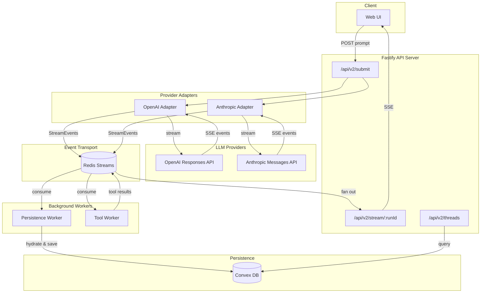

# Cody - Streaming LLM Harness

A streaming-first LLM harness built on Fastify, Redis Streams, and Convex. Supports multiple providers (OpenAI, Anthropic) with canonical event schemas based on the OpenAI Responses API.

## Architecture



### Data Flow

1. **Submit** → Client POSTs prompt to `/api/v2/submit`, receives `runId`
2. **Stream from Provider** → Adapter calls LLM, receives SSE stream
3. **Normalize** → Adapter transforms provider events to canonical `StreamEvent` format
4. **Publish** → Events written to Redis stream (`codex:run:{runId}:events`)
5. **Fan Out** → Multiple consumers read from Redis:
   - **Persistence Worker** → Hydrates events via `ResponseReducer`, saves to Convex
   - **Tool Worker** → Detects `function_call` events, executes tools, publishes results
   - **SSE Endpoint** → Streams events to connected clients
6. **Query** → Client can fetch persisted threads/runs from Convex via API

### Core Design Principle

**One shape, multiple hydration levels.** The same canonical schema (based on OpenAI Responses API) flows through the entire pipeline:
- **Streaming:** Events arrive incrementally (`item_start` → `item_delta` → `item_done`)
- **Dehydrated:** Complete but compact (stored in Convex)
- **Hydrated:** Full `Response` object reconstructed for UI

No format conversion - just inflation/deflation of the same shape.

## Repository Structure

```
codex-port-02/
├── CLAUDE.md              # AI agent instructions
├── .code-agents/
│   └── planner/           # Planner agent state files
│       ├── STATE.md       # System health and status
│       ├── CURRENT.md     # Active work slice
│       ├── NEXT.md        # Work queue
│       └── PROCESS.md     # Workflow and checkpoints
├── docs/
│   └── MODELS.md          # Canonical model identifiers
├── projects/
│   ├── 01-api/            # TDD API test work
│   └── 02-script-tools/   # Script harness project (active)
├── cody-fastify/          # Main application
└── codex-ts/              # Legacy TypeScript library (dependency)
```

## Prerequisites

- **Bun** ≥ 1.0
- **Redis** running locally (port 6379)
- **Convex** deployment
- **API Keys:** `OPENAI_API_KEY` and/or `ANTHROPIC_API_KEY`

## Quickstart

```bash
# Install dependencies
cd cody-fastify && bun install

# Start Redis
redis-server --port 6379

# Start Convex (separate terminal)
cd cody-fastify && npx convex dev

# Configure environment
cp .env.example .env.local
# Edit .env.local with your API keys

# Run the server
bun run dev
```

### Environment Variables

```bash
PORT=4010
HOST=0.0.0.0
REDIS_URL=redis://127.0.0.1:6379
CONVEX_URL=<your-convex-url>
OPENAI_API_KEY=sk-...
ANTHROPIC_API_KEY=sk-ant-...
CORE2_MODEL=gpt-5.1-codex-mini
CORE2_PROVIDER_ID=openai
```

## Testing

```bash
cd cody-fastify

# TDD API tests (requires running server + infrastructure)
bun run test:tdd-api

# Verify pipeline
bun run verify:pipeline
```

The TDD API tests exercise the full pipeline with real LLM calls - no mocks. See `cody-fastify/test-suites/tdd-api/README.md` for test principles.

## Key Files

| File | Purpose |
|------|---------|
| `cody-fastify/src/core/schema.ts` | Canonical Zod schemas (Response, OutputItem, StreamEvent) |
| `cody-fastify/src/core/reducer.ts` | ResponseReducer - stream-to-object transformation |
| `cody-fastify/src/core/adapters/` | OpenAI and Anthropic provider adapters |
| `cody-fastify/src/api/routes/` | Fastify API routes |
| `cody-fastify/docs/codex-core-2.0-tech-design.md` | Full architecture specification |

## Current Work

**Active Project:** Script-based tool execution (`projects/02-script-tools/`)

Implementing a QuickJS WASM sandbox for script-based tool execution as an alternative to JSON-structured tool calls. See project docs for details.

## Models

Use model identifiers from `docs/MODELS.md`. Current defaults:
- OpenAI: `gpt-5.1-codex-mini`
- Anthropic: `claude-haiku-4.5`

## License

Apache License 2.0
