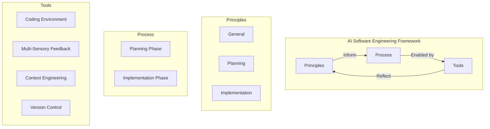
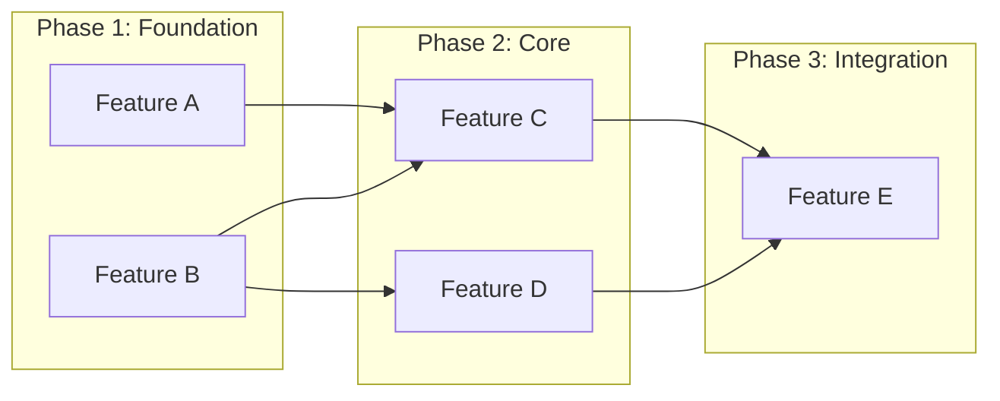
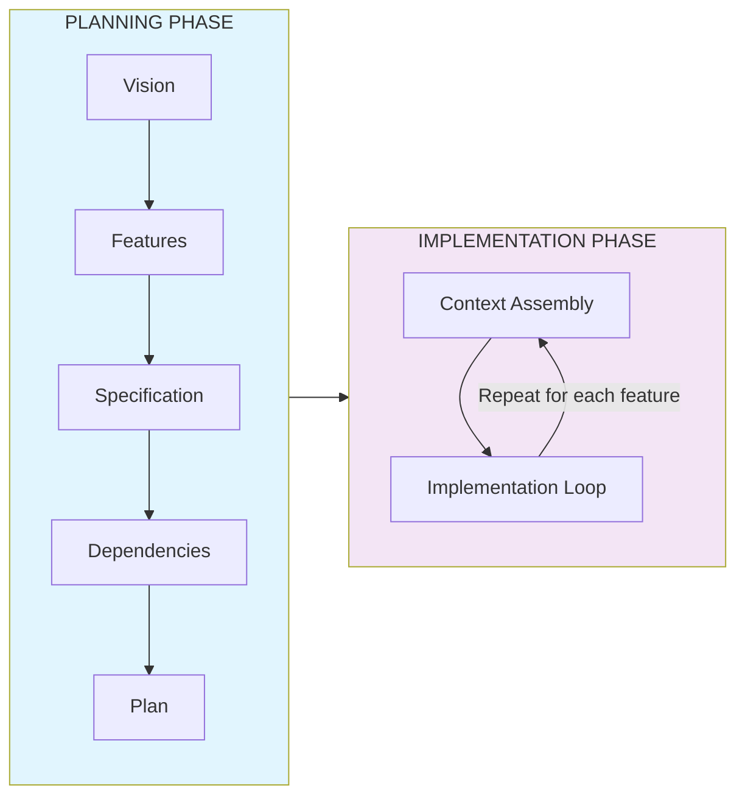
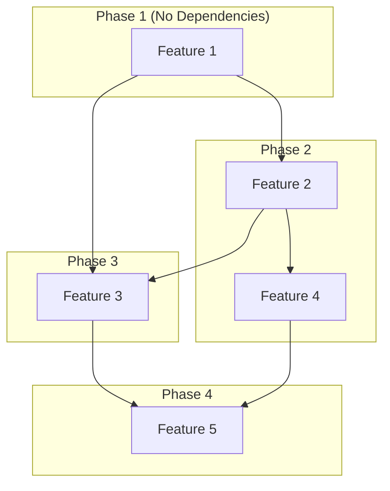
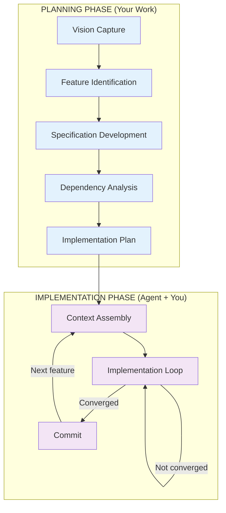

# AI Software Engineering Framework

A comprehensive framework for building maintainable, production-quality software with AI coding agents.

---

## Table of Contents

1. [Introduction](#introduction)
2. [Framework Overview](#framework-overview)
3. [The Three Pillars](#the-three-pillars)
4. [Principles](#principles)
   - [General Principles](#general-principles)
   - [Planning Principles](#planning-principles)
   - [Implementation Principles](#implementation-principles)
5. [Process](#process)
   - [Planning Phase](#planning-phase)
   - [Implementation Phase](#implementation-phase)
6. [Tools](#tools)
7. [Quick Reference](#quick-reference)

---

## Introduction

### The Problem: Vibe Coding Hangover

**Vibe coding** is the low-spec, zero-planning approach to AI-accelerated development that feels productive but results in brittle, unmaintainable "demo-ware."

The **hangover** is the resulting despair when you try to build maintainable, understandable software this way:

```
+---------------------------------------------------------------------+
|  THE VIBE CODING CYCLE                                              |
|                                                                     |
|   Inspiration    Fire up      Jam in       Hand it      "It works!" |
|   strikes! -------> AI --------> prompts ---> over ------->  :)     |
|       |          agent                                      |       |
|       |                                                     |       |
|       |         +---------------------------------------+   |       |
|       |         v                                       |   |       |
|       |    Monday arrives...                            |   |       |
|       |         |                                       |   |       |
|       |         v                                       |   |       |
|       |    "I don't understand it"                      |   |       |
|       |         |                                       |   |       |
|       |         v                                       |   |       |
|       |    "I can't maintain it"                        |   |       |
|       |         |                                       |   |       |
|       |         v                                       |   |       |
|       +------ Throw it away <---- THE HANGOVER          |   |       |
|                                                                     |
+---------------------------------------------------------------------+
```

### Who This Framework Is For

This framework is for you if:

- You value programming as a **daily learning experience**
- You want to **understand and own** the software you write with AI agents
- You want to be the **boss of the coding agents**, not their confused intern
- Working with agents makes you feel like a "prompt jockey" instead of an AI engineer
- You're sick of **throwing away code**, burning time and tokens
- You want to use coding agents to build **production applications** that do real work

### What You Can Build

This framework is adaptive to all types of software:

- Specialized litigation support applications for law firms
- Real-time appliance monitoring packages
- Digital publishing systems for dynamic content
- Any production software that needs to be evolved and maintained

---

## Framework Overview

```
+---------------------------------------------------------------------+
|                    AI SOFTWARE ENGINEERING FRAMEWORK                 |
+---------------------------------------------------------------------+
|                                                                     |
|    +-------------+    +-------------+    +-------------+            |
|    |             |    |             |    |             |            |
|    | PRINCIPLES  |    |   PROCESS   |    |    TOOLS    |            |
|    |             |    |             |    |             |            |
|    | Philosophy  |    |  Workflow   |    | Accelerators|            |
|    | underpinning|--->|  for getting|--->| & enablers  |            |
|    |  everything |    |  software   |    | of process  |            |
|    |             |    |   built     |    |             |            |
|    +-------------+    +-------------+    +-------------+            |
|                                                                     |
|         THE          PRINCIPLES IN        REFLECT OUR               |
|      PHILOSOPHY        ACTION             PRINCIPLES                |
|                                                                     |
+---------------------------------------------------------------------+
```

---

## The Three Pillars



| Pillar | Purpose | Description |
|--------|---------|-------------|
| **Principles** | Philosophy | The foundational beliefs that guide all decisions |
| **Process** | Workflow | The step-by-step method for building software |
| **Tools** | Enablers | Accelerators that make the process efficient |

---

## Principles

The framework is built on **10 principles** organized into three categories:

```
+---------------------------------------------------------------------+
|                         10 PRINCIPLES                               |
+---------------------------------------------------------------------+
|                                                                     |
|  GENERAL (3)              PLANNING (4)          IMPLEMENTATION (3)  |
|  ===========              ============          ==================  |
|                                                                     |
|  1. Accelerated           4. Specification      8. One Feature      |
|     Learning                 > Prompts             at a Time        |
|                                                                     |
|  2. Architect vs          5. Define Done        9. Context          |
|     Implementer              First                 Engineering      |
|                                                                     |
|  3. Slow Down to          6. Feature           10. Make it Work,    |
|     Go Fast                  Atomicity              Right, Fast     |
|                                                                     |
|                           7. Dependency-                            |
|                              Driven Dev                             |
|                                                                     |
+---------------------------------------------------------------------+
```

---

### General Principles

#### Principle 1: AI Engineering is Accelerated Learning

> **"Always Be Learning"**

**The Problem:**
- Treating AI coding agents as pure productivity tools
- Using AI to generate software without learning from the process
- Becoming dependent on AI for debugging, modifications, architectural decisions

**The Solution:**
- The framework is not just about building faster--it's about **learning as you go**
- Every step creates specific **learning opportunities**
- You're not just shipping software; you're **building yourself**

```
+---------------------------------------------------------------------+
|  VALUE HIERARCHY                                                    |
|                                                                     |
|     +-------------------------------+                               |
|     |   The engineer you become is  |  <-- EXPONENTIALLY            |
|     |   exponentially more valuable |      MORE VALUABLE            |
|     +-------------------------------+                               |
|                    ^                                                |
|                    |                                                |
|     +-------------------------------+                               |
|     |   The software is valuable    |  <-- VALUABLE                 |
|     +-------------------------------+                               |
|                                                                     |
+---------------------------------------------------------------------+
```

---

#### Principle 2: You Are the Architect, Agent is the Implementer

> **"Delegate the Doing, Not the Thinking"**

**The Problem:**
- Treating AI agents as replacements for architectural thinking
- Letting agents make design decisions

**The Solution:**
Keep the architect/implementer boundary crystal clear:

```
+---------------------------------------------------------------------+
|                                                                     |
|    YOU (The Architect)              AGENT (The Implementer)         |
|    ====================             =======================         |
|                                                                     |
|    +---------------------+          +---------------------+         |
|    | - Architecture      |          | - Implementation    |         |
|    | - Interfaces        |   --->   | - Typing code       |         |
|    | - System intent     |          | - Following patterns|         |
|    | - Structure         |          | - Implementing tests|         |
|    | - Design decisions  |          | - Boilerplate       |         |
|    | - Trade-offs        |          |                     |         |
|    +---------------------+          +---------------------+         |
|                                                                     |
|         THE THINKING                      THE DOING                 |
|                                                                     |
+---------------------------------------------------------------------+
```

---

#### Principle 3: Slow Down to Go Fast

> **"Compound Progress, Accelerate Velocity"**

**The Problem:**
- The "starting over" cycle
- Without deliberate iteration on validated work, you repeatedly start from scratch
- 3 months in: multiple abandoned attempts instead of one consistently improving system

**The Solution:**
Deliberate iteration enables compounding returns:

```
+---------------------------------------------------------------------+
|  COMPOUNDING RETURNS                                                |
|                                                                     |
|  Productivity                                                       |
|       ^                                                             |
|       |                                    /                        |
|       |                                 /                           |
|       |                              /      Week 3:                 |
|       |                           /         DRAMATICALLY FASTER     |
|       |                        /                                    |
|       |                     /               Week 2:                 |
|       |                  /                  BUILDS MOMENTUM         |
|       |               /                                             |
|       |            /                        Week 1:                 |
|       |         /                           FEELS SLOW              |
|       |      /                                                      |
|       |   /                                                         |
|       +------------------------------------------------------>      |
|                              Time                                   |
|                                                                     |
+---------------------------------------------------------------------+
```

---

### Planning Principles

#### Principle 4: Specification > Prompt Engineering

> **"Write the Blueprint, Not the Prompt"**

**The Problem:**
- Prompt engineering treats AI interactions as an optimization problem
- Trying to find "magic words" rather than clearly defining what "right" means

**The Solution:**
Specifications are fundamentally different from prompts:

| Prompts | Specifications |
|---------|---------------|
| Conversational | Structured |
| Interpretive | Precise |
| Vague | Unambiguous |
| Hope-based | Definition-based |

**Specifications include:**
- Requirements
- Behavior definitions
- Interfaces
- Acceptance criteria

**Benefits:**
1. **Forces architectural thinking** - You must understand the problem completely
2. **Defines interfaces precisely** - No room for interpretation
3. **Anticipates edge cases** - Proactive rather than reactive
4. **Provides clear direction** - Agent implements what you specified, not what it interprets

---

#### Principle 5: Define Done Before Implementing

> **"Specify Success, Then Build"**

**The Problem:**
- Starting implementation without executable tests and observable success criteria
- Agents lack clear completion criteria and immediate feedback
- They can't self-validate, self-correct, or know when they're done

**The Solution:**
Define "done" before implementation:

```
+---------------------------------------------------------------------+
|  MULTI-SENSORY VALIDATION                                          |
|                                                                     |
|  +-------------+   +-------------+   +-------------+                |
|  |   VISUAL    |   |  AUDITORY   |   |   TACTILE   |                |
|  |   SENSE     |   |   SENSE     |   |   SENSE     |                |
|  |             |   |             |   |             |                |
|  | What        |   | What system |   | How it      |                |
|  | renders     |   | reports     |   | interacts   |                |
|  |             |   | (logs,      |   |             |                |
|  |             |   |  errors)    |   |             |                |
|  +------+------+   +------+------+   +------+------+                |
|         |                 |                 |                       |
|         +--------+--------+-----------------+                       |
|                  v                                                  |
|          +-------------+                                            |
|          |    TESTS    |                                            |
|          |   verify    |                                            |
|          | correctness |                                            |
|          +-------------+                                            |
|                  |                                                  |
|                  v                                                  |
|     +-----------------------+                                       |
|     |  DONE = Tests pass    |                                       |
|     |        AND            |                                       |
|     |  Sensors validate     |                                       |
|     +-----------------------+                                       |
|                                                                     |
+---------------------------------------------------------------------+
```

---

#### Principle 6: Feature Atomicity

> **"Reduce Until Irreducible"**

**The Problem:**
- Writing non-atomic features leaves decomposition for implementation time
- Forces agents to make architectural decisions on the fly

**The Solution:**
Features become **implementation work units**:

```
+---------------------------------------------------------------------+
|  ATOMIC FEATURE CHARACTERISTICS                                     |
|                                                                     |
|  +--------------------------------------------------------------+  |
|  |                     ATOMIC FEATURE                            |  |
|  +--------------------------------------------------------------+  |
|  |  - Irreducible - cannot be broken down further               |  |
|  |  - Single-session - agent can complete in one focused session|  |
|  |  - Self-contained - has clear boundaries                     |  |
|  |  - Testable - can be validated independently                 |  |
|  |  - Committable - represents a meaningful checkpoint          |  |
|  +--------------------------------------------------------------+  |
|                                                                     |
|  RULE: Keep features as SMALL as possible to make agent            |
|        implementation as SUCCESSFUL as possible                    |
|                                                                     |
+---------------------------------------------------------------------+
```

---

#### Principle 7: Dependency-Driven Development

> **"Schedule Implementation by Dependencies"**

**The Problem:**
- Implementing without explicit dependency analysis
- Treating all features as independent when they form an interconnected graph

**The Solution:**



**Benefits:**
- Understand how features relate and integrate
- Ensure agents never implement features that depend on incomplete work

---

### Implementation Principles

#### Principle 8: Implement One Atomic Feature at a Time

> **"Complete One, Commit One, Continue"**

**The Problem:**
- Working on multiple features treats implementation as parallel streams
- Implementation quality requires sustained focus, complete context, tight feedback loops
- Jumping between features fragments focus

**The Solution:**
A disciplined rhythm:

```
+---------------------------------------------------------------------+
|  IMPLEMENTATION RHYTHM                                              |
|                                                                     |
|    +----------+    +----------+    +----------+    +----------+    |
|    |          |    |          |    |          |    |          |    |
|    | IMPLEMENT|--->|  STUDY   |--->| VALIDATE |--->|  COMMIT  |    |
|    |          |    |          |    |          |    |          |    |
|    +----------+    +----------+    +----------+    +-----+----+    |
|         ^                                               |          |
|         |                                               |          |
|         +-----------------------------------------------+          |
|                         NEXT FEATURE                               |
|                                                                     |
|  This rhythm creates:                                              |
|  - Momentum                                                        |
|  - Deepening understanding                                         |
|  - Working software                                                |
|  - Engineering knowledge                                           |
|                                                                     |
+---------------------------------------------------------------------+
```

---

#### Principle 9: Context Engineering and Management

> **"Curate Context, Don't Accumulate It"**

**The Problem:**
- Treating context as something that happens automatically
- Letting conversation history passively accumulate
- Not building context resilience (state won't persist)

**The Solution:**

```
+---------------------------------------------------------------------+
|  CONTEXT ENGINEERING                                                |
|                                                                     |
|  DON'T:                           DO:                               |
|  ------                           ---                               |
|  - Rely on conversational         - Capture decisions in            |
|    state persisting                 persistent documents            |
|                                                                     |
|  - Let history accumulate         - Curate what matters             |
|    passively                                                        |
|                                                                     |
|  - Hope agent remembers           - Build context from              |
|                                     artifacts:                      |
|                                     - Specifications                |
|                                     - Plans                         |
|                                     - Design documents              |
|                                                                     |
+---------------------------------------------------------------------+
```

---

#### Principle 10: Make It Work, Make It Right, Make It Fast

> **"Build, Learn, Improve"**

**The Problem:**
- Treating all three phases as equal from the start
- Trying to achieve them simultaneously
- Pursuing elegance and performance upfront

**The Solution:**

```
+---------------------------------------------------------------------+
|  THE THREE PHASES                                                   |
|                                                                     |
|  +-----------------+                                                |
|  |  MAKE IT WORK   |  <-- FRAMEWORK FOCUS                           |
|  |                 |                                                |
|  |  Simple,        |      Ship quickly. Get real usage.             |
|  |  functional     |      Pass tests. Working software.             |
|  |  implementation |                                                |
|  +--------+--------+                                                |
|           |                                                         |
|           v  Real usage reveals what matters                        |
|  +-----------------+                                                |
|  |  MAKE IT RIGHT  |  <-- SELECTIVE INVESTMENT                      |
|  |                 |                                                |
|  |  Refactor,      |      Only after usage proves value.            |
|  |  clean up       |                                                |
|  +--------+--------+                                                |
|           |                                                         |
|           v  Performance issues surface                             |
|  +-----------------+                                                |
|  |  MAKE IT FAST   |  <-- SELECTIVE INVESTMENT                      |
|  |                 |                                                |
|  |  Optimize       |      Only what deserves optimization.          |
|  +-----------------+                                                |
|                                                                     |
+---------------------------------------------------------------------+
```

---

## Process

The framework process has two distinct phases:



---

## Planning Phase

Planning is where you complete your **architectural thinking**. You transform a vague project idea into atomic, sequenced, fully-specified features ready for implementation.

**This is purely YOUR work:**
- Architectural decisions
- Decomposition
- Specification writing
- Dependency analysis

The agent can assist as a thinking partner, but **you make every decision**.

```
+---------------------------------------------------------------------+
|  PLANNING PHASE: 5 SEQUENTIAL STEPS                                |
|                                                                     |
|   +---------+   +---------+   +---------+   +---------+   +-----+  |
|   |         |   |         |   |         |   |         |   |     |  |
|   | VISION  |-->|FEATURES |-->|  SPEC   |-->|  DEPS   |-->|PLAN |  |
|   |         |   |         |   |         |   |         |   |     |  |
|   +---------+   +---------+   +---------+   +---------+   +-----+  |
|                                                                     |
|   Template      Template      Template      Matrix        Template  |
|      v             v             v            v              v      |
|   Completed     Completed     Completed    Validated     Completed  |
|   Template      Template      Template      Matrix       Template   |
|                                                                     |
|      MPS          FI           FS           DM/DG          IP       |
|                                                                     |
|   MPS = Master Project Specification                                |
|   FI  = Feature Inventory                                           |
|   FS  = Feature Specifications                                      |
|   DM  = Dependency Matrix                                           |
|   DG  = Dependency Graph                                            |
|   IP  = Implementation Plan                                         |
|                                                                     |
+---------------------------------------------------------------------+
```

---

### Step 1: Vision Capture

**Purpose:** Transform your vague project idea into a complete, structured Master Project Specification.

**The Problem:**
- Initial idea exists only in your head (usually incomplete)
- Details are fuzzy
- Implicit assumptions are unexamined
- Critical aspects are uninformed

**Process:** Think out loud with an agent through 5 sections:

```
+---------------------------------------------------------------------+
|  VISION CAPTURE: 5 SECTIONS                                        |
|                                                                     |
|  1. PROJECT PURPOSE                                                 |
|     +-- What problem are you solving?                               |
|     +-- Who experiences this problem?                               |
|     +-- What core value does your software deliver?                 |
|                                                                     |
|  2. ESSENTIAL FUNCTIONALITY                                         |
|     +-- 3-5 fundamental workflows that solve the problem            |
|                                                                     |
|  3. SCOPE BOUNDARIES (Now / Not / Next)                             |
|     +-- NOW: Must have for "make it work" version                   |
|     +-- NOT: Explicitly out of scope                                |
|     +-- NEXT: Future enhancements                                   |
|                                                                     |
|  4. TECHNICAL CONTEXT                                               |
|     +-- Where does it run?                                          |
|     +-- How do users interact?                                      |
|     +-- What systems does it connect to?                            |
|                                                                     |
|  5. WORKFLOW DETAILS (for each of the 3-5 workflows)                |
|     +-- Goal                                                        |
|     +-- High-level steps                                            |
|     +-- Expected outcome                                            |
|                                                                     |
+---------------------------------------------------------------------+
```

**Output:** Master Project Specification (MPS)

**Applied Principles:** Specification > Prompts, Define Done First

---

### Step 2: Feature Identification & Categorization

**Purpose:** Systematically extract all units of functionality from MPS and organize into a categorized Feature Inventory.

**The Problem:**
- Can't jump from high-level vision to detailed specs (too big a leap)
- Need intermediate refinement step

**Process:**

```
+---------------------------------------------------------------------+
|  FEATURE EXTRACTION QUESTIONS                                       |
|                                                                     |
|  For PROJECT PURPOSE:                                               |
|    "What foundational capabilities does this system need?"          |
|                                                                     |
|  For ESSENTIAL FUNCTIONALITY:                                       |
|    "What discrete capabilities are required for each workflow?"     |
|                                                                     |
|  For SCOPE BOUNDARIES:                                              |
|    "What infrastructure is needed to make it work NOW?"             |
|                                                                     |
|  For TECHNICAL CONTEXT:                                             |
|    "What platform integration and interface features are needed?"   |
|                                                                     |
|  For WORKFLOWS:                                                     |
|    "What handles input? What processing? What output?"              |
|    "What errors to anticipate? How do we feedback?"                 |
|                                                                     |
|  CROSS-CUTTING:                                                     |
|    "What security/logging/config/testing spans the system?"         |
|                                                                     |
+---------------------------------------------------------------------+
```

**Workflow:**

1. **Extract** - Document each feature and its source in MPS
2. **Build Raw List** - Capture every capability (don't organize yet)
3. **Challenge Completeness** - "What handles errors? What validates input?"
4. **Analyze** - Identify 3-7 natural category groupings
5. **Categorize** - Assign features, create unique IDs (e.g., `CORE-001`, `API-101`)
6. **Estimate Complexity** - Easy / Medium / Hard

**Output:** Feature Inventory with ID, description, complexity, source traceability

---

### Step 3: Iterative Specification Development

**Purpose:** Transform each feature from inventory into a complete, atomic, implementation-ready specification.

**The Problem:**
- Can't jump from feature list to implementation (too big a leap)
- Giving agents high-level descriptions and hoping they infer correctly doesn't work

**Process: Three-Level Refinement Pattern**

```
+---------------------------------------------------------------------+
|  SPECIFICATION DEVELOPMENT                                          |
|                                                                     |
|  1. USER STORY                                                      |
|     "As a [user type], I want to [action] so that [benefit]"        |
|                                                                     |
|  2. IMPLEMENTATION CONTRACTS (3 levels of refinement)               |
|                                                                     |
|     Level 1: PLAIN ENGLISH                                          |
|     +-- Describe what the feature does in natural language          |
|     +-- What it receives, what it does, what it produces            |
|                                                                     |
|            | Refine                                                  |
|            v                                                        |
|                                                                     |
|     Level 2: LOGIC FLOW (Input -> Logic -> Output)                  |
|     +-- Structured pseudo-code                                      |
|     +-- Clear input, step-by-step logic, defined output             |
|                                                                     |
|            | Refine                                                  |
|            v                                                        |
|                                                                     |
|     Level 3: FORMAL INTERFACES                                      |
|     +-- Exact signatures and data structures                        |
|     +-- Exact input types, return types, errors                     |
|                                                                     |
|  3. VALIDATION CONTRACTS (3 levels of refinement)                   |
|                                                                     |
|     Level 1: PLAIN ENGLISH                                          |
|     +-- Describe scenarios: happy path, errors, edge cases          |
|                                                                     |
|            | Refine                                                  |
|            v                                                        |
|                                                                     |
|     Level 2: TEST LOGIC (Given -> When -> Then)                     |
|     +-- Setup, trigger, expected outcomes                           |
|                                                                     |
|            | Refine                                                  |
|            v                                                        |
|                                                                     |
|     Level 3: FORMAL TEST DEFINITION                                 |
|     +-- Exact test interfaces with setup, inputs, assertions        |
|                                                                     |
|  4. VALIDATE ATOMICITY                                              |
|     +-- Can this be implemented in a single focused session?        |
|         If scattered or multiple capabilities -> SPLIT & REPEAT     |
|                                                                     |
|  5. IDENTIFY DEPENDENCIES                                           |
|     +-- Binary: depends or doesn't (no partial dependencies)        |
|                                                                     |
+---------------------------------------------------------------------+
```

**Output:** Complete Atomic Feature Specification containing:
- User Story
- Technical Blueprint (3 levels)
- Validation Strategy (3 levels)
- Dependencies
- Implementation Notes

---

### Step 4: Dependency Analysis

**Purpose:** Transform feature specifications into a validated Dependency Matrix defining exact implementation order.

**The Problem:**
- Dependencies are scattered across individual documents
- No global picture of the dependency graph
- Can't detect circular dependencies spanning multiple features

**Process:**

```
+---------------------------------------------------------------------+
|  DEPENDENCY MATRIX CONSTRUCTION                                     |
|                                                                     |
|  1. EXTRACT MATRIX                                                  |
|     Create grid: rows = features, columns = features                |
|     Mark X where row feature depends on column feature              |
|                                                                     |
|     Example:                                                        |
|            | F1  | F2  | F3  | F4  | F5  |                          |
|     -------+-----+-----+-----+-----+-----+                          |
|     F1     |     |     |     |     |     |                          |
|     F2     |  X  |     |     |     |     |                          |
|     F3     |  X  |  X  |     |     |     |                          |
|     F4     |     |  X  |     |     |     |                          |
|     F5     |     |     |  X  |  X  |     |                          |
|                                                                     |
|  2. GENERATE GRAPH                                                  |
|     Visualize with GraphViz/Mermaid                                 |
|     Features = nodes, Dependencies = edges                          |
|     Closed loops = circular dependencies (immediately visible)      |
|                                                                     |
|  3. VALIDATE & CLEAN                                                |
|     Apply binary dependency test to every mark:                     |
|     "Does row feature REQUIRE column feature's specific             |
|      output/configuration/functionality to work?"                   |
|     YES = keep    NO = remove (may be coordination only)            |
|                                                                     |
|  4. DETECT & RESOLVE CYCLES                                         |
|     Resolution strategies (in order):                               |
|     1. Dependency Elimination - reexamine with binary test          |
|     2. Revised Specification - revise interfaces/contracts          |
|     3. Feature Splitting - may not be atomic                        |
|     4. Consolidation - last resort                                  |
|                                                                     |
|  5. ITERATE                                                         |
|     Update matrix -> Regenerate graph -> Recheck                    |
|     Continue until ZERO circular dependencies                       |
|                                                                     |
+---------------------------------------------------------------------+
```

**Output:**
- Validated Dependency Matrix
- Dependency Graph (visual diagram)



---

### Step 5: Implementation Plan Development

**Purpose:** Transform validated dependency matrix into a comprehensive, phase-organized Implementation Plan.

**The Problem:**
Without an implementation plan, you can't answer:
- Which features should be implemented first?
- Which can be developed in parallel?
- How to validate feature groups work together?
- When is it safe to begin dependent features?

**Process:**

```
+---------------------------------------------------------------------+
|  IMPLEMENTATION PLAN DEVELOPMENT                                    |
|                                                                     |
|  1. ORGANIZE PHASES (Topological Sort)                              |
|     +-- Phase 1: Features with NO dependencies                      |
|     +-- Phase 2: Features depending ONLY on Phase 1                 |
|     +-- Phase 3: Features depending ONLY on Phase 1 & 2             |
|     +-- Continue pattern...                                         |
|                                                                     |
|     Verify: No features within same phase depend on each other      |
|     Identify: Critical path (longest dependency chain)              |
|                                                                     |
|  2. PARALLEL ANALYSIS (optional acceleration)                       |
|     Identify which features in same phase can be built together     |
|                                                                     |
|  3. VALIDATION STRATEGY PLANNING                                    |
|     For each phase, define:                                         |
|     +-- What tests must pass?                                       |
|     +-- What integration points must work?                          |
|     +-- How to verify features work together?                       |
|     +-- What feedback loops enable autonomous refinement?           |
|                                                                     |
|     Think through: What could go wrong when features combine?       |
|                                                                     |
|  4. IMPLEMENTATION SEQUENCING                                       |
|     Define complete execution strategy:                             |
|     +-- Phase Gates: How to determine phase completion              |
|     +-- Task Assignment: How agent selects next feature             |
|     +-- Blocker Management: How to handle/resolve blockers          |
|     +-- Progress Tracking: Feature-level, phase-level, critical     |
|                            path monitoring                          |
|                                                                     |
+---------------------------------------------------------------------+
```

**Output:** Implementation Plan containing:
- Phase-organized feature sequence
- Parallel development opportunities
- Binary validation gates per phase
- Guidance for autonomous agent sessions

---

## Implementation Phase

Implementation is where planning artifacts guide transformation of specifications into **working, tested software**.

Unlike planning (linear, 5 steps), implementation is a **tight, rapid loop** executed repeatedly for each atomic feature.

```
+---------------------------------------------------------------------+
|  IMPLEMENTATION PHASE                                               |
|                                                                     |
|   +------------------------------------------------------------+   |
|   |                                                            |   |
|   |  For each feature in implementation plan:                  |   |
|   |                                                            |   |
|   |      +-----------------+                                   |   |
|   |      |     CONTEXT     |                                   |   |
|   |      |    ASSEMBLY     |                                   |   |
|   |      +--------+--------+                                   |   |
|   |               |                                            |   |
|   |               v                                            |   |
|   |      +-----------------+                                   |   |
|   |      | IMPLEMENTATION  |<--------------+                   |   |
|   |      |      LOOP       |               |                   |   |
|   |      +--------+--------+               |                   |   |
|   |               |                        |                   |   |
|   |               v                        |                   |   |
|   |          Tests pass?     NO -----------+                   |   |
|   |          Sensors clean?                                    |   |
|   |               |                                            |   |
|   |              YES                                           |   |
|   |               |                                            |   |
|   |               v                                            |   |
|   |      +-----------------+                                   |   |
|   |      |     COMMIT      |                                   |   |
|   |      +--------+--------+                                   |   |
|   |               |                                            |   |
|   |               v                                            |   |
|   |         Next Feature                                       |   |
|   |                                                            |   |
|   +------------------------------------------------------------+   |
|                                                                     |
+---------------------------------------------------------------------+
```

---

### Multi-Sensory Feedback Loop

A key concept enabling autonomous agent implementation:

```
+---------------------------------------------------------------------+
|  MULTI-SENSORY FEEDBACK SYSTEM                                      |
|                                                                     |
|                    +-------------------+                            |
|                    |   AGENT WRITES    |                            |
|                    |      CODE         |                            |
|                    +---------+---------+                            |
|                              |                                      |
|                              v                                      |
|                    +-------------------+                            |
|                    |   AGENT EXECUTES  |                            |
|                    |      CODE         |                            |
|                    +---------+---------+                            |
|                              |                                      |
|          +-------------------+-------------------+                  |
|          v                   v                   v                  |
|   +-------------+     +-------------+     +-------------+           |
|   |   VISUAL    |     |  AUDITORY   |     |   TACTILE   |           |
|   |   SENSE     |     |   SENSE     |     |   SENSE     |           |
|   |             |     |             |     |             |           |
|   | What        |     | What system |     | How         |           |
|   | renders     |     | reports     |     | interactions|           |
|   |             |     |             |     | respond     |           |
|   | - UI        |     | - Logs      |     | - Clicks    |           |
|   | - Screenshots|    | - Errors    |     | - Submits   |           |
|   | - Layout    |     | - Warnings  |     | - Workflows |           |
|   +------+------+     +------+------+     +------+------+           |
|          |                   |                   |                  |
|          +-------------------+-------------------+                  |
|                              |                                      |
|                              v                                      |
|                    +-------------------+                            |
|                    |   RUN FORMAL      |                            |
|                    |     TESTS         |                            |
|                    +---------+---------+                            |
|                              |                                      |
|                              v                                      |
|                    +-------------------+                            |
|                    |    CORRELATE      |                            |
|                    |  SENSORS + TESTS  |                            |
|                    |                   |                            |
|                    | WHAT failed (tests)|                           |
|                    | WHY failed (sensors)|                          |
|                    +---------+---------+                            |
|                              |                                      |
|                              v                                      |
|              +-------------------------------+                      |
|              |     ALL PASS + ALL CLEAN?     |                      |
|              +---------------+---------------+                      |
|                              |                                      |
|                   YES <------+------> NO                            |
|                    |                    |                           |
|                    v                    v                           |
|              +-----------+        +-----------+                     |
|              |  FEATURE  |        |  REFINE   |                     |
|              | COMPLETE  |        |   LOOP    |                     |
|              +-----------+        +-----------+                     |
|                                                                     |
+---------------------------------------------------------------------+
```

**Key Insight:** Tests tell you WHAT failed. Sensors tell you WHY.

---

### Step 1: Context Assembly

**Purpose:** Transform planning artifacts into a curated context package for autonomous feature implementation.

**The Problem:**
- Can't just throw everything at the agent
- Dumping entire planning documents wastes context window
- Turns autonomous sessions into constant back-and-forth

**Process:**

```
+---------------------------------------------------------------------+
|  CONTEXT ASSEMBLY: 4 STEPS                                          |
|                                                                     |
|  1. FEATURE SPECIFICATION ASSEMBLY                                  |
|     Include complete spec: user story, contracts, acceptance        |
|     @reference all dependencies                                     |
|     This is the PRIMARY BLUEPRINT                                   |
|                                                                     |
|  2. DEPENDENCY CONTEXT GATHERING                                    |
|     Follow all @references in feature spec                          |
|     Each @reference points to:                                      |
|     +-- Dependency feature specification                            |
|     +-- IMPLEMENTED CODE (must already exist per framework)         |
|                                                                     |
|  3. IMPLEMENTATION GUIDANCE                                         |
|     Extract RELEVANT sections only:                                 |
|     +-- What phase is this feature in?                              |
|     +-- What are the phase completion criteria?                     |
|     +-- What's the validation strategy for this phase?              |
|                                                                     |
|  4. ENABLE SENSORY CAPABILITIES                                     |
|     Read acceptance criteria for required sensors:                  |
|     +-- "sees/displays/renders" -> Visual sense tools               |
|     +-- "logs/errors" -> Auditory sense tools                       |
|     +-- "clicks/submits/completes" -> Tactile sense tools           |
|     @reference appropriate tool usage guides                        |
|                                                                     |
+---------------------------------------------------------------------+
```

**Output:** Curated Context Package containing:
- Feature specification
- Dependency code (for all integrated features)
- Relevant implementation guidance
- Sensory tool instructions

---

### Step 2: Implementation Loop

**Purpose:** Transform an atomic feature specification into working, tested code.

> **NOTE:** This is the ONLY step in the entire framework where the AI writes code.

**The Problem:**
- "Write everything then test" fails - problems compound undetected
- "Ad hoc write and test" fails - no systematic feedback

**Why This Works:**
Because features are **atomic**, complete implementation fits in one context window:
- No context loss
- No reconstruction
- No degraded fidelity

**The Loop:**

```
+---------------------------------------------------------------------+
|  THE IMPLEMENTATION LOOP                                            |
|                                                                     |
|      +------------------------------------------------------+       |
|      |                                                      |       |
|      |  +---------------------------------------------+     |       |
|      |  | 1. WRITE CODE                               |     |       |
|      |  |    Follow feature spec's technical contracts|     |       |
|      |  |    Translate all 3 levels into working code |     |       |
|      |  |    Match interfaces, inputs, outputs, errors|     |       |
|      |  +---------------------+-----------------------+     |       |
|      |                        |                             |       |
|      |                        v                             |       |
|      |  +---------------------------------------------+     |       |
|      |  | 2. EXECUTE & SENSE                          |     |       |
|      |  |    Execute code immediately                 |     |       |
|      |  |    Gather sensory feedback:                 |     |       |
|      |  |    - Visual: what renders                   |     |       |
|      |  |    - Auditory: what logs/errors             |     |       |
|      |  |    - Tactile: how interactions respond      |     |       |
|      |  +---------------------+-----------------------+     |       |
|      |                        |                             |       |
|      |                        v                             |       |
|      |  +---------------------------------------------+     |       |
|      |  | 3. TEST & VALIDATE                          |     |       |
|      |  |    Run all test scenarios from spec         |     |       |
|      |  |    Binary pass/fail against requirements    |     |       |
|      |  +---------------------+-----------------------+     |       |
|      |                        |                             |       |
|      |                        v                             |       |
|      |  +---------------------------------------------+     |       |
|      |  | 4. CORRELATE                                |     |       |
|      |  |    Cross-reference sensors + test results   |     |       |
|      |  |    Multiple sensors same issue = confirmed  |     |       |
|      |  |    Conflicting signals = hidden complexity  |     |       |
|      |  |    WHAT failed (tests) + WHY (sensors)      |     |       |
|      |  +---------------------+-----------------------+     |       |
|      |                        |                             |       |
|      |                        v                             |       |
|      |  +---------------------------------------------+     |       |
|      |  | 5. CONVERGED?                               |     |       |
|      |  |    All tests pass?                          |     |       |
|      |  |    All sensors clean?                       |     |       |
|      |  |    - No errors in logs                      |     |       |
|      |  |    - No UI rendering issues                 |     |       |
|      |  |    - Interactions work properly             |     |       |
|      |  +---------------------+-----------------------+     |       |
|      |                        |                             |       |
|      |              NO <------+------> YES                  |       |
|      |               |                  |                   |       |
|      |               v                  |                   |       |
|      |         +-----------+            |                   |       |
|      |         |  REFINE   |            |                   |       |
|      |         |  (based on|            |                   |       |
|      |         |diagnostics)|           |                   |       |
|      |         +-----+-----+            |                   |       |
|      |               |                  |                   |       |
|      +---------------+                  |                   |       |
|                                         v                   |       |
|                              +-------------------+          |       |
|                              |  ATOMIC COMMIT    |          |       |
|                              |  - Feature ID     |          |       |
|                              |  - Spec summary   |          |       |
|                              |  - Validation     |          |       |
|                              |    confirmation   |          |       |
|                              |  - Impl notes     |          |       |
|                              +-------------------+          |       |
|                                         |                   |       |
|                                         v                   |       |
|                              +-------------------+          |       |
|                              |  FEATURE COMPLETE |          |       |
|                              |  Ready for next   |          |       |
|                              +-------------------+          |       |
|                                                             |       |
+---------------------------------------------------------------------+
```

**Output:** Working, tested feature that:
- Passes all acceptance criteria
- Passes all tests
- Validated by all three digital sensors
- Ready for integration

---

## Tools

The framework requires four foundational capabilities:

```
+---------------------------------------------------------------------+
|  FOUR FOUNDATIONAL TOOL CATEGORIES                                  |
|                                                                     |
|  +-----------------+    +-----------------+                         |
|  |    CODING       |    |  MULTI-SENSORY  |                         |
|  |  ENVIRONMENT    |    |    FEEDBACK     |                         |
|  |                 |    |     SYSTEM      |                         |
|  | Development     |    |                 |                         |
|  | workspace for   |    | Validation      |                         |
|  | thinking +      |    | infrastructure  |                         |
|  | implementation  |    | for agents      |                         |
|  +-----------------+    +-----------------+                         |
|                                                                     |
|  +-----------------+    +-----------------+                         |
|  |    CONTEXT      |    |    VERSION      |                         |
|  |  ENGINEERING    |    |   CONTROL &     |                         |
|  |     TOOLS       |    |   PROGRESS      |                         |
|  |                 |    |                 |                         |
|  | Systematic      |    | Git for history |                         |
|  | assembly of     |    | + Impl Plan for |                         |
|  | focused context |    | feature tracking|                         |
|  +-----------------+    +-----------------+                         |
|                                                                     |
+---------------------------------------------------------------------+
```

---

### 1. Coding Environment

A complete development workspace supporting two types of work:
- Your architectural thinking and planning
- Agent's autonomous implementation and testing

**Core Components:**

| Component | Purpose |
|-----------|---------|
| **AI Coding Agent** | The agent that implements specifications |
| **Execution Sandbox** | Safe, isolated environment for code execution and testing. Disposable, risk-free, easy reset. |
| **IDE/Text Editor** | Your interface for reading, reviewing, and editing |
| **Voice Input** | Rapid capture system converting speech to text at thinking speed. Removes typing bottleneck for planning work. |

> **Pro Tip:** A good voice input tool is massively impactful for applying the framework. Planning involves externalizing architectural thinking that's often incomplete and exploratory--voice removes the typing bottleneck.

---

### 2. Multi-Sensory Feedback System

Comprehensive validation infrastructure giving agents the ability to observe implementations through three digital senses:

```
+---------------------------------------------------------------------+
|  MULTI-SENSORY TOOLS                                                |
|                                                                     |
|  +-------------------------------------------------------------+   |
|  | VISUAL SENSE TOOLS                                          |   |
|  | "What was produced / what exists"                           |   |
|  +-------------------------------------------------------------+   |
|  | - UI Rendering: Screenshots, layout, styling                |   |
|  | - System State: Database contents, configuration, session   |   |
|  | - Code Structure: Actual implementation                     |   |
|  |                                                             |   |
|  | CATCHES: Broken rendering, incorrect state, structural      |   |
|  |          issues that logs and tests miss                    |   |
|  +-------------------------------------------------------------+   |
|                                                                     |
|  +-------------------------------------------------------------+   |
|  | AUDITORY SENSE TOOLS                                        |   |
|  | "What the system reports"                                   |   |
|  +-------------------------------------------------------------+   |
|  | - Logs: System narrating its operations                     |   |
|  | - Errors & Warnings: Problems the system detects            |   |
|  | - API Responses: Inter-system communications                |   |
|  | - Stack Traces: Detailed failure information                |   |
|  |                                                             |   |
|  | EXPLAINS: WHY things fail, not just THAT they failed        |   |
|  +-------------------------------------------------------------+   |
|                                                                     |
|  +-------------------------------------------------------------+   |
|  | TACTILE SENSE TOOLS                                         |   |
|  | "Active interaction testing"                                |   |
|  +-------------------------------------------------------------+   |
|  | - User Workflows: Completing tasks end-to-end               |   |
|  | - API Interactions: Request/response cycles                 |   |
|  | - Performance: Response times, resource usage               |   |
|  | - Security Checks: Validation under actual use              |   |
|  | - Integration Testing: System behavior under use            |   |
|  |                                                             |   |
|  | REVEALS: Whether software behaves correctly under ACTUAL    |   |
|  |          use, not just isolated test scenarios              |   |
|  +-------------------------------------------------------------+   |
|                                                                     |
+---------------------------------------------------------------------+
```

---

### 3. Context Engineering & Assembly Tools

Systematic approach to assembling focused, complete context packages:

| Tool | Purpose |
|------|---------|
| **Cross-Referencing System (`@references`)** | Declarative linking between documents/code. Enables automatic context assembly by following dependency chains. |
| **Slash Commands** | Process automation triggering multi-step workflows through single invocation. Useful for context assembly, template instantiation, session initialization. |
| **Template System** | Structured templates for every framework artifact. Ensures consistent format and completeness. |
| **Markdown Documentation** | Universal format agents understand deeply. All communication should be instantly convertible to markdown. |

**Key Templates:**
- Master Project Specification
- Feature Specification
- Dependency Matrix
- Implementation Plan
- Implementation Record

---

### 4. Version Control & Progress Tracking

Dual mechanism system:

```
+---------------------------------------------------------------------+
|  VERSION CONTROL + PROGRESS TRACKING                                |
|                                                                     |
|  +---------------------------------+                                |
|  |         GIT                     |                                |
|  |                                 |                                |
|  |  Implementation history via     |                                |
|  |  atomic feature commits         |                                |
|  |                                 |                                |
|  |  Shows: WHAT changed and WHEN   |                                |
|  +---------------------------------+                                |
|               +                                                     |
|  +---------------------------------+                                |
|  |  IMPLEMENTATION PLAN            |                                |
|  |                                 |                                |
|  |  Feature completion tracking    |                                |
|  |  (same artifact from planning)  |                                |
|  |                                 |                                |
|  |  Shows: PROJECT STATE           |                                |
|  |  (what Git doesn't show)        |                                |
|  +---------------------------------+                                |
|                                                                     |
|  Like saving progress in a video game - obvious and essential       |
|                                                                     |
+---------------------------------------------------------------------+
```

---

## Quick Reference

### The 10 Principles at a Glance

| # | Principle | Mantra |
|---|-----------|--------|
| 1 | AI Engineering is Accelerated Learning | "Always Be Learning" |
| 2 | You are Architect, Agent is Implementer | "Delegate the Doing, Not the Thinking" |
| 3 | Slow Down to Go Fast | "Compound Progress, Accelerate Velocity" |
| 4 | Specification > Prompt Engineering | "Write the Blueprint, Not the Prompt" |
| 5 | Define Done Before Implementing | "Specify Success, Then Build" |
| 6 | Feature Atomicity | "Reduce Until Irreducible" |
| 7 | Dependency-Driven Development | "Schedule Implementation by Dependencies" |
| 8 | One Atomic Feature at a Time | "Complete One, Commit One, Continue" |
| 9 | Context Engineering & Management | "Curate Context, Don't Accumulate It" |
| 10 | Make It Work, Right, Fast | "Build, Learn, Improve" |

---

### Planning Phase Checklist

```
[ ] STEP 1: Vision Capture
    [ ] Project Purpose defined
    [ ] 3-5 Essential Functionality workflows identified
    [ ] Scope Boundaries (Now/Not/Next) explicit
    [ ] Technical Context documented
    [ ] Workflow Details for each workflow
    -> OUTPUT: Master Project Specification

[ ] STEP 2: Feature Identification
    [ ] All features extracted from MPS
    [ ] Raw feature list complete
    [ ] Completeness challenged
    [ ] 3-7 categories identified
    [ ] Features categorized with IDs
    [ ] Complexity estimated
    -> OUTPUT: Feature Inventory

[ ] STEP 3: Specification Development (per feature)
    [ ] User Story written
    [ ] Implementation Contract Level 1 (Plain English)
    [ ] Implementation Contract Level 2 (Logic Flow)
    [ ] Implementation Contract Level 3 (Formal Interfaces)
    [ ] Validation Contract Level 1 (Plain English)
    [ ] Validation Contract Level 2 (Given/When/Then)
    [ ] Validation Contract Level 3 (Formal Tests)
    [ ] Atomicity validated (split if needed)
    [ ] Dependencies identified
    -> OUTPUT: Feature Specifications

[ ] STEP 4: Dependency Analysis
    [ ] Dependency matrix extracted
    [ ] Dependency graph generated
    [ ] Dependencies validated (binary test)
    [ ] Circular dependencies detected and resolved
    [ ] Matrix and graph finalized
    -> OUTPUT: Validated Dependency Matrix + Graph

[ ] STEP 5: Implementation Plan
    [ ] Phases organized (topological sort)
    [ ] Critical path identified
    [ ] Validation strategy per phase defined
    [ ] Phase gates established
    [ ] Sequencing complete
    -> OUTPUT: Implementation Plan
```

---

### Implementation Phase Checklist

```
[ ] For each feature in Implementation Plan:

    [ ] CONTEXT ASSEMBLY
        [ ] Feature specification included
        [ ] All @references followed
        [ ] Dependency code gathered
        [ ] Relevant implementation guidance extracted
        [ ] Required sensory tools identified and included
        -> OUTPUT: Curated Context Package

    [ ] IMPLEMENTATION LOOP
        [ ] Code written following technical contracts
        [ ] Code executed with sensory feedback
        [ ] Tests run against validation contracts
        [ ] Sensors + tests correlated
        [ ] Loop until: all tests pass AND all sensors clean
        -> OUTPUT: Working, tested feature

    [ ] COMMIT
        [ ] Atomic git commit created
        [ ] Feature ID in commit message
        [ ] Spec summary included
        [ ] Validation confirmation noted
        -> Ready for next feature
```

---

### The Complete Framework Flow



---

## Summary

The AI Software Engineering Framework transforms vibe coding chaos into sustainable, maintainable software development:

1. **Principles** provide the philosophy--always learning, clear boundaries, compound progress
2. **Process** provides the workflow--structured planning, systematic implementation
3. **Tools** enable efficiency--sensory feedback, context engineering, version control

The key insight: **The only step where AI writes code is the Implementation Loop**. Everything else is your architectural thinking, captured in specifications that enable autonomous, high-quality agent work.

**Stop being a prompt jockey. Become an AI engineer.**

---

*Framework source: Corey's AI Engineering Talk - vibecodinghangover.com*
