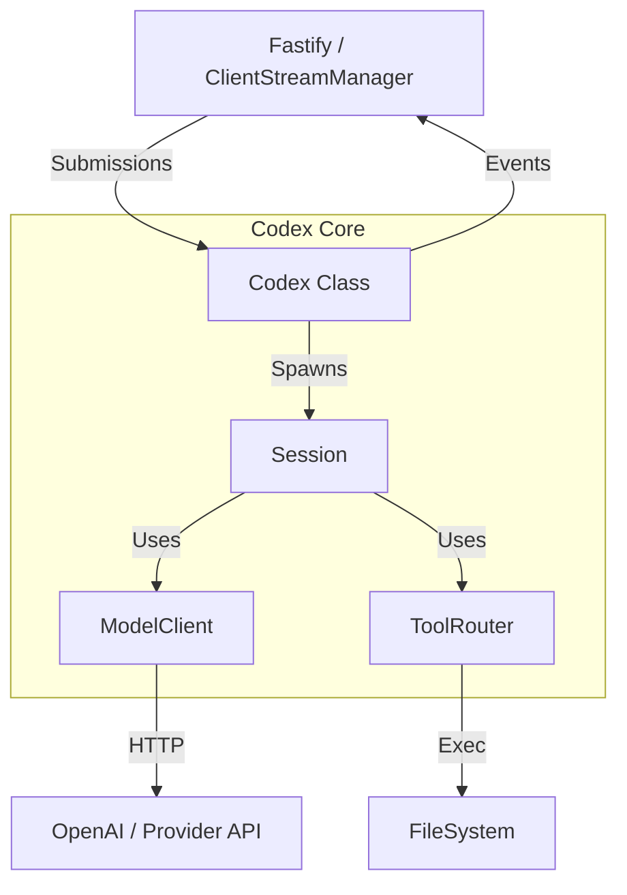
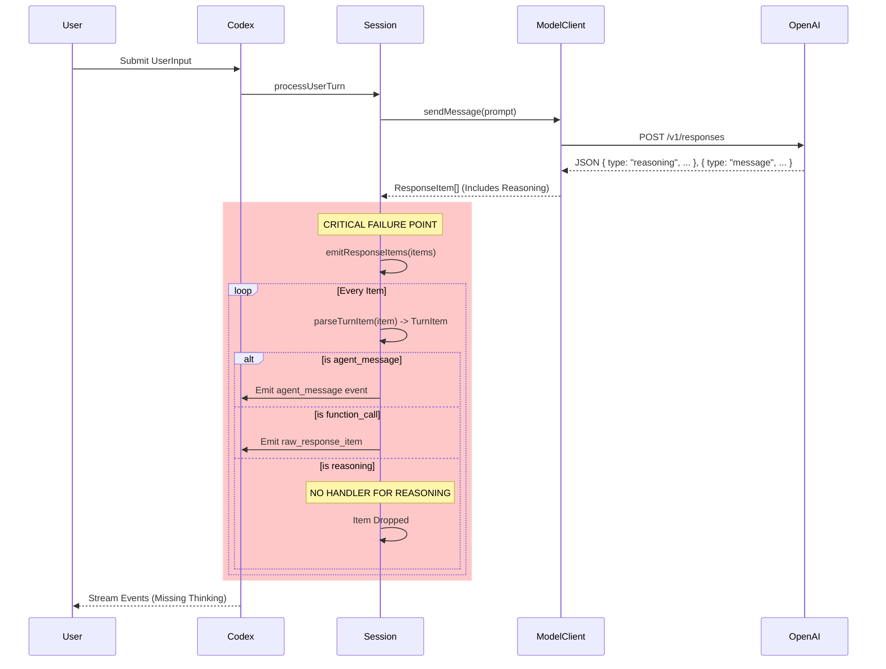

# Codex Core Architecture (As-Is)

## 1. High-Level Overview

The `codex-core` (`codex-ts/src/core`) is the orchestration engine responsible for managing conversational sessions, executing tools, and interfacing with LLM providers. It was ported from a Rust implementation (`codex-rs`) and currently exhibits several architectural characteristics typical of a direct port, including channel-like event emitters and rigid structural couplings.

### System Context



## 2. Key Components

### 2.1. The Orchestrator: `Codex` Class
*   **Location:** `src/core/codex/codex.ts`
*   **Role:** The public entry point and boundary. It acts as a "shell" around the `Session`.
*   **Communication:** Uses a pair of `EventEmitter`s (`txSub` for submissions, `rxEvent` for events) to mimic Rust's MPSC channels.
*   **Responsibility:**
    *   Spawns the `Session`.
    *   Starts the `submissionLoop`.
    *   Resolves provider configuration using a hardcoded `resolveSessionProvider` function.
    *   Wires internal session events to the public event emitter.

### 2.2. The State Machine: `Session` Class
*   **Location:** `src/core/codex/session.ts`
*   **Role:** The "Model" and "Controller" of the conversation. It holds the state configuration, history, and active turn data.
*   **Key Responsibilities:**
    *   `processUserTurn`: The main execution loop for a turn.
    *   `emitResponseItems`: Converts model response items into public events.
    *   `executeFunctionCalls`: Manages the tool execution loop (up to `MAX_TOOL_ITERATIONS`).
*   **Opacity:** The `Session` logic is monolithic. It manually iterates through response items and decides what to emit, acting as a filter that currently swallows unknown item types (like "reasoning").

### 2.3. The IO Layer: `ModelClient`
*   **Location:** `src/core/client/client.ts`
*   **Role:** Abstracts the differences between OpenAI Responses API, Chat Completions, and Anthropic Messages.
*   **Current State:**
    *   Implementing `sendMessage` (request/response) but `stream` methods are largely unimplemented or placeholders in the current phase.
    *   It **correctly** parses `reasoning` from the OpenAI Responses API into `ResponseItem` objects.

### 2.4. Configuration Registry
*   **Location:** `src/core/client/model-provider-info.ts` & `src/cli/providers.ts`
*   **Mechanism:** Static lists of "Built-in" providers (`openai`, `anthropic`, `openrouter`).
*   **Rigidity:** `Codex.spawn` relies on `resolveSessionProvider` which hardcodes checks against these IDs. Adding a new provider requires modifying the core code; there is no dynamic injection mechanism for the registry.

## 3. Data Flow & The "Thinking" Gap

The current failure to display "Thinking" cards is a direct result of an omission in the `Session`'s event emission logic.

### Sequence Diagram: A Turn Execution



### Detailed Analysis of the Failure
1.  **`ModelClient`**: Correctly receives and parses the `reasoning` block from the API into a `ResponseItem` of type `reasoning`.
2.  **`parseTurnItem`**: Correctly converts this `ResponseItem` into a `TurnItem` of type `reasoning`.
3.  **`Session.emitResponseItems`**: Iterates through the items. It has explicit `if` blocks for:
    *   `function_call` / `function_call_output`
    *   `agent_message`
    *   **It does NOT have an `if` block for `reasoning` or `agent_reasoning`.**
4.  **Result**: The data exists in memory but is silently discarded before leaving the `Session`.

## 4. Technical Debt & Refactoring Opportunities

1.  **Observability**: The `Session` is a black box. Events are emitted conditionally. A rewrite should prefer an "Event Bus" architecture where *all* raw events from the model are emitted first, and processors (like history, UI) subscribe to them, rather than the `Session` deciding what is worthy of emission.
2.  **Provider Injection**: The hardcoded provider resolution in `Codex.spawn` makes configuration brittle. Providers should be injected dependencies, not static lookups.
3.  **Streaming**: The current core simulates streaming by waiting for the full request (`sendMessage`) and then emitting items. True streaming (`stream`) is defined in `ModelClient` but not fully wired or utilized, increasing latency.
4.  **Event Typing**: The `EventEmitter` usage mimics Rust channels but loses type safety. `txEvent` and `rxEvent` rely on magic string keys.

## 5. Recommended Fix (Short Term) vs. Rewrite (Long Term)

### Short Term Fix (The Patch)
Modify `codex-ts/src/core/codex/session.ts` in `emitResponseItems`:
Add a handler for `turnItem.type === "reasoning"`.

```typescript
      if (turnItem.type === "reasoning") {
        // Construct and emit the missing event
        await this.sendEvent(subId, {
          type: "agent_reasoning",
          text: turnItem.item.raw_content.join(""), // Simplify for now
        });
      }
```

### Long Term Rewrite
Redesign `Codex` to be an observable pipeline:
1.  **Pipeline:** `Input -> Model -> EventStream`.
2.  **Middleware:** History persistence, Tool Execution, and UI Formatting become middleware that tap into the `EventStream`.
3.  **Registry:** A single `ProviderRegistry` passed into the runtime, allowing dynamic registration of models/providers without code changes.
