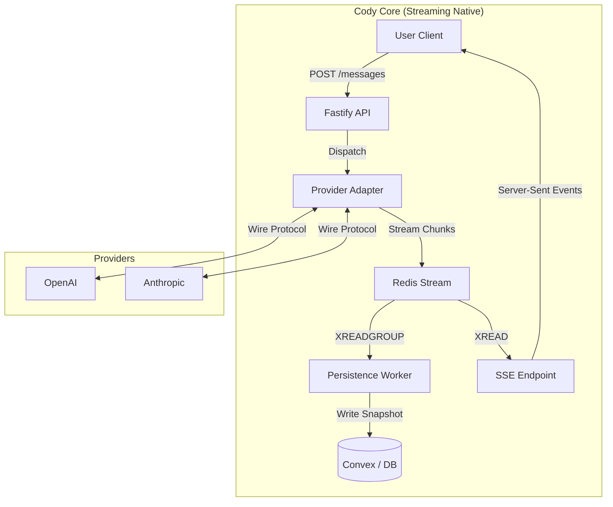
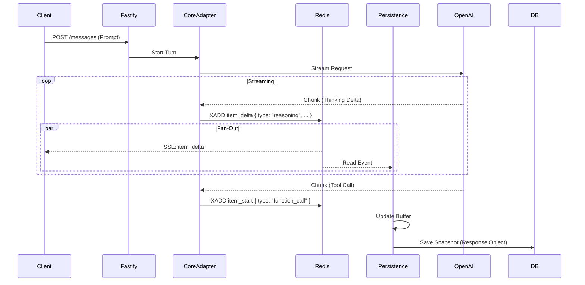

# Cody Core 2.0: Streaming-First Architecture

## 1. Executive Summary

**Objective:** Re-architect the core runtime ("Codex Core") of Cody to be **streaming-native**.

Currently, Cody operates on a legacy architecture ported directly from Rust (`codex-rs`), which relies on opaque state machines, manual event filtering, and a "Request/Response" mental model that fights against the reality of modern LLMs. This has led to observability gaps (missing "thinking" blocks), brittle configuration, and difficulty supporting concurrent agentic workflows.

**The Solution:** A complete redesign centered on **Redis Streams** and the **OpenAI Responses API Schema**. We will treat the entire system as a pipeline of events, where "Thinking", "Tool Calls", and "Messages" are all just typed blocks in a unified stream. This aligns our internal data model with the industry-standard wire formats, drastically reducing transformation complexity.

---

## 2. Context & History

### 2.1. The Journey
1.  **Rust Origins:** Started as `codex-rs`, a CLI tool with a custom event protocol tailored for terminal output and multi-provider abstraction.
2.  **The Port:** Ported to TypeScript (`codex-ts`) faithfully, preserving the Rust-centric patterns (Channel-like EventEmitters, strict class hierarchies).
3.  **Fastify Integration:** Wrapped `codex-ts` in a Fastify server to serve a Web UI. This exposed the cracks: the "Core" was a black box that swallowed events, making features like "Thinking Cards" painful to implement.
4.  **The Realization:** We discovered that trying to patch visibility into the legacy core was a losing battle. The architecture itself—buffering full steps before emitting—was the bottleneck.

### 2.2. The Pivot
Instead of bolting streaming onto a request/response core, we are rebuilding the core to be **streaming-first**.
*   **Old Way:** `Session` orchestrates a turn, waits for completion, then emits a summary event.
*   **New Way:** `Core` acts as a thin pipe. It pushes raw chunks to Redis. Processors (Persistence, UI) read from Redis.

---

## 3. Architecture: The Unified Stream

### 3.1. Design Philosophy: "Responses API" as Canonical
We evaluated multiple schemas (Anthropic Messages, OpenAI Chat, Custom) and converged on the **OpenAI Responses API Schema** as our internal "Source of Truth".

**Why?**
*   **Native Fit:** It models an agent turn as a `Response` container holding a list of `OutputItems` (Message, Tool Call, Tool Output). This perfectly matches the agentic loop.
*   **Block-Based:** It supports multi-modal, interleaved content naturally.
*   **Industry Standard:** It aligns with where major providers are converging (Anthropic's Messages API is structurally identical).

**The "Thinking" Extension:**
We extend the schema slightly to treat **Reasoning** as a first-class `OutputItem` (`type: "reasoning"`), similar to Anthropic's "Thinking Blocks", rather than burying it in metadata.

### 3.2. System Topology



1.  **Provider Adapter:** Connects to LLM. Translates vendor-specific chunks (e.g., Anthropic `content_block_delta`) into our **Canonical Event Format** immediately.
2.  **Redis Stream:** The single source of truth. Keyed by `run:<uuid>:events`.
3.  **Persistence Worker:** Reads the stream, aggregates chunks into a **Response Object**, and saves the snapshot to the DB.
4.  **SSE Endpoint:** Reads the stream and pipes events to the client.

### 3.3. High-Level Sequence Flow



---

## 4. Data Models: The "Unified Shape"

We use one consistent shape across the entire pipeline to minimize transformation friction.

### 4.1. The Canonical "Response" Object (Persistence/Hydration)
This is what we store in the DB and send to the client for history load.

```typescript
interface Response {
  id: string;
  agent_id: string;
  created_at: number;
  items: OutputItem[];
}

type OutputItem = 
  | { id: "1", type: "reasoning", content: "I need to search..." }
  | { id: "2", type: "function_call", name: "ls", arguments: "..." }
  | { id: "3", type: "function_call_output", output: "file1.txt" }
  | { id: "4", type: "message", content: "I found the file." };
```

### 4.2. The Stream Event (Wire Format)
This is what flows through Redis and SSE. It describes *mutations* to the Response Object.

```typescript
type StreamEvent = 
  | { type: "response_start", response_id: "..." }
  | { type: "item_start", item_id: "1", item_type: "reasoning" }
  | { type: "item_delta", item_id: "1", delta: "I need..." }
  | { type: "item_done", item_id: "1" }
  | { type: "response_done", response_id: "..." }
```

### 4.3. Client-Side Hydration
The client uses a shared **Reducer** library.
*   **Live Stream:** `reducer.applyEvent(currentResponse, event)` -> Updates state.
*   **History Load:** The API returns the fully reduced `Response` object. The client renders it directly.

This eliminates the "Two Renderers" problem. The "History" object is just the final state of the "Stream" process.

---

## 5. Work Plan & Phasing

### Phase 1: The Foundation (Redis & Adapters)
**Goal:** Get raw events flowing from OpenAI to a Redis Stream in the Canonical Format.
1.  **Define Schema:** Codify `OutputItem` and `StreamEvent` types in TypeScript.
2.  **Redis Infrastructure:** Set up the Redis Stream publisher/subscriber utilities.
3.  **OpenAI Adapter:** Write a standalone function that calls OpenAI (stream: true) and pushes normalized events to Redis.
4.  **Verification:** Write a test script that prints Redis events to console to prove flow.

### Phase 2: The "Projector" (Persistence)
**Goal:** Persist the stream to Convex without blocking the flow.
1.  **Persistence Worker:** Implement the background worker that reads from Redis.
2.  **Reducer Logic:** Implement the `applyEvent` logic to build a `Response` object from chunks.
3.  **DB Writer:** Save the final `Response` object to the `messages` table in Convex.
4.  **TDD:** Unit test the Reducer; Integration test the Worker (Redis -> DB).

### Phase 3: The Client (SSE & Hydration)
**Goal:** Connect the frontend to the new pipeline.
1.  **SSE Endpoint:** Create a Fastify route that bridges Redis -> Server-Sent Events.
2.  **Client Library:** Write the TypeScript client helper that handles `applyEvent` and manages the `Response` state.
3.  **UI Components:** Update the React components to render from the `Response` object (Block-based rendering).

### Phase 4: Feature Parity & Cleanup
1.  **Tool Execution:** Wire up the "Tool Execution" loop (listening for `item_done: function_call`, executing, and pushing `function_call_output`).
2.  **Anthropic Adapter:** Add the adapter for Claude (mapping Messages API -> Canonical Schema).
3.  **Legacy Cleanup:** Deprecate and remove the old `codex-ts/src/core` session machine.

---

## 6. Open Questions & Risks
*   **Backpressure:** We rely on Redis to handle the speed mismatch between LLM generation and DB writes. Monitor Redis memory usage.
*   **Tool Latency:** Ensure the "Tool Execution" worker picks up jobs instantly so the user doesn't perceive lag between "Tool Call" and "Result".
*   **Error Handling:** If the Adapter crashes mid-stream, we need a mechanism to mark the `Response` as "Failed" in the DB so it doesn't hang forever.

---

## Appendix A: The Contract

*Note: The schemas defined in this Appendix are the definitive source of truth and supersede any earlier illustrative examples in this document.*

### 1. Zod Schemas (Canonical Data Models)

**Response Object (Canonical Domain Object)**
```typescript
import { z } from 'zod';

// OutputItem Variants
const MessageItemSchema = z.object({
  id: z.string().uuid(),
  type: z.literal('message'),
  content: z.string(),
  origin: z.enum(['user', 'agent', 'system']).default('agent'),
  correlation_id: z.string().uuid().optional(),
});

const ReasoningItemSchema = z.object({
  id: z.string().uuid(),
  type: z.literal('reasoning'),
  content: z.string(),
  origin: z.enum(['agent', 'system']).default('agent'),
  correlation_id: z.string().uuid().optional(),
});

const FunctionCallItemSchema = z.object({
  id: z.string().uuid(),
  type: z.literal('function_call'),
  name: z.string(),
  arguments: z.string(), // JSON string
  call_id: z.string().uuid(),
  origin: z.enum(['agent']).default('agent'),
  correlation_id: z.string().uuid().optional(),
});

const FunctionCallOutputItemSchema = z.object({
  id: z.string().uuid(),
  type: z.literal('function_call_output'),
  call_id: z.string().uuid(),
  output: z.string(),
  success: z.boolean(),
  origin: z.enum(['system', 'tool_harness']).default('system'),
  correlation_id: z.string().uuid().optional(),
});

const ScriptExecutionItemSchema = z.object({
  id: z.string().uuid(),
  type: z.literal('script_execution'),
  code: z.string(),
  origin: z.enum(['agent']).default('agent'),
  correlation_id: z.string().uuid().optional(),
});

const ScriptExecutionOutputItemSchema = z.object({
  id: z.string().uuid(),
  type: z.literal('script_execution_output'),
  script_id: z.string().uuid(),
  result: z.string(), // JSON string
  success: z.boolean(),
  error: z.object({
    code: z.string(),
    message: z.string(),
    stack: z.string().optional(),
  }).optional(),
  origin: z.enum(['system', 'script_harness']).default('system'),
  correlation_id: z.string().uuid().optional(),
});

const ErrorItemSchema = z.object({
  id: z.string().uuid(),
  type: z.literal('error'),
  code: z.string(),
  message: z.string(),
  details: z.any().optional(),
  origin: z.enum(['agent', 'system', 'provider']).default('system'),
  correlation_id: z.string().uuid().optional(),
});

const OutputItemSchema = z.discriminatedUnion('type', [
  MessageItemSchema,
  ReasoningItemSchema,
  FunctionCallItemSchema,
  FunctionCallOutputItemSchema,
  ScriptExecutionItemSchema,
  ScriptExecutionOutputItemSchema,
  ErrorItemSchema,
]);

// Response Object
const ResponseSchema = z.object({
  id: z.string().uuid(),
  turn_id: z.string().uuid(),
  thread_id: z.string().uuid(),
  agent_id: z.string().uuid().optional(),
  model_id: z.string(),
  provider_id: z.string(),
  created_at: z.number(),
  updated_at: z.number(),
  status: z.enum(['queued', 'in_progress', 'complete', 'error', 'aborted']),
  output_items: z.array(OutputItemSchema),
  usage: z.object({
    prompt_tokens: z.number(),
    completion_tokens: z.number(),
    total_tokens: z.number(),
  }).optional(),
  finish_reason: z.string().nullable(),
  error: z.object({
    code: z.string(),
    message: z.string(),
    details: z.any().optional(),
  }).optional(),
});
```

**StreamEvent (Redis/SSE Wire Protocol)**
```typescript
// OpenTelemetry Trace Context
const TraceContextSchema = z.object({
  traceparent: z.string(),
  tracestate: z.string().optional(),
});

// A reusable error object schema
const ErrorObjectSchema = z.object({
  code: z.string(),
  message: z.string(),
  stack: z.string().optional(),
  details: z.any().optional(),
});

// StreamEvent (Redis/SSE Wire Protocol)
const StreamEventSchema = z.object({
  event_id: z.string().uuid(), // Unique ID for this specific event message (for deduplication)
  timestamp: z.number(),
  trace_context: TraceContextSchema, // OpenTelemetry context carrier
  run_id: z.string().uuid(), // Corresponds to Response.id
  // Note: The 'type' field is duplicated in the payload for Zod's discriminatedUnion to work.
  // Implementations must ensure outer 'type' matches inner 'payload.type'.
  type: z.enum([
    'response_start', 'item_start', 'item_delta', 'item_done',
    'item_error', 'item_cancelled',
    'script_execution_start', 'script_execution_done', 'script_execution_error',
    'response_done', 'response_error', 'heartbeat', 'turn_aborted_by_user', 'usage_update'
  ]),
  
  // Specific payload based on type
  payload: z.discriminatedUnion('type', [
    z.object({ // response_start payload
      type: z.literal('response_start'),
      response_id: z.string().uuid(),
      turn_id: z.string().uuid(),
      thread_id: z.string().uuid(),
      agent_id: z.string().uuid().optional(),
      model_id: z.string(),
      provider_id: z.string(),
      created_at: z.number(),
    }),
    z.object({ // item_start payload
      type: z.literal('item_start'),
      item_id: z.string().uuid(),
      // Explicitly list all possible OutputItem types for clarity and strictness
      item_type: z.enum(['message', 'reasoning', 'function_call', 'function_call_output', 'script_execution', 'script_execution_output', 'error']),
      // Optional initial content for items like message, reasoning
      initial_content: z.string().optional(), 
      // Optional metadata for function_call, script_execution items
      name: z.string().optional(), // For function_call
      arguments: z.string().optional(), // For function_call (JSON string)
      code: z.string().optional(), // For script_execution
    }),
    z.object({ // item_delta payload
      type: z.literal('item_delta'),
      item_id: z.string().uuid(),
      delta_content: z.string(),
    }),
    z.object({ // item_done payload
      type: z.literal('item_done'),
      item_id: z.string().uuid(),
      final_item: OutputItemSchema, // The final, complete item object
    }),
    z.object({ // item_error payload
      type: z.literal('item_error'),
      item_id: z.string().uuid(),
      error: ErrorObjectSchema,
    }),
    z.object({ // item_cancelled payload
      type: z.literal('item_cancelled'),
      item_id: z.string().uuid(),
      reason: z.string().optional(),
    }),
    z.object({ // script_execution_start payload
      type: z.literal('script_execution_start'),
      item_id: z.string().uuid(), // Corresponds to the script_execution OutputItem's ID
      code: z.string(),
    }),
    z.object({ // script_execution_done payload
      type: z.literal('script_execution_done'),
      item_id: z.string().uuid(),
      result: z.string(), // JSON string of script return
      success: z.boolean(),
    }),
    z.object({ // script_execution_error payload
      type: z.literal('script_execution_error'),
      item_id: z.string().uuid(),
      error: ErrorObjectSchema,
    }),
    z.object({ // response_done payload
      type: z.literal('response_done'),
      response_id: z.string().uuid(),
      status: ResponseSchema.shape.status,
      usage: ResponseSchema.shape.usage.optional(),
      finish_reason: ResponseSchema.shape.finish_reason,
    }),
    z.object({ // response_error payload
      type: z.literal('response_error'),
      response_id: z.string().uuid(),
      error: ErrorObjectSchema,
    }),
    z.object({ // usage_update payload
      type: z.literal('usage_update'),
      response_id: z.string().uuid(),
      usage: ResponseSchema.shape.usage,
    }),
    z.object({ type: z.literal('heartbeat') }), // heartbeat payload is empty
    z.object({ // turn_aborted_by_user payload
      type: z.literal('turn_aborted_by_user'),
      turn_id: z.string().uuid(),
      reason: z.string(),
    }),
  ]),
});


```

### 2. Redis Stream Parameters

*   **Stream Key Format:** `codex:run:<RESPONSE_ID>:events`
*   **Consumer Groups:**
    *   **Projector (Persistence):** `codex-projector-group` (Consumes for side-effects/storage)
    *   **SSE Clients:** Do NOT use consumer groups. Use `XREAD` from specific ID (or `$`) for ephemeral access.
*   **Retention Policy:** `MAXLEN ~ 1000` (Approximate trimming to prevent memory leaks on long runs).
*   **Guarantees:**
    *   **At-Least-Once:** Consumers must handle duplicate events.
    *   **Ordering:** Strict ordering per `response_id` is guaranteed by Redis Stream.
*   **Driver:** `ioredis` is currently used for streaming operations due to `bun:redis` lacking necessary streaming commands. It should be replaced with `bun:redis` once streaming support is mature.

### 3. Observability & Tracing (Mandatory)

The system must be fully observable using **OpenLLMetry (Traceloop)** and **Langfuse**.

*   **Bridge Pattern (Redis):** OpenTelemetry context does NOT automatically propagate across Redis. You must manually:
    1.  **Inject:** In the Adapter, inject the current active context into the `trace_context` field of the `StreamEvent`.
    2.  **Extract:** In the Projector/SSE, extract the `trace_context` from the event and start a new Span linked to that parent context.
*   **Instrumentation:** Initialize `Traceloop` with `disableBatch: true` for real-time streaming visibility.
*   **Visualization:** Traces should form a single waterfall: `Fastify Request -> Adapter -> Redis -> Projector -> Convex Write`.

### 4. Convex Persistence Schema (Projector Target)

The Projector reads `StreamEvent`s and builds the `Response` object to store in the `messages` table.

```typescript
// convex/schema.ts
import { defineSchema, defineTable } from "convex/server";
import { v } from "convex/values";

export default defineSchema({
  messages: defineTable({
    // Primary ID for the Response object
    runId: v.string(), // Corresponds to Response.id
    
    // Foreign Keys for broader context
    turnId: v.string(), // ID of the overall user turn
    threadId: v.string(), // ID of the conversation thread
    
    // Agent and Model Metadata
    agentId: v.optional(v.string()),
    modelId: v.string(),
    providerId: v.string(),
    
    // Response Lifecycle
    status: v.union(
      v.literal('queued'), v.literal('in_progress'), 
      v.literal('complete'), v.literal('error'), v.literal('aborted')
    ),
    createdAt: v.number(),
    updatedAt: v.number(),
    
    // The Content (Structured OutputItems)
    outputItems: v.array(v.union(
      // MessageItemSchema
      v.object({
        id: v.string(), type: v.literal('message'), content: v.string(),
        origin: v.string(), correlation_id: v.optional(v.string())
      }),
      // ReasoningItemSchema
      v.object({
        id: v.string(), type: v.literal('reasoning'), content: v.string(),
        origin: v.string(), correlation_id: v.optional(v.string())
      }),
      // FunctionCallItemSchema
      v.object({
        id: v.string(), type: v.literal('function_call'), name: v.string(), 
        arguments: v.string(), // Expected to be a JSON string
        call_id: v.string(),
        origin: v.string(), correlation_id: v.optional(v.string())
      }),
      // FunctionCallOutputItemSchema
      v.object({
        id: v.string(), type: v.literal('function_call_output'), call_id: v.string(), 
        output: v.string(), // Expected to be a JSON string or raw tool output
        success: v.boolean(),
        origin: v.string(), correlation_id: v.optional(v.string())
      }),
      // ScriptExecutionItemSchema
      v.object({
        id: v.string(), type: v.literal('script_execution'), code: v.string(),
        origin: v.string(), correlation_id: v.optional(v.string())
      }),
      // ScriptExecutionOutputItemSchema
      v.object({
        id: v.string(), type: v.literal('script_execution_output'), script_id: v.string(), 
        result: v.string(), // Expected to be a JSON string
        success: v.boolean(),
        error: v.optional(v.object({
          code: v.string(), message: v.string(), stack: v.optional(v.string())
        })), origin: v.string(), correlation_id: v.optional(v.string())
      }),
      // ErrorItemSchema
      v.object({
        id: v.string(), type: v.literal('error'), code: v.string(), message: v.string(), 
        details: v.optional(v.any()),
        origin: v.string(), correlation_id: v.optional(v.string())
      })
    )),
    
    usage: v.optional(v.object({
      promptTokens: v.number(),
      completionTokens: v.number(),
      totalTokens: v.number(),
    })),
    finishReason: v.optional(v.string()),
    error: v.optional(v.object({
      code: v.string(),
      message: v.string(),
      details: v.optional(v.any()),
    })),
  })
  .index("by_runId", ["runId"]) // New index for direct Response lookup
  .index("by_threadId", ["threadId"])
  .index("by_turnId", ["turnId"]),
});
```

### 5. OpenAI Adapter Mapping Table

**Mandate:** Phase 1 MUST use the **OpenAI Responses API** (`/v1/responses`) if available. If Responses API is strictly unavailable, the Adapter MUST internally map Chat Completions API responses to the canonical `StreamEvent` format defined here.

| OpenAI Chunk Type | OpenAI Field | StreamEvent Type | Payload Mapping / Logic |
| :--- | :--- | :--- | :--- |
| `chunk` | `choices[0].delta.content` | `item_delta` | `delta_content = content`. Target `message` item. |
| `chunk` | `choices[0].delta.reasoning_content` | `item_delta` | `delta_content = reasoning_content`. Target `reasoning` item. |
| `chunk` | `choices[0].delta.tool_calls[i]` | `item_start` / `item_delta` | **Complex Tool Call Assembly:** <br> 1. If `tool_calls[i].id` is new: Emit `item_start` (`function_call`) with `item_id = tool_calls[i].id` and initial `name`, `arguments` (empty if not present). <br> 2. Accumulate `tool_calls[i].function.arguments` chunks for the specific `item_id`. <br> 3. Emit `item_delta` with the `arguments` partial string. <br> 4. On `finish_reason: "tool_calls"`, emit `item_done` for each `function_call` that has assembled its arguments. |
| `chunk` | `choices[0].finish_reason` | `response_done` | `finish_reason = finish_reason`. Status = `complete`. |

**Anthropic Adapter Note (Phase 4):** Anthropic's Messages API (e.g., `content_block_delta` with `type: "tool_use"`, `type: "text"`) must also be mapped to the canonical `StreamEvent` structure. This will involve similar logic for accumulating partial content and tool arguments.

**Script Harness Note (Phase 4):** When the **Worker** (not Adapter) processes a user turn with an embedded script block (from `codex-enhancement-02.md`), it will emit the following sequence of StreamEvents:
*   `script_execution_start` (when the script begins execution)
*   `item_start` (`function_call`) and `item_done` (`function_call_output`) for any tools called *by the script*.
*   `script_execution_done` or `script_execution_error` (when the script finishes).

### 6. Verification Success Criteria

The Phase 1 `verify_pipeline.ts` script is "DONE" when:

1.  **Env Check:** It asserts `OPENAI_API_KEY` and `LANGFUSE_PUBLIC_KEY` exist.
2.  **Stream Flow:** It pushes a prompt `"Hello world, explain quantum physics in one sentence."` to the Adapter using `gpt-4o` (or equivalent).
3.  **Observability:** It prints a valid Trace ID (`trace_id: ...`) to the console.
4.  **Redis Output:** It uses `XREAD` to tail `codex:run:<ID>:events` and prints a valid JSON sequence including:
    *   `response_start`
    *   `item_start` (type: `reasoning` or `message`)
    *   Multiple `item_delta` events for content chunks
    *   `item_done`
    *   `response_done` (status: `complete`)
    All events MUST contain a valid `trace_context`.
5.  **Cleanup:** It deletes the Redis key after verification.