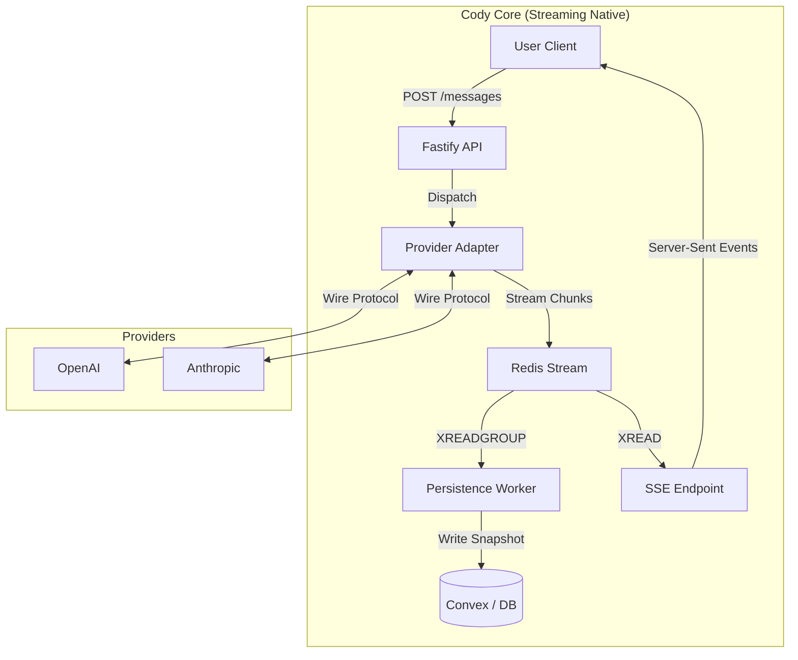
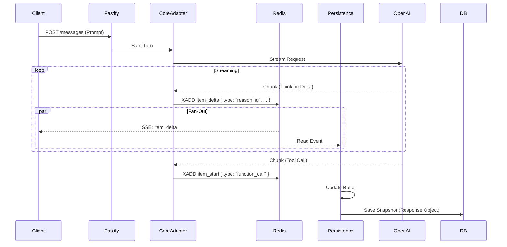

# Cody Core 2.0: Streaming-First Architecture

## 1. Executive Summary

**Objective:** Re-architect the core runtime ("Codex Core") of Cody to be **streaming-native**.

Currently, Cody operates on a legacy architecture ported directly from Rust (`codex-rs`), which relies on opaque state machines, manual event filtering, and a "Request/Response" mental model that fights against the reality of modern LLMs. This has led to observability gaps (missing "thinking" blocks), brittle configuration, and difficulty supporting concurrent agentic workflows.

**The Solution:** A complete redesign centered on **Redis Streams** and the **OpenAI Responses API Schema**. We will treat the entire system as a pipeline of events, where "Thinking", "Tool Calls", and "Messages" are all just typed blocks in a unified stream. This aligns our internal data model with the industry-standard wire formats, drastically reducing transformation complexity.

---

## 2. Context & History

### 2.1. The Journey
1.  **Rust Origins:** Started as `codex-rs`, a CLI tool with a custom event protocol tailored for terminal output and multi-provider abstraction.
2.  **The Port:** Ported to TypeScript (`codex-ts`) faithfully, preserving the Rust-centric patterns (Channel-like EventEmitters, strict class hierarchies).
3.  **Fastify Integration:** Wrapped `codex-ts` in a Fastify server to serve a Web UI. This exposed the cracks: the "Core" was a black box that swallowed events, making features like "Thinking Cards" painful to implement.
4.  **The Realization:** We discovered that trying to patch visibility into the legacy core was a losing battle. The architecture itself—buffering full steps before emitting—was the bottleneck.

### 2.2. The Pivot
Instead of bolting streaming onto a request/response core, we are rebuilding the core to be **streaming-first**.
*   **Old Way:** `Session` orchestrates a turn, waits for completion, then emits a summary event.
*   **New Way:** `Core` acts as a thin pipe. It pushes raw chunks to Redis. Processors (Persistence, UI) read from Redis.

---

## 3. Architecture: The Unified Stream

### 3.1. Design Philosophy: "Responses API" as Canonical
We evaluated multiple schemas (Anthropic Messages, OpenAI Chat, Custom) and converged on the **OpenAI Responses API Schema** as our internal "Source of Truth".

**Why?**
*   **Native Fit:** It models an agent turn as a `Response` container holding a list of `OutputItems` (Message, Tool Call, Tool Output). This perfectly matches the agentic loop.
*   **Block-Based:** It supports multi-modal, interleaved content naturally.
*   **Industry Standard:** It aligns with where major providers are converging (Anthropic's Messages API is structurally identical).

**The "Thinking" Extension:**
We extend the schema slightly to treat **Reasoning** as a first-class `OutputItem` (`type: "reasoning"`), similar to Anthropic's "Thinking Blocks", rather than burying it in metadata.

### 3.2. System Topology



1.  **Provider Adapter:** Connects to LLM. Translates vendor-specific chunks (e.g., Anthropic `content_block_delta`) into our **Canonical Event Format** immediately.
2.  **Redis Stream:** The single source of truth. Keyed by `run:<uuid>:events`.
3.  **Persistence Worker:** Reads the stream, aggregates chunks into a **Response Object**, and saves the snapshot to the DB.
4.  **SSE Endpoint:** Reads the stream and pipes events to the client.

### 3.3. High-Level Sequence Flow



---

## 4. Data Models: The "Unified Shape"

We use one consistent shape across the entire pipeline to minimize transformation friction.

### 4.1. The Canonical "Response" Object (Persistence/Hydration)
This is what we store in the DB and send to the client for history load.

```typescript
interface Response {
  id: string;
  agent_id: string;
  created_at: number;
  items: OutputItem[];
}

type OutputItem = 
  | { id: "1", type: "reasoning", content: "I need to search..." }
  | { id: "2", type: "function_call", name: "ls", arguments: "..." }
  | { id: "3", type: "function_call_output", output: "file1.txt" }
  | { id: "4", type: "message", content: "I found the file." };
```

### 4.2. The Stream Event (Wire Format)
This is what flows through Redis and SSE. It describes *mutations* to the Response Object.

```typescript
type StreamEvent = 
  | { type: "response_start", response_id: "..." }
  | { type: "item_start", item_id: "1", item_type: "reasoning" }
  | { type: "item_delta", item_id: "1", delta: "I need..." }
  | { type: "item_done", item_id: "1" }
  | { type: "response_done", response_id: "..." }
```

### 4.3. Client-Side Hydration
The client uses a shared **Reducer** library.
*   **Live Stream:** `reducer.applyEvent(currentResponse, event)` -> Updates state.
*   **History Load:** The API returns the fully reduced `Response` object. The client renders it directly.

This eliminates the "Two Renderers" problem. The "History" object is just the final state of the "Stream" process.

---

## 5. Work Plan & Phasing

### Phase 1: The Foundation (Redis & Adapters)
**Goal:** Get raw events flowing from OpenAI to a Redis Stream in the Canonical Format.
1.  **Define Schema:** Codify `OutputItem` and `StreamEvent` types in TypeScript.
2.  **Redis Infrastructure:** Set up the Redis Stream publisher/subscriber utilities.
3.  **OpenAI Adapter:** Write a standalone function that calls OpenAI (stream: true) and pushes normalized events to Redis.
4.  **Verification:** Write a test script that prints Redis events to console to prove flow.

### Phase 2: The "Projector" (Persistence)
**Goal:** Persist the stream to Convex without blocking the flow.
1.  **Persistence Worker:** Implement the background worker that reads from Redis.
2.  **Reducer Logic:** Implement the `applyEvent` logic to build a `Response` object from chunks.
3.  **DB Writer:** Save the final `Response` object to the `messages` table in Convex.
4.  **TDD:** Unit test the Reducer; Integration test the Worker (Redis -> DB).

### Phase 3: The Client (SSE & Hydration)
**Goal:** Connect the frontend to the new pipeline.
1.  **SSE Endpoint:** Create a Fastify route that bridges Redis -> Server-Sent Events.
2.  **Client Library:** Write the TypeScript client helper that handles `applyEvent` and manages the `Response` state.
3.  **UI Components:** Update the React components to render from the `Response` object (Block-based rendering).

### Phase 4: Feature Parity & Cleanup
1.  **Tool Execution:** Wire up the "Tool Execution" loop (listening for `item_done: function_call`, executing, and pushing `function_call_output`).
2.  **Anthropic Adapter:** Add the adapter for Claude (mapping Messages API -> Canonical Schema).
3.  **Legacy Cleanup:** Deprecate and remove the old `codex-ts/src/core` session machine.

---

## 6. Open Questions & Risks
*   **Backpressure:** We rely on Redis to handle the speed mismatch between LLM generation and DB writes. Monitor Redis memory usage.
*   **Tool Latency:** Ensure the "Tool Execution" worker picks up jobs instantly so the user doesn't perceive lag between "Tool Call" and "Result".
*   **Error Handling:** If the Adapter crashes mid-stream, we need a mechanism to mark the `Response` as "Failed" in the DB so it doesn't hang forever.
