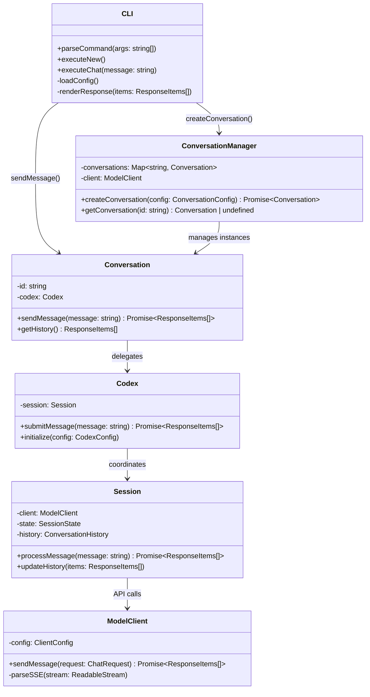
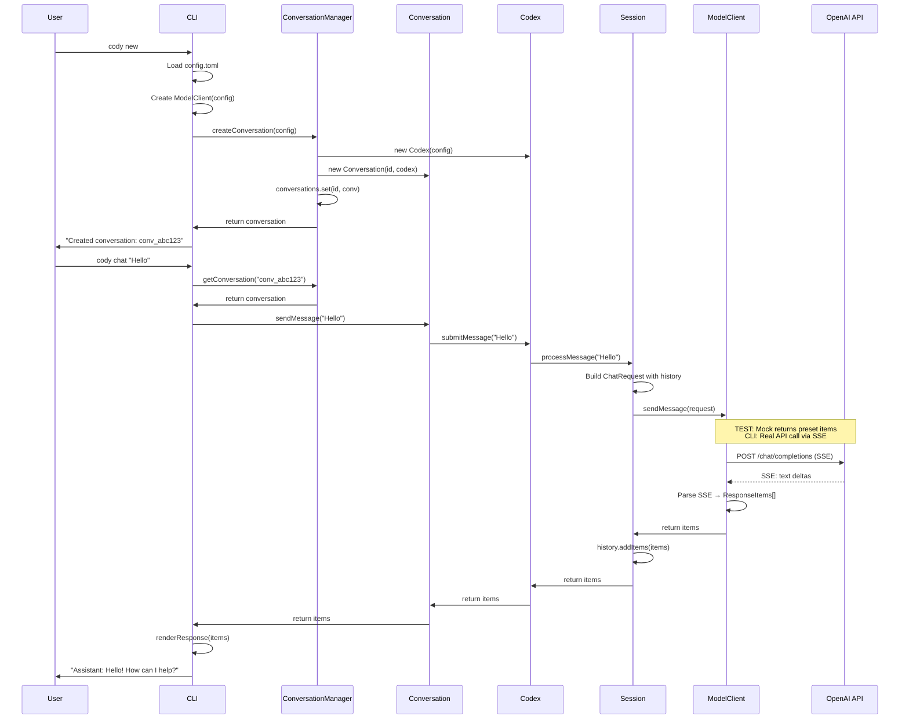
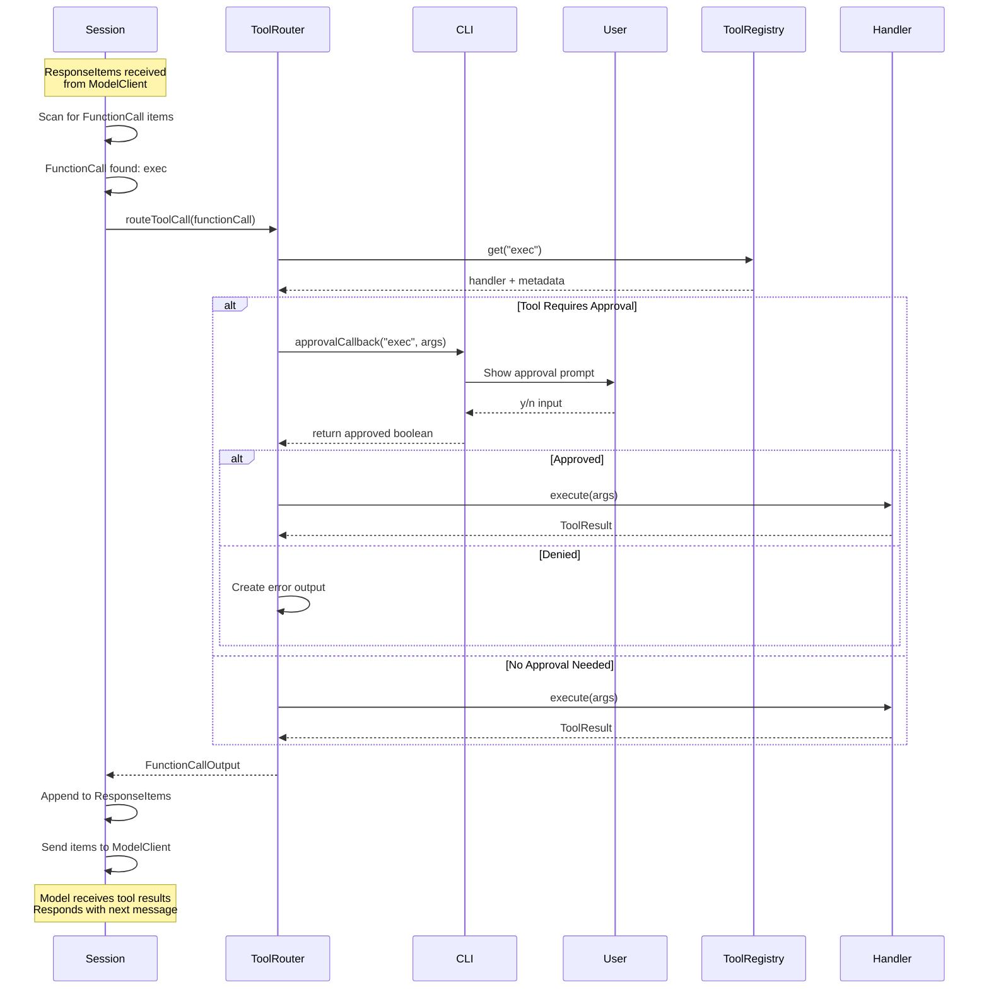
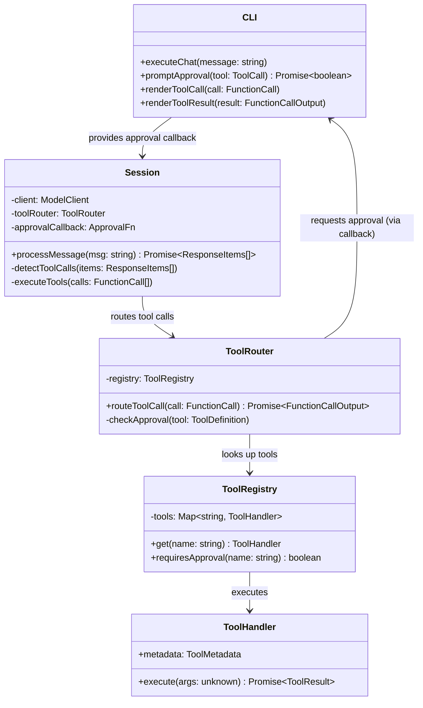
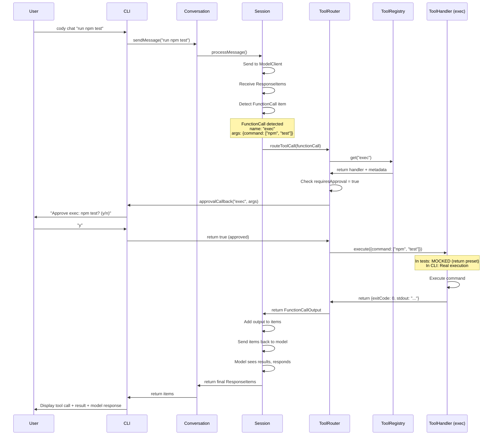
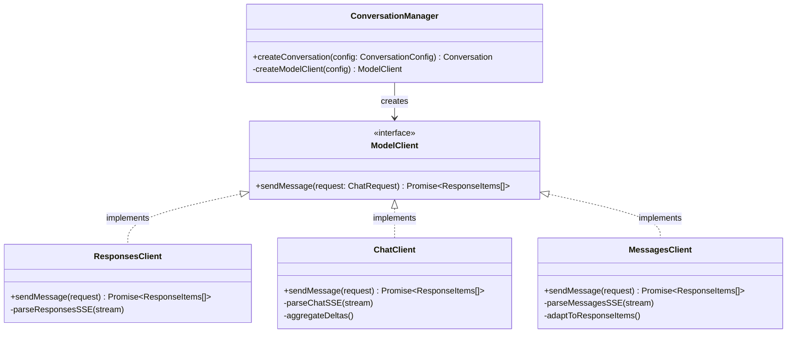
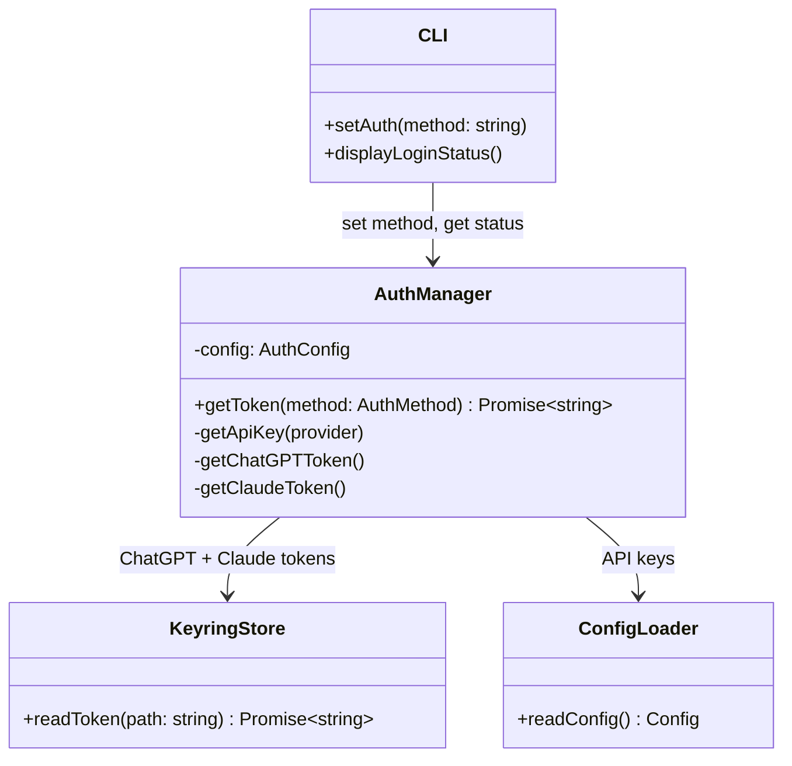
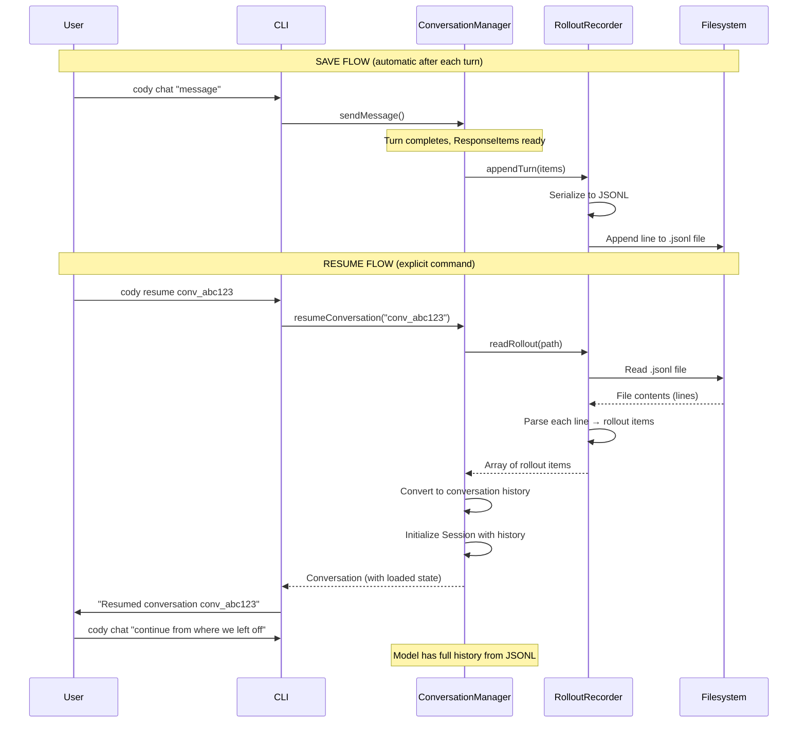
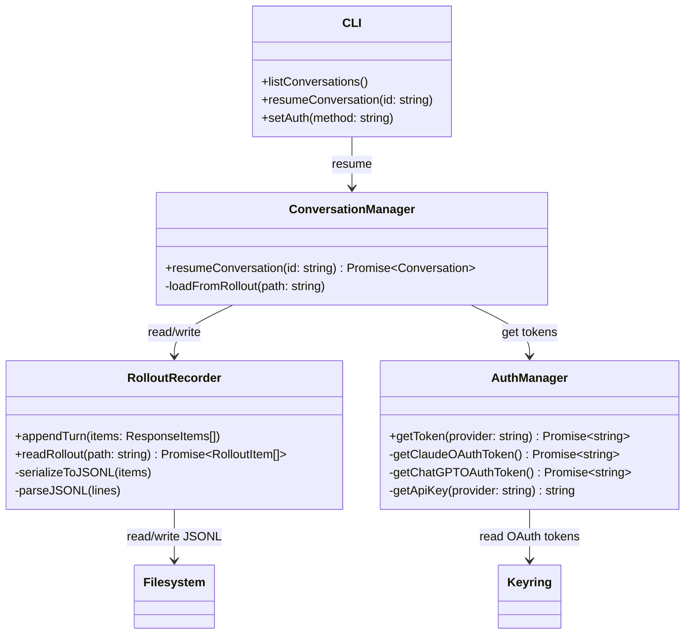

# Technical Approach: Project 02 UI Integration

**Project:** UI Integration & Library Definition
**Date:** November 8, 2025
**Status:** Planning

---

## 1. Architecture Overview

### System Summary

The Codex TypeScript system consists of three layers: a protocol/data layer defining types and serialization, a core orchestration layer managing conversations and tool execution, and a presentation layer (CLI) providing user interaction. All components from the Rust port (Phases 1-6) are integrated through the ConversationManager, which serves as the primary library entry point. The CLI is a thin wrapper around this core library, handling I/O and display while business logic remains in core modules.

**Key characteristics:**
- **Provider-agnostic:** Same code works with OpenAI (Responses, Chat) and Anthropic (Messages) APIs
- **Stateless operations:** Methods use async/await, return results directly (no EventEmitter, no subscriptions)
- **Tool execution:** Structured tool calling with approval flow (Rust-compatible harness)
- **Persistence:** JSONL rollout files for conversation storage and resume
- **Testing:** Mocked-service tests at library boundaries with external dependencies stubbed

### Component Structure

```
┌─────────────────────────────────────────────────────────┐
│                         CLI Layer                       │
│  ┌──────────┐  ┌──────────┐  ┌──────────┐               │
│  │ Commands │  │   REPL   │  │ Display  │               │
│  │  Parser  │  │   Loop   │  │ Renderer │               │
│  └────┬─────┘  └────┬─────┘  └────┬─────┘               │
│       │             │             │                     │
│       └─────────────┴─────────────┘                     │
│                     │                                   │
└─────────────────────┼───────────────────────────────────┘
                      ▼
┌─────────────────────────────────────────────────────────┐
│                    Library Layer                        │
│  ┌───────────────────────────────────────────────────┐  │
│  │         ConversationManager (Entry Point)         │  │
│  │  - createConversation()                           │  │
│  │  - getConversation()                              │  │
│  │  - resumeConversation()                           │  │
│  └──────────────────┬────────────────────────────────┘  │
│                     │                                   │
│       ┌─────────────┼─────────────┐                     │
│       ▼             ▼             ▼                     │
│  ┌─────────┐  ┌─────────┐  ┌──────────┐                 │
│  │ Session │  │ Codex   │  │  Config  │                 │
│  │  State  │  │  Core   │  │  Loader  │                 │
│  └────┬────┘  └────┬────┘  └──────────┘                 │
│       │            │                                    │
│       │      ┌─────┴──────┐                             │
│       │      ▼            ▼                             │
│       │  ┌─────────┐  ┌──────────┐                      │
│       │  │  Tool   │  │  Model   │                      │
│       │  │ Router  │  │  Client  │                      │
│       │  └────┬────┘  └────┬─────┘                      │
│       │       │            │                            │
└───────┼───────┼────────────┼────────────────────────────┘
        │       │            │
        ▼       ▼            ▼
┌─────────────────────────────────────────────────────────┐
│                  External Boundaries                    │
│  ┌──────────┐  ┌─────────┐  ┌──────────────────────┐    │
│  │   JSONL  │  │  Tools  │  │    LLM APIs          │    │
│  │   Files  │  │  (exec, │  │  (OpenAI, Anthropic) │    │
│  │          │  │  apply) │  │                      │    │
│  └──────────┘  └─────────┘  └──────────────────────┘    │
│       ▲             ▲                  ▲                │
│       │             │                  │                │
│    MOCKED        MOCKED             MOCKED              │
│   (in tests)    (in tests)         (in tests)           │
└─────────────────────────────────────────────────────────┘
```

**Integration flow:**
1. CLI parses command → calls ConversationManager method
2. ConversationManager orchestrates via Codex core
3. Codex coordinates Session, ModelClient, ToolRouter
4. External calls (API, filesystem, tools) cross boundaries
5. Results flow back through layers
6. CLI displays to user

**Testing boundary:** Library layer (ConversationManager and below). External boundaries mocked. CLI tested separately with mocked library.

### Current State & Deltas

**Post-Port Foundation**

The Rust → TypeScript port (Phases 1-6) delivered a complete but unintegrated library. Core functionality exists—conversation management, multi-provider LLM clients, tool execution, persistence, authentication—but these components have never been wired together for actual user interaction. Each module has unit tests validating isolated behavior, but no end-to-end workflows verify the system works as a whole.

**Port Completion Metrics**

75 modules ported across 6 phases, 1,876 tests passing with zero TypeScript errors and zero ESLint errors. Complete library layer functional, ready for integration. All ported code maintains strict type safety, follows Rust patterns, and preserves original behavior.

**Ported components include:**
- Protocol layer (8 modules): Types, message formats, configuration schemas, event definitions
- Core orchestration (3 modules): ConversationManager, Codex, Session state management
- Persistence (2 modules): Config loader (TOML), Rollout recorder (JSONL)
- Client layer (15+ modules): ModelClient with Responses, Chat, Messages API adapters, SSE parsing, provider abstraction
- Tool system (12+ modules): ToolRegistry, ToolRouter, 12 tool handlers, MCP integration, approval flow
- Auth (6 modules): AuthManager, API key storage, ChatGPT OAuth, keyring integration
- Utilities (20+ modules): Git operations, file operations, execution engine, sandboxing

**Core Codex Integration Points**

This project wires the core integration chain for the first time: CLI commands invoke ConversationManager methods, ConversationManager delegates to Codex orchestrator, Codex coordinates Session state and manages the conversation loop, Session routes to ModelClient for LLM communication and ToolRouter for tool execution, results flow back through the layers to CLI display. These integration points are defined in ported code but never exercised together. This project validates the integration works and exposes any gaps in the design.

**What's Being Added**

We're layering new capabilities onto the ported foundation while preserving the core library unchanged. The additions fall into four categories: a new CLI layer for user interaction, enhancements to ported capabilities, a new testing infrastructure, and API specifications for future extension.

**CLI Layer (Greenfield)**

The original Codex CLI uses Ratatui (Rust terminal UI library) which doesn't port to TypeScript without significant rework. Rather than attempt a Ratatui port immediately, we're building a simple baseline CLI with three interaction modes: interactive REPL for human users, one-shot command mode for agent and script usage, and JSON output mode for programmatic consumption. This multi-mode approach makes the CLI testable from day one (agents can drive it via commands, assert on JSON output) while keeping the implementation straightforward (plain console output, no complex terminal rendering).

The simple baseline serves multiple purposes: provides immediate user access for validation, establishes patterns for future UI enhancements, maintains modes suitable for automation and testing, and avoids locking us into a specific terminal UI framework. Later, we can layer Rich-TS features (Tables, Panels, Markdown rendering) incrementally on top of this foundation without changing the core modes. The testable, agent-accessible foundation remains stable while presentation evolves.

**CLI components being built:**
- Command parser using Commander.js (handles arguments, flags, help text)
- Interactive REPL loop (read-eval-print for conversational usage)
- One-shot command execution (single command, execute, exit)
- JSON output formatter (structured output for automation)
- Display renderer (console output with tool execution visibility)
- Approval prompts (CLI-based approval for dangerous tools)
- Dual-mode configuration (batch text display, no token-by-token streaming)

**Enhancements to Ported Code**

While most ported modules remain unchanged, we're adding targeted capabilities that extend Phase 4-5 work. The Messages API adapter (Phase 4.2) exists but hasn't been used in complete conversation workflows—this project tests it end-to-end. ChatGPT OAuth (Phase 5) works, but we're adding Claude OAuth by reading tokens from ~/.claude keyring (no flow implementation, just token retrieval). Provider switching exists in config but has no CLI interface—we're adding commands to switch providers at runtime.

**Specific additions:**
- Anthropic OAuth token retrieval from ~/.claude keyring
- CLI commands for provider switching (set-provider, list-providers)
- CLI commands for auth method switching (login, set-auth)
- Tool execution display (print tools as they execute, not just final results)

**Testing Infrastructure (New Strategy)**

Traditional unit tests worked for porting (Rust tests provided known-good reference), but integration testing requires a different approach. We're implementing mocked-service tests: integration-level tests written at library API boundaries with all external dependencies mocked (ModelClient API calls, JSONL filesystem writes, tool process execution). These tests exercise complete workflows through the library while remaining fast, deterministic, and runnable offline.

**Testing components:**
- tests/mocked-service/ directory (integration tests at library contracts)
- tests/mocks/ directory (reusable mock implementations for external services)
- Mock ModelClient (returns predefined responses, no network)
- Mock RolloutRecorder (in-memory JSONL, no filesystem)
- Mock AuthManager (stub token retrieval, no keyring/OAuth)
- Mock tool execution (stub exec/apply/read, no actual process/file operations)
- Contract test templates (patterns for testing library boundaries)

**API Specifications (Documentation)**

As we wire the system, we're documenting two API surfaces: the TypeScript library API for developers building on @openai/codex-core, and the REST API design for future HTTP wrapper implementation. Library API documents public exports, method signatures, usage examples, and contract boundaries. REST API documents endpoints, request/response formats, and authentication patterns (design only, implementation deferred).

**Documentation being created:**
- docs/api/library-api.md (TypeScript library public surface)
- docs/api/rest-api.md (HTTP wrapper endpoint design)
- Integration examples (create conversation, send message, execute tools, persist/resume)
- Contract boundary documentation (what to test, what to mock)

---

## 2. Phase 1: Basic Chat Flow

### Integration Approach

Phase 1 proves the core conversation flow works end-to-end. We wire CLI commands to ConversationManager, Manager to Codex, Codex to Session, Session to ModelClient (Responses API only). This is the first time these pieces talk to each other. Start with single provider (OpenAI Responses) and single auth method (API key) to minimize variables. Once basic flow works, subsequent phases add providers and auth methods.

The integration happens in layers. First, build CLI command parser that accepts `new` and `chat` commands. Commands call thin handler functions. Handlers import ConversationManager and call its methods. ConversationManager already knows how to delegate to Codex—that wiring exists from port. Codex already knows how to use ModelClient—that exists too. Our job is to wire the CLI → Manager connection and verify the Manager → Codex → Client chain actually works.

Testing uses mocked ModelClient. No real API calls during test. Mock returns predefined responses for any message. This lets us verify conversation flow (create → send → receive → history updated) without network dependencies, API keys, or rate limits. Fast, deterministic, repeatable.

### Phase 1 Target State

```
User Terminal
     ↓
┌─────────────────────────────────────┐
│  CLI Commands (NEW)                 │
│  ┌─────────┐  ┌─────────────┐       │
│  │  codex  │  │    codex    │       │
│  │   new   │  │  chat "msg" │       │
│  └────┬────┘  └─────┬───────┘       │
│       │             │               │
│       └─────────────┘               │
│              ▼                      │
│       Command Handler (NEW)         │
└─────────────┬───────────────────────┘
              ▼
┌─────────────────────────────────────┐
│  ConversationManager (EXISTS)       │
│  ┌─────────────────────────────┐    │
│  │  createConversation()       │    │
│  │  ┌──────────────────────┐   │    │
│  │  │  NEW: Initial wiring │   │    │
│  │  └──────────────────────┘   │    │
│  └──────────┬──────────────────┘    │
└─────────────┼───────────────────────┘
              ▼
┌─────────────────────────────────────┐
│  Codex / Session (EXISTS)           │
│  conversation loop                  │
└─────────────┬───────────────────────┘
              ▼
┌─────────────────────────────────────┐
│  ModelClient (EXISTS)               │
│  Responses API only (Phase 1)       │
│  ┌─────────────────────────────┐    │
│  │  ACTIVATED: First real use  │    │
│  └─────────────────────────────┘    │
└─────────────┬───────────────────────┘
              ▼
        OpenAI API
       (MOCKED in tests)
```

**Highlighted:** CLI commands (NEW), command handler (NEW), ConversationManager wiring (NEW), ModelClient activation (first real use).

### Technical Deltas

**New code (CLI layer):**
- src/cli/index.ts: Main CLI entry, Commander.js setup
- src/cli/commands/new.ts: Create conversation command
- src/cli/commands/chat.ts: Send message command
- src/cli/display.ts: Console rendering (batch mode)
- src/cli/config.ts: Load ~/.codex/config.toml

**New code (testing):**
- tests/mocked-service/phase-1-conversation-flow.test.ts: End-to-end conversation tests (vitest, separate from unit tests)
- tests/mocks/model-client.ts: Mock ModelClient with preset responses

**Wiring points:**
- CLI command handlers → ConversationManager.createConversation()
- CLI chat command → Conversation.sendMessage()
- Display renderer prints response after await (simple async/await, no events)

**Configuration:**
- Read provider + model from config.toml
- Read OpenAI API key from config
- Single provider: openai, single API: responses

**Estimated new code:** ~400 lines (CLI layer ~300, mocked-service tests ~100)

### Component Structure



### Connection Points Detail

**CLI → ConversationManager:**

CLI imports ConversationManager singleton or creates instance with ModelClient dependency. `new` command calls `manager.createConversation(config)` where config includes provider (openai), model (gpt-4), and auth (API key from config file). Manager returns Conversation instance. CLI stores conversation reference (in-memory map or singleton Manager handles storage). `chat` command retrieves active conversation via `manager.getConversation(id)`, calls `conversation.sendMessage(message)`.

**ConversationManager → Conversation:**

Manager's createConversation() method instantiates Codex with provided config, then creates Conversation instance passing the Codex instance. Conversation doesn't know about ModelClient directly—it only knows about Codex. Manager maintains Map of conversation ID → Conversation instance. getConversation() retrieves from this Map. Manager is the factory and registry for conversations.

**Conversation → Codex:**

Conversation is thin wrapper around Codex. sendMessage() delegates directly to Codex.submitMessage(). No transformation, no additional logic. Conversation's job is to provide clean API for callers while delegating orchestration to Codex. Future phases may add conversation-specific state here (display preferences, tool approvals), but Phase 1 is pure delegation.

**Codex → Session:**

Codex manages Session lifecycle. Initializes Session during spawn/create. Session is where conversation state lives (history, pending approvals, active turn). Codex's submitMessage() calls Session.processMessage(). Session is the orchestrator—coordinates ModelClient, ToolRouter (Phase 2), conversation history, rollout recording (Phase 5). Phase 1 exercises Session → ModelClient path only.

**Session → ModelClient:**

Session builds ChatRequest from conversation history. Calls ModelClient.sendMessage(request). Awaits ResponseItems[] (ModelClient handles SSE parsing internally, returns complete items). Session updates conversation history with response items. Returns items to Codex, which returns to Conversation, which returns to CLI. This is the core conversation loop.

**Dependency injection points:**
- CLI must construct ModelClient with correct config
- ConversationManager receives ModelClient in constructor
- Manager passes to Codex during conversation creation
- All downstream components get client reference through this chain

**For testing:** Inject mock ModelClient at ConversationManager construction. All downstream code uses the mock. No real API calls made.

### End-to-End Sequence



### Verification Approach

**Functional verification (manual CLI testing):**

1. Run `cody new` with valid OpenAI API key configured → conversation ID displayed, no errors
2. Run `cody chat "Hello"` → response from model displayed to console
3. Run `cody chat "What did I just say?"` → model responds with context from previous turn
4. Verify: Multi-turn conversation maintains history, responses coherent

**Mocked-service testing (automated):**

Tests located in `tests/mocked-service/phase-1-conversation-flow.test.ts` using vitest framework. These tests are separate from unit tests (different directory, focused on integration). See `docs/core/contract-testing-tdd-philosophy.md` for testing philosophy and approach.

```typescript
describe('Phase 1: Basic Conversation Flow', () => {
  let mockClient: MockModelClient;
  let manager: ConversationManager;

  beforeEach(() => {
    mockClient = createMockClient([
      {items: [{type: 'message', role: 'assistant', content: [{type: 'text', text: 'Hello!'}]}]}
    ]);
    manager = new ConversationManager({client: mockClient});
  });

  it('creates conversation and sends message', async () => {
    const config = {provider: 'openai', model: 'gpt-4', auth: {type: 'api-key', key: 'test'}};
    const conv = await manager.createConversation(config);

    expect(conv.id).toBeDefined();

    const response = await conv.sendMessage("Hello");

    expect(mockClient.sendMessage).toHaveBeenCalled();
    expect(response.length).toBeGreaterThan(0);
    expect(response[0].type).toBe('message');
  });

  it('maintains conversation history across turns', async () => {
    const conv = await manager.createConversation(config);

    await conv.sendMessage("First message");
    await conv.sendMessage("Second message");

    expect(mockClient.sendMessage).toHaveBeenCalledTimes(2);
    // Verify second call included first message in history
    const secondCall = mockClient.sendMessage.mock.calls[1][0];
    expect(secondCall.messages.length).toBeGreaterThan(1);
  });
});
```

**Quality gates:**
- Mocked-service tests: All passing (phase-1-conversation-flow.test.ts)
- Unit tests: Baseline maintained (1,876 still passing)
- TypeScript: `npx tsc --noEmit` → 0 errors
- ESLint: `npm run lint` → 0 errors
- Format: `npm run format` → no changes
- Combined verification: All checks pass in sequence

**Code review (2-stage with GPT-5-Codex):**
- Review Stage 1 (Traditional): Standards compliance, code quality, security, error handling, maintainability
- Review Stage 2 (Port Validation): Integration points match Rust patterns, conversation flow mirrors Rust behavior, no functionality missed

---

## 3. Phase 2: Tool Integration

### Integration Approach

Phase 2 adds tool execution to the conversation flow. Models can now request tools (exec, readFile, applyPatch, etc.), CLI prompts user for approval, tools execute, results return to model. This activates the ToolRouter and approval system from the port for the first time. The conversation loop from Phase 1 remains unchanged—we're adding a branch point where Session detects tool calls and routes to ToolRouter instead of just returning to CLI.

### Phase 2 Target State

```
User Terminal
     ↓
┌─────────────────────────────────────────┐
│  CLI (Phase 1 + NEW)                    │
│  ┌─────────┐  ┌──────────────────┐      │
│  │  chat   │  │  Approval Prompt │      │
│  │command  │  │     (NEW)        │      │
│  └────┬────┘  └──────┬───────────┘      │
│       │              │                  │
│       │         ┌────┴────┐             │
│       │         │ Display │             │
│       │         │  Tool   │ (NEW)       │
│       │         │  Calls  │             │
│       │         └─────────┘             │
└───────┼─────────────────────────────────┘
        ▼
ConversationManager (EXISTS from Phase 1)
        ▼
   Conversation (EXISTS from Phase 1)
        ▼
┌─────────────────────────────────────────┐
│  Codex / Session (EXISTS)               │
│  ┌───────────────────────────────────┐  │
│  │  Tool Detection (ACTIVATED)       │  │
│  │  ┌─────────────────┐              │  │
│  │  │  NEW: Route to  │              │  │
│  │  │   ToolRouter    │              │  │
│  │  └─────────────────┘              │  │
│  └───────────────────────────────────┘  │
└──────────────┬──────────────────────────┘
               ▼
┌─────────────────────────────────────────┐
│  ToolRouter (ACTIVATED)                 │
│  ┌───────────────────────────────────┐  │
│  │  First real use                   │  │
│  │  - Route to handlers              │  │
│  │  - Approval integration (NEW)     │  │
│  │  - Result collection              │  │
│  └───────────────────────────────────┘  │
└──────────────┬──────────────────────────┘
               ▼
        Tool Handlers
     (exec, readFile, etc.)
       (MOCKED in tests)
```

**Highlighted:** Approval prompts (NEW), tool call display (NEW), tool detection in Session (ACTIVATED), ToolRouter (ACTIVATED), approval integration (NEW).

The diagram shows the new approval and display components in the CLI layer. When Session receives ResponseItems from ModelClient, it now checks for FunctionCall items. If detected, Session routes to ToolRouter (which was ported in Phase 3 but never activated). ToolRouter checks if the tool requires approval, calls back to CLI if needed, executes the tool handler, and returns FunctionCallOutput. The CLI displays tool execution progress and results as they flow through, giving user visibility and control. All components below CLI layer already exist from the port—we're adding the CLI interface and wiring the approval callback.

### Tool Call Cycle (Critical Path)

**The core tool execution flow:**

When a model response contains tool calls, the system must detect them, route to appropriate handlers, get user approval for dangerous operations, execute tools, collect results, and return outputs to the model for the next turn. This cycle extends the basic conversation loop from Phase 1 with a conditional branch: if ResponseItems contain FunctionCall items, process those before returning to user.

Session receives ResponseItems array from ModelClient. Scans for FunctionCall items (item.type === 'function_call'). For each FunctionCall, extracts tool name and arguments, passes to ToolRouter.routeToolCall(). ToolRouter looks up tool in ToolRegistry, checks metadata.requiresApproval. If approval needed, calls CLI's approval callback with tool details. Callback shows user prompt, awaits y/n response, returns boolean. If approved (or no approval needed), ToolRouter calls handler.execute(args). Handler returns ToolResult. Router wraps in FunctionCallOutput item. Session collects all outputs, appends to ResponseItems array. Sends items back to ModelClient (model sees tool results). Model responds (either with more tool calls or final answer). Cycle repeats until model returns final message.

**Tool call cycle steps:**
1. ModelClient returns items → Session scans for FunctionCall
2. FunctionCall detected → extract name/args → route to ToolRouter
3. ToolRouter checks approval → calls CLI callback if needed
4. User approves → tool executes → result captured
5. Result wrapped as FunctionCallOutput → added to items
6. Items sent back to model → model sees results → responds
7. If more tools requested → repeat from step 1
8. If final message → return to CLI for display

**Tool Call Cycle Sequence:**



This focused sequence shows just the tool execution path. Session detects tool call, routes through ToolRouter with conditional approval, executes, collects result, returns to model. The full end-to-end sequence later in this section shows how this cycle fits into the complete conversation flow.

### Technical Deltas

**New code (CLI layer):**
- src/cli/approval.ts: Prompt user for tool approval (readline interface)
- src/cli/display.ts: Add renderToolCall(), renderToolResult() methods
- src/cli/commands/chat.ts: Handle tool approval callbacks

**New code (integration):**
- src/core/codex/session.ts: Wire approval prompts to CLI callback
- Minimal changes - approval system exists, just needs callback injection

**New code (testing):**
- tests/mocked-service/phase-2-tool-execution.test.ts: Tool call workflows
- tests/mocks/tool-handlers.ts: Mock exec, readFile, applyPatch (no real execution)

**Wiring points:**
- Session detects FunctionCall items → routes to ToolRouter (exists from port)
- ToolRouter checks requiresApproval → calls approval callback (NEW: CLI provides this)
- Approval callback shows CLI prompt → user approves/denies → result returned
- ToolRouter executes approved tools → returns FunctionCallOutput items
- CLI displays tool calls + results as Session processes them

**Configuration:**
- No new config needed (tool system already configured in Phase 3 port)
- Approval callback injected at Session initialization

**Estimated new code:** ~300 lines (CLI approval/display ~200, mocked-service tests ~100)

### Component Structure

The tool execution system involves five key classes: CLI provides the approval callback and displays tool activity, Session detects tool calls and coordinates routing, ToolRouter manages the execution pipeline with approval checks, ToolRegistry maintains the map of available tools, and ToolHandler implementations execute the actual operations. Session holds references to both ToolRouter and the approval callback, creating the integration point where CLI control meets tool execution.



### Connection Points Detail

**CLI → Session (Approval Callback):**

CLI provides approval callback function to Session during initialization. Function signature: `(toolName: string, args: unknown) => Promise<boolean>`. When tool requires approval, ToolRouter calls this callback with tool details. CLI displays prompt to user (readline), waits for y/n input, resolves Promise with boolean. Session/ToolRouter await approval result before executing tool.

**Session → ToolRouter (Tool Detection and Routing):**

After ModelClient returns ResponseItems, Session scans for FunctionCall items. If found, extracts tool name and arguments, passes to ToolRouter.routeToolCall(). ToolRouter handles approval check, execution, error handling. Returns FunctionCallOutput item. Session adds output to response items, returns complete array to Codex/Conversation/CLI.

**ToolRouter → ToolRegistry (Tool Lookup):**

ToolRouter receives tool name from FunctionCall. Looks up in ToolRegistry via `registry.get(toolName)`. Registry returns ToolHandler with execute method and metadata (including requiresApproval boolean). Router checks metadata, routes to approval callback if needed, executes handler if approved.

**ToolRouter → CLI (Approval Request via Callback):**

When tool requires approval, ToolRouter calls approval callback with tool name and arguments. Callback is async—returns Promise. ToolRouter awaits approval. If true, proceeds with execution. If false, returns error FunctionCallOutput (denied by user). This is the critical integration point for user control.

**ToolRegistry → ToolHandler (Execution):**

Registry holds Map of tool name → ToolHandler. Each handler implements execute(args). Phase 3 port provided 12 handlers (exec, readFile, etc.). For Phase 2, we mock these—createMockToolHandler returns stub that doesn't actually execute commands/file ops. Real handlers used in manual CLI testing, mocked handlers used in automated tests.

**Key integration: Approval callback injection.**

CLI must provide callback when creating ConversationManager/Session. This callback is how CLI maintains control over dangerous operations. Without it, tools execute automatically (not acceptable for operations like exec). The callback creates the human-in-the-loop that makes Codex safe.

### Complete End-to-End Sequence



### Verification Approach

**Functional verification (manual CLI testing):**

1. Run `cody chat "read the README file"` → model requests readFile tool, CLI shows approval prompt
2. Approve → tool executes, file content displayed, model responds with summary
3. Run `cody chat "run npm test"` → model requests exec tool, approval prompt appears
4. Deny → execution blocked, model receives denial message
5. Verify: Approval flow works for both approval and denial cases

**Mocked-service testing (automated):**

Tests in `tests/mocked-service/phase-2-tool-execution.test.ts` using vitest framework, separate from unit tests. Uses mocked-service approach from `docs/core/contract-testing-tdd-philosophy.md`.

```typescript
describe('Phase 2: Tool Execution', () => {
  let mockClient: MockModelClient;
  let mockToolHandler: MockToolHandler;
  let manager: ConversationManager;
  let approvalResults: boolean[];

  beforeEach(() => {
    approvalResults = [true]; // Default: approve
    mockClient = createMockClientWithToolCall('exec', {command: ['test']});
    mockToolHandler = createMockToolHandler({exitCode: 0, stdout: 'passed'});

    const approvalCallback = async () => approvalResults.shift() ?? false;

    manager = new ConversationManager({
      client: mockClient,
      toolHandlers: {exec: mockToolHandler},
      approvalCallback
    });
  });

  it('executes approved tool and returns result', async () => {
    const conv = await manager.createConversation(config);
    const response = await conv.sendMessage("run tests");

    expect(mockToolHandler.execute).toHaveBeenCalled();
    expect(response.some(item => item.type === 'function_call_output')).toBe(true);
  });

  it('blocks denied tool execution', async () => {
    approvalResults = [false]; // Deny
    const conv = await manager.createConversation(config);
    const response = await conv.sendMessage("run tests");

    expect(mockToolHandler.execute).not.toHaveBeenCalled();
    const output = response.find(item => item.type === 'function_call_output');
    expect(output.error).toContain('denied');
  });

  it('displays tool calls to user', async () => {
    // Test that CLI.renderToolCall was called
    // Verify tool name and args displayed correctly
  });
});
```

**Quality gates:**
- Mocked-service tests: phase-2-tool-execution.test.ts all passing
- Unit tests: Baseline maintained (1,876+ still passing)
- TypeScript: 0 errors
- ESLint: 0 errors
- Format: no changes
- Combined: `npm run format && npm run lint && npx tsc --noEmit && npm test` succeeds

**Code review (2-stage):**
- Stage 1: Approval flow security, error handling, user experience
- Stage 2: Tool routing matches Rust patterns, approval integration correct

---

## 4. Phase 3: Multi-Provider Support

### Integration Approach

Phase 3 adds Chat Completions and Messages API support alongside the Responses API from Phase 1. The provider abstraction from the port (WireApi enum, adapter pattern) means most heavy lifting is done—we're adding CLI commands for provider switching and verifying the three APIs work identically for end users. Same conversation code, different underlying API, transparent to CLI layer.

Provider switching happens via config or CLI command. User sets provider (openai or anthropic) and API type (responses, chat, or messages). ConversationManager constructs appropriate ModelClient based on config. From there, conversation flow is identical—sendMessage() works the same regardless of provider. The adapters (Phase 4.1-4.2) normalize provider-specific formats to common ResponseItems, making CLI code provider-agnostic.

Testing verifies parity: same conversation on all three providers produces equivalent results. Mock each provider's API responses, run identical conversation sequence, assert ResponseItems match expected structure. If provider-specific differences exist (thinking blocks in Messages, reasoning in Responses), document but don't block—test that they're handled gracefully.

### Phase 3 Target State

```
User runs: cody set-provider anthropic
           cody set-api messages

┌─────────────────────────────────┐
│  CLI (Phase 1-2 + NEW)          │
│  ┌──────────────────┐           │
│  │  set-provider   │ (NEW)      │
│  │  list-providers │ (NEW)      │
│  └────────┬─────────┘           │
│            ▼                     │
│    Provider Config Update        │
└────────────┬────────────────────┘
             ▼
┌──────────────────────────────────┐
│  ConversationManager             │
│  ┌────────────────────────────┐  │
│  │ ModelClient Factory (NEW) │  │
│  │  ┌─────────────────────┐  │  │
│  │  │ Switch on provider │  │  │
│  │  │ + API type         │  │  │
│  │  └─────────────────────┘  │  │
│  └────────────────────────────┘  │
└──────────┬───────────────────────┘
           ▼
    ┌──────┴──────┐
    ▼             ▼             ▼
┌────────┐  ┌──────────┐  ┌──────────┐
│Responses│  │   Chat   │  │ Messages │
│ Client │  │  Client  │  │  Client  │
│(Phase1)│  │  (NEW)   │  │  (NEW)   │
└────┬───┘  └────┬─────┘  └────┬─────┘
     │           │             │
     └───────────┴─────────────┘
                 ▼
          Common ResponseItems
                 ▼
            CLI Display
```

**Highlighted:** Provider switching commands (NEW), ModelClient factory (NEW), Chat and Messages clients (ACTIVATED from port), common ResponseItems abstraction (enables provider-agnostic CLI).

Each provider's client was ported in Phases 4.1-4.2 but never used in complete workflows. Phase 3 activates them, tests parity, and exposes any provider-specific quirks. The CLI doesn't know which provider is active—it just calls Conversation.sendMessage() and renders ResponseItems. Provider abstraction working as designed.

### Technical Deltas

**New code (CLI layer):**
- src/cli/commands/set-provider.ts: Switch provider (openai/anthropic)
- src/cli/commands/set-api.ts: Switch API type (responses/chat/messages)
- src/cli/commands/list-providers.ts: Show available providers and current selection

**New code (integration):**
- src/core/conversation-manager.ts: ModelClient factory based on provider config
- Constructs Responses/Chat/Messages client based on config.provider + config.api

**New code (testing):**
- tests/mocked-service/phase-3-provider-parity.test.ts: Same conversation on all providers
- tests/mocks/chat-client.ts: Mock Chat API responses
- tests/mocks/messages-client.ts: Mock Messages API responses

**Wiring points:**
- CLI set-provider command → updates config → recreates ModelClient
- ConversationManager factory → switches on provider/API → returns appropriate client
- All three clients → return ResponseItems (common format)

**Estimated new code:** ~250 lines (CLI commands ~100, client factory ~50, mocked-service tests ~100)

### Component Structure

Provider abstraction uses factory pattern. ConversationManager checks config.provider and config.api, constructs appropriate ModelClient implementation. All clients implement same interface (sendMessage returns ResponseItems). CLI doesn't know which client is active—just calls interface methods.



### Connection Points Detail

**ConversationManager → ModelClient Factory:**

During createConversation(), Manager calls internal createModelClient(config) method. Method switches on config.provider ('openai' | 'anthropic') and config.api ('responses' | 'chat' | 'messages'). Constructs appropriate client: ResponsesClient for openai+responses, ChatClient for openai+chat, MessagesClient for anthropic+messages. Returns ModelClient interface. All downstream code uses interface, doesn't know concrete implementation.

**CLI → Provider Configuration:**

set-provider command updates config.provider, writes to ~/.codex/config.toml. Next conversation creation uses new provider. Existing conversations continue with their original provider (config stored per conversation). list-providers shows available options and current default. Simple config management, no complex migration.

**Provider Adapters → ResponseItems:**

Each client adapter (ResponsesClient, ChatClient, MessagesClient) parses its provider's SSE format and normalizes to ResponseItems array. Responses API returns semantic events (already ResponseItems format). Chat API returns deltas (ChatClient aggregates into complete messages, converts to ResponseItems). Messages API returns content blocks (MessagesClient maps to ResponseItems, handles thinking blocks). All three produce compatible output. CLI receives same structure regardless of provider.

### Verification Approach

**Functional verification (manual CLI testing):**

1. Responses API: `cody chat "Hello"` → verify response
2. Switch to Chat: `cody set-api chat` → `cody new` → `cody chat "Hello"` → verify response
3. Switch to Messages: `cody set-provider anthropic` → `cody set-api messages` → `cody new` → `cody chat "Hello"` → verify response
4. Compare: All three work, conversations coherent, no errors

**Mocked-service testing (automated, no real API calls):**

Tests in `tests/mocked-service/phase-3-provider-parity.test.ts` using vitest, separate from unit tests. Uses mocked-service approach from `docs/core/contract-testing-tdd-philosophy.md`. Verifies wiring correctness with mocked clients.

**Model integration testing (manual, real API calls):**

Additional testing layer with actual LLM providers using cheap models. Tests provider behavior, config parameters (thinking, temperature), and real compatibility. Located in `scripts/integration-tests/` as standalone Node scripts (pre-library formalization).

Tests to run:
- OpenAI Responses API (gpt-4o-mini, no thinking)
- OpenAI Chat Completions (gpt-4o-mini)
- Anthropic Messages API (haiku-4.5, no thinking)
- OpenRouter Chat (gemini-2.0-flash-001)
- Thinking controls (Responses + Messages with thinking enabled)
- Temperature variation (verify different outputs with temperature changes)

Requires real API keys, costs nominal amount. Run via `npm run test:integration` or manually execute scripts. Validates providers actually work with real models, not just mocked responses. Results inform any provider-specific handling needed.

```typescript
describe('Phase 3: Provider Parity', () => {
  const testConversation = async (provider: string, api: string, mockClient: MockModelClient) => {
    const manager = new ConversationManager({client: mockClient});
    const conv = await manager.createConversation({provider, api, model: 'test', auth: testAuth});

    const response = await conv.sendMessage("Hello");

    expect(response.length).toBeGreaterThan(0);
    expect(response[0].type).toBe('message');
    return response;
  };

  it('Responses API works', async () => {
    const mock = createMockResponsesClient();
    await testConversation('openai', 'responses', mock);
  });

  it('Chat API works', async () => {
    const mock = createMockChatClient();
    await testConversation('openai', 'chat', mock);
  });

  it('Messages API works', async () => {
    const mock = createMockMessagesClient();
    await testConversation('anthropic', 'messages', mock);
  });

  it('all providers return compatible ResponseItems', async () => {
    // Verify structure matches across providers
  });
});
```

**Model integration scripts:**

Located in `scripts/integration-tests/phase-3/` as standalone Node.js scripts. Each script tests one provider with real API, validates behavior, logs results.

```
scripts/integration-tests/phase-3/
├── test-responses-api.ts        (OpenAI Responses, gpt-4o-mini)
├── test-chat-api.ts             (OpenAI Chat, gpt-4o-mini)
├── test-messages-api.ts         (Anthropic Messages, haiku-4.5)
├── test-openrouter.ts           (OpenRouter, gemini-2.0-flash-001)
├── test-thinking-controls.ts    (Responses + Messages with thinking)
├── test-temperature.ts          (Temperature 0.2, 0.7, 1.0 variation)
└── run-all.ts                   (Execute suite, collect results)
```

Run via `npm run test:integration` or `node scripts/integration-tests/phase-3/run-all.ts`. Requires API keys in .env. Tests make real API calls (costs pennies with cheap models). Validates provider parity, config parameter handling, and actual compatibility. Results inform any provider-specific edge case handling needed.

**Quality gates:**
- Mocked-service tests: phase-3-provider-parity.test.ts all passing
- Model integration scripts: All providers tested, results logged (not automated pass/fail, manual review)
- TypeScript: 0 errors
- ESLint: 0 errors
- Combined: Automated checks pass, model integration validated manually

**Code review:**
- Stage 1: Provider switching logic, config handling, error cases
- Stage 2: Provider abstraction preserved, adapter patterns correct, model integration results reviewed

---

## 5. Phase 4: Authentication Expansion

### Integration Approach

Phase 4 adds Claude OAuth token retrieval alongside the existing ChatGPT OAuth from Phase 5 port. We're not implementing OAuth flows—just reading tokens from ~/.claude keyring where Claude Code stores them after user authenticates. This extends the AuthManager to support four auth methods total: OpenAI API key, Anthropic API key, ChatGPT OAuth, Claude OAuth. CLI adds commands for auth method selection and login status display.

The integration is primarily configuration and token retrieval. AuthManager already has keyring integration from Phase 5 (for ChatGPT). We're adding a second keyring path for Claude tokens, reading from ~/.claude config/keyring (exact path discovered during implementation). Token refresh still manual (user re-authenticates in Claude Code when expired). No complex OAuth flow logic—just file/keyring reads.

Testing mocks keyring/filesystem reads. No real token files needed. Mock returns valid tokens for each auth method, verify AuthManager retrieves correctly, constructs proper auth headers for each provider. Test all auth × provider combinations (4 auth methods × 3 providers = 12 combinations, though not all are valid—ChatGPT OAuth only works with OpenAI).

### Phase 4 Target State

```
User runs: cody login        (shows current auth)
           cody set-auth oauth-claude

┌──────────────────────────────────┐
│  CLI (Phase 1-3 + NEW)           │
│  ┌────────┐  ┌──────────────┐   │
│  │ login │  │  set-auth    │   │
│  │ (NEW) │  │    (NEW)     │   │
│  └───┬────┘  └──────┬───────┘   │
│      │              │            │
│      └──────────────┘            │
│             ▼                    │
│     Auth Config Update           │
└─────────────┬────────────────────┘
              ▼
┌──────────────────────────────────┐
│  AuthManager (Phase 5 + NEW)     │
│  ┌────────────────────────────┐  │
│  │  Token Retrieval (expanded)│  │
│  │  - API keys (EXISTS)       │  │
│  │  - ChatGPT OAuth (EXISTS)  │  │
│  │  - Claude OAuth (NEW)      │  │
│  └────────────────────────────┘  │
└──────────────┬───────────────────┘
               ▼
        ┌──────┴──────┐
        ▼             ▼
   ┌─────────┐  ┌──────────┐
   │ Keyring │  │  Config  │
   │  ~/.    │  │  .toml   │
   │ claude  │  │   file   │
   │ (NEW)   │  │(EXISTS)  │
   └─────────┘  └──────────┘
```

**Highlighted:** login and set-auth commands (NEW), Claude OAuth retrieval (NEW), dual keyring sources (ChatGPT from Phase 5, Claude added).

### Technical Deltas

**New code (CLI layer):**
- src/cli/commands/login.ts: Display current auth status and available methods
- src/cli/commands/set-auth.ts: Switch auth method (api-key, oauth-chatgpt, oauth-claude)

**New code (auth layer):**
- src/core/auth/claude-oauth.ts: Read Claude tokens from ~/.claude keyring
- src/core/auth/auth-manager.ts: Extend to support Claude OAuth method

**New code (testing):**
- tests/mocked-service/phase-4-auth-methods.test.ts: All auth × provider combinations
- tests/mocks/keyring.ts: Mock keyring reads for both ChatGPT and Claude paths

**Wiring points:**
- CLI set-auth → updates config.auth.method
- AuthManager checks method → routes to appropriate token source
- Claude OAuth → reads ~/.claude keyring → extracts token
- Token passed to ModelClient → used in auth headers

**Estimated new code:** ~200 lines (CLI commands ~50, Claude OAuth retrieval ~50, mocked-service tests ~100)

### Component Structure

AuthManager routes to four token sources based on config. API keys read from config.toml. ChatGPT OAuth reads from ~/.codex keyring. Claude OAuth reads from ~/.claude keyring. All methods return token string. ModelClient receives token, doesn't know source.



### Verification Approach

**Functional verification (manual CLI testing):**

1. OpenAI API key + Responses API: Verify conversation works with API key auth
2. OpenAI API key + Chat API: Verify conversation works with API key auth
3. Anthropic API key + Messages API: Verify conversation works with API key auth
4. ChatGPT OAuth + Responses API: `cody set-auth oauth-chatgpt` → verify uses token from ~/.codex, conversation works with OpenAI Responses
5. Claude OAuth + Messages API: `cody set-auth oauth-claude` → verify uses token from ~/.claude, conversation works with Anthropic Messages
6. Auth method switching: Toggle between methods, verify each works

**Note:** OAuth methods tested only with their respective providers (ChatGPT OAuth with OpenAI, Claude OAuth with Anthropic). API keys tested with all three APIs (Responses, Chat, Messages).

**Mocked-service testing:**

Tests in `tests/mocked-service/phase-4-auth-methods.test.ts` using vitest.

```typescript
describe('Phase 4: Authentication Methods', () => {
  it('retrieves OpenAI API key from config', async () => {
    const mockConfig = {auth: {method: 'api-key', openai_key: 'test-key'}};
    const auth = new AuthManager(mockConfig);
    const token = await auth.getToken('openai');
    expect(token).toBe('test-key');
  });

  it('retrieves ChatGPT OAuth token from keyring', async () => {
    const mockKeyring = createMockKeyring({'~/.codex/auth': 'chatgpt-token-123'});
    const auth = new AuthManager({auth: {method: 'oauth-chatgpt'}}, mockKeyring);
    const token = await auth.getToken('openai');
    expect(token).toBe('chatgpt-token-123');
  });

  it('retrieves Claude OAuth token from keyring', async () => {
    const mockKeyring = createMockKeyring({'~/.claude/token': 'claude-token-456'});
    const auth = new AuthManager({auth: {method: 'oauth-claude'}}, mockKeyring);
    const token = await auth.getToken('anthropic');
    expect(token).toBe('claude-token-456');
  });
});
```

**Quality gates:**
- Mocked-service tests: All auth methods tested, passing
- TypeScript: 0 errors
- ESLint: 0 errors
- Combined: All checks pass

**Code review:**
- Stage 1: Token security, keyring access safety, error handling
- Stage 2: Auth patterns match Phase 5 approach, keyring integration correct

---

## 6. Phase 5: Persistence & Resume

### Integration Approach

Phase 5 wires the RolloutRecorder from Phase 2 port into the conversation flow. Conversations now save to JSONL files in ~/.codex/conversations/ as they progress. Each turn appends to the rollout file. CLI adds commands for listing saved conversations and resuming from JSONL. Resume reconstructs conversation state from rollout, loads into ConversationManager, user continues where they left off.

The integration has two parts: recording (save as conversation progresses) and resuming (load from JSONL). Recording happens automatically during conversation—after each turn, Codex flushes state to RolloutRecorder, recorder appends to JSONL. Resuming requires reading JSONL, parsing rollout items, reconstructing conversation history, initializing Session with that history, creating Conversation wrapper. ConversationManager.resumeConversation() handles this orchestration.

Testing mocks filesystem for JSONL reads/writes. In-memory buffer simulates file. Test conversation creates some turns, recorder "writes" to buffer, resume reads from buffer, verify conversation continues correctly. Also test edge cases: corrupted JSONL, missing files, partial rollouts.

### Phase 5 Target State

```
User runs: cody list
           cody resume conv_abc123

┌──────────────────────────────────┐
│  CLI (Phase 1-4 + NEW)           │
│  ┌──────┐  ┌────────────┐       │
│  │ list │  │  resume    │       │
│  │(NEW) │  │ <conv-id>  │ (NEW) │
│  └──┬───┘  └─────┬──────┘       │
│     │            │               │
│     └────────────┘               │
│           ▼                      │
│    List/Resume Handler           │
└───────────┬──────────────────────┘
            ▼
┌──────────────────────────────────┐
│  ConversationManager             │
│  ┌────────────────────────────┐  │
│  │ resumeConversation() (NEW) │  │
│  │  - Read JSONL              │  │
│  │  - Reconstruct history     │  │
│  │  - Initialize Session      │  │
│  └────────────────────────────┘  │
└──────────┬───────────────────────┘
           ▼
┌──────────────────────────────────┐
│  RolloutRecorder (ACTIVATED)     │
│  ┌────────────────────────────┐  │
│  │  First real use            │  │
│  │  - Append to JSONL         │  │
│  │  - Parse rollout items     │  │
│  └────────────────────────────┘  │
└──────────┬───────────────────────┘
           ▼
    ~/.codex/conversations/
    conv_abc123.jsonl
       (MOCKED in tests)
```

**Highlighted:** list and resume commands (NEW), resumeConversation() method (NEW), RolloutRecorder (ACTIVATED from port), JSONL persistence.

### Technical Deltas

**New code (CLI layer):**
- src/cli/commands/list.ts: List saved conversations (read ~/.codex/conversations/, show IDs and metadata)
- src/cli/commands/resume.ts: Resume conversation by ID (load JSONL, initialize conversation)

**New code (integration):**
- src/core/conversation-manager.ts: resumeConversation(id) method
- Reads JSONL via RolloutRecorder, reconstructs history, creates Conversation with loaded state

**New code (persistence):**
- src/core/codex/session.ts: Auto-flush to RolloutRecorder after each turn
- Minimal wiring - recorder exists from port, just needs to be called

**New code (testing):**
- tests/mocked-service/phase-5-persistence.test.ts: Save and resume flows
- tests/mocks/rollout-recorder.ts: In-memory JSONL (no filesystem)

**Wiring points:**
- Session after turn complete → calls recorder.appendTurn(items)
- RolloutRecorder → writes JSONL line (mocked in tests, real file in CLI)
- ConversationManager.resumeConversation() → reads JSONL via recorder → reconstructs state
- Resume creates Conversation with pre-loaded history

**Estimated new code:** ~250 lines (CLI commands ~80, resume logic ~70, mocked-service tests ~100)

### Persistence Cycle (Critical Path)

**The save and resume flow:**

During active conversation, after each model response (including tool calls and results), Session calls RolloutRecorder.appendTurn() with complete turn data. Recorder serializes to JSONL format (one line per turn), appends to ~/.codex/conversations/{conversationId}.jsonl. File grows as conversation progresses. No explicit "save" command—persistence is automatic.

To resume, user runs `cody resume {conversationId}`. CLI calls ConversationManager.resumeConversation(id). Manager constructs JSONL file path, calls RolloutRecorder.readRollout(path). Recorder reads file line-by-line, parses JSON, reconstructs array of rollout items. Manager converts rollout items to conversation history (ResponseItems), initializes Session with pre-loaded history, creates Conversation wrapper, returns to CLI. User continues conversation from where they left off—model has full context from loaded history.

**Persistence cycle steps:**
1. Turn completes → Session has ResponseItems for this turn
2. Session → RolloutRecorder.appendTurn(items)
3. Recorder serializes items → JSONL line
4. Append to file (or buffer in tests)

**Resume cycle steps:**
1. User: `cody resume conv_id`
2. Manager reads JSONL via RolloutRecorder
3. Parse lines → array of rollout items
4. Convert to conversation history
5. Initialize Session with history
6. Create Conversation wrapper
7. Return to CLI → user can continue



### Component Structure

Persistence uses RolloutRecorder to serialize/deserialize conversation state. AuthManager extends to support Claude OAuth alongside existing methods. CLI commands provide user interface for listing and resuming.



### Verification Approach

**Functional verification (manual CLI testing):**

1. Create conversation: `cody new` → `cody chat "Hello"` → `cody chat "Goodbye"`
2. Exit CLI
3. List conversations: `cody list` → verify conversation appears
4. Resume: `cody resume {id}` → `cody chat "Do you remember what I said?"` → model has context from previous session
5. Verify: History loaded correctly, conversation continues seamlessly

**Mocked-service testing:**

Tests in `tests/mocked-service/phase-5-persistence.test.ts` using vitest.

```typescript
describe('Phase 5: Persistence & Resume', () => {
  let mockRecorder: MockRolloutRecorder;
  let manager: ConversationManager;

  beforeEach(() => {
    mockRecorder = createMockRecorder(); // In-memory buffer
    manager = new ConversationManager({recorder: mockRecorder});
  });

  it('saves conversation to JSONL', async () => {
    const conv = await manager.createConversation(config);
    await conv.sendMessage("First");
    await conv.sendMessage("Second");

    const saved = mockRecorder.getBuffer(); // Get in-memory JSONL
    expect(saved.split('\n').length).toBeGreaterThan(0);
  });

  it('resumes conversation from JSONL', async () => {
    // Setup: Create and save conversation
    const conv1 = await manager.createConversation(config);
    await conv1.sendMessage("First message");
    const rollout = mockRecorder.getBuffer();

    // Resume
    mockRecorder.setBuffer(rollout); // Simulate file read
    const conv2 = await manager.resumeConversation(conv1.id);

    expect(conv2.id).toBe(conv1.id);
    expect(conv2.history.length).toBeGreaterThan(0);
  });

  it('handles corrupted JSONL gracefully', async () => {
    mockRecorder.setBuffer('invalid json\n{broken');
    await expect(manager.resumeConversation('test')).rejects.toThrow();
  });
});
```

**Quality gates:**
- Mocked-service tests: phase-5-persistence.test.ts all passing
- JSONL format compatible with Rust Codex (verify with sample file)
- TypeScript: 0 errors
- ESLint: 0 errors
- Combined: All checks pass

**Code review:**
- Stage 1: JSONL parsing robustness, error handling, file path security
- Stage 2: Rollout format matches Rust, resume logic preserves conversation state correctly

---

## [Remaining sections TBD]
