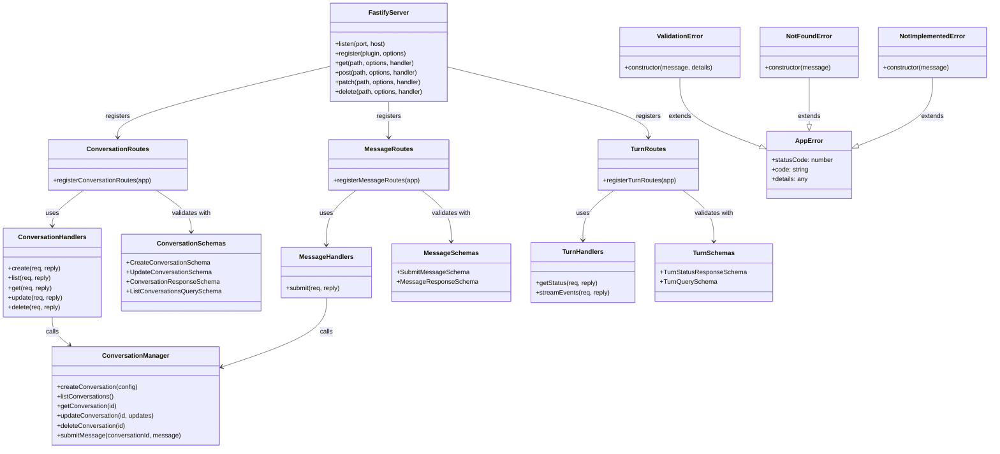
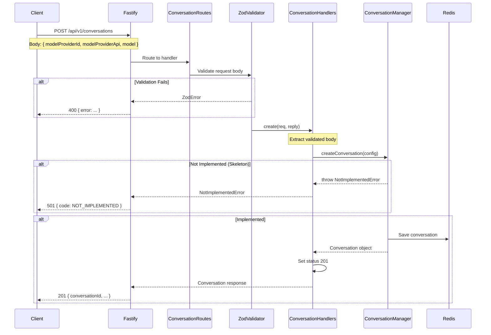
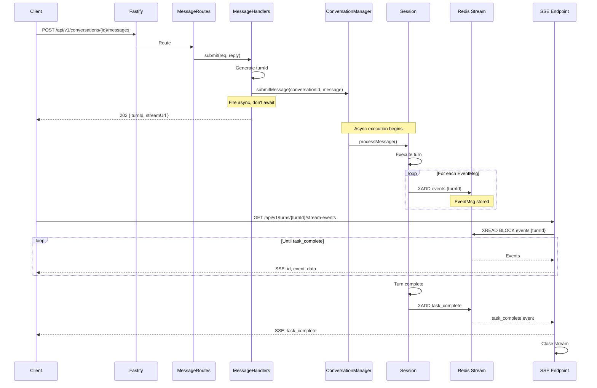

# Cody API - Skeleton Design

**Phase:** 6 REST API
**Purpose:** Define code structure, component connections, and signatures for skeleton implementation
**Date:** 2025-11-16

---

## Overview

This document defines the skeleton structure for cody-fastify REST API. The skeleton includes all components with proper signatures and connections, but handlers return `NotImplementedError`. This establishes the structure before implementation and allows Playwright tests to return consistent 501 responses.

**Key Principles:**
- Leverage existing ConversationManager from codex-ts
- Three-layer pattern: Routes → Handlers → ConversationManager (not repos initially)
- Zod schemas define all request/response shapes
- Error classes provide HTTP status mapping
- **Redis Client:** Use Bun's native Redis client (not ioredis) for Phase 2.2+

**Skeleton Purpose:**
- All files exist with correct structure
- All routes registered with schemas
- All handlers throw NotImplementedError (return 501)
- Structure ready for implementation
- You can type this code while designing the architecture

---

## Architecture Overview (ASCII)

```
┌─────────────────────────────────────────────────┐
│           Fastify Server (server.ts)            │
│                                                 │
│  ┌──────────────┐      ┌──────────────────┐    │
│  │   /health    │      │   /api/v1/*      │    │
│  └──────────────┘      └────────┬─────────┘    │
│                                 │              │
│                    ┌────────────┴───────────┐   │
│                    │ Zod Validator/         │   │
│                    │ Serializer Compilers   │   │
│                    └────────────┬───────────┘   │
└─────────────────────────────────┼───────────────┘
                                  │
                ┌─────────────────┴──────────────┐
                │                                │
          ┌─────▼──────┐              ┌─────────▼────────┐
          │   Routes   │              │      Routes      │
          │ (register) │              │   (register)     │
          └─────┬──────┘              └─────────┬────────┘
                │                               │
    ┌───────────┴─────────┐          ┌──────────┴────────┐
    │                     │          │                   │
┌───▼────────┐    ┌──────▼─────┐  ┌─▼──────┐   ┌───────▼─────┐
│Conversation│    │  Message   │  │ Turn   │   │    Turn     │
│  Routes    │    │   Routes   │  │ Routes │   │   Routes    │
│            │    │            │  │        │   │  (streaming)│
└─────┬──────┘    └──────┬─────┘  └───┬────┘   └───────┬─────┘
      │                  │            │                │
      │  Creates/Uses    │            │                │
      ▼                  ▼            ▼                ▼
┌──────────────────────────────────────────────────────────┐
│                      Handlers                            │
│  (Thin transport layer - extract, call, respond)         │
│                                                          │
│  buildConversationHandlers()                             │
│  buildMessageHandlers()                                  │
│  buildTurnHandlers()                                     │
└────────────────────┬─────────────────────────────────────┘
                     │
           ┌─────────┴──────────┐
           │                    │
      ┌────▼─────────┐    ┌─────▼──────────────┐
      │   Schemas    │    │    Existing        │
      │   (Zod)      │    │ ConversationManager│
      │              │    │  (from codex-ts)   │
      └──────────────┘    └─────┬──────────────┘
                                │
                          ┌─────┴──────┐
                          │            │
                     ┌────▼────┐  ┌────▼────┐
                     │  Codex  │  │Session  │
                     └─────────┘  └─────────┘
```

**Key:**
- **Routes:** Register endpoints with schemas
- **Handlers:** Thin adapters (extract → call → respond)
- **Schemas:** Zod validation for all requests/responses
- **ConversationManager:** Existing library (from codex-ts)

---

## Component Structure (Mermaid Class Diagram)



---

## Request Flow (Mermaid Sequence Diagram)

### Example: POST /conversations



### Example: POST /conversations/:id/messages (With Streaming)



---

## File Structure

```
cody-fastify/
├── src/
│   ├── server.ts                    # Main Fastify setup
│   │
│   ├── api/
│   │   ├── routes/
│   │   │   ├── conversations.ts     # Conversation endpoints
│   │   │   ├── messages.ts          # Message submission
│   │   │   └── turns.ts             # Turn status + streaming
│   │   │
│   │   ├── handlers/
│   │   │   ├── conversation-handlers.ts
│   │   │   ├── message-handlers.ts
│   │   │   └── turn-handlers.ts
│   │   │
│   │   ├── schemas/
│   │   │   ├── conversation.ts
│   │   │   ├── message.ts
│   │   │   └── turn.ts
│   │   │
│   │   ├── errors/
│   │   │   └── api-errors.ts
│   │   │
│   │   └── bridges/
│   │       └── eventmsg-redis.ts    # EventMsg → Redis Stream
│   │
│   └── types/
│       └── conversation.ts          # Shared types
│
└── tests/
    └── e2e/
        ├── fixtures/
        │   ├── api-client.ts
        │   └── test-helpers.ts
        ├── smoke.spec.ts
        ├── conversations.spec.ts
        ├── messages.spec.ts
        ├── turns.spec.ts
        └── lifecycle.spec.ts
```

---

## Component Signatures

### Routes (src/api/routes/conversations.ts)

```typescript
import type { FastifyInstance } from "fastify";
import type { ZodTypeProvider } from "fastify-type-provider-zod";

export function registerConversationRoutes(app: FastifyInstance): void;
```

**Registers:**
- POST /conversations
- GET /conversations
- GET /conversations/:id
- PATCH /conversations/:id
- DELETE /conversations/:id

---

### Handlers (src/api/handlers/conversation-handlers.ts)

```typescript
import type { FastifyRequest, FastifyReply } from "fastify";
import type { ConversationManager } from "../../../codex-ts/src/core/conversation-manager";

export function buildConversationHandlers(manager: ConversationManager) {
  return {
    create(
      req: FastifyRequest<{ Body: CreateConversationBody }>,
      reply: FastifyReply
    ): Promise<void>;

    list(
      req: FastifyRequest<{ Querystring: ListConversationsQuery }>,
      reply: FastifyReply
    ): Promise<void>;

    get(
      req: FastifyRequest<{ Params: { id: string } }>,
      reply: FastifyReply
    ): Promise<void>;

    update(
      req: FastifyRequest<{
        Params: { id: string };
        Body: UpdateConversationBody
      }>,
      reply: FastifyReply
    ): Promise<void>;

    delete(
      req: FastifyRequest<{ Params: { id: string } }>,
      reply: FastifyReply
    ): Promise<void>;
  };
}
```

**Each handler in skeleton:**
```typescript
async create(req, reply): Promise<void> {
  throw new NotImplementedError("POST /conversations not yet implemented");
}
```

---

### Schemas (src/api/schemas/conversation.ts)

```typescript
import { z } from "zod";

export const CreateConversationSchema = z.object({
  modelProviderId: z.string().min(1),
  modelProviderApi: z.string().min(1),
  model: z.string().min(1),
  title: z.string().optional(),
  summary: z.string().optional(),
  tags: z.array(z.string()).optional(),
  agentRole: z.string().optional()
});

export const ListConversationsQuerySchema = z.object({
  cursor: z.string().optional(),
  limit: z.union([z.number(), z.string()]).optional()
});

export const UpdateConversationSchema = z.object({
  title: z.string().optional(),
  summary: z.string().optional(),
  tags: z.array(z.string()).optional(),
  agentRole: z.string().optional(),
  modelProviderId: z.string().optional(),
  modelProviderApi: z.string().optional(),
  model: z.string().optional()
}).refine(
  (data) => Object.keys(data).length > 0,
  { message: "At least one field must be provided" }
);

export const ConversationResponseSchema = z.object({
  conversationId: z.string().uuid(),
  createdAt: z.string().datetime(),
  updatedAt: z.string().datetime(),
  modelProviderId: z.string(),
  modelProviderApi: z.string(),
  model: z.string(),
  title: z.string().nullable(),
  summary: z.string().nullable(),
  parent: z.string().nullable(),
  tags: z.array(z.string()),
  agentRole: z.string().nullable()
});

// Inferred types
export type CreateConversationBody = z.infer<typeof CreateConversationSchema>;
export type ListConversationsQuery = z.infer<typeof ListConversationsQuerySchema>;
export type UpdateConversationBody = z.infer<typeof UpdateConversationSchema>;
export type ConversationResponse = z.infer<typeof ConversationResponseSchema>;
```

---

## Handlers (src/api/handlers/message-handlers.ts)

**Complete file to type in:**

```typescript
import type { FastifyRequest, FastifyReply } from "fastify";
import { NotImplementedError } from "../errors/api-errors.js";
import type { SubmitMessageBody } from "../schemas/message.js";

export function buildMessageHandlers(manager: any) {
  return {
    async submit(
      req: FastifyRequest<{
        Params: { id: string };
        Body: SubmitMessageBody
      }>,
      reply: FastifyReply
    ): Promise<void> {
      throw new NotImplementedError("POST /conversations/:id/messages not yet implemented");
    }
  };
}
```

---

## Handlers (src/api/handlers/turn-handlers.ts)

**Complete file to type in:**

```typescript
import type { FastifyRequest, FastifyReply } from "fastify";
import { NotImplementedError } from "../errors/api-errors.js";
import type { TurnQueryParams } from "../schemas/turn.js";

export function buildTurnHandlers() {
  return {
    async getStatus(
      req: FastifyRequest<{
        Params: { id: string };
        Querystring: TurnQueryParams
      }>,
      reply: FastifyReply
    ): Promise<void> {
      throw new NotImplementedError("GET /turns/:id not yet implemented");
    },

    async streamEvents(
      req: FastifyRequest<{
        Params: { id: string };
        Querystring: TurnQueryParams
      }>,
      reply: FastifyReply
    ): Promise<void> {
      throw new NotImplementedError("GET /turns/:id/stream-events not yet implemented");
    }
  };
}
```

---

## Error Classes (src/api/errors/api-errors.ts)

**Complete file to type in:**

```typescript
export class AppError extends Error {
  constructor(
    message: string,
    public statusCode: number,
    public code?: string,
    public details?: any
  ) {
    super(message);
    this.name = this.constructor.name;
  }
}

export class ValidationError extends AppError {
  constructor(message: string, details?: any) {
    super(message, 400, "VALIDATION_ERROR", details);
  }
}

export class NotFoundError extends AppError {
  constructor(message: string) {
    super(message, 404, "NOT_FOUND");
  }
}

export class ConflictError extends AppError {
  constructor(message: string, details?: any) {
    super(message, 409, "CONFLICT", details);
  }
}

export class NotImplementedError extends AppError {
  constructor(message: string) {
    super(message, 501, "NOT_IMPLEMENTED");
  }
}

export class ServiceUnavailableError extends AppError {
  constructor(message: string) {
    super(message, 503, "SERVICE_UNAVAILABLE");
  }
}
```

---

## Routes (src/api/routes/messages.ts)

**Complete file to type in:**

```typescript
import type { FastifyInstance } from "fastify";
import type { ZodTypeProvider } from "fastify-type-provider-zod";
import { buildMessageHandlers } from "../handlers/message-handlers.js";
import { SubmitMessageSchema, SubmitMessageResponseSchema } from "../schemas/message.js";

export function registerMessageRoutes(app: FastifyInstance): void {
  const typedApp = app.withTypeProvider<ZodTypeProvider>();

  const manager = null as any; // Placeholder
  const handlers = buildMessageHandlers(manager);

  typedApp.post(
    "/conversations/:id/messages",
    {
      schema: {
        body: SubmitMessageSchema,
        response: { 202: SubmitMessageResponseSchema }
      }
    },
    handlers.submit
  );
}
```

---

## Routes (src/api/routes/turns.ts)

**Complete file to type in:**

```typescript
import type { FastifyInstance } from "fastify";
import type { ZodTypeProvider } from "fastify-type-provider-zod";
import { buildTurnHandlers } from "../handlers/turn-handlers.js";
import {
  TurnQuerySchema,
  TurnStatusResponseSchema
} from "../schemas/turn.js";

export function registerTurnRoutes(app: FastifyInstance): void {
  const typedApp = app.withTypeProvider<ZodTypeProvider>();

  const handlers = buildTurnHandlers();

  typedApp.get(
    "/turns/:id",
    {
      schema: {
        querystring: TurnQuerySchema,
        response: { 200: TurnStatusResponseSchema }
      }
    },
    handlers.getStatus
  );

  typedApp.get(
    "/turns/:id/stream-events",
    {
      schema: {
        querystring: TurnQuerySchema
      }
    },
    handlers.streamEvents
  );
}
```

---

## Server Setup (src/server.ts)

**Update existing createServer() to add:**
1. Route registrations
2. Global error handler

**Add these imports:**
```typescript
import { ZodError } from "zod";
import { registerConversationRoutes } from "./api/routes/conversations.js";
import { registerMessageRoutes } from "./api/routes/messages.js";
import { registerTurnRoutes } from "./api/routes/turns.js";
import { AppError } from "./api/errors/api-errors.js";
```

**Update createServer() function:**
```typescript
export async function createServer() {
  const app = Fastify({ logger: true });

  await app.register(cors, { origin: "*" });

  app.get("/health", async () => ({
    status: "ok",
    timestamp: new Date().toISOString(),
    version: "0.1.0",
  }));

  // Register API routes with Zod validation
  app.register(
    (sub) => {
      sub.setValidatorCompiler(validatorCompiler);
      sub.setSerializerCompiler(serializerCompiler);

      registerConversationRoutes(sub);
      registerMessageRoutes(sub);
      registerTurnRoutes(sub);
    },
    { prefix: "/api/v1" }
  );

  // Global error handler
  app.setErrorHandler((err, req, reply) => {
    // Zod validation errors
    if (err instanceof ZodError) {
      const message = err.issues
        .map((i) => `${i.path.join(".") || "body"}: ${i.message}`)
        .join("; ");
      reply.code(400).send({
        error: {
          code: "VALIDATION_ERROR",
          message,
          details: { errors: err.issues }
        }
      });
      return;
    }

    // App errors (including NotImplementedError)
    if (err instanceof AppError) {
      reply.code(err.statusCode).send({
        error: {
          code: err.code,
          message: err.message,
          details: err.details
        }
      });
      return;
    }

    // Unexpected errors
    app.log.error({ err, req: req.id }, "Unexpected error");
    reply.code(500).send({
      error: {
        code: "INTERNAL_ERROR",
        message: "An unexpected error occurred",
        requestId: req.id
      }
    });
  });

  return app;
}
```

---

## Route Registration (src/api/routes/conversations.ts)

**Complete file to type in:**

```typescript
import type { FastifyInstance } from "fastify";
import type { ZodTypeProvider } from "fastify-type-provider-zod";
import { buildConversationHandlers } from "../handlers/conversation-handlers.js";
import {
  CreateConversationSchema,
  UpdateConversationSchema,
  ListConversationsQuerySchema,
  ConversationResponseSchema
} from "../schemas/conversation.js";

export function registerConversationRoutes(app: FastifyInstance): void {
  const typedApp = app.withTypeProvider<ZodTypeProvider>();

  // TODO: Initialize ConversationManager (needs config, auth, etc.)
  const manager = null as any; // Placeholder for now
  const handlers = buildConversationHandlers(manager);

  typedApp.post(
    "/conversations",
    {
      schema: {
        body: CreateConversationSchema,
        response: { 201: ConversationResponseSchema }
      }
    },
    handlers.create
  );

  typedApp.get(
    "/conversations",
    {
      schema: {
        querystring: ListConversationsQuerySchema
      }
    },
    handlers.list
  );

  typedApp.get(
    "/conversations/:id",
    {
      schema: {
        response: { 200: ConversationResponseSchema }
      }
    },
    handlers.get
  );

  typedApp.patch(
    "/conversations/:id",
    {
      schema: {
        body: UpdateConversationSchema,
        response: { 200: ConversationResponseSchema }
      }
    },
    handlers.update
  );

  typedApp.delete(
    "/conversations/:id",
    handlers.delete
  );
}
```

---

## Handlers (src/api/handlers/conversation-handlers.ts)

**Complete file to type in:**

```typescript
import type { FastifyRequest, FastifyReply } from "fastify";
import { NotImplementedError } from "../errors/api-errors.js";
import type {
  CreateConversationBody,
  UpdateConversationBody,
  ListConversationsQuery
} from "../schemas/conversation.js";

export function buildConversationHandlers(manager: any) {
  return {
    async create(
      req: FastifyRequest<{ Body: CreateConversationBody }>,
      reply: FastifyReply
    ): Promise<void> {
      throw new NotImplementedError("POST /conversations not yet implemented");
    },

    async list(
      req: FastifyRequest<{ Querystring: ListConversationsQuery }>,
      reply: FastifyReply
    ): Promise<void> {
      throw new NotImplementedError("GET /conversations not yet implemented");
    },

    async get(
      req: FastifyRequest<{ Params: { id: string } }>,
      reply: FastifyReply
    ): Promise<void> {
      throw new NotImplementedError("GET /conversations/:id not yet implemented");
    },

    async update(
      req: FastifyRequest<{
        Params: { id: string };
        Body: UpdateConversationBody
      }>,
      reply: FastifyReply
    ): Promise<void> {
      throw new NotImplementedError("PATCH /conversations/:id not yet implemented");
    },

    async delete(
      req: FastifyRequest<{ Params: { id: string } }>,
      reply: FastifyReply
    ): Promise<void> {
      throw new NotImplementedError("DELETE /conversations/:id not yet implemented");
    }
  };
}
```

---

## Schemas (src/api/schemas/message.ts)

**Complete file to type in:**

```typescript
import { z } from "zod";

export const SubmitMessageSchema = z.object({
  message: z.string().min(1),
  modelProviderId: z.string().optional(),
  modelProviderApi: z.string().optional(),
  model: z.string().optional()
});

export const SubmitMessageResponseSchema = z.object({
  turnId: z.string().uuid(),
  conversationId: z.string().uuid(),
  streamUrl: z.string(),
  statusUrl: z.string()
});

export type SubmitMessageBody = z.infer<typeof SubmitMessageSchema>;
export type SubmitMessageResponse = z.infer<typeof SubmitMessageResponseSchema>;
```

---

## Schemas (src/api/schemas/turn.ts)

**Complete file to type in:**

```typescript
import { z } from "zod";

export const TurnQuerySchema = z.object({
  thinkingLevel: z.enum(['none', 'full']).optional(),
  toolLevel: z.enum(['none', 'full']).optional()
});

export const TurnStatusResponseSchema = z.object({
  turnId: z.string().uuid(),
  conversationId: z.string().uuid(),
  status: z.enum(['running', 'completed', 'error']),
  startedAt: z.string().datetime(),
  completedAt: z.string().datetime().nullable()
});

export type TurnQueryParams = z.infer<typeof TurnQuerySchema>;
export type TurnStatusResponse = z.infer<typeof TurnStatusResponseSchema>;
```

---

## Quick Typing Checklist

**Files to create (in order):**

1. ✅ src/api/errors/api-errors.ts (add NotImplementedError to existing)
2. □ src/api/schemas/conversation.ts
3. □ src/api/schemas/message.ts
4. □ src/api/schemas/turn.ts
5. □ src/api/handlers/conversation-handlers.ts
6. □ src/api/handlers/message-handlers.ts
7. □ src/api/handlers/turn-handlers.ts
8. □ src/api/routes/conversations.ts
9. □ src/api/routes/messages.ts
10. □ src/api/routes/turns.ts
11. □ Update src/server.ts (add imports, route registrations, error handler)

**For each file:**
- Scroll to that section in this doc
- Type the complete code shown
- Save file
- Move to next

**After all files created:**
```bash
bun run build      # Should compile (0 errors)
bun run lint       # Should pass (0 errors)
bun run format     # Format code
bun src/server.ts  # Start server (should listen on 4010)
curl http://localhost:4010/health  # Should return 200
curl http://localhost:4010/api/v1/conversations  # Should return 501
```

---

## Notes for Implementation Phase

**When ready to implement handlers (after skeleton complete):**

**Integration with codex-ts:**
- Import from: `../../../codex-ts/src/core/conversation-manager.js`
- ConversationManager needs: config, auth manager
- May need to extend with updateConversation, deleteConversation methods

**SessionMeta additions needed (in codex-ts):**
- title?: string
- summary?: string
- parent?: string
- tags?: string[]
- agentRole?: string
- updatedAt?: string

**For Phase 2.2 (Redis + Streaming):**
- Use Bun's native Redis client (not ioredis)
- Event bridge subscribes to Conversation/Codex events
- SSE handler reads from Redis Streams
- Reference: proven-patterns doc Section 1.3 and 1.4

---

## Skeleton Complete Checklist

**Verification steps:**

- [x] All 11 files created
- [x] TypeScript compiles (bun run build)
- [x] ESLint passes (bun run lint)
- [x] Server starts (bun src/server.ts)
- [x] Health check works (GET /health → 200)
- [x] All conversation endpoints → 501
- [x] All message endpoints → 501
- [x] All turn endpoints → 501
- [x] Error responses properly formatted
- [x] Ready for Playwright test implementation
