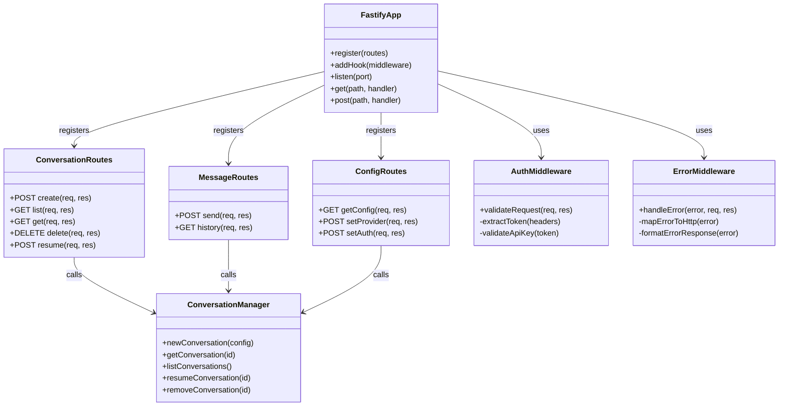

# Phase 6: Technical Design

**Phase:** Library API & REST API
**Goal:** Document @openai/codex-core public API surface, implement Fastify REST wrapper with Bun runtime, comprehensive Playwright testing in two modes

---

## Integration Overview

(From TECH-APPROACH Section 7)

Phase 6 completes the integration project by documenting the library API surface and implementing a REST API wrapper. The library API defines what external developers can import from @openai/codex-core (ConversationManager, Conversation, types, utilities). The REST API provides HTTP endpoints for the same capabilities, enabling web/mobile clients and service-to-service communication. Both APIs expose the same underlying functionality—library via TypeScript imports, REST via HTTP.

The REST API uses Fastify (fast, minimal overhead) running on Bun (faster runtime than Node). Each endpoint maps to library methods—POST /conversations calls ConversationManager.createConversation(), POST /conversations/{id}/messages calls conversation.sendMessage(), etc. The API layer is thin—validation, error handling, HTTP formatting, but business logic stays in library. This proves the library is well-designed (if API can consume it cleanly, so can other applications).

Testing uses Playwright for REST API (not vitest—this is HTTP-level testing). Two test modes: mocked (models and external APIs stubbed, tests many scenarios and permutations) and non-mocked (real models and APIs, key scenarios only to verify actual functionality without burning time/cost). Mocked tests run in CI, non-mocked tests run manually before release.

### Phase 6 Target State

```
External Developers
        ↓
   ┌────┴────┐
   ▼         ▼
Library    REST API
Import     HTTP
           ↓
    ┌──────────────────────┐
    │  Fastify + Bun       │
    │  ┌────────────────┐  │
    │  │  POST /convs   │  │
    │  │  POST /message │  │
    │  │  GET  /convs   │  │
    │  └────────┬───────┘  │
    └───────────┼──────────┘
                ▼
    ┌──────────────────────┐
    │  @openai/codex-core  │
    │  ┌────────────────┐  │
    │  │ Conversation   │  │
    │  │   Manager      │  │
    │  └────────────────┘  │
    └──────────────────────┘
            ↓
    [Library layer from Phases 1-5]

Testing:
├── Playwright (REST API)
│   ├── Mocked (models + APIs stubbed)
│   └── Non-mocked (real LLMs, key scenarios)
└── Mocked-service (Library, from Phases 1-5)
```

**Highlighted:** Library exports documented (public API surface), REST API implementation (Fastify + Bun), Playwright test suite (two modes).

---

## Technical Deltas

**New code (library API):**
- src/index.ts: Main library export file (~50 lines)
- docs/api/library-api.md: Complete API documentation (~400 lines)

**New code (REST API):**
- src/api/server.ts: Fastify server setup (~80 lines)
- src/api/routes/conversations.ts: Conversation CRUD endpoints (~120 lines)
- src/api/routes/messages.ts: Message send/history endpoints (~100 lines)
- src/api/routes/config.ts: Config endpoints (~60 lines)
- src/api/middleware/auth.ts: API key authentication (~40 lines)
- src/api/middleware/error.ts: Error handling (~50 lines)
- docs/api/rest-api.md: REST API specification (~500 lines)

**New code (Playwright testing):**
- tests/playwright/api/conversations.spec.ts: Conversation tests (~150 lines, 15 tests)
- tests/playwright/api/messages.spec.ts: Message tests (~200 lines, 20 tests)
- tests/playwright/api/providers.spec.ts: Provider parity (~120 lines, 12 tests)
- tests/playwright/api/auth.spec.ts: Auth tests (~80 lines, 8 tests)
- tests/playwright/mocks/model-server.ts: Mock LLM APIs (~200 lines)
- tests/playwright/mocks/search-server.ts: Mock search APIs (~80 lines)
- tests/playwright/config/: Test configurations (~50 lines)
- tests/playwright/fixtures/: Preset responses (~100 lines)

**Estimated new code:** ~2,380 lines total
- Library exports + docs: ~450 lines
- REST API + docs: ~950 lines
- Playwright tests + mocks: ~980 lines

**This is the largest phase by code volume** (but much is boilerplate routes and test scenarios).

---

## Library API Design

### Public Exports

**Main entry point:** `src/index.ts`

```typescript
// Primary API
export {ConversationManager} from './core/conversation-manager';
export {CodexConversation} from './core/codex-conversation';

// Factory helper
export {createConversationManager} from './core/factory';

// Types
export type {
  ConversationConfig,
  ConversationMetadata,
  AuthMethod,
  Provider,
  WireApi
} from './core/types';

export type {
  ResponseItem,
  ResponseItems,
  FunctionCall,
  FunctionCallOutput,
  UserInput
} from './protocol/items';

// Utilities (optional, if useful for external devs)
export {countTokens} from './utils/tokenizer';
export {parseRollout} from './core/rollout/parser';
```

**What NOT to export:**
- Internal Session class (implementation detail)
- Codex class (wrapped by CodexConversation)
- ModelClient implementations (factory handles)
- ToolRouter internals (handled by Session)

**Principle:** Export only what external developers need. Keep internal implementation hidden.

### Factory Helper

**Purpose:** Simplify library usage for common case.

```typescript
// src/core/factory.ts

export async function createConversationManager(options?: {
  configPath?: string;
  baseDir?: string;
}): Promise<ConversationManager> {
  // Load config
  const configPath = options?.configPath ?? '~/.cody/config.toml';
  const config = await loadConfig(configPath);
  
  // Create dependencies
  const authManager = new AuthManager(config);
  const recorder = new RolloutRecorder(options?.baseDir ?? '~/.cody/conversations');
  
  // Create manager
  return new ConversationManager(authManager, recorder);
}
```

**Usage:**
```typescript
import {createConversationManager} from '@openai/codex-core';

// Simple (uses defaults)
const manager = await createConversationManager();

// Custom paths
const manager = await createConversationManager({
  configPath: './my-config.toml',
  baseDir: './my-conversations'
});
```

### Usage Examples

**Example 1: Basic Chat**
```typescript
import {createConversationManager} from '@openai/codex-core';

const manager = await createConversationManager();

const {conversation, conversationId} = await manager.newConversation({
  provider: {name: 'openai', api: 'responses', model: 'gpt-4o-mini'},
  auth: {method: 'openai-api-key'}
});

await conversation.submit([{type: 'text', text: 'Hello!'}]);
const event = await conversation.nextEvent();

console.log(event.msg); // Assistant response
```

**Example 2: Multi-Turn with Tools**
```typescript
const {conversation} = await manager.newConversation(config);

// Enable tool execution with approval callback
const approvalCallback = async (toolName, args) => {
  console.log(`Approve ${toolName}?`, args);
  return true; // Auto-approve for this example
};

// Send message that triggers tools
await conversation.submit([{type: 'text', text: 'Read the README file'}]);

// Process events
while (true) {
  const event = await conversation.nextEvent();
  
  if (event.msg.type === 'tool_call') {
    const approved = await approvalCallback(event.msg.name, event.msg.args);
    // Handle approval...
  }
  
  if (event.msg.type === 'completed') {
    break;
  }
}
```

**Example 3: Resume**
```typescript
// List saved conversations
const conversations = await manager.listConversations();
console.log('Saved:', conversations.map(c => c.id));

// Resume specific conversation
const conversation = await manager.resumeConversation('conv_abc123');

// Continue chatting
await conversation.submit([{type: 'text', text: 'Continuing from before...'}]);
```

**These examples go in docs/api/library-api.md.**

---

## REST API Design

### Endpoint Specification

**Base URL:** `http://localhost:3000/api/v1`

**Conversation Endpoints:**

```
POST   /conversations
GET    /conversations
GET    /conversations/:id
DELETE /conversations/:id
POST   /conversations/:id/resume
```

**Message Endpoints:**

```
POST   /conversations/:id/messages
GET    /conversations/:id/messages
```

**Config Endpoints:**

```
GET    /config
POST   /config/provider
POST   /config/auth
```

### Request/Response Formats

**POST /api/v1/conversations** (Create)

Request:
```json
{
  "provider": "openai",
  "api": "responses",
  "model": "gpt-4o-mini",
  "auth": {
    "method": "openai-api-key"
  }
}
```

Response (201 Created):
```json
{
  "conversationId": "conv_abc123",
  "created": 1699564800000,
  "provider": "openai",
  "api": "responses",
  "model": "gpt-4o-mini"
}
```

**POST /api/v1/conversations/:id/messages** (Send Message)

Request:
```json
{
  "message": "Hello, how are you?",
  "stream": false
}
```

Response (200 OK):
```json
{
  "items": [
    {
      "type": "message",
      "role": "assistant",
      "content": [
        {"type": "text", "text": "I'm doing well, thank you!"}
      ]
    }
  ],
  "usage": {
    "inputTokens": 15,
    "outputTokens": 12,
    "totalTokens": 27
  }
}
```

**GET /api/v1/conversations** (List)

Response (200 OK):
```json
{
  "conversations": [
    {
      "id": "conv_abc123",
      "provider": "openai",
      "model": "gpt-4o-mini",
      "updatedAt": 1699564800000
    },
    {
      "id": "conv_def456",
      "provider": "anthropic",
      "model": "claude-3-haiku",
      "updatedAt": 1699564700000
    }
  ]
}
```

**Error Response Format:**

```json
{
  "error": {
    "code": "CONVERSATION_NOT_FOUND",
    "message": "Conversation 'conv_xyz' not found",
    "details": {
      "conversationId": "conv_xyz"
    }
  }
}
```

HTTP status codes:
- 200: Success
- 201: Created
- 400: Bad Request (validation error)
- 401: Unauthorized (missing/invalid API key)
- 404: Not Found (conversation doesn't exist)
- 500: Internal Server Error

### Authentication

**Two-layer auth:**

**Layer 1: REST API Access**
- Header: `Authorization: Bearer <api-key>`
- Validates request can access REST API
- Simple API key check (not OAuth)

**Layer 2: Model Provider Auth**
- Configured per conversation (in request body)
- Uses AuthManager (API keys or OAuth)
- Handled by library layer

**Example request:**
```bash
curl -X POST http://localhost:3000/api/v1/conversations \
  -H "Authorization: Bearer my-rest-api-key" \
  -H "Content-Type: application/json" \
  -d '{
    "provider": "openai",
    "api": "responses",
    "model": "gpt-4o-mini",
    "auth": {"method": "openai-api-key"}
  }'
```

**REST API key** (Bearer token) authorizes API access.
**Model provider auth** (in body) authorizes LLM API calls.

---

## Fastify Server Implementation

### Server Setup

```typescript
// src/api/server.ts

import Fastify from 'fastify';
import {conversationRoutes} from './routes/conversations';
import {messageRoutes} from './routes/messages';
import {configRoutes} from './routes/config';
import {authMiddleware} from './middleware/auth';
import {errorMiddleware} from './middleware/error';

export async function createServer(options?: {
  port?: number;
  apiKey?: string;
}) {
  const fastify = Fastify({
    logger: true,
    requestIdHeader: 'x-request-id'
  });

  // Middleware
  fastify.addHook('onRequest', authMiddleware(options?.apiKey));
  fastify.setErrorHandler(errorMiddleware);

  // Routes
  await fastify.register(conversationRoutes, {prefix: '/api/v1'});
  await fastify.register(messageRoutes, {prefix: '/api/v1'});
  await fastify.register(configRoutes, {prefix: '/api/v1'});

  // Health check
  fastify.get('/health', async () => ({status: 'ok'}));

  return fastify;
}

export async function startServer(port: number = 3000) {
  const server = await createServer({
    apiKey: process.env.CODY_API_KEY
  });

  await server.listen({
    port,
    host: '0.0.0.0'
  });

  console.log(`✓ Cody REST API listening on http://localhost:${port}`);
  return server;
}
```

**Run with Bun:**
```bash
bun run src/api/server.ts
```

### Route Handlers

**Conversation Routes:**

```typescript
// src/api/routes/conversations.ts

import {FastifyInstance} from 'fastify';
import {getConversationManager} from '../manager';

export async function conversationRoutes(fastify: FastifyInstance) {
  const manager = getConversationManager();

  // Create conversation
  fastify.post('/conversations', async (request, reply) => {
    const {provider, api, model, auth} = request.body as CreateConversationRequest;

    // Validate request
    if (!provider || !api || !model) {
      return reply.code(400).send({
        error: {
          code: 'INVALID_REQUEST',
          message: 'Missing required fields: provider, api, model'
        }
      });
    }

    try {
      const {conversation, conversationId} = await manager.newConversation({
        provider: {name: provider, api, model},
        auth
      });

      return reply.code(201).send({
        conversationId: conversationId.toString(),
        created: Date.now(),
        provider,
        api,
        model
      });
    } catch (err) {
      throw err; // Error middleware handles
    }
  });

  // List conversations
  fastify.get('/conversations', async (request, reply) => {
    const conversations = await manager.listConversations();

    return {
      conversations: conversations.map(c => ({
        id: c.id,
        provider: c.provider,
        model: c.model,
        updatedAt: c.updatedAt
      }))
    };
  });

  // Get conversation
  fastify.get('/conversations/:id', async (request, reply) => {
    const {id} = request.params as {id: string};

    const conversation = await manager.getConversation(id);
    if (!conversation) {
      return reply.code(404).send({
        error: {
          code: 'CONVERSATION_NOT_FOUND',
          message: `Conversation '${id}' not found`
        }
      });
    }

    return {
      id,
      // Return metadata (provider, model, message count, etc.)
    };
  });

  // Delete conversation
  fastify.delete('/conversations/:id', async (request, reply) => {
    const {id} = request.params as {id: string};

    await manager.removeConversation(id);

    return reply.code(204).send();
  });

  // Resume conversation
  fastify.post('/conversations/:id/resume', async (request, reply) => {
    const {id} = request.params as {id: string};

    try {
      const conversation = await manager.resumeConversation(id);

      return {
        conversationId: id,
        resumed: true
      };
    } catch (err) {
      if (err.code === 'CONVERSATION_NOT_FOUND') {
        return reply.code(404).send({
          error: {
            code: 'CONVERSATION_NOT_FOUND',
            message: `Conversation '${id}' not found`
          }
        });
      }
      throw err;
    }
  });
}
```

**Message Routes:**

```typescript
// src/api/routes/messages.ts

export async function messageRoutes(fastify: FastifyInstance) {
  const manager = getConversationManager();

  // Send message
  fastify.post('/conversations/:id/messages', async (request, reply) => {
    const {id} = request.params as {id: string};
    const {message, stream} = request.body as SendMessageRequest;

    if (!message) {
      return reply.code(400).send({
        error: {
          code: 'INVALID_REQUEST',
          message: 'Missing required field: message'
        }
      });
    }

    const conversation = await manager.getConversation(id);
    if (!conversation) {
      return reply.code(404).send({
        error: {
          code: 'CONVERSATION_NOT_FOUND',
          message: `Conversation '${id}' not found`
        }
      });
    }

    // Submit message
    await conversation.submit([{type: 'text', text: message}]);

    if (stream) {
      // SSE streaming mode
      reply.raw.writeHead(200, {
        'Content-Type': 'text/event-stream',
        'Cache-Control': 'no-cache',
        'Connection': 'keep-alive'
      });

      // Stream events
      while (true) {
        const event = await conversation.nextEvent();

        reply.raw.write(`data: ${JSON.stringify(event.msg)}\n\n`);

        if (event.msg.type === 'completed') {
          break;
        }
      }

      reply.raw.end();
      return reply;
    } else {
      // Batch mode - collect all events
      const items = [];
      let usage = null;

      while (true) {
        const event = await conversation.nextEvent();

        if (event.msg.type === 'message') {
          items.push(event.msg);
        }

        if (event.msg.type === 'completed') {
          usage = event.msg.usage;
          break;
        }
      }

      return {items, usage};
    }
  });

  // Get message history
  fastify.get('/conversations/:id/messages', async (request, reply) => {
    const {id} = request.params as {id: string};

    const conversation = await manager.getConversation(id);
    if (!conversation) {
      return reply.code(404).send({
        error: {code: 'CONVERSATION_NOT_FOUND', message: `Conversation '${id}' not found`}
      });
    }

    const history = conversation.getHistory(); // Or equivalent method

    return {
      conversationId: id,
      messages: history
    };
  });
}
```

### Middleware

**Auth Middleware:**

```typescript
// src/api/middleware/auth.ts

export function authMiddleware(expectedApiKey?: string) {
  return async (request, reply) => {
    // Skip auth for health check
    if (request.url === '/health') {
      return;
    }

    const authHeader = request.headers.authorization;

    if (!authHeader) {
      return reply.code(401).send({
        error: {
          code: 'UNAUTHORIZED',
          message: 'Missing Authorization header'
        }
      });
    }

    const [scheme, token] = authHeader.split(' ');

    if (scheme !== 'Bearer') {
      return reply.code(401).send({
        error: {
          code: 'UNAUTHORIZED',
          message: 'Invalid authorization scheme. Use: Bearer <token>'
        }
      });
    }

    if (expectedApiKey && token !== expectedApiKey) {
      return reply.code(401).send({
        error: {
          code: 'UNAUTHORIZED',
          message: 'Invalid API key'
        }
      });
    }

    // Auth passed
  };
}
```

**Error Middleware:**

```typescript
// src/api/middleware/error.ts

export function errorMiddleware(error, request, reply) {
  // Map internal errors to HTTP responses

  if (error.name === 'ConfigurationError') {
    return reply.code(400).send({
      error: {
        code: 'CONFIGURATION_ERROR',
        message: error.message
      }
    });
  }

  if (error.name === 'AuthError') {
    return reply.code(401).send({
      error: {
        code: 'AUTH_ERROR',
        message: error.message
      }
    });
  }

  if (error.code === 'CONVERSATION_NOT_FOUND') {
    return reply.code(404).send({
      error: {
        code: 'CONVERSATION_NOT_FOUND',
        message: error.message
      }
    });
  }

  // Default: 500
  return reply.code(500).send({
    error: {
      code: 'INTERNAL_ERROR',
      message: error.message || 'An unexpected error occurred'
    }
  });
}
```

---

## Component Structure

REST API is thin wrapper. Routes validate and format, middleware handles cross-cutting concerns, library does all business logic.



---

## Playwright Testing Strategy

**Two test modes for comprehensive coverage:**

### Mode 1: Mocked (CI/Development)

**Environment:** `TEST_MODE=mocked`

**Mock servers:**
- Mock OpenAI API (localhost:3001)
- Mock Anthropic API (localhost:3002)
- Mock OpenRouter API (localhost:3003)
- Mock search APIs (localhost:3004)

**What's mocked:**
- All LLM API calls (return preset responses)
- All search API calls (return preset results)
- Filesystem (use temp directories)
- Keyring (return test tokens)

**Test coverage:**
- Full scenario matrix (providers × auth × workflows)
- Error cases (400, 401, 404, 500)
- Edge cases (empty messages, large responses, concurrent requests)
- Security tests (missing auth, invalid tokens, injection attempts)

**Benefits:**
- Fast (~2 minutes for ~55 tests)
- Deterministic (no flaky network)
- Comprehensive (test all permutations)
- No cost (no real API calls)
- Runnable offline

**Run via:** `npm run test:playwright:mocked`

### Mode 2: Non-Mocked (Validation)

**Environment:** `TEST_MODE=integration`

**Real APIs:**
- OpenAI Responses (gpt-4o-mini)
- Anthropic Messages (haiku-4.5)
- OpenRouter (gemini-2.0-flash-001)

**What's real:**
- LLM API calls (actual network, actual models)
- Auth (real API keys)
- Responses (real model behavior)

**Test coverage (minimal, key scenarios only):**
- Happy path per provider (create → send → receive)
- Tool execution (one tool call per provider)
- Thinking parameter (Responses + Messages with thinking)
- Temperature (verify variation)
- Persistence (save → resume)

**Benefits:**
- Validates real behavior
- Catches provider quirks
- Proves actual functionality

**Cost:**
- ~5 minutes runtime
- ~$0.05-0.10 in API costs
- Manual run only (not CI)

**Run via:** `npm run test:playwright:integration`

### Mock Server Implementation

**Mock Model API Server:**

```typescript
// tests/playwright/mocks/model-server.ts

import {createServer} from 'http';

export function startMockModelServer(port: number = 3001) {
  const server = createServer((req, res) => {
    // Parse request
    const url = new URL(req.url, `http://localhost:${port}`);

    // OpenAI Responses API
    if (url.pathname === '/v1/chat/completions' && req.headers['openai-api-version']) {
      return handleResponsesAPI(req, res);
    }

    // OpenAI Chat API
    if (url.pathname === '/v1/chat/completions') {
      return handleChatAPI(req, res);
    }

    // Anthropic Messages API
    if (url.pathname === '/v1/messages') {
      return handleMessagesAPI(req, res);
    }

    // Not found
    res.writeHead(404);
    res.end();
  });

  server.listen(port);
  return server;
}

function handleResponsesAPI(req, res) {
  // Return SSE stream with preset responses
  res.writeHead(200, {
    'Content-Type': 'text/event-stream',
    'openai-api-version': '2024-10-01'
  });

  // Send events
  res.write('event: response.created\ndata: {"id":"resp_123"}\n\n');
  res.write('event: response.output_item.done\ndata: {"item":{"type":"message","role":"assistant","content":[{"type":"text","text":"Mock response"}]}}\n\n');
  res.write('event: response.done\ndata: {"usage":{"total_tokens":20}}\n\n');

  res.end();
}

// Similar for Chat and Messages APIs
```

**For testing:** Start mock servers before Playwright tests, configure library to use localhost URLs, run tests, verify requests hit mocks.

---

## Playwright Test Structure

**Test organization:**

```
tests/playwright/
├── api/
│   ├── conversations.spec.ts    (15 tests)
│   ├── messages.spec.ts         (20 tests)
│   ├── providers.spec.ts        (12 tests)
│   └── auth.spec.ts             (8 tests)
├── mocks/
│   ├── model-server.ts          (Mock LLM APIs)
│   ├── search-server.ts         (Mock search APIs)
│   └── start-mocks.ts           (Launch all mocks)
├── config/
│   ├── mocked.config.ts         (Mocked mode settings)
│   └── integration.config.ts    (Non-mocked mode settings)
└── fixtures/
    └── responses.ts             (Preset API responses)
```

### Example Playwright Tests

**conversations.spec.ts:**

```typescript
import {test, expect} from '@playwright/test';

test.describe('Conversations API', () => {
  test('creates conversation with OpenAI', async ({request}) => {
    const response = await request.post('/api/v1/conversations', {
      headers: {
        'Authorization': 'Bearer test-api-key',
        'Content-Type': 'application/json'
      },
      data: {
        provider: 'openai',
        api: 'responses',
        model: 'gpt-4o-mini',
        auth: {method: 'openai-api-key'}
      }
    });

    expect(response.ok()).toBeTruthy();
    const body = await response.json();
    expect(body.conversationId).toBeDefined();
    expect(body.provider).toBe('openai');
  });

  test('lists conversations', async ({request}) => {
    // Create a conversation first
    const createResp = await request.post('/api/v1/conversations', {
      headers: {'Authorization': 'Bearer test-api-key'},
      data: {provider: 'openai', api: 'responses', model: 'gpt-4', auth: {method: 'openai-api-key'}}
    });
    const {conversationId} = await createResp.json();

    // List
    const listResp = await request.get('/api/v1/conversations', {
      headers: {'Authorization': 'Bearer test-api-key'}
    });

    expect(listResp.ok()).toBeTruthy();
    const {conversations} = await listResp.json();
    expect(conversations.some(c => c.id === conversationId)).toBe(true);
  });

  test('returns 404 for missing conversation', async ({request}) => {
    const response = await request.get('/api/v1/conversations/nonexistent', {
      headers: {'Authorization': 'Bearer test-api-key'}
    });

    expect(response.status()).toBe(404);
    const body = await response.json();
    expect(body.error.code).toBe('CONVERSATION_NOT_FOUND');
  });

  test('returns 401 without auth header', async ({request}) => {
    const response = await request.post('/api/v1/conversations', {
      data: {provider: 'openai', api: 'responses', model: 'gpt-4', auth: {method: 'openai-api-key'}}
    });

    expect(response.status()).toBe(401);
  });
});
```

**messages.spec.ts:**

```typescript
test.describe('Messages API', () => {
  test('sends message and receives response', async ({request}) => {
    // Create conversation
    const createResp = await request.post('/api/v1/conversations', {
      headers: {'Authorization': 'Bearer test-api-key'},
      data: {provider: 'openai', api: 'responses', model: 'gpt-4', auth: {method: 'openai-api-key'}}
    });
    const {conversationId} = await createResp.json();

    // Send message
    const msgResp = await request.post(`/api/v1/conversations/${conversationId}/messages`, {
      headers: {'Authorization': 'Bearer test-api-key'},
      data: {message: 'Hello', stream: false}
    });

    expect(msgResp.ok()).toBeTruthy();
    const {items, usage} = await msgResp.json();
    expect(items.length).toBeGreaterThan(0);
    expect(items[0].type).toBe('message');
    expect(usage.totalTokens).toBeGreaterThan(0);
  });

  test('streams message with SSE', async ({request}) => {
    const createResp = await request.post('/api/v1/conversations', {
      headers: {'Authorization': 'Bearer test-api-key'},
      data: {provider: 'openai', api: 'responses', model: 'gpt-4', auth: {method: 'openai-api-key'}}
    });
    const {conversationId} = await createResp.json();

    // Send with streaming
    const msgResp = await request.post(`/api/v1/conversations/${conversationId}/messages`, {
      headers: {'Authorization': 'Bearer test-api-key'},
      data: {message: 'Hello', stream: true}
    });

    expect(msgResp.headers()['content-type']).toContain('text/event-stream');

    // Read SSE stream
    const body = await msgResp.text();
    expect(body).toContain('data:');
    // Verify SSE format
  });
});
```

---

## Reference Locations

**Library code (already ported):**
- ConversationManager: `codex-ts/src/core/conversation-manager/`
- CodexConversation: `codex-ts/src/core/codex-conversation.ts`
- Types: `codex-ts/src/protocol/items.ts`, `codex-ts/src/core/types.ts`

**Fastify docs:** https://fastify.dev/docs/latest/
**Playwright docs:** https://playwright.dev/docs/api-testing

---

## Implementation Notes

**Key decisions to document in DECISIONS.md:**

1. **Library exports:** What to export vs keep internal? Principle: export only what external devs need.

2. **REST API authentication:** Simple API key (Bearer token) vs more complex? Recommend: simple for now, can add OAuth later.

3. **Streaming implementation:** SSE format for REST API? Match OpenAI's format or custom? Recommend: custom (simpler), document format.

4. **Error response format:** Consistent structure across all errors? Recommend: {error: {code, message, details}}.

5. **Conversation isolation:** REST API stateless (no session affinity) or stateful? Recommend: stateless (each request independent).

6. **Bun vs Node:** Run with Bun for performance or Node for compatibility? Recommend: Bun (faster, test both).

7. **Mock server complexity:** Full SSE simulation or simple JSON responses? Recommend: full SSE (tests streaming paths).

8. **Playwright test organization:** Group by endpoint or by scenario? Recommend: by endpoint (clearer).

---

## Quality Gates

**Before marking Phase 6 complete:**

1. **Library API:**
   - [ ] docs/api/library-api.md complete (~400 lines)
   - [ ] src/index.ts exports defined
   - [ ] Usage examples work (test with minimal app)
   - [ ] Mocked-service tests repointed to library imports (verify still pass)

2. **REST API:**
   - [ ] All endpoints implemented
   - [ ] docs/api/rest-api.md complete (~500 lines)
   - [ ] Server starts with Bun
   - [ ] Health check works

3. **Playwright (mocked):**
   - [ ] ~55 tests passing
   - [ ] All scenarios covered
   - [ ] Mock servers working
   - [ ] Run time <2 minutes

4. **Playwright (non-mocked):**
   - [ ] ~8 key scenarios passing
   - [ ] Real models tested
   - [ ] Results logged

5. **Quality baseline:**
   - [ ] TypeScript: 0 errors
   - [ ] ESLint: 0 errors
   - [ ] Format: clean
   - [ ] Combined: All checks pass

6. **Code review:**
   - [ ] Stage 1: API design, security, error handling
   - [ ] Stage 2: Library exports clean, REST maps correctly

---

## Summary

Phase 6 exposes the integrated system through two interfaces: TypeScript library and REST API. Library API serves developers building on Codex. REST API serves web/mobile apps and services. Both are thin wrappers around the same core functionality (ConversationManager). Comprehensive Playwright testing in two modes ensures REST API works correctly (mocked for coverage, non-mocked for validation). Focus on clean API design, helpful error messages, and thorough testing across all scenarios.
