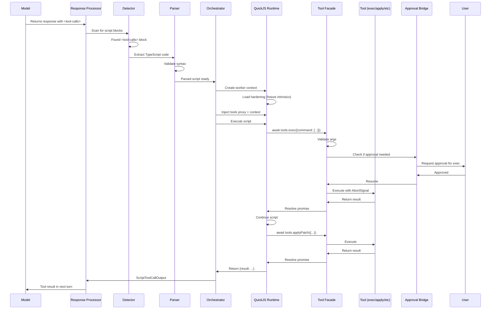
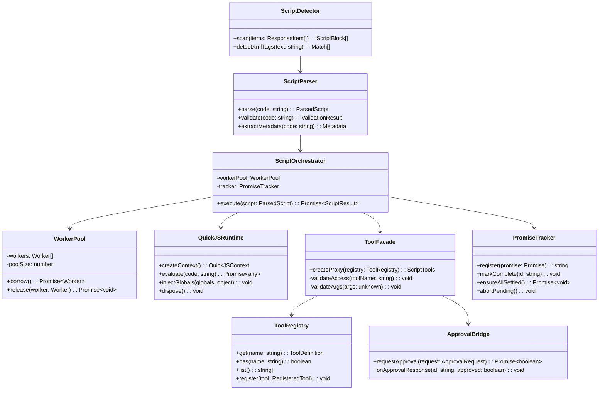

# Codex Enhancement 02: Script-Based Tool Execution

**Enhancement:** QuickJS Sandboxed Runtime for Compositional Tool Orchestration
**Status:** Complete (Phase 4.4-4.5)
**Date:** November 7, 2025

---

## Overview

This enhancement introduces an alternative tool execution model alongside Codex's existing structured tool calling system. While maintaining full compatibility with the original Rust tool harness, we've added a sandboxed TypeScript execution environment that enables models to compose tools through code rather than structured JSON.

Both systems coexist: models can use structured calls (Rust-compatible) or script-based calls (new capability), and both integrate with the same underlying tool implementations.

---

## Background: Codex's Structured Tool Calling

### How Structured Tool Calling Works in Codex

**In the context of turn processing:**

**1. Turn Initiation:**
```
User submits prompt
  ↓
Codex creates turn context
  ↓
Builds conversation history
  ↓
Sends to ModelClient
```

**2. Model Response:**
```
Model returns ResponseItems
  ↓
Example:
  ResponseItem.Message {role: "assistant", content: "I'll fix the tests"}
  ResponseItem.FunctionCall {name: "exec", arguments: "{\"command\":[\"npm\",\"test\"]}", call_id: "call_1"}
  ResponseItem.Message {role: "assistant", content: "Let me apply a patch"}
  ResponseItem.FunctionCall {name: "apply_patch", arguments: "{\"patch\":\"...\"}", call_id: "call_2"}
```

**3. Response Processing:**
```
response_processing.process_items()
  ↓
For each ResponseItem:
  ├─ Message → Record in history
  ├─ FunctionCall → Extract, validate
  │   ↓
  │   ToolRouter.build_tool_call()
  │   ↓
  │   {toolName, callId, payload}
  │   ↓
  │   ToolRegistry.dispatch()
  │   ↓
  │   Tool executes (with approval if needed)
  │   ↓
  │   Returns: ResponseInputItem.FunctionCallOutput
  └─ Pair with call, record both in history
```

**4. Next Turn:**
```
Tool outputs added to history
  ↓
Model sees results
  ↓
Responds with next action
  ↓
Repeat until task complete
```

**Characteristics:**
- One tool call per ResponseItem
- Model must wait for result before next decision
- Multiple tools = multiple round-trips
- Tool arguments must be valid JSON
- Format dictated by API (function calling schema)

**This works well** - proven in production Codex. The Rust implementation is faithfully ported.

---

## The Script-Based Alternative

### Motivation

Certain workflows benefit from compositional tool execution:
- Multiple dependent tools (use output of tool A in tool B)
- Conditional logic (if X succeeds, then Y, else Z)
- Parallel execution (run tools simultaneously)
- Error recovery (try/catch around tool calls)
- Complex orchestration (loops, data transformation)

**With structured calls:** Each step requires a model round-trip.
**With scripts:** Model writes workflow once, executes in single turn.

### Design Goals

**1. Maintain compatibility:**
- Script harness is additive, not replacement
- Same tools used in both harnesses
- Same approval system
- Same tool execution engine

**2. Enable composition:**
- Tools can be combined in single turn
- Output of one tool → input to another
- Conditional logic based on results
- Parallel execution where appropriate

**3. Secure execution:**
- Sandboxed runtime (no host access)
- Resource limits (time, memory, calls)
- Approval flow preserved
- User maintains control

**4. Developer-friendly:**
- Standard TypeScript/JavaScript
- Familiar async/await patterns
- Clear error messages
- Good debugging experience

### Expected Benefits

Based on compositional programming principles, we anticipate:

**Reduced context fragmentation:**
- Complex workflows complete in one turn
- Original user prompt remains in recent context
- Model maintains coherent understanding throughout

**Error reduction:**
- TypeScript syntax vs JSON formatting
- IDE-like autocomplete patterns (via good documentation)
- Compile-time-like validation before execution

**Broader model compatibility:**
- Models good at code but poor at JSON tool schemas
- Standard programming constructs (if/then, try/catch, loops)
- May enable coding use of models currently unsuitable

**Specific improvements remain to be measured through testing.**

---

## Architecture

### High-Level Design

```
Model Response
    ↓
┌─────────────────────┐
│ Response Processor  │
└──────────┬──────────┘
           │
    ┌──────▼──────┐
    │  Detector?  │
    │<tool-calls> │
    └──┬────────┬─┘
       │ No     │ Yes
       │        │
       ▼        ▼
  ┌────────┐  ┌──────────────────┐
  │ Tool   │  │ Script Harness   │
  │ Router │  │                  │
  │ (Rust  │  │ ┌──────────────┐ │
  │ style) │  │ │ Parser       │ │
  └────────┘  │ └──────┬───────┘ │
              │        ▼         │
              │ ┌──────────────┐ │
              │ │ QuickJS      │ │
              │ │ Sandbox      │ │
              │ └──────┬───────┘ │
              │        ▼         │
              │ ┌──────────────┐ │
              │ │ Tool Facade  │ │
              │ └──────┬───────┘ │
              └────────┼─────────┘
                       ▼
              ┌──────────────────┐
              │  Tool Registry   │
              │  (Shared Tools)  │
              └──────────────────┘
```

**Both harnesses use the same tools** - only invocation mechanism differs.

### Sequence Diagram: Script Execution Flow



### Component Architecture



---

## Component Details

### 1. Script Detection

**Purpose:** Identify `<tool-calls>` blocks in model responses.

**Implementation:**
```typescript
export function detectScriptBlocks(item: ResponseItem): ScriptBlock[] {
  if (item.type !== 'message' || item.role !== 'assistant') {
    return [];
  }

  const text = extractTextContent(item);
  const regex = /<tool-calls>(.*?)<\/tool-calls>/gs;
  const blocks: ScriptBlock[] = [];

  for (const match of text.matchAll(regex)) {
    blocks.push({
      code: match[1].trim(),
      startIndex: match.index!,
      endIndex: match.index! + match[0].length
    });
  }

  return blocks;
}
```

**Detection rules:**
- Only in assistant messages
- XML tag format: `<tool-calls>...</tool-calls>`
- Multiple blocks supported (executed sequentially)
- Surrounding text preserved (model can explain before/after script)

### 2. Script Parsing

**Purpose:** Validate TypeScript code before execution.

**Validation checks:**
- UTF-8 encoding valid
- Balanced XML tags
- Script size <= 20KB
- No banned tokens (`require`, `import`, `eval`, `new Function`)
- Syntax valid (attempt compilation probe)

**Auto-wrapping:**
```typescript
// If script uses await at top level:
const x = await tools.readFile(...);

// Automatically wrapped:
(async () => {
  const x = await tools.readFile(...);
})()
```

**Output:**
```typescript
{
  success: boolean;
  script?: {
    sourceCode: string;
    hasReturn: boolean;
  };
  error?: string;
}
```

### 3. QuickJS Runtime

**Why QuickJS:**
- Lightweight (~800KB WASM)
- ES2020 support (async/await, Promise, etc.)
- True sandboxing (WASM isolation)
- No native dependencies (portable)
- Runs in worker threads (killable)

**Language Support:**
- **Async/await:** Full support via Asyncify
- **Promises:** Promise.all, Promise.race, Promise.allSettled
- **Arrow functions:** Supported
- **Template literals:** Supported
- **Destructuring:** Supported
- **Spread operator:** Supported
- **Classes:** Basic support
- **Modules:** NO (import/require disabled)
- **Node APIs:** NO (not available)

**Hardened Environment:**
```typescript
// Executed on context creation:
Object.freeze(Object.prototype);
Object.freeze(Array.prototype);
Object.freeze(Function.prototype);
Object.freeze(Promise.prototype);
Object.freeze(Map.prototype);
Object.freeze(Set.prototype);

delete globalThis.eval;
delete globalThis.Function;
delete globalThis.require;
delete globalThis.module;
delete globalThis.process;

Object.freeze(globalThis);
```

**What scripts CAN do:**
- Standard JavaScript control flow
- Async/await tool calls
- Promise composition
- Object/array manipulation
- Math operations
- String processing

**What scripts CANNOT do:**
- Import modules
- Access Node.js APIs
- Use eval or Function constructor
- Modify Object prototypes
- Access host globals
- Spawn processes (except via tools.exec)

### 4. Worker Pool

**Purpose:** Reuse QuickJS contexts to avoid initialization overhead.

**Design:**
```typescript
class WorkerPool {
  private workers: Worker[];
  private poolSize: number;  // min(2, cpuCount)

  async borrow(): Promise<Worker> {
    // Return idle worker if available
    // Create new if under limit
    // Wait for one to free up
  }

  async release(worker: Worker): Promise<void> {
    // Mark idle
    // Check execution count
    // Recycle if > 100 scripts
  }
}
```

**Lifecycle:**
- Worker created: Load QuickJS WASM, apply hardening
- Worker borrowed: Create fresh context or reset existing
- Worker released: Mark available
- Worker recycled: After 100 scripts or if contaminated

**Performance:**
- Cold start: ~15ms (once per worker)
- Warm borrow: ~1-2ms
- Context reset: ~1ms vs ~8ms fresh creation

### 5. Tool Facade

**Purpose:** Expose tools to sandbox with validation and approval handling.

**Implementation:**
```typescript
export function createToolsProxy(
  registry: ToolRegistry,
  tracker: PromiseTracker,
  config: ToolFacadeConfig
): ScriptTools {
  const allowedTools = new Set(config.allowedTools);

  return new Proxy({}, {
    get(target, toolName: string) {
      // Validate tool exists
      // Validate tool allowed
      // Return async function that:
      //   - Validates arguments
      //   - Checks budget
      //   - Registers with PromiseTracker
      //   - Requests approval if needed
      //   - Executes tool
      //   - Returns frozen result
    }
  });
}
```

**Features:**
- **Whitelist enforcement:** Only allowed tools accessible
- **Argument validation:** Against tool schemas
- **Budget tracking:** Max 32 total calls, 4 concurrent
- **Approval integration:** Suspends script, waits for user
- **Promise tracking:** All calls monitored
- **Result freezing:** Immutable return values

**tools.spawn (detached tasks):**
```typescript
const task = tools.spawn.exec("exec", {command: ["long-running"]});
// Script continues immediately
// Later:
const result = await task.done;
// Or:
await task.cancel();
```

- For long-running operations (phone-a-sme, deep research)
- Returns immediately with task handle
- Promises don't auto-cancel on script end
- Explicit cancel available

### 6. Promise Tracker

**Purpose:** Manage lifecycle of all async tool calls.

**Tracking:**
```typescript
class PromiseTracker {
  private pending: Map<string, {
    promise: Promise;
    abort: AbortController;
    toolName: string;
    startTime: number;
  }>();

  register(toolName: string, promise: Promise): string {
    const id = genId();
    const abort = new AbortController();
    this.pending.set(id, {promise, abort, toolName, startTime: Date.now()});

    // Auto-cleanup on settle
    promise.finally(() => this.pending.delete(id));

    return id;
  }

  async ensureAllSettled(): Promise<void> {
    if (this.pending.size === 0) return;

    // Abort all pending
    for (const entry of this.pending.values()) {
      entry.abort.abort();
    }

    // Grace period for cleanup
    await Promise.race([
      Promise.allSettled(Array.from(this.pending.values()).map(e => e.promise)),
      delay(250)  // 250ms grace
    ]);

    // Throw if still pending
    if (this.pending.size > 0) {
      throw new DetachedPromiseError([...this.pending.keys()]);
    }
  }
}
```

**Handles:**
- Non-awaited promises (orphaned)
- Promise.race losers
- Script timeout with pending calls
- Cleanup on errors

**Example scenarios:**

**Orphaned promise:**
```typescript
const slow = tools.exec({command: ["sleep", "10"]});  // Not awaited
const fast = await tools.fileSearch({pattern: "*.ts"});
return fast.length;
// → Tracker aborts slow, waits 250ms, completes
```

**Promise.race:**
```typescript
const winner = await Promise.race([
  tools.exec({command: ["npm", "test"]}),
  tools.exec({command: ["npm", "build"]})
]);
// → Loser automatically aborted
// → exec process killed via AbortSignal
```

### 7. Approval Bridge

**Purpose:** Integrate existing approval system with sandboxed execution.

**Challenge:** How to pause a QuickJS script and wait for user input?

**Solution:** Asyncify + Promise suspension

**Flow:**
```
1. Script: await tools.exec({command: ["rm", "file"]})
2. Tool facade checks: approval required
3. Facade returns pending Promise (doesn't resolve)
4. QuickJS suspends (Asyncify preserves stack)
5. Approval request surfaced to user
6. User responds (approve/deny)
7. Promise resolves or rejects
8. QuickJS resumes execution at await point
```

**Implementation:**
```typescript
class ApprovalBridge {
  private pending = new Map<string, {
    resolve: (approved: boolean) => void;
    reject: (error: Error) => void;
    timer: NodeJS.Timeout;
  }>();

  async requestApproval(request: ApprovalRequest): Promise<boolean> {
    const requestId = genId();

    // Emit approval request (existing system)
    this.emitApprovalRequest({...request, requestId});

    // Return promise that resolves when user responds
    return new Promise((resolve, reject) => {
      const timer = setTimeout(() => {
        this.pending.delete(requestId);
        reject(new ApprovalTimeoutError());
      }, 60000);  // 60s timeout

      this.pending.set(requestId, {resolve, reject, timer});
    });
  }

  onApprovalResponse(requestId: string, approved: boolean) {
    const entry = this.pending.get(requestId);
    if (!entry) return;

    clearTimeout(entry.timer);
    this.pending.delete(requestId);
    entry.resolve(approved);
  }
}
```

**From script's perspective:**
```typescript
try {
  const result = await tools.exec({command: ["dangerous"]});
  // Execution pauses here until approved
  return result;
} catch (err) {
  if (err.name === 'ApprovalDeniedError') {
    return {denied: true, reason: err.message};
  }
  throw err;
}
```

---

## Detailed Data Flow

### ASCII: Complete Execution Flow

```
User Prompt
    ↓
Model generates response:
    "Let me fix the tests.
    <tool-calls>
    const tests = await tools.fileSearch({pattern: '*.test.ts'});
    const results = await Promise.all(
      tests.map(t => tools.exec({command: ['npm','test',t.path]}))
    );
    return {total: tests.length, failed: results.filter(r=>r.exitCode!==0).length};
    </tool-calls>
    I found 3 failing tests."
    ↓
┌─────────────────────────────────────────────────┐
│ Response Processing                             │
│  - Extract text before: "Let me fix the tests" │
│  - Extract script                               │
│  - Extract text after: "I found 3..."           │
└─────────────────────┬───────────────────────────┘
                      ↓
┌─────────────────────────────────────────────────┐
│ Script Detector                                 │
│  - Regex match on <tool-calls>                  │
│  - Extract: "const tests = await tools..."      │
└─────────────────────┬───────────────────────────┘
                      ↓
┌─────────────────────────────────────────────────┐
│ Script Parser                                   │
│  - Validate UTF-8                               │
│  - Check size < 20KB                            │
│  - Scan for banned tokens                       │
│  - Syntax check (compile probe)                 │
│  - Wrap if needed (async IIFE)                  │
└─────────────────────┬───────────────────────────┘
                      ↓
┌─────────────────────────────────────────────────┐
│ Worker Pool                                     │
│  - Borrow idle worker OR create new             │
│  - Worker has QuickJS context ready             │
└─────────────────────┬───────────────────────────┘
                      ↓
┌─────────────────────────────────────────────────┐
│ Inject Globals                                  │
│  tools = Proxy{fileSearch, exec, applyPatch}    │
│  context = {conversationId, workingDir, ...}    │
│  console = RateLimitedProxy{log, warn, error}   │
└─────────────────────┬───────────────────────────┘
                      ↓
┌─────────────────────────────────────────────────┐
│ QuickJS Execute                                 │
│  (async () => {                                 │
│    const tests = await tools.fileSearch(...);   │──┐
│    // tools.fileSearch call                     │  │
└─────────────────────┬───────────────────────────┘  │
                      ↓                                │
┌─────────────────────────────────────────────────┐  │
│ Tool Facade: fileSearch                        │  │
│  - Check allowlist                              │  │
│  - Validate args                                │  │
│  - Register promise                             │  │
│  - Execute tool                                 │  │
│  - Return frozen result                         │  │
└─────────────────────┬───────────────────────────┘  │
                      ↓                                │
                  [10 test files] ─────────────────────┘
                      ↓
┌─────────────────────────────────────────────────┐
│ QuickJS Continue                                │
│    const results = await Promise.all(           │
│      tests.map(t => tools.exec({...}))          │──┐
│    );                                           │  │
└─────────────────────┬───────────────────────────┘  │
                      ↓                                │
┌─────────────────────────────────────────────────┐  │
│ Tool Facade: exec (10 parallel)                │  │
│  - Register all 10 promises                     │  │
│  - Check concurrency limit (4 max)              │  │
│  - Execute in batches                           │  │
│  - Each waits for approval                      │◄─┘
│  - All return results                           │
└─────────────────────┬───────────────────────────┘
                      ↓
              [{exitCode:0}, {exitCode:1}, ...]
                      ↓
┌─────────────────────────────────────────────────┐
│ QuickJS Continue                                │
│    return {total: 10, failed: 1};               │
└─────────────────────┬───────────────────────────┘
                      ↓
┌─────────────────────────────────────────────────┐
│ Promise Tracker Check                          │
│  - All promises settled? Yes                    │
│  - No orphaned promises                         │
└─────────────────────┬───────────────────────────┘
                      ↓
┌─────────────────────────────────────────────────┐
│ Return Value Capture                            │
│  {total: 10, failed: 1}                         │
│  - JSON serialize                               │
│  - Size check (< 128KB)                         │
└─────────────────────┬───────────────────────────┘
                      ↓
┌─────────────────────────────────────────────────┐
│ Serializer                                      │
│  - Create ScriptToolCall item                   │
│  - Create ScriptToolCallOutput item             │
└─────────────────────┬───────────────────────────┘
                      ↓
┌─────────────────────────────────────────────────┐
│ Conversation History                            │
│  - Text before script                           │
│  - Script execution items                       │
│  - Text after script                            │
│  - All preserved in order                       │
└─────────────────────────────────────────────────┘
```

---

## Security Architecture

### Isolation Layers

**Layer 1: WASM Boundary**
- QuickJS compiled to WebAssembly
- No direct memory access to host
- All data crosses boundary via marshalling

**Layer 2: Worker Thread**
- Runs in separate thread
- Can be terminated without affecting main process
- Message passing for communication

**Layer 3: Frozen Runtime**
- All intrinsics frozen (Object, Array, Function, Promise)
- No prototype pollution possible
- No eval or dynamic code generation

**Layer 4: Capability Exposure**
- Only explicit tools exposed
- No Node.js APIs available
- No filesystem/network/process access except via tools

### Resource Limits

**Enforced at runtime:**
```typescript
{
  timeoutMs: 30000,           // Hard wall clock limit
  memoryMb: 96,               // QuickJS heap limit
  maxStackBytes: 524288,      // 512KB stack
  maxToolCalls: 32,           // Per script
  maxConcurrentCalls: 4,      // Parallel limit
  maxSourceBytes: 20480,      // 20KB script size
  maxReturnBytes: 131072      // 128KB return value
}
```

**Enforcement mechanisms:**
- Timeout: Interrupt handler + wall clock timer
- Memory: QuickJS `setMemoryLimit` + worker RSS monitoring
- Stack: QuickJS `setMaxStackSize`
- Tool calls: Counter in PromiseTracker
- Script size: Pre-execution check
- Return size: JSON serialization check

**On violation:**
- Timeout → ScriptTimeoutError (partial results preserved)
- Memory → ScriptMemoryError
- Stack → Stack overflow error
- Budget → ToolBudgetExceededError

---

## Tool Registry

### Design

**Centralized registration of all available tools:**

```typescript
class ToolRegistry {
  private tools = new Map<string, RegisteredTool>();

  register(tool: RegisteredTool): void {
    this.tools.set(tool.metadata.name, tool);
  }

  get(name: string): ToolDefinition | undefined {
    return this.tools.get(name);
  }

  list(): string[] {
    return Array.from(this.tools.keys());
  }
}

interface RegisteredTool {
  metadata: {
    name: string;
    description: string;
    requiresApproval: boolean;
    schema?: JSONSchema;
  };
  execute: (args: unknown, options?: ToolOptions) => Promise<unknown>;
}
```

### Registering a New Tool

**Example: Adding a custom tool**

```typescript
// 1. Implement the tool function
async function myCustomTool(params: {input: string}): Promise<{output: string}> {
  // Tool logic here
  return {output: `Processed: ${params.input}`};
}

// 2. Register with registry
registry.register({
  metadata: {
    name: 'myCustomTool',
    description: 'Processes input and returns output',
    requiresApproval: false,
    schema: {
      type: 'object',
      properties: {
        input: {type: 'string', description: 'Input to process'}
      },
      required: ['input']
    }
  },
  execute: async (args: unknown) => {
    // Validate args match schema
    const params = args as {input: string};
    return await myCustomTool(params);
  }
});

// 3. Tool now available in scripts
// const result = await tools.myCustomTool({input: "test"});
```

### Tool Pack System

**Pre-configured tool collections:**

```typescript
export const TOOL_PACKS = {
  'core-codex': [
    'exec', 'applyPatch', 'readFile', 'listDir',
    'grepFiles', 'fileSearch'
  ],
  'anthropic-standard': [
    'exec', 'readFile', 'updatePlan', 'listDir'
  ],
  'file-ops': [
    'readFile', 'listDir', 'grepFiles',
    'applyPatch', 'fileSearch'
  ],
  'research': [
    'webSearch', 'fetchUrl'  // Phase 4.7
  ],
  'all': null  // Special: expose everything
};

// Usage
createToolsProxy(registry, tracker, {
  toolPack: 'core-codex'  // Or explicit: allowedTools: ['exec', 'readFile']
});
```

**Benefits:**
- Easy configuration per scenario
- Provider-specific tool sets (Anthropic vs OpenAI preferences)
- Custom packs supported
- Inheritance/composition possible

---

## Current Tool Catalog

### File Operations

**readFile**
```typescript
readFile(params: {
  filePath: string;
  offset?: number;      // 1-indexed line number (default: 1)
  limit?: number;       // Lines to read (default: 2000)
  mode?: 'slice' | 'indentation';
  anchorLine?: number;  // For indentation mode
  maxLevels?: number;   // Indentation depth
  workdir?: string;
}): Promise<{
  content: string;      // Formatted lines (L123: content)
  success: boolean;
}>
```
**What it does:** Reads file contents with smart indentation-aware mode for navigating code structure by indentation levels, or simple slice mode for range reading.

**listDir**
```typescript
listDir(params: {
  dirPath: string;
  offset?: number;      // 1-indexed entry number
  limit?: number;       // Entries to return (default: 25)
  depth?: number;       // Recursion depth (default: 2)
}): Promise<{
  content: string;      // Tree structure with / @ ? markers
  success: boolean;
}>
```
**What it does:** Lists directory contents recursively with visual tree structure. Directories marked with `/`, symlinks with `@`, other types with `?`.

**grepFiles**
```typescript
grepFiles(params: {
  pattern: string;      // Regex pattern
  include?: string;     // Glob filter
  path?: string;        // Search path
  limit?: number;       // Result limit (default: 100)
}): Promise<{
  content: string;      // File paths with matches
  success: boolean;
}>
```
**What it does:** Searches file contents using ripgrep. Returns paths of files containing pattern match. Requires ripgrep installed.

**applyPatch**
```typescript
applyPatch(params: {
  patch: string;        // Unified diff format
  cwd?: string;
}): Promise<{
  success: boolean;
  stdout: string;
  stderr: string;
}>
```
**What it does:** Applies unified diff patches to files. Uses tree-sitter for bash heredoc parsing. Handles Add/Delete/Update operations.

**fileSearch**
```typescript
fileSearch(params: {
  pattern: string;
  limit?: number;
  searchDirectory?: string;
  exclude?: string[];
}): Promise<{
  files: Array<{
    path: string;
    score: number;
  }>;
}>
```
**What it does:** Fuzzy filename search. Returns ranked results by relevance score. Respects gitignore patterns.

### Execution

**exec**
```typescript
exec(params: {
  command: string[];     // Command and arguments
  cwd?: string;
  env?: Record<string, string>;
  timeoutMs?: number;
}): Promise<{
  exitCode: number;
  stdout: string;
  stderr: string;
  aggregatedOutput: string;
  timedOut: boolean;
  durationMs: number;
}>
```
**What it does:** Executes shell command in sandboxed environment. Requires user approval. Captures stdout/stderr. Enforces timeout. Integrates with platform sandboxing (macOS Seatbelt, Linux Seccomp).

### Planning

**updatePlan**
```typescript
updatePlan(params: {
  explanation?: string;
  plan: Array<{
    step: string;
    status: 'pending' | 'in_progress' | 'completed';
  }>;
}): Promise<{
  content: string;
  success: boolean;
}>
```
**What it does:** Structured task planning. Validates at most one step can be in_progress. Forces model to document plan for UI rendering.

### Media

**viewImage**
```typescript
viewImage(params: {
  path: string;
  workdir?: string;
}): Promise<{
  content: string;
  success: boolean;
}>
```
**What it does:** Validates image path and prepares for injection into conversation. Checks file exists and is a file. Actual injection handled at session level.

### MCP Integration

**listMcpResources**
```typescript
listMcpResources(params: {
  server?: string;      // Specific server or all
  cursor?: string;      // Pagination
}): Promise<{
  content: string;      // JSON: {server, resources[], nextCursor}
  success: boolean;
}>
```
**What it does:** Lists available resources from MCP servers. Resources are data/content (not tools). Can list from specific server or aggregate all servers.

**listMcpResourceTemplates**
```typescript
listMcpResourceTemplates(params: {
  server?: string;
  cursor?: string;
}): Promise<{
  content: string;      // JSON: {server, resourceTemplates[], nextCursor}
  success: boolean;
}>
```
**What it does:** Lists resource templates with URI variables (e.g., "file:///{path}"). Templates can be instantiated with specific values.

**readMcpResource**
```typescript
readMcpResource(params: {
  server: string;
  uri: string;
}): Promise<{
  content: string;      // Resource content
  success: boolean;
}>
```
**What it does:** Reads specific resource content from MCP server. Returns text or structured data from resource URI.

### Web & Research (Phase 4.7)

**webSearch**
```typescript
webSearch(params: {
  query: string | string[];
  maxResults?: number;      // Default: 10
  prefetch?: number;        // Background cache top N (default: 3)
}): Promise<{
  results: Array<{
    url: string;
    title: string;
    snippet: string;
    relevanceScore?: number;
  }>;
}>
```
**What it does:** Web search via Perplexity API. Returns ranked SERP results. Background prefetch scrapes top N URLs to cache.

**fetchUrl**
```typescript
fetchUrl(params: {
  urls: string | string[];
  maxLength?: number;       // Truncate pages (default: 50KB)
}): Promise<{
  fetches: Array<{
    fileKey: string;        // Auto-assigned for retrieval
    url: string;
    title: string;
    content: string;        // Markdown
    tokens: number;
    cached: boolean;
  }>;
}>
```
**What it does:** Fetches web page content via Firecrawl. Checks cache first (URL-keyed, 24hr TTL). Converts to markdown. Auto-assigns fileKey for later retrieval. Adds to announcement board.

### Document Management (Stubs - Interfaces Defined)

**saveToFC, fetchFromFC, writeFile** - File Cabinet operations for persistent document storage and zero-token file writing.

### Prompt & Agent Tools (Stubs - Interfaces Defined)

**prompts.save, prompts.get** - Prompt caching and retrieval
**agents.llm.chat** - Single-shot LLM calls with cached prompts
**agents.launch.sync, agents.launch.async** - Agent spawning for meta-orchestration

---

## Performance Optimizations

### Worker Pooling

**Overhead reduction:**
- Cold start: 15ms (one-time per worker)
- Warm borrow: 1-2ms (reuse existing)
- Context reset: 1ms vs 8ms fresh creation

**87% faster** for repeated scripts via context reuse.

### Script Caching

**LRU cache of parsed scripts:**
- Key: SHA-256 of source code
- Value: Parsed + validated script
- Max: 1000 entries
- Saves: ~10ms parsing per cache hit

**Benefit:** Model retries or similar scripts skip parsing.

### Compilation Caching

**TypeScript → JavaScript caching:**
- Key: Source hash
- Value: Compiled JS
- Saves: ~20-30ms transpilation

**Benefit:** Repeated patterns compile once.

### Combined Impact

**Simple script overhead:**
- First execution: ~40ms (parse + compile + init)
- Cached execution: ~5ms (lookup + context borrow)
- Compared to: Multi-second tool execution time (tools dominate)

---

## Integration with Existing System

### Coexistence with Structured Calls

**Both harnesses available:**
```typescript
// Structured (Rust-style)
ResponseItem.FunctionCall {name: "exec", arguments: "..."}

// Script (new)
ResponseItem.Message {
  role: "assistant",
  content: "...<tool-calls>const x = await tools.exec(...);</tool-calls>..."
}
```

**Processing:**
- Detector checks for `<tool-calls>` first
- If found: Script harness
- If not: Structured harness (Rust ToolRouter)
- Both use same ToolRegistry
- Both use same approval system
- Both record in same conversation history

### Feature Flag Control

**Three modes:**
```typescript
config.scriptHarness.mode:
  'disabled' - Detector ignores scripts, uses structured only
  'dry-run'  - Parse and validate, don't execute (testing)
  'enabled'  - Full execution
```

**Per-provider configuration:**
```typescript
// Some models better at scripts than others
config.providers.anthropic.scriptHarness.enabled = true;
config.providers.openai.scriptHarness.enabled = true;
```

### Tool Implementation Sharing

**Tools don't know which harness called them:**

```typescript
// applyPatch implementation
export async function applyPatch(patch: string, options?: {cwd?: string}) {
  // Same code whether called from:
  // - Structured: FunctionCall {arguments: "{\"patch\":\"...\"}"}
  // - Script: tools.applyPatch({patch: "..."})

  const result = await applyPatchInternal(patch, options);
  return result;
}
```

**Single implementation, dual invocation paths.**

---

## Example: Complex Workflow

### Scenario: Fix Failing Tests

**User prompt:** "Fix the 3 failing authentication tests"

**Model response with script:**
```
I'll search for auth tests, run them to see failures, then apply fixes.

<tool-calls>
// Find auth test files
const authTests = await tools.grepFiles({
  pattern: "describe.*authentication",
  include: "*.test.ts"
});

// Run tests to identify failures
const testResults = await Promise.all(
  authTests.map(async (file) => {
    const result = await tools.exec({
      command: ["npm", "test", file.path],
      timeoutMs: 30000
    });
    return {
      file: file.path,
      passed: result.exitCode === 0,
      output: result.stderr
    };
  })
);

// Filter to failures
const failures = testResults.filter(t => !t.passed);

// Read each failing test to understand issue
const testContents = await Promise.all(
  failures.map(f => tools.readFile({
    filePath: f.file,
    mode: 'indentation',
    anchorLine: extractLineFromError(f.output)
  }))
);

// Generate fix
const patch = generatePatchFromFailures(testContents, failures);

// Apply fix
const patchResult = await tools.applyPatch({patch});

// Verify fix
const verification = await Promise.all(
  failures.map(f => tools.exec({
    command: ["npm", "test", f.file]
  }))
);

return {
  testsFixed: failures.length,
  allPassing: verification.every(v => v.exitCode === 0),
  patchApplied: patchResult.success
};
</tool-calls>

All 3 authentication tests are now passing. The issue was incorrect token validation in the middleware.
```

**Execution:**
- ONE turn (vs 15+ turns with structured calls)
- Tools called in logical order
- Parallel where possible (test runs, verification)
- Conditional (only apply patch if needed)
- Error handling (can catch individual tool failures)
- Custom return shape (what model wants to communicate)

**Conversation history records:**
- Text before script
- ScriptToolCall (execution metadata)
- ScriptToolCallOutput (return value + all tool results)
- Text after script

**Next turn:**
- Model sees complete workflow results
- Original context still present (not pushed down)

---

## Testing Strategy

### Security Tests

**Sandbox escape attempts:**
- Access to `require` → ReferenceError
- Access to `process` → undefined
- Modify `Object.prototype` → fails (frozen)
- Use `eval` → ReferenceError
- Create `new Function` → ReferenceError

**Resource limits:**
- Infinite loop → timeout at 30s
- Memory exhaustion → MemoryLimitError
- Large return → truncated with error
- Tool spam → ToolBudgetExceededError

**20 security tests verify isolation boundaries.**

### Functional Tests

**Basic execution:**
- Single tool call
- Sequential tools
- Parallel tools (Promise.all)
- Conditional logic (if/then)
- Error handling (try/catch)

**Promise lifecycle:**
- Orphaned promise cleanup
- Promise.race cancellation
- Timeout with pending calls

**Approval flow:**
- Approval required tool pauses script
- Approval granted → script resumes
- Approval denied → catchable error

**30 functional tests verify behavior.**

### Integration Tests

**Cross-API compatibility:**
- Works with Responses API
- Works with Chat API
- Works with Messages API

**Tool registry integration:**
- All registered tools callable
- Tool packs work
- Custom tools integrate

**10 integration tests verify system-wide behavior.**

---

## Debugging & Observability

### Error Messages

**Script errors include:**
```typescript
{
  code: 'ScriptTimeoutError',
  message: 'Script exceeded 30000ms limit',
  phase: 'executing',  // parsing | executing | finalizing
  scriptId: 'scr_abc123',
  toolName: 'exec',     // If error during tool
  callId: 'tool_3',
  stack: 'Error: timeout\n  at line 15 in script.ts',  // Sanitized
  metadata: {
    elapsedMs: 30012,
    completedTools: 12,
    pendingTools: 1
  }
}
```

**Stack traces sanitized:**
- Only script-relative line numbers
- No host paths exposed
- Virtual filename: `script.ts` or `<tool-calls>:15:3`

### Progress Tracking

**During execution:**
```typescript
// Model can emit progress
context.telemetry.emitProgress("Running tests...");
// Surfaces as OutputTextDelta event

// Tool calls emit events automatically
// Each tool start/complete visible to application
```

**Metrics:**
```typescript
// After execution
{
  durationMs: number;
  toolCallsMade: number;
  memoryUsedMb: number;
  cacheHit: boolean;     // Script cache
  compilationCacheHit: boolean;
}
```

---

## Comparison: Structured vs Script

### When to Use Structured Calls

**Advantages:**
- API-native (well-tested by providers)
- Streaming tool responses (some APIs)
- Simple single-tool scenarios
- Provider-optimized (trained on format)

**Best for:**
- Single tool invocations
- When model struggles with code
- Maximum provider compatibility

### When to Use Script Calls

**Advantages:**
- Compositional (tools combine)
- Conditional logic
- Error recovery
- Parallel execution
- Single-turn workflows

**Best for:**
- Multi-step workflows
- Complex orchestration
- When reducing turn count matters
- Models good at code

### Hybrid Usage

**Models can use both in same conversation:**
```typescript
// Turn 1: Structured (simple)
FunctionCall {name: "fileSearch"}

// Turn 2: Script (complex workflow)
<tool-calls>
const files = await tools.fileSearch(...);
const results = await Promise.all(...);
return processResults(results);
</tool-calls>

// Turn 3: Structured (simple follow-up)
FunctionCall {name: "readFile"}
```

**System handles both seamlessly.**

---

## Future Directions

### Potential Enhancements

**1. TypeScript Language Server Integration**
- Real autocomplete in sandbox
- Type checking before execution
- Better error messages

**2. Debugging Support**
- Breakpoints
- Step-through execution
- Variable inspection

**3. Standard Library**
- Safe utility functions
- Data manipulation helpers
- Date/time utilities

**4. Streaming Execution**
- Emit results as tools complete (not just at end)
- Progressive refinement
- Interruptible workflows

### Provider-Specific Optimizations

**Currently:** Same script harness for all providers.

**Potential:** Provider-specific tool signatures could be offered, but early testing suggests the scripting advantage is so significant that signature differences are marginal. The compositional capability matters more than parameter naming.

**Decision:** Defer provider-specific tools until measurement shows benefit.

---

## Conclusion

The script-based tool execution system provides an alternative to structured tool calling that enables compositional workflows, reduces turn count, and may improve tool calling reliability for models stronger at code generation than JSON formatting. It integrates cleanly with the existing Codex architecture, sharing tool implementations and approval systems while adding programmability.

**Implementation:** Complete (QuickJS runtime, tool facade, approval integration, promise lifecycle)
**Testing:** Comprehensive (60 tests covering security, functionality, integration)
**Performance:** Optimized (caching, worker pooling)
**Extensibility:** Tool registration straightforward, pack system flexible

**Next steps:** Measure actual performance improvement across model tiers, refine based on usage patterns, consider additional language features if beneficial.
