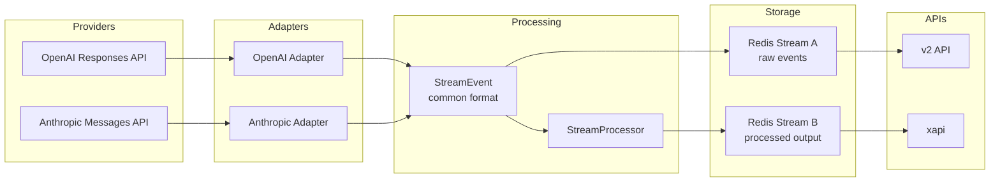
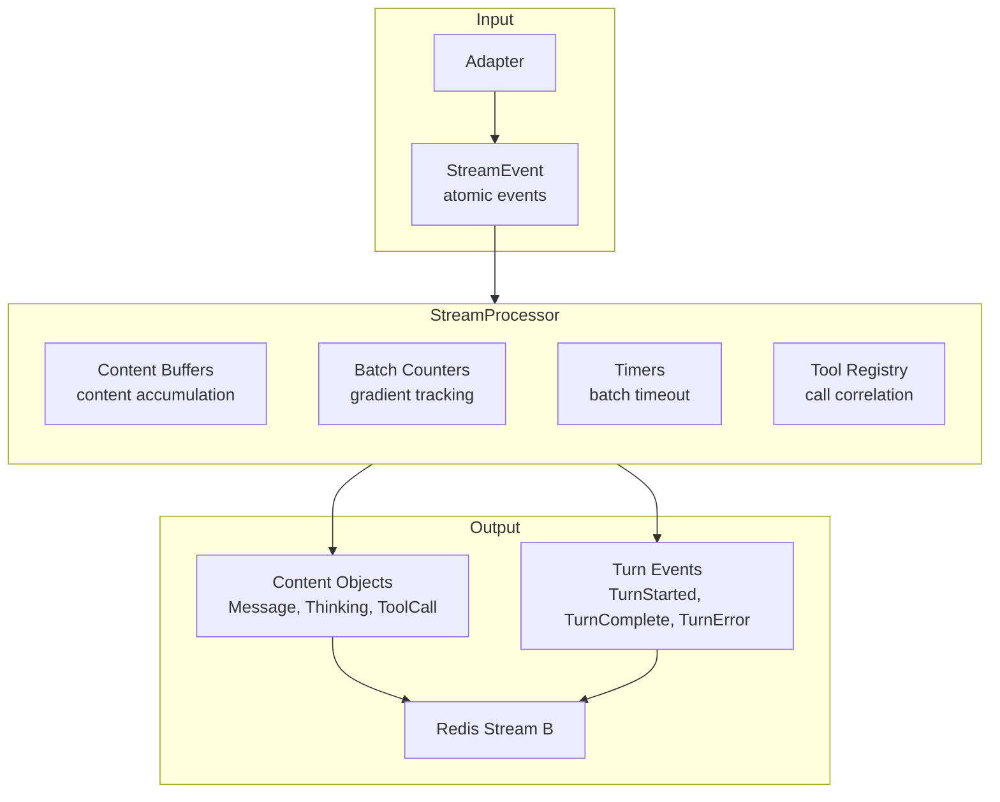

# Slice 002: Setup TDD Tests for StreamProcessor

**Project:** 04-stream-management
**Slice:** 002-setup-tdd-tests
**Status:** TDD Red Phase Complete - Ready for Implementation

---

## High-Level Architecture



---

## What We Are Transforming and Why

The adapters normalize vendor-specific streaming formats into a common StreamEvent format. This format is designed for internal system use - atomic events that can be reduced to build complete Response objects. It works well for persistence and debugging but creates complexity for UI consumption.

The UI needs to render content as it streams. With the current format, the UI must track item state, handle origin changes mid-stream, buffer deltas, detect duplicates, and manage timing. This complexity has proven difficult for coding agents to maintain without introducing bugs.

The StreamProcessor transforms the atomic StreamEvent format into UI-friendly output. Each emission contains complete current state for an item - the UI simply binds the content without tracking deltas or managing state.

**Key benefits:**
- UI becomes stateless renderer - just bind what arrives
- Batching reduces event frequency while maintaining responsiveness
- Full content per emission enables self-healing on missed events
- Server-side complexity is isolated and testable
- Same format works for streaming and persistence loading

---

## Core Data Flow



---

## Input Format: StreamEvent

This is the input to the StreamProcessor. Already defined in the codebase at `cody-fastify/src/core/schema.ts`.

**StreamEvent** - envelope for all events

| Attribute | Type | Description |
|-----------|------|-------------|
| event_id | string (uuid) | Unique identifier for this event |
| timestamp | number | Milliseconds since epoch |
| trace_context | TraceContext | Distributed tracing info |
| run_id | string (uuid) | Identifies the turn |
| type | string | Event type discriminator |
| payload | object | Type-specific payload |

**Input Event Types:**

| Event Type | Description |
|------------|-------------|
| response_start | Turn is beginning |
| item_start | New output item beginning |
| item_delta | Content chunk for an item |
| item_done | Item is complete |
| item_error | Error on specific item |
| item_cancelled | Item was cancelled |
| response_done | Turn is complete |
| response_error | Turn-level error |

**Input Item Types (item_type field):**

| Item Type | Maps To |
|-----------|---------|
| message | Message |
| reasoning | Thinking |
| function_call | ToolCall |
| function_call_output | (updates existing ToolCall) |
| error | (handled via status: "error") |

---

## Output Format

The StreamProcessor emits typed objects to Redis Stream B. There are two categories:

### Content Types

Content objects represent items within a turn. Each has a `type` field that directly identifies what it is.

**Common Fields (all content types):**

| Field | Type | Description |
|-------|------|-------------|
| type | string | "message", "thinking", or "tool_call" |
| turnId | string | Turn identifier |
| threadId | string | Thread identifier |
| itemId | string | Unique item identifier |
| status | string | "create", "update", "complete", or "error" |
| errorCode | string, optional | Present when status is "error" |
| errorMessage | string, optional | Present when status is "error" |

**Message** - Conversational text from user or agent

| Field | Type | Description |
|-------|------|-------------|
| type | "message" | Discriminator |
| content | string | Full accumulated text |
| origin | string | "user", "agent", or "system" |

**Thinking** - Model's reasoning/chain-of-thought

| Field | Type | Description |
|-------|------|-------------|
| type | "thinking" | Discriminator |
| content | string | Full accumulated thinking text |
| providerId | string | Provider (for UI filtering) |

**ToolCall** - Tool invocation with lifecycle

| Field | Type | Description |
|-------|------|-------------|
| type | "tool_call" | Discriminator |
| content | string | Usually empty |
| toolName | string | Name of the tool |
| toolArguments | object | Parsed arguments |
| callId | string | Links call to output |
| toolOutput | object or string, optional | Present on complete |
| success | boolean, optional | Present on complete |

### Turn Events

Turn events mark lifecycle transitions.

**TurnStarted** - Turn is beginning

| Field | Type | Description |
|-------|------|-------------|
| type | "turn_started" | Discriminator |
| turnId | string | Turn identifier |
| threadId | string | Thread identifier |
| modelId | string, optional | Model being used |
| providerId | string, optional | Provider being used |

**TurnComplete** - Turn finished

| Field | Type | Description |
|-------|------|-------------|
| type | "turn_complete" | Discriminator |
| turnId | string | Turn identifier |
| threadId | string | Thread identifier |
| status | string | "complete", "error", or "aborted" |
| usage | object, optional | Token counts |

**TurnError** - Turn-level failure

| Field | Type | Description |
|-------|------|-------------|
| type | "turn_error" | Discriminator |
| turnId | string | Turn identifier |
| threadId | string | Thread identifier |
| error | object | { code, message } |

### Redis Message Envelope

All outputs are wrapped for Redis:

| Field | Type | Description |
|-------|------|-------------|
| eventId | string | Unique emission identifier |
| timestamp | number | Milliseconds since epoch |
| turnId | string | For stream key construction |
| payload | string | JSON serialized content or turn event |

Stream key pattern: `codex:turn:{turnId}:processed`

---

## Status Field Semantics

The `status` field tells the UI what to do:

| Status | Meaning | UI Action |
|--------|---------|-----------|
| create | First time seeing this item | Create element, start animation |
| update | More content arrived | Update content, continue animation |
| complete | Item is finished | Update content, stop animation |
| error | Item failed | Update content, show error state |

**Emit Rules:**

Emissions are triggered by threshold crossing OR item completion:

1. **Threshold exceeded** (accumulated tokens > current threshold AND more content arrives):
   - First threshold crossing → emit with status: "create"
   - Subsequent threshold crossings → emit with status: "update"

2. **Item completion** (item_done received):
   - Emit remaining buffered content with status: "complete"
   - This may be the ONLY emission if content never exceeded any threshold

3. **Item error** (item_error received):
   - Emit with status: "error" on the same item (not a separate type)

**Key insight:** Short content that never exceeds threshold results in a single "complete" emission on item_done. No "create" or "update" emissions occur.

---

## Batch Gradient

The processor batches content to reduce emission frequency while maintaining responsiveness.

**Default Gradient:**
```
[10, 10, 10, 10, 20, 20, 20, 20, 50, 50, 50, 50, 100, 100, 200, 200, 500, 500, 500, 500, 1000, 1000, 2000]
```

After the gradient is exhausted, continue with the last value (2000).

**Cumulative Thresholds:**
- Emit 1: 10 tokens
- Emit 2: 20 tokens
- Emit 3: 30 tokens
- Emit 4: 40 tokens
- Emit 5: 60 tokens
- Emit 6: 80 tokens
- ... and so on

**Token Estimation:** characters / 4

This gradient provides responsive early streaming (small batches at start) while avoiding excessive emissions on long responses (larger batches later).

---

## StreamProcessor Methods

**constructor(options: ProcessorOptions)**

Creates a new processor instance for a single turn.

| Option | Type | Default | Description |
|--------|------|---------|-------------|
| turnId | string | required | Turn identifier |
| threadId | string | required | Thread identifier |
| batchGradient | number[] | see above | Token counts per batch level |
| batchTimeoutMs | number | 1000 | Safety fallback timeout |
| onEmit | function | required | Async callback for Redis write |
| retryAttempts | number | 3 | Retry count on emit failure |
| retryBaseMs | number | 1000 | Base delay for exponential backoff |
| retryMaxMs | number | 10000 | Maximum retry delay |

**processEvent(event: StreamEvent): Promise\<void\>**

Process a single incoming event. May buffer internally or emit immediately depending on event type and batch state.

**flush(): Promise\<void\>**

Force emit all pending buffered content. Called on turn completion.

**destroy(): void**

Cleanup all resources. Clears timers, releases buffers.

**getBufferState(): Map\<string, BufferInfo\>**

Returns current buffer state for testing/debugging.

---

## Processing Logic

### On response_start
- Store turn metadata (turnId, threadId, modelId, providerId)
- Emit turn_started immediately

### On item_start
- Create new content buffer
- Determine content type from item_type:
  - "message" → Message
  - "reasoning" → Thinking
  - "function_call" → ToolCall
- If user message (detected by item_id pattern), mark as held
- If function_call, mark as held (emit on item_done)

### On item_delta
- Append delta_content to buffer
- Increment token count (chars / 4)
- Check if batch threshold reached
- If threshold reached AND not held:
  - If first emission: emit with status "create"
  - Otherwise: emit with status "update"
  - Advance batch index
- Reset batch timer

### On item_done
- If item was held (user message or function_call):
  - Emit with status "complete" (single emission)
- Otherwise:
  - Emit with status "complete"
- For function_call: store in toolCallRegistry for correlation
- Clear buffer

### On item_done for function_call_output
- Look up original tool call via callId in toolCallRegistry
- Emit ToolCall with:
  - Same itemId as the original function_call
  - status: "complete"
  - toolOutput from the output item
  - success from the output item
- Remove from toolCallRegistry

### On item_error
- Emit content with status "error"
- Include errorCode and errorMessage on the same item
- Clear buffer

### On response_done
- Flush any remaining buffered content
- Emit turn_complete with status and usage

### On response_error
- Emit turn_error with error details

### Batch Timeout (Safety Fallback)
- Timer fires if no activity for batchTimeoutMs
- Emit current buffer as "update" (or "create" if first)
- Timer is safety net, not primary mechanism
- Normal flow uses gradient thresholds or item_done

### Retry Logic
- If onEmit fails, retry up to retryAttempts times
- Exponential backoff: retryBaseMs * 2^attempt
- Cap at retryMaxMs
- If all retries fail, throw RetryExhaustedError

---

## Tool Call Lifecycle

Tool calls have a two-phase lifecycle:

**Phase 1: function_call**
1. item_start creates buffer (held)
2. item_done triggers:
   - Store metadata in toolCallRegistry: { itemId, toolName, toolArguments, callId }
   - Emit ToolCall with status "create"

**Phase 2: function_call_output**
1. item_start is IGNORED (no buffer created)
2. item_done triggers:
   - Look up metadata by callId
   - Emit ToolCall with status "complete", same itemId, with toolOutput

**Example Flow:**

Input:
```
1. item_start { item_id: "fc-001", item_type: "function_call", name: "read_file" }
2. item_done { item_id: "fc-001", final_item: { call_id: "call-001", arguments: "{...}" } }
3. item_start { item_id: "fco-001", item_type: "function_call_output" }
4. item_done { item_id: "fco-001", final_item: { call_id: "call-001", output: "{...}", success: true } }
```

Output:
```
1. (nothing - held)
2. tool_call { itemId: "fc-001", status: "create", toolName: "read_file", callId: "call-001" }
3. (nothing - ignored)
4. tool_call { itemId: "fc-001", status: "complete", toolOutput: {...}, success: true }
```

Both emissions use `itemId: "fc-001"` - the UI sees one tool call with two status updates.

---

## User Message Handling

User messages are held until item_done to ensure correct origin.

**Why:** The adapter may emit item_start with origin "agent" (placeholder), then correct to "user" on item_done. If we emit on item_start, UI shows wrong origin briefly.

**Detection:** item_id contains "user-prompt" pattern (or check origin in final_item)

**Behavior:**
- On item_start: create buffer, mark as held
- On item_delta: buffer content (no emit)
- On item_done: emit single message with status "complete" and correct origin

No "create" or "update" emissions for user messages - just one "complete".

---

## Test Cases Summary

| TC | Name | Tests |
|----|------|-------|
| 01 | Simple Agent Message | Basic flow, short message (under threshold) |
| 02 | Batching Threshold | Gradient triggers updates |
| 03 | User Message Hold | Held until complete |
| 04 | Thinking Block | Reasoning → Thinking mapping |
| 05 | Tool Call and Output | Two-phase lifecycle |
| 06 | Multiple Tool Calls | Sequential tools |
| 07 | Item Error Mid-Stream | Error as status on same item |
| 08 | Response Error | turn_error event |
| 09 | Batch Timeout | Safety fallback |
| 10 | Gradient Progression | Multiple threshold crossings |
| 11 | Empty Content | Item with no content |
| 12 | Flush on Destroy | Buffered content emitted |
| 13 | Retry Success | Retry recovers |
| 14 | Retry Exhausted | RetryExhaustedError thrown |
| 15 | Exactly At Threshold | Threshold met but not exceeded |
| 16 | Threshold Plus One | Minimal threshold exceed |
| 17 | Single Delta Multiple Thresholds | Bulk content crosses multiple |

---

## Test Layer Architecture

### Overview

Tests use Bun's test framework (`bun test`). Service-mocked unit tests - no external dependencies. Processor tested in isolation via mock onEmit callback.

### Test Strategy

1. Create processor with mock onEmit that captures emissions
2. Feed StreamEvent objects sequentially via processEvent()
3. Capture StreamMessage objects emitted via callback
4. Assert captured outputs match expected fixtures

Each test is scoped to **one turn**:
- Starts with response_start
- Ends with response_done or response_error
- One processor instance per test

### File Structure

```
cody-fastify/src/core/upsert-stream-processor/
├── __tests__/
│   ├── fixtures/
│   │   ├── types.ts
│   │   ├── tc-01-simple-message.ts
│   │   ├── tc-02-batching.ts
│   │   └── ... (tc-03 through tc-14)
│   ├── helpers.ts
│   └── processor.test.ts
├── index.ts
├── types.ts
├── processor.ts
├── content-buffer.ts
└── utils.ts
```

### Running Tests

```bash
# From cody-fastify directory
bun test

# Run specific test
bun test src/core/upsert-stream-processor/__tests__/processor.test.ts

# Verbose output
bun test --verbose
```

### Current State

- 14 test fixtures created
- All tests fail with NotImplementedError (TDD Red phase)
- Ready for implementation (TDD Green phase)

---

## Detailed Test Specifications

### TC-01: Simple Agent Message

**Purpose:** Basic flow - response starts, agent sends short message, response completes.

**Input Events:**
1. response_start (provider: "anthropic", model: "claude-sonnet-4-20250514")
2. item_start (item_id: "msg-01-001", item_type: "message")
3. item_delta (delta_content: "Hello there!" - 12 chars, ~3 tokens)
4. item_done (final_item: { content: "Hello there!", origin: "agent" })
5. response_done (status: "complete", usage: { prompt: 10, completion: 3, total: 13 })

**Expected Outputs:**
1. turn_started { turnId, threadId, modelId, providerId }
2. message { itemId: "msg-01-001", status: "complete", content: "Hello there!", origin: "agent" }
3. turn_complete { turnId, threadId, status: "complete", usage }

Note: Only one message emission because content (~3 tokens) never exceeded threshold (10). No "create" emission.

---

### TC-02: Agent Message With Batching

**Purpose:** Verify batch gradient triggers "update" emissions.

**Processor Options:** batchGradient: [10, 10, 20]

**Input Events:** response_start, item_start, 3 item_deltas (~11, ~10, ~11 tokens), item_done, response_done

**Expected Outputs:**
1. turn_started
2. message { status: "create" } - after first delta crosses threshold
3. message { status: "update" } - after second delta crosses next threshold
4. message { status: "complete" } - on item_done
5. turn_complete

---

### TC-03: User Message (Held)

**Purpose:** User messages held until item_done, single "complete" emission.

**Input Events:** response_start, item_start (item_id contains "user-prompt"), item_done (origin: "user"), agent message events, response_done

**Expected Outputs:**
1. turn_started
2. message { status: "complete", origin: "user" } - single emission, no create/update
3. message { status: "create", origin: "agent" }
4. message { status: "complete", origin: "agent" }
5. turn_complete

---

### TC-04: Thinking Block

**Purpose:** Reasoning input maps to Thinking output.

**Input Events:** response_start (provider: "anthropic"), item_start (item_type: "reasoning"), deltas, item_done, agent message, response_done

**Expected Outputs:**
1. turn_started { providerId: "anthropic" }
2. thinking { status: "create", providerId: "anthropic" }
3. thinking { status: "update" } (if threshold crossed)
4. thinking { status: "complete" }
5. message { status: "create", origin: "agent" }
6. message { status: "complete" }
7. turn_complete

---

### TC-05: Tool Call and Output

**Purpose:** Two-phase tool call lifecycle.

**Input Events:**
1. response_start
2. item_start (function_call, name: "read_file")
3. item_done (function_call with call_id, arguments)
4. item_start (function_call_output)
5. item_done (function_call_output with output, success)
6. agent message events
7. response_done

**Expected Outputs:**
1. turn_started
2. tool_call { itemId: "fc-05-001", status: "create", toolName: "read_file", callId }
3. tool_call { itemId: "fc-05-001", status: "complete", toolOutput, success: true }
4. message { status: "create" }
5. message { status: "complete" }
6. turn_complete

Note: Both tool_call emissions use same itemId.

---

### TC-06: Multiple Tool Calls

**Purpose:** Sequential tool calls, each with create/complete lifecycle.

**Expected Outputs:**
1. turn_started
2. tool_call #1 { status: "create" }
3. tool_call #1 { status: "complete" }
4. tool_call #2 { status: "create" }
5. tool_call #2 { status: "complete" }
6. message { status: "create" }
7. message { status: "complete" }
8. turn_complete

---

### TC-07: Item Error Mid-Stream

**Purpose:** Error is status on same item, not separate type.

**Input Events:** response_start, item_start (message), item_delta (partial), item_error (CONTENT_FILTER), response_done

**Expected Outputs:**
1. turn_started
2. message { itemId: "msg-07-001", status: "create", content: "partial..." }
3. message { itemId: "msg-07-001", status: "error", content: "partial...", errorCode: "CONTENT_FILTER", errorMessage }
4. turn_complete { status: "error" }

Note: Same itemId for create and error.

---

### TC-08: Response Error

**Purpose:** Turn-level error produces turn_error, not turn_complete.

**Input Events:** response_start, response_error (PROVIDER_ERROR)

**Expected Outputs:**
1. turn_started
2. turn_error { error: { code: "PROVIDER_ERROR", message } }

---

### TC-09: Batch Timeout

**Purpose:** Safety fallback fires when stream stalls.

**Setup:** batchTimeoutMs: 50, delay between events

**Expected Outputs:**
1. turn_started
2. message { status: "create" }
3. message { status: "update" } - timeout triggered
4. message { status: "complete" }
5. turn_complete

---

### TC-10: Gradient Progression

**Purpose:** Long response exercises multiple batch levels.

**Expected:** Multiple "update" emissions as content grows, following gradient thresholds.

---

### TC-11: Empty Content

**Purpose:** Item with no content still emits "complete".

**Expected Outputs:**
1. turn_started
2. message { status: "complete", content: "" }
3. turn_complete

---

### TC-12: Flush on Destroy

**Purpose:** Buffered content emitted on destroy.

**Input:** response_start, item_start, item_delta, then destroy() (no item_done)

**Expected Outputs:**
1. turn_started
2. message { status: "create", content: "buffered content" }

Only 2 emissions. The "create" was emitted on delta. No item_done means no "complete". Destroy doesn't emit if no new content since last emit.

---

### TC-13: Retry Success

**Purpose:** Retry recovers from transient failure.

**Setup:** onEmit fails once then succeeds

**Expected:** turn_started eventually delivered after retry.

---

### TC-14: Retry Exhausted

**Purpose:** All retries fail, RetryExhaustedError thrown.

**Setup:** onEmit always fails, retryAttempts: 3

**Expected:** processEvent throws RetryExhaustedError.

---

### TC-15: Exactly At Threshold

**Purpose:** Boundary condition - content exactly at threshold (met but not exceeded).

**Input Events:**
1. response_start
2. item_start (item_id: "msg-15-001", item_type: "message")
3. item_delta (40 chars = exactly 10 tokens = exactly threshold)
4. item_done
5. response_done

**Expected Outputs:**
1. turn_started
2. message { status: "complete" } - only emission, threshold was met but not exceeded
3. turn_complete

Note: No "create" emission because threshold (10) was met exactly, not exceeded.

---

### TC-16: Threshold Plus One

**Purpose:** Minimal threshold exceed - 10 tokens, then 1 more arrives.

**Input Events:**
1. response_start
2. item_start
3. item_delta #1 (40 chars = 10 tokens, at threshold)
4. item_delta #2 (4 chars = 1 token, exceeds threshold)
5. item_done
6. response_done

**Expected Outputs:**
1. turn_started
2. message { status: "create" } - emitted when delta #2 arrives and exceeds threshold
3. message { status: "complete" } - on item_done
4. turn_complete

---

### TC-17: Single Delta Crosses Multiple Thresholds

**Purpose:** One large delta that would cross multiple thresholds only emits once.

**Processor Options:** batchGradient: [10, 10, 20] (thresholds at 10, 20, 40)

**Input Events:**
1. response_start
2. item_start
3. item_delta (100 chars = 25 tokens, crosses 10 and 20 thresholds)
4. item_done
5. response_done

**Expected Outputs:**
1. turn_started
2. message { status: "create" } - single emission (batch index advances to match)
3. message { status: "complete" } - on item_done
4. turn_complete

Note: Even though 25 tokens crosses thresholds at 10 and 20, we only emit once per delta.

---

## Implementation Checklist

- [ ] Implement ContentBuffer methods
- [ ] Implement StreamProcessor.processEvent() routing
- [ ] Implement handleResponseStart
- [ ] Implement handleItemStart (with content type mapping)
- [ ] Implement handleItemDelta (with batch gradient logic)
- [ ] Implement handleItemDone (with tool call registry)
- [ ] Implement handleItemError
- [ ] Implement handleResponseDone
- [ ] Implement handleResponseError
- [ ] Implement flush()
- [ ] Implement destroy()
- [ ] Implement retry logic with exponential backoff
- [ ] Run tests - all 17 should pass

---

## Verification

**Typecheck:**
```bash
cd cody-fastify && bun run typecheck
# Expected: 0 errors
```

**Tests (current state - TDD Red):**
```bash
cd cody-fastify && bun test src/core/upsert-stream-processor/
# Expected: 17 tests, 17 fail with NotImplementedError
```

**Tests (after implementation - TDD Green):**
```bash
cd cody-fastify && bun test src/core/upsert-stream-processor/
# Expected: 17 tests, 17 pass
```
