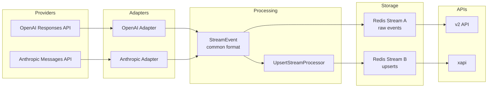
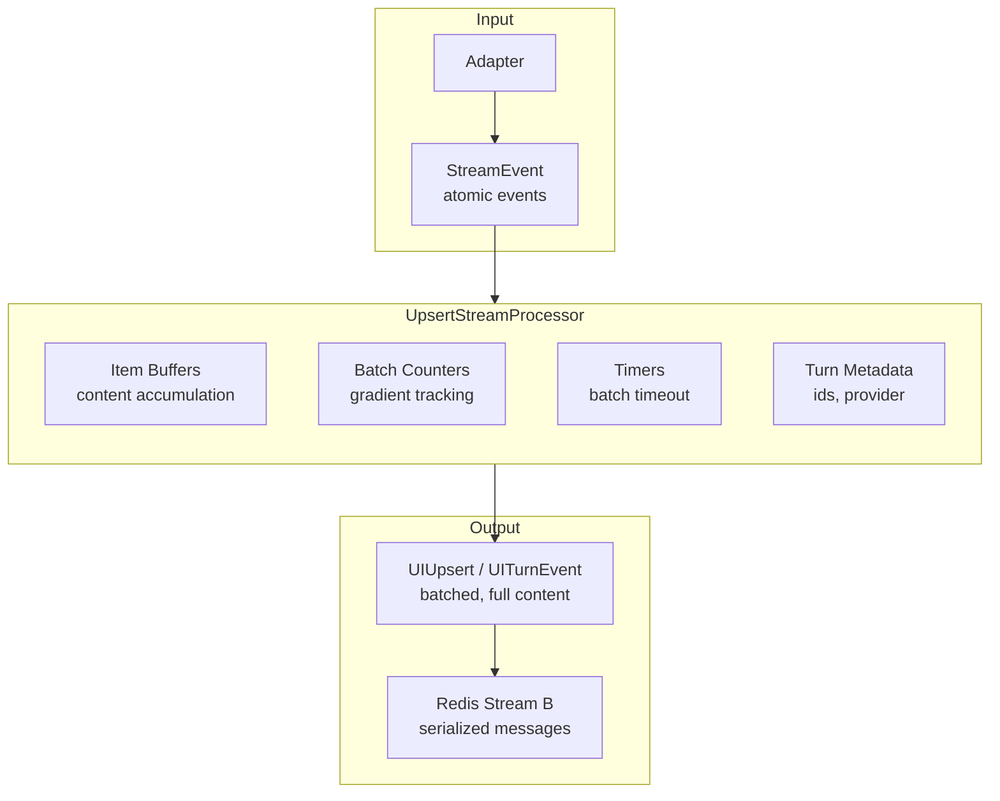

# Slice 002: Setup TDD Tests for UpsertStreamProcessor

**Project:** 04-stream-management
**Slice:** 002-setup-tdd-tests
**Status:** In Progress

---

## High-Level Architecture



---

## What We Are Transforming and Why

The adapters normalize vendor-specific streaming formats into a common StreamEvent format. This format is designed for internal system use - atomic events that can be reduced to build complete Response objects. It works well for persistence and debugging but creates complexity for UI consumption.

The UI needs to render content as it streams. With the current format, the UI must track item state, handle origin changes mid-stream, buffer deltas, detect duplicates, and manage timing. This complexity has proven difficult for coding agents to maintain without introducing bugs.

The UpsertStreamProcessor transforms the atomic StreamEvent format into a UI-friendly UIUpsert format. Each upsert contains complete current state for an item - the UI simply binds the content without tracking deltas or managing state.

**Key benefits:**
- UI becomes stateless renderer - just bind what arrives
- Batching reduces event frequency while maintaining responsiveness
- Full content per upsert enables self-healing on missed events
- Server-side complexity is isolated and testable
- Same format works for streaming and persistence loading

---

## Core Data Flow



---

## Post-Adapter Format: StreamEvent

This is the input to the UpsertStreamProcessor. Already defined in the codebase, summarized here for reference.

**StreamEvent** - envelope for all events

| Attribute | Type | Description |
|-----------|------|-------------|
| event_id | string (uuid) | Unique identifier for this event |
| timestamp | number | Milliseconds since epoch |
| trace_context | TraceContext | Distributed tracing info |
| run_id | string (uuid) | Identifies the turn/run |
| type | string | Event type discriminator |
| payload | object | Type-specific payload |

**Payload Types:**

**response_start** - Turn is beginning

| Attribute | Type | Description |
|-----------|------|-------------|
| type | "response_start" | Discriminator |
| response_id | string (uuid) | Same as run_id |
| turn_id | string (uuid) | Turn identifier |
| thread_id | string (uuid) | Thread identifier |
| agent_id | string (uuid), optional | Agent identifier |
| model_id | string | Model identifier |
| provider_id | string | Provider (e.g., "anthropic", "openai") |
| created_at | number | Timestamp |

**item_start** - New output item beginning

| Attribute | Type | Description |
|-----------|------|-------------|
| type | "item_start" | Discriminator |
| item_id | string | Unique item identifier |
| item_type | string | One of: message, reasoning, function_call, function_call_output, error |
| initial_content | string, optional | Starting content if any |
| name | string, optional | Tool name for function_call |
| arguments | string, optional | Initial arguments for function_call |
| code | string, optional | For script_execution |

**item_delta** - Content chunk for an item

| Attribute | Type | Description |
|-----------|------|-------------|
| type | "item_delta" | Discriminator |
| item_id | string | Which item this delta belongs to |
| delta_content | string | The new content chunk |

**item_done** - Item is complete

| Attribute | Type | Description |
|-----------|------|-------------|
| type | "item_done" | Discriminator |
| item_id | string | Which item completed |
| final_item | OutputItem | Complete item with all fields |

**item_error** - Error on specific item

| Attribute | Type | Description |
|-----------|------|-------------|
| type | "item_error" | Discriminator |
| item_id | string | Which item errored |
| error | ErrorObject | Error details (code, message, stack) |

**response_done** - Turn is complete

| Attribute | Type | Description |
|-----------|------|-------------|
| type | "response_done" | Discriminator |
| response_id | string (uuid) | Which response completed |
| status | string | One of: complete, error, aborted |
| usage | object, optional | Token counts (prompt, completion, total) |
| finish_reason | string, nullable | Why generation stopped |

**response_error** - Turn-level error

| Attribute | Type | Description |
|-----------|------|-------------|
| type | "response_error" | Discriminator |
| response_id | string (uuid) | Which response errored |
| error | ErrorObject | Error details |

---

## Post-Processor Format: UIUpsert and UITurnEvent

These are the outputs from the UpsertStreamProcessor.

### UIUpsert - Item content update

| Attribute | Type | Description |
|-----------|------|-------------|
| type | "item_upsert" | Discriminator |
| turnId | string (uuid) | Turn this belongs to |
| threadId | string (uuid) | Thread this belongs to |
| itemId | string | Item identifier |
| itemType | string | One of: message, reasoning, tool_call, tool_output, error |
| changeType | string | One of: created, updated, completed |
| content | string | Full accumulated content up to this point |
| origin | string, optional | For messages: user, agent, or system |
| providerId | string, optional | For reasoning: which provider (for UI filtering) |
| toolName | string, optional | For tool_call: name of the tool |
| toolArguments | object, optional | For tool_call: parsed arguments |
| callId | string, optional | For tool_call and tool_output: links them together |
| toolOutput | object or string, optional | For tool_output: parsed result |
| success | boolean, optional | For tool_output: whether tool succeeded |
| errorCode | string, optional | For error: error code |
| errorMessage | string, optional | For error: error description |

### UITurnEvent - Turn lifecycle event

| Attribute | Type | Description |
|-----------|------|-------------|
| type | string | One of: turn_started, turn_completed, turn_error |
| turnId | string (uuid) | Turn identifier |
| threadId | string (uuid) | Thread identifier |
| modelId | string, optional | For turn_started: model being used |
| providerId | string, optional | For turn_started: provider being used |
| status | string, optional | For turn_completed: complete, error, or aborted |
| usage | object, optional | For turn_completed: promptTokens, completionTokens, totalTokens |
| error | object, optional | For turn_error: code and message |

### Redis Stream B Message - Envelope for Redis

| Attribute | Type | Description |
|-----------|------|-------------|
| eventId | string (uuid) | Unique identifier for this emission |
| timestamp | number | Milliseconds since epoch |
| turnId | string (uuid) | For stream key construction |
| payloadType | string | Either "item_upsert" or "turn_event" |
| payload | string | JSON serialized UIUpsert or UITurnEvent |

Stream key pattern: `codex:turn:{turnId}:upserts`

---

## UpsertStreamProcessor Methods

**constructor(options: UpsertStreamProcessorOptions)**

Creates a new processor instance for a single turn.

Options:
| Option | Type | Description |
|--------|------|-------------|
| turnId | string (uuid) | Turn identifier |
| threadId | string (uuid) | Thread identifier |
| batchGradient | number[] | Token counts per batch level, e.g., [10, 10, 20, 20, 50, ...] |
| batchTimeoutMs | number | Max milliseconds before forcing batch emit, default 1000 (safety fallback, not primary mechanism) |
| onEmit | function | Async callback receiving StreamBMessage to write to Redis |
| retryAttempts | number | Number of retry attempts on emit failure, default 3 |
| retryBaseMs | number | Base delay for exponential backoff, default 1000 |
| retryMaxMs | number | Maximum retry delay, default 10000 |

**processEvent(event: StreamEvent): Promise\<void\>**

Process a single incoming event. May buffer internally or emit immediately depending on event type and batch state.

**flush(): Promise\<void\>**

Force emit all pending buffered content. Called on turn completion or error.

**destroy(): void**

Cleanup all resources. Clears timers, releases buffers. Must be called when processor is no longer needed to prevent memory leaks.

**getBufferState(): Map\<string, BufferInfo\>**

Returns current buffer state for testing/debugging. BufferInfo contains itemId, tokenCount, content length, and batch index.

---

## Functional Description

The UpsertStreamProcessor maintains internal state for each item in a turn. When events arrive:

**On response_start:**
- Store turn metadata (turnId, threadId, modelId, providerId)
- Emit turn_started event immediately

**On item_start:**
- Create new item buffer
- If item is a user message (detected by item_id pattern or origin), mark as held
- If initial_content provided and not held, may emit created upsert

**On item_delta:**
- Append delta_content to item buffer
- Increment token count (estimated as character count divided by 4)
- Check if batch threshold reached (based on gradient and current batch index)
- If threshold reached, emit updated upsert with full accumulated content, advance batch index
- Reset batch timer

**On item_done:**
- If item was held (user message), emit single created+completed upsert with correct origin
- Otherwise emit completed upsert with final content
- Clear item buffer

**On item_error:**
- Emit error upsert for the item
- Clear item buffer

**On response_done:**
- Flush any remaining buffered content
- Emit turn_completed event with status and usage

**On response_error:**
- Flush any remaining buffered content
- Emit turn_error event

**Batch timing:**
- Each item has a batch timer (default 1000ms)
- Timer is a safety fallback, not the primary batching mechanism
- Normal flow: batch gradient thresholds or item_done trigger emits
- Timer only fires if stream stalls, packets lost, or provider delays
- Timer resets on each delta
- If timer fires, emit current buffered content as "updated"

**Retry logic:**
- If onEmit fails, retry up to retryAttempts times
- Use exponential backoff starting at retryBaseMs
- Cap delay at retryMaxMs
- If all retries fail, throw error

---

## Output Object Types

### Message Upsert (user)

Emitted once when user message item completes. Held until item_done to ensure correct origin.

| Field | Value |
|-------|-------|
| type | "item_upsert" |
| itemType | "message" |
| changeType | "completed" |
| origin | "user" |
| content | Full message text |

### Message Upsert (agent)

Emitted multiple times as content streams. First emission is "created", subsequent are "updated", final is "completed".

| Field | Value |
|-------|-------|
| type | "item_upsert" |
| itemType | "message" |
| changeType | "created" or "updated" or "completed" |
| origin | "agent" |
| content | Full accumulated text so far |

### Reasoning Upsert

Emitted for thinking/reasoning blocks. Includes providerId so UI can decide whether to display.

| Field | Value |
|-------|-------|
| type | "item_upsert" |
| itemType | "reasoning" |
| changeType | "created" or "updated" or "completed" |
| providerId | "anthropic" or "openai" etc |
| content | Full accumulated reasoning text |

### Tool Call Upsert

Emitted when function_call item completes. Not streamed (arguments come complete).

| Field | Value |
|-------|-------|
| type | "item_upsert" |
| itemType | "tool_call" |
| changeType | "completed" |
| toolName | Name of the tool |
| toolArguments | Parsed arguments object |
| callId | Identifier linking to output |

### Tool Output Upsert

Emitted when function_call_output item completes.

| Field | Value |
|-------|-------|
| type | "item_upsert" |
| itemType | "tool_output" |
| changeType | "completed" |
| callId | Links to corresponding tool_call |
| toolOutput | Parsed output object or string |
| success | Boolean indicating success |

### Error Upsert

Emitted on item_error.

| Field | Value |
|-------|-------|
| type | "item_upsert" |
| itemType | "error" |
| changeType | "completed" |
| errorCode | Error code string |
| errorMessage | Error description |

### Turn Started Event

Emitted immediately on response_start.

| Field | Value |
|-------|-------|
| type | "turn_started" |
| turnId | Turn identifier |
| threadId | Thread identifier |
| modelId | Model being used |
| providerId | Provider being used |

### Turn Completed Event

Emitted on response_done after flushing buffers.

| Field | Value |
|-------|-------|
| type | "turn_completed" |
| turnId | Turn identifier |
| threadId | Thread identifier |
| status | "complete" or "error" or "aborted" |
| usage | Token counts if available |

### Turn Error Event

Emitted on response_error.

| Field | Value |
|-------|-------|
| type | "turn_error" |
| turnId | Turn identifier |
| threadId | Thread identifier |
| error | Object with code and message |

---

## Functional Test Cases

### TC-01: Simple Agent Message

**Scenario:** Agent responds with a short message under one batch threshold.

**Input events:**
1. response_start with provider "anthropic"
2. item_start with item_id "msg-1", item_type "message"
3. item_delta with delta_content "Hello there!"
4. item_done with final_item containing content "Hello there!", origin "agent"
5. response_done with status "complete"

**Expected outputs:**
1. turn_started event with modelId, providerId
2. item_upsert: itemType "message", changeType "created", content "Hello there!", origin "agent"
3. item_upsert: itemType "message", changeType "completed", content "Hello there!", origin "agent"
4. turn_completed event with status "complete"

---

### TC-02: Agent Message With Batching

**Scenario:** Agent responds with content that exceeds first batch threshold (10 tokens).

**Input events:**
1. response_start
2. item_start with item_id "msg-1", item_type "message"
3. item_delta with 20 characters (~5 tokens) "Hello, how are you?"
4. item_delta with 30 characters (~8 tokens) " I hope you're having a great"
5. item_delta with 20 characters (~5 tokens) " day today!"
6. item_done with final content
7. response_done

**Expected outputs:**
1. turn_started
2. item_upsert: changeType "created", content "Hello, how are you?" (after first delta, under threshold)
3. item_upsert: changeType "updated", content "Hello, how are you? I hope you're having a great" (threshold crossed)
4. item_upsert: changeType "completed", content "Hello, how are you? I hope you're having a great day today!"
5. turn_completed

---

### TC-03: User Message (Held Until Complete)

**Scenario:** User message should not emit until item_done to ensure correct origin.

**Input events:**
1. response_start
2. item_start with item_id "run-123-user-prompt", item_type "message"
3. item_done with final_item containing content "What is the weather?", origin "user"
4. (agent response events...)
5. response_done

**Expected outputs:**
1. turn_started
2. item_upsert: itemType "message", changeType "completed", content "What is the weather?", origin "user"
3. (agent response upserts...)
4. turn_completed

Note: No "created" or "updated" emitted for user message - single "completed" emission.

---

### TC-04: Anthropic Reasoning Block

**Scenario:** Anthropic model emits thinking/reasoning before response.

**Input events:**
1. response_start with provider "anthropic"
2. item_start with item_type "reasoning"
3. item_delta with reasoning content (multiple deltas)
4. item_done for reasoning
5. item_start with item_type "message"
6. item_delta with message content
7. item_done for message
8. response_done

**Expected outputs:**
1. turn_started with providerId "anthropic"
2. item_upsert: itemType "reasoning", changeType "created", providerId "anthropic"
3. item_upsert: itemType "reasoning", changeType "updated" (if batching triggers)
4. item_upsert: itemType "reasoning", changeType "completed"
5. item_upsert: itemType "message", changeType "created"
6. item_upsert: itemType "message", changeType "completed"
7. turn_completed

---

### TC-05: Tool Call and Output

**Scenario:** Agent calls a tool and receives output.

**Input events:**
1. response_start
2. item_start with item_type "function_call", name "read_file"
3. item_done with final_item containing name "read_file", arguments '{"path": "/tmp/test.txt"}', call_id "call-1"
4. item_start with item_type "function_call_output"
5. item_done with final_item containing call_id "call-1", output '{"content": "file contents"}', success true
6. (agent continues with message...)
7. response_done

**Expected outputs:**
1. turn_started
2. item_upsert: itemType "tool_call", changeType "completed", toolName "read_file", toolArguments {path: "/tmp/test.txt"}, callId "call-1"
3. item_upsert: itemType "tool_output", changeType "completed", callId "call-1", toolOutput {content: "file contents"}, success true
4. (message upserts...)
5. turn_completed

---

### TC-06: Multiple Tool Calls in Sequence

**Scenario:** Agent calls multiple tools before responding.

**Input events:**
1. response_start
2. function_call "read_file" with call_id "call-1"
3. function_call_output for "call-1"
4. function_call "write_file" with call_id "call-2"
5. function_call_output for "call-2"
6. agent message
7. response_done

**Expected outputs:**
1. turn_started
2. tool_call upsert for "read_file"
3. tool_output upsert for call-1
4. tool_call upsert for "write_file"
5. tool_output upsert for call-2
6. message upserts
7. turn_completed

---

### TC-07: Item Error Mid-Stream

**Scenario:** An item encounters an error during processing.

**Input events:**
1. response_start
2. item_start for message
3. item_delta with partial content
4. item_error with error code "CONTENT_FILTER", message "Content blocked"
5. response_done with status "error"

**Expected outputs:**
1. turn_started
2. item_upsert: changeType "created" with partial content
3. item_upsert: itemType "error", errorCode "CONTENT_FILTER", errorMessage "Content blocked"
4. turn_completed with status "error"

---

### TC-08: Response Error

**Scenario:** Turn-level error occurs.

**Input events:**
1. response_start
2. response_error with error code "RATE_LIMIT", message "Too many requests"

**Expected outputs:**
1. turn_started
2. turn_error with error code "RATE_LIMIT", message "Too many requests"

---

### TC-09: Batch Timeout (Safety Fallback)

**Scenario:** Stream stalls, timeout forces emit of buffered content.

**Setup:**
- batchTimeoutMs set to 1000ms (or shorter for test)

**Input events:**
1. response_start
2. item_start for message
3. item_delta with 10 characters (~2 tokens)
4. (timeout period passes with no more deltas)
5. item_delta with 10 more characters
6. item_done

**Expected outputs:**
1. turn_started
2. item_upsert: changeType "created" with first delta content
3. item_upsert: changeType "updated" with accumulated content (after timeout fires)
4. item_upsert: changeType "updated" with more content (or merged with next)
5. item_upsert: changeType "completed"
6. turn_completed

Note: In normal operation, batch gradient or item_done triggers emits before timeout. This test verifies the safety fallback.

---

### TC-10: Batch Gradient Progression

**Scenario:** Long response exercises multiple batch gradient levels.

**Input events:**
1. response_start
2. item_start for message
3. Multiple item_deltas totaling ~500 tokens

**Expected outputs:**
1. turn_started
2. Upserts at approximately: 10, 20, 40, 60, 110, 160, 210, 260, 360, 460 tokens (following gradient)
3. Final completed upsert
4. turn_completed

Gradient: [10, 10, 20, 20, 50, 50, 50, 50, 100, 100, ...]
Cumulative thresholds: 10, 20, 40, 60, 110, 160, 210, 260, 360, 460, ...

---

### TC-11: Empty Content Item

**Scenario:** Item starts and completes with no content.

**Input events:**
1. response_start
2. item_start with item_type "message", no initial_content
3. item_done with empty content
4. response_done

**Expected outputs:**
1. turn_started
2. item_upsert: changeType "completed", content "" (empty string)
3. turn_completed

---

### TC-12: Flush on Destroy

**Scenario:** Processor destroyed with content still buffered.

**Input events:**
1. response_start
2. item_start for message
3. item_delta with content
4. (destroy() called without item_done or response_done)

**Expected behavior:**
- flush() should be called implicitly or explicitly before destroy()
- Any buffered content should be emitted
- Timers should be cleared
- No memory leaks

---

### TC-13: Redis Emit Retry

**Scenario:** First emit attempt fails, retry succeeds.

**Setup:**
- onEmit configured to fail once then succeed

**Input events:**
1. response_start

**Expected behavior:**
- First emit attempt fails
- Wait 1 second (retryBaseMs)
- Second emit attempt succeeds
- turn_started event eventually delivered

---

### TC-14: Redis Emit Retry Exhausted

**Scenario:** All retry attempts fail.

**Setup:**
- onEmit configured to always fail
- retryAttempts set to 3

**Input events:**
1. response_start

**Expected behavior:**
- Attempt 1 fails, wait 1s
- Attempt 2 fails, wait 2s
- Attempt 3 fails, wait 4s (capped at 10s)
- Attempt 4 fails
- processEvent throws error after retries exhausted

---

## Test Layer Architecture

### Overview

The UpsertStreamProcessor is tested using Bun's built-in test framework (`bun test`). Tests are service-mocked unit tests - they run in-process with no external dependencies (no Redis, no network). The processor is tested in isolation by mocking the `onEmit` callback.

### Processor Lifecycle in Production

In production, the adapter creates and manages the processor:

1. Client submits prompt via API
2. Adapter's `stream()` method is called
3. Adapter creates new `UpsertStreamProcessor` instance with `onEmit` callback that writes to Redis Stream B
4. Adapter calls provider API (OpenAI/Anthropic)
5. As provider streams events, adapter transforms each to `StreamEvent` format
6. Adapter calls `processor.processEvent(streamEvent)` for each event
7. Processor buffers, batches, and calls `onEmit(StreamBMessage)` as thresholds are reached
8. When provider stream completes, adapter calls `processor.destroy()`

Key points:
- **One processor instance per turn** - not a singleton
- **Created by adapter** when turn starts
- **Fed events sequentially** via `processEvent()`
- **Outputs captured** via `onEmit` callback
- **Destroyed** when turn ends

### Test Strategy

Tests simulate what the adapter does:

1. Create processor with mock `onEmit` that captures emissions
2. Feed `StreamEvent` objects one at a time (simulating adapter output)
3. Capture `StreamBMessage` objects emitted via callback
4. Assert captured outputs match expected fixtures

Each test is scoped to **one turn**:
- Starts with `response_start` event
- Ends with `response_done` or `response_error` event
- One processor instance created and destroyed per test

No multi-turn tests needed - processor has no knowledge of previous or future turns.

### Bun Test Framework

Bun provides a Jest-compatible test runner with:
- `describe()` for test suites
- `test()` or `it()` for individual tests
- `expect()` for assertions
- `beforeEach()` / `afterEach()` for setup/teardown
- Built-in TypeScript support (no compilation step)
- Fast execution (native runtime)

Test files: `*.test.ts` in `cody-fastify/src/core/upsert-stream-processor/__tests__/`

Run tests: `bun test` from `cody-fastify/` directory

### File Structure

```
cody-fastify/src/core/upsert-stream-processor/
├── __tests__/
│   ├── fixtures/
│   │   ├── types.ts              # TestFixture interface
│   │   ├── tc-01-simple-message.ts
│   │   ├── tc-02-batching.ts
│   │   ├── tc-03-user-message.ts
│   │   ├── tc-04-reasoning.ts
│   │   ├── tc-05-tool-call.ts
│   │   ├── tc-06-multiple-tools.ts
│   │   ├── tc-07-item-error.ts
│   │   ├── tc-08-response-error.ts
│   │   ├── tc-09-batch-timeout.ts
│   │   ├── tc-10-gradient-progression.ts
│   │   ├── tc-11-empty-content.ts
│   │   ├── tc-12-flush-on-destroy.ts
│   │   ├── tc-13-retry-success.ts
│   │   └── tc-14-retry-exhausted.ts
│   ├── helpers.ts                # Test utilities
│   └── processor.test.ts         # Main test file
├── index.ts
├── types.ts
├── processor.ts
├── item-buffer.ts
└── utils.ts
```

### Fixture Format

```typescript
// __tests__/fixtures/types.ts

import type { StreamEvent } from '../../../schema.js';
import type { StreamBMessage } from '../../types.js';

export interface TestFixture {
  /** Test case identifier (e.g., "TC-01") */
  id: string;

  /** Human-readable test name */
  name: string;

  /** Description of what this test verifies */
  description: string;

  /** Processor options overrides (optional) */
  options?: {
    batchGradient?: number[];
    batchTimeoutMs?: number;
    retryAttempts?: number;
    retryBaseMs?: number;
    retryMaxMs?: number;
  };

  /** Input: Array of StreamEvents to feed to processEvent() in order */
  input: StreamEvent[];

  /** Expected: Array of StreamBMessages that onEmit should receive */
  expected: ExpectedMessage[];

  /** For retry tests: configure onEmit behavior */
  onEmitBehavior?: OnEmitBehavior;
}

export interface ExpectedMessage {
  /** Payload type to verify */
  payloadType: 'item_upsert' | 'turn_event';

  /** Parsed payload to match against (partial matching supported) */
  payload: Partial<UIUpsert | UITurnEvent>;
}

export type OnEmitBehavior =
  | { type: 'success' }                          // Always succeed
  | { type: 'fail_then_succeed'; failCount: number }  // Fail N times then succeed
  | { type: 'always_fail' };                     // Always fail
```

### Test Helpers

```typescript
// __tests__/helpers.ts

import { UpsertStreamProcessor } from '../processor.js';
import type { StreamEvent } from '../../../schema.js';
import type { StreamBMessage, UpsertStreamProcessorOptions } from '../types.js';
import type { TestFixture, OnEmitBehavior } from './fixtures/types.js';

/** Captured emission for assertions */
export interface CapturedEmission {
  message: StreamBMessage;
  timestamp: number;
}

/** Result of running a test fixture */
export interface TestResult {
  emissions: CapturedEmission[];
  errors: Error[];
}

/**
 * Creates a mock onEmit function that captures emissions
 */
export function createMockOnEmit(
  behavior: OnEmitBehavior = { type: 'success' }
): {
  onEmit: (message: StreamBMessage) => Promise<void>;
  getEmissions: () => CapturedEmission[];
  getCallCount: () => number;
} {
  const emissions: CapturedEmission[] = [];
  let callCount = 0;
  let failuresRemaining = behavior.type === 'fail_then_succeed' ? behavior.failCount : 0;

  const onEmit = async (message: StreamBMessage): Promise<void> => {
    callCount++;

    if (behavior.type === 'always_fail') {
      throw new Error('Mock Redis failure');
    }

    if (behavior.type === 'fail_then_succeed' && failuresRemaining > 0) {
      failuresRemaining--;
      throw new Error('Mock Redis failure');
    }

    emissions.push({
      message,
      timestamp: Date.now(),
    });
  };

  return {
    onEmit,
    getEmissions: () => emissions,
    getCallCount: () => callCount,
  };
}

/**
 * Runs a test fixture and returns results
 */
export async function runFixture(fixture: TestFixture): Promise<TestResult> {
  const mock = createMockOnEmit(fixture.onEmitBehavior ?? { type: 'success' });
  const errors: Error[] = [];

  const processor = new UpsertStreamProcessor({
    turnId: 'test-turn-id',
    threadId: 'test-thread-id',
    onEmit: mock.onEmit,
    ...fixture.options,
  });

  try {
    for (const event of fixture.input) {
      try {
        await processor.processEvent(event);
      } catch (error) {
        errors.push(error as Error);
      }
    }
  } finally {
    processor.destroy();
  }

  return {
    emissions: mock.getEmissions(),
    errors,
  };
}

/**
 * Parses payload from StreamBMessage for assertion
 */
export function parsePayload(message: StreamBMessage): UIUpsert | UITurnEvent {
  return JSON.parse(message.payload);
}

/**
 * Asserts emissions match expected, ignoring dynamic fields (eventId, timestamp)
 */
export function assertEmissionsMatch(
  actual: CapturedEmission[],
  expected: ExpectedMessage[]
): void {
  expect(actual.length).toBe(expected.length);

  for (let i = 0; i < expected.length; i++) {
    const actualMsg = actual[i].message;
    const expectedMsg = expected[i];

    // Check payload type
    expect(actualMsg.payloadType).toBe(expectedMsg.payloadType);

    // Parse and check payload (partial matching)
    const actualPayload = parsePayload(actualMsg);
    expect(actualPayload).toMatchObject(expectedMsg.payload);
  }
}
```

### Main Test File Structure

```typescript
// __tests__/processor.test.ts

import { describe, test, expect, beforeEach, afterEach } from 'bun:test';
import { runFixture, assertEmissionsMatch } from './helpers.js';

// Import all fixtures
import { tc01SimpleMessage } from './fixtures/tc-01-simple-message.js';
import { tc02Batching } from './fixtures/tc-02-batching.js';
// ... import all fixtures

const fixtures = [
  tc01SimpleMessage,
  tc02Batching,
  // ... all fixtures
];

describe('UpsertStreamProcessor', () => {

  describe('Happy Path Tests', () => {

    test('TC-01: Simple agent message', async () => {
      const fixture = tc01SimpleMessage;
      const result = await runFixture(fixture);

      expect(result.errors).toHaveLength(0);
      assertEmissionsMatch(result.emissions, fixture.expected);
    });

    test('TC-02: Agent message with batching', async () => {
      const fixture = tc02Batching;
      const result = await runFixture(fixture);

      expect(result.errors).toHaveLength(0);
      assertEmissionsMatch(result.emissions, fixture.expected);
    });

    // ... tests for TC-03 through TC-06
  });

  describe('Error Handling Tests', () => {

    test('TC-07: Item error mid-stream', async () => {
      const fixture = tc07ItemError;
      const result = await runFixture(fixture);

      expect(result.errors).toHaveLength(0);
      assertEmissionsMatch(result.emissions, fixture.expected);
    });

    test('TC-08: Response error', async () => {
      const fixture = tc08ResponseError;
      const result = await runFixture(fixture);

      expect(result.errors).toHaveLength(0);
      assertEmissionsMatch(result.emissions, fixture.expected);
    });
  });

  describe('Batching Behavior Tests', () => {

    test('TC-09: Batch timeout safety fallback', async () => {
      // This test needs special handling for timing
      const fixture = tc09BatchTimeout;
      const result = await runFixture(fixture);

      expect(result.errors).toHaveLength(0);
      assertEmissionsMatch(result.emissions, fixture.expected);
    });

    test('TC-10: Batch gradient progression', async () => {
      const fixture = tc10GradientProgression;
      const result = await runFixture(fixture);

      expect(result.errors).toHaveLength(0);
      assertEmissionsMatch(result.emissions, fixture.expected);
    });
  });

  describe('Edge Cases', () => {

    test('TC-11: Empty content item', async () => {
      const fixture = tc11EmptyContent;
      const result = await runFixture(fixture);

      expect(result.errors).toHaveLength(0);
      assertEmissionsMatch(result.emissions, fixture.expected);
    });

    test('TC-12: Flush on destroy', async () => {
      // Special test - doesn't complete normally
      const fixture = tc12FlushOnDestroy;
      const result = await runFixture(fixture);

      // Verify buffered content was flushed
      assertEmissionsMatch(result.emissions, fixture.expected);
    });
  });

  describe('Retry Logic Tests', () => {

    test('TC-13: Redis emit retry succeeds', async () => {
      const fixture = tc13RetrySuccess;
      const result = await runFixture(fixture);

      expect(result.errors).toHaveLength(0);
      assertEmissionsMatch(result.emissions, fixture.expected);
    });

    test('TC-14: Redis emit retry exhausted', async () => {
      const fixture = tc14RetryExhausted;
      const result = await runFixture(fixture);

      // Should have error after retries exhausted
      expect(result.errors.length).toBeGreaterThan(0);
    });
  });

});
```

### Example Fixture

```typescript
// __tests__/fixtures/tc-01-simple-message.ts

import type { TestFixture } from './types.js';
import type { StreamEvent } from '../../../../schema.js';

export const tc01SimpleMessage: TestFixture = {
  id: 'TC-01',
  name: 'Simple agent message',
  description: 'Agent responds with a short message under one batch threshold',

  input: [
    // response_start
    {
      event_id: 'evt-1',
      timestamp: 1000,
      run_id: 'test-turn-id',
      type: 'response_start',
      payload: {
        type: 'response_start',
        response_id: 'test-turn-id',
        turn_id: 'test-turn-id',
        thread_id: 'test-thread-id',
        model_id: 'claude-sonnet-4-20250514',
        provider_id: 'anthropic',
        created_at: 1000,
      },
    },
    // item_start for message
    {
      event_id: 'evt-2',
      timestamp: 1001,
      run_id: 'test-turn-id',
      type: 'item_start',
      payload: {
        type: 'item_start',
        item_id: 'msg-1',
        item_type: 'message',
      },
    },
    // item_delta with content
    {
      event_id: 'evt-3',
      timestamp: 1002,
      run_id: 'test-turn-id',
      type: 'item_delta',
      payload: {
        type: 'item_delta',
        item_id: 'msg-1',
        delta_content: 'Hello there!',
      },
    },
    // item_done
    {
      event_id: 'evt-4',
      timestamp: 1003,
      run_id: 'test-turn-id',
      type: 'item_done',
      payload: {
        type: 'item_done',
        item_id: 'msg-1',
        final_item: {
          id: 'msg-1',
          type: 'message',
          content: 'Hello there!',
          origin: 'agent',
        },
      },
    },
    // response_done
    {
      event_id: 'evt-5',
      timestamp: 1004,
      run_id: 'test-turn-id',
      type: 'response_done',
      payload: {
        type: 'response_done',
        response_id: 'test-turn-id',
        status: 'complete',
        usage: {
          prompt_tokens: 10,
          completion_tokens: 5,
          total_tokens: 15,
        },
      },
    },
  ] as StreamEvent[],

  expected: [
    // turn_started
    {
      payloadType: 'turn_event',
      payload: {
        type: 'turn_started',
        turnId: 'test-turn-id',
        threadId: 'test-thread-id',
        modelId: 'claude-sonnet-4-20250514',
        providerId: 'anthropic',
      },
    },
    // item_upsert created
    {
      payloadType: 'item_upsert',
      payload: {
        type: 'item_upsert',
        itemType: 'message',
        changeType: 'created',
        content: 'Hello there!',
        origin: 'agent',
      },
    },
    // item_upsert completed
    {
      payloadType: 'item_upsert',
      payload: {
        type: 'item_upsert',
        itemType: 'message',
        changeType: 'completed',
        content: 'Hello there!',
        origin: 'agent',
      },
    },
    // turn_completed
    {
      payloadType: 'turn_event',
      payload: {
        type: 'turn_completed',
        turnId: 'test-turn-id',
        threadId: 'test-thread-id',
        status: 'complete',
      },
    },
  ],
};
```

### Test Execution Flow

1. **Setup**: Create processor with mock onEmit
2. **Execute**: Feed input events sequentially via `processEvent()`
3. **Capture**: Mock onEmit collects all StreamBMessages
4. **Teardown**: Call `processor.destroy()`
5. **Assert**: Compare captured emissions against expected fixtures

### Handling Special Cases

**TC-09 (Batch Timeout)**: Need to simulate time passing. Options:
- Use Bun's timer mocking if available
- Use short timeout (10ms) in test fixture
- Accept real-time delay in test

**TC-12 (Flush on Destroy)**: Input doesn't include `response_done`. Processor should flush buffered content when `destroy()` is called.

**TC-13/TC-14 (Retry)**: Use `onEmitBehavior` to configure mock failures. Need to account for retry delays in test timeout.

### Running Tests

```bash
# From cody-fastify directory
bun test

# Run specific test file
bun test src/core/upsert-stream-processor/__tests__/processor.test.ts

# Run with verbose output
bun test --verbose

# Run specific test by name
bun test --test-name-pattern "TC-01"
```

---

## Detailed Test Fixture Specifications

This section provides complete functional specifications for all 14 test cases. Each specification includes exact input data and expected output data. The engineer should use these to create the fixture files.

**Common Test Constants:**

All fixtures use these standard IDs unless otherwise specified:
- `turnId`: "test-turn-00000000-0000-0000-0000-000000000001"
- `threadId`: "test-thread-0000-0000-0000-0000-000000000001"
- `trace_context`: `{ traceparent: "00-test-trace-id-000000000000000000-span-id-00000000-01" }`

Event IDs follow pattern: `evt-{test-number}-{sequence}` (e.g., "evt-01-001")

Timestamps start at 1000 and increment by 1 for each event.

---

### TC-01: Simple Agent Message

**Purpose:** Verify basic flow - response starts, agent sends short message, response completes.

**Processor Options:** Default (no overrides)

**Input Events (5 events):**

1. **response_start**
   - event_id: "evt-01-001"
   - timestamp: 1000
   - run_id: {turnId}
   - type: "response_start"
   - payload:
     - type: "response_start"
     - response_id: {turnId}
     - turn_id: {turnId}
     - thread_id: {threadId}
     - model_id: "claude-sonnet-4-20250514"
     - provider_id: "anthropic"
     - created_at: 1000

2. **item_start** (message)
   - event_id: "evt-01-002"
   - timestamp: 1001
   - run_id: {turnId}
   - type: "item_start"
   - payload:
     - type: "item_start"
     - item_id: "msg-01-001"
     - item_type: "message"

3. **item_delta**
   - event_id: "evt-01-003"
   - timestamp: 1002
   - run_id: {turnId}
   - type: "item_delta"
   - payload:
     - type: "item_delta"
     - item_id: "msg-01-001"
     - delta_content: "Hello there!" (12 chars = ~3 tokens, under 10 token threshold)

4. **item_done**
   - event_id: "evt-01-004"
   - timestamp: 1003
   - run_id: {turnId}
   - type: "item_done"
   - payload:
     - type: "item_done"
     - item_id: "msg-01-001"
     - final_item:
       - id: "msg-01-001"
       - type: "message"
       - content: "Hello there!"
       - origin: "agent"

5. **response_done**
   - event_id: "evt-01-005"
   - timestamp: 1004
   - run_id: {turnId}
   - type: "response_done"
   - payload:
     - type: "response_done"
     - response_id: {turnId}
     - status: "complete"
     - usage: { prompt_tokens: 10, completion_tokens: 3, total_tokens: 13 }
     - finish_reason: "end_turn"

**Expected Outputs (4 emissions):**

1. **turn_started** (turn_event)
   - type: "turn_started"
   - turnId: {turnId}
   - threadId: {threadId}
   - modelId: "claude-sonnet-4-20250514"
   - providerId: "anthropic"

2. **item_upsert** (created)
   - type: "item_upsert"
   - turnId: {turnId}
   - threadId: {threadId}
   - itemId: "msg-01-001"
   - itemType: "message"
   - changeType: "created"
   - content: "Hello there!"
   - origin: "agent"

3. **item_upsert** (completed)
   - type: "item_upsert"
   - turnId: {turnId}
   - threadId: {threadId}
   - itemId: "msg-01-001"
   - itemType: "message"
   - changeType: "completed"
   - content: "Hello there!"
   - origin: "agent"

4. **turn_completed** (turn_event)
   - type: "turn_completed"
   - turnId: {turnId}
   - threadId: {threadId}
   - status: "complete"
   - usage: { promptTokens: 10, completionTokens: 3, totalTokens: 13 }

---

### TC-02: Agent Message With Batching

**Purpose:** Verify batch gradient triggers "updated" emissions when token thresholds are crossed.

**Processor Options:**
- batchGradient: [10, 10, 20] (simplified for test - thresholds at 10, 20, 40 cumulative tokens)

**Input Events (7 events):**

1. **response_start** (same structure as TC-01)

2. **item_start** (message)
   - item_id: "msg-02-001"
   - item_type: "message"

3. **item_delta** #1
   - item_id: "msg-02-001"
   - delta_content: "This is the first part of a longer message. " (45 chars = ~11 tokens)
   - Note: Crosses first threshold (10 tokens)

4. **item_delta** #2
   - item_id: "msg-02-001"
   - delta_content: "Here is some more content that continues. " (42 chars = ~10 tokens)
   - Note: Cumulative ~21 tokens, crosses second threshold (20)

5. **item_delta** #3
   - item_id: "msg-02-001"
   - delta_content: "And finally the conclusion of this message." (43 chars = ~11 tokens)
   - Note: Cumulative ~32 tokens, under third threshold (40)

6. **item_done**
   - item_id: "msg-02-001"
   - final_item:
     - content: "This is the first part of a longer message. Here is some more content that continues. And finally the conclusion of this message."
     - origin: "agent"

7. **response_done** (status: "complete")

**Expected Outputs (6 emissions):**

1. **turn_started**

2. **item_upsert** (created) - emitted after first delta crosses threshold
   - changeType: "created"
   - content: "This is the first part of a longer message. "

3. **item_upsert** (updated) - emitted after second delta crosses next threshold
   - changeType: "updated"
   - content: "This is the first part of a longer message. Here is some more content that continues. "

4. **item_upsert** (completed) - emitted on item_done
   - changeType: "completed"
   - content: "This is the first part of a longer message. Here is some more content that continues. And finally the conclusion of this message."

5. **turn_completed**

---

### TC-03: User Message (Held Until Complete)

**Purpose:** Verify user messages are held and only emitted once on item_done with correct origin.

**Processor Options:** Default

**Input Events (8 events):**

1. **response_start** (provider: "anthropic")

2. **item_start** (user message)
   - item_id: "msg-03-001-user-prompt"
   - item_type: "message"
   - Note: item_id contains "user-prompt" pattern indicating this should be held

3. **item_done** (user message)
   - item_id: "msg-03-001-user-prompt"
   - final_item:
     - content: "What is the weather like today?"
     - origin: "user"

4. **item_start** (agent message)
   - item_id: "msg-03-002"
   - item_type: "message"

5. **item_delta** (agent)
   - item_id: "msg-03-002"
   - delta_content: "I don't have access to weather data."

6. **item_done** (agent)
   - item_id: "msg-03-002"
   - final_item:
     - content: "I don't have access to weather data."
     - origin: "agent"

7. **response_done** (status: "complete")

**Expected Outputs (5 emissions):**

1. **turn_started**

2. **item_upsert** (user message - completed only, no created/updated)
   - itemId: "msg-03-001-user-prompt"
   - itemType: "message"
   - changeType: "completed"
   - content: "What is the weather like today?"
   - origin: "user"

3. **item_upsert** (agent created)
   - itemId: "msg-03-002"
   - changeType: "created"
   - origin: "agent"

4. **item_upsert** (agent completed)
   - itemId: "msg-03-002"
   - changeType: "completed"
   - origin: "agent"

5. **turn_completed**

---

### TC-04: Anthropic Reasoning Block

**Purpose:** Verify reasoning/thinking blocks are emitted with providerId for UI filtering.

**Processor Options:** Default

**Input Events (10 events):**

1. **response_start**
   - provider_id: "anthropic"
   - model_id: "claude-sonnet-4-20250514"

2. **item_start** (reasoning)
   - item_id: "reasoning-04-001"
   - item_type: "reasoning"

3. **item_delta** (reasoning) #1
   - item_id: "reasoning-04-001"
   - delta_content: "Let me think about this problem. " (33 chars = ~8 tokens)

4. **item_delta** (reasoning) #2
   - item_id: "reasoning-04-001"
   - delta_content: "I should consider multiple factors here." (41 chars = ~10 tokens)

5. **item_done** (reasoning)
   - item_id: "reasoning-04-001"
   - final_item:
     - type: "reasoning"
     - content: "Let me think about this problem. I should consider multiple factors here."
     - origin: "agent"

6. **item_start** (message)
   - item_id: "msg-04-001"
   - item_type: "message"

7. **item_delta** (message)
   - item_id: "msg-04-001"
   - delta_content: "Based on my analysis, the answer is 42."

8. **item_done** (message)
   - item_id: "msg-04-001"
   - final_item:
     - content: "Based on my analysis, the answer is 42."
     - origin: "agent"

9. **response_done** (status: "complete")

**Expected Outputs (7 emissions):**

1. **turn_started**
   - providerId: "anthropic"

2. **item_upsert** (reasoning created)
   - itemType: "reasoning"
   - changeType: "created"
   - content: "Let me think about this problem. "
   - providerId: "anthropic"

3. **item_upsert** (reasoning updated) - after second delta crosses threshold
   - itemType: "reasoning"
   - changeType: "updated"
   - content: "Let me think about this problem. I should consider multiple factors here."
   - providerId: "anthropic"

4. **item_upsert** (reasoning completed)
   - itemType: "reasoning"
   - changeType: "completed"
   - providerId: "anthropic"

5. **item_upsert** (message created)
   - itemType: "message"
   - changeType: "created"
   - origin: "agent"

6. **item_upsert** (message completed)
   - itemType: "message"
   - changeType: "completed"
   - origin: "agent"

7. **turn_completed**

---

### TC-05: Tool Call and Output

**Purpose:** Verify function_call and function_call_output are transformed to tool_call and tool_output with parsed arguments.

**Processor Options:** Default

**Input Events (9 events):**

1. **response_start** (provider: "anthropic")

2. **item_start** (function_call)
   - item_id: "fc-05-001"
   - item_type: "function_call"
   - name: "read_file"

3. **item_done** (function_call)
   - item_id: "fc-05-001"
   - final_item:
     - type: "function_call"
     - name: "read_file"
     - arguments: '{"path": "/tmp/test.txt", "encoding": "utf-8"}'
     - call_id: "call-05-001"
     - origin: "agent"

4. **item_start** (function_call_output)
   - item_id: "fco-05-001"
   - item_type: "function_call_output"

5. **item_done** (function_call_output)
   - item_id: "fco-05-001"
   - final_item:
     - type: "function_call_output"
     - call_id: "call-05-001"
     - output: '{"content": "Hello from file!", "bytes": 17}'
     - success: true
     - origin: "system"

6. **item_start** (message)
   - item_id: "msg-05-001"
   - item_type: "message"

7. **item_delta** (message)
   - delta_content: "The file contains: Hello from file!"

8. **item_done** (message)
   - final_item with origin: "agent"

9. **response_done** (status: "complete")

**Expected Outputs (6 emissions):**

1. **turn_started**

2. **item_upsert** (tool_call)
   - itemType: "tool_call"
   - changeType: "completed"
   - content: "" (empty - tool calls don't have streaming content)
   - toolName: "read_file"
   - toolArguments: { path: "/tmp/test.txt", encoding: "utf-8" } (parsed object, not string)
   - callId: "call-05-001"

3. **item_upsert** (tool_output)
   - itemType: "tool_output"
   - changeType: "completed"
   - content: "" (empty)
   - callId: "call-05-001"
   - toolOutput: { content: "Hello from file!", bytes: 17 } (parsed object)
   - success: true

4. **item_upsert** (message created)

5. **item_upsert** (message completed)

6. **turn_completed**

---

### TC-06: Multiple Tool Calls in Sequence

**Purpose:** Verify multiple tool calls are processed correctly in sequence.

**Processor Options:** Default

**Input Events (15 events):**

1. **response_start**

2. **item_start** (function_call #1)
   - item_id: "fc-06-001"
   - item_type: "function_call"
   - name: "list_files"

3. **item_done** (function_call #1)
   - arguments: '{"directory": "/home/user"}'
   - call_id: "call-06-001"

4. **item_start** (function_call_output #1)

5. **item_done** (function_call_output #1)
   - call_id: "call-06-001"
   - output: '{"files": ["doc.txt", "image.png"]}'
   - success: true

6. **item_start** (function_call #2)
   - item_id: "fc-06-002"
   - item_type: "function_call"
   - name: "read_file"

7. **item_done** (function_call #2)
   - arguments: '{"path": "/home/user/doc.txt"}'
   - call_id: "call-06-002"

8. **item_start** (function_call_output #2)

9. **item_done** (function_call_output #2)
   - call_id: "call-06-002"
   - output: '{"content": "Document contents here"}'
   - success: true

10. **item_start** (message)

11. **item_delta** (message)
    - delta_content: "I found 2 files and read doc.txt for you."

12. **item_done** (message)

13. **response_done**

**Expected Outputs (8 emissions):**

1. **turn_started**

2. **item_upsert** (tool_call #1)
   - toolName: "list_files"
   - callId: "call-06-001"

3. **item_upsert** (tool_output #1)
   - callId: "call-06-001"
   - success: true

4. **item_upsert** (tool_call #2)
   - toolName: "read_file"
   - callId: "call-06-002"

5. **item_upsert** (tool_output #2)
   - callId: "call-06-002"
   - success: true

6. **item_upsert** (message created)

7. **item_upsert** (message completed)

8. **turn_completed**

---

### TC-07: Item Error Mid-Stream

**Purpose:** Verify item_error events produce error upserts and don't prevent turn completion.

**Processor Options:** Default

**Input Events (7 events):**

1. **response_start**

2. **item_start** (message)
   - item_id: "msg-07-001"
   - item_type: "message"

3. **item_delta**
   - item_id: "msg-07-001"
   - delta_content: "I was starting to respond but"

4. **item_error**
   - item_id: "msg-07-001"
   - error:
     - code: "CONTENT_FILTER"
     - message: "Response blocked by content filter"

5. **response_done**
   - status: "error"
   - finish_reason: "content_filter"

**Expected Outputs (4 emissions):**

1. **turn_started**

2. **item_upsert** (message created - partial content before error)
   - itemType: "message"
   - changeType: "created"
   - content: "I was starting to respond but"

3. **item_upsert** (error)
   - itemType: "error"
   - changeType: "completed"
   - content: "" (empty)
   - errorCode: "CONTENT_FILTER"
   - errorMessage: "Response blocked by content filter"

4. **turn_completed**
   - status: "error"

---

### TC-08: Response Error

**Purpose:** Verify response_error events produce turn_error and no turn_completed.

**Processor Options:** Default

**Input Events (2 events):**

1. **response_start**

2. **response_error**
   - response_id: {turnId}
   - error:
     - code: "RATE_LIMIT_EXCEEDED"
     - message: "Too many requests. Please retry after 60 seconds."

**Expected Outputs (2 emissions):**

1. **turn_started**

2. **turn_error** (turn_event)
   - type: "turn_error"
   - turnId: {turnId}
   - threadId: {threadId}
   - error:
     - code: "RATE_LIMIT_EXCEEDED"
     - message: "Too many requests. Please retry after 60 seconds."

Note: No turn_completed is emitted when response_error occurs.

---

### TC-09: Batch Timeout Safety Fallback

**Purpose:** Verify batch timeout forces emission of buffered content when stream stalls.

**Processor Options:**
- batchTimeoutMs: 50 (short timeout for testing)
- batchGradient: [100] (high threshold so we don't hit it naturally)

**Input Events (5 events with timing gaps):**

1. **response_start**

2. **item_start** (message)
   - item_id: "msg-09-001"

3. **item_delta** #1 (at t=1002)
   - delta_content: "First chunk. " (13 chars = ~3 tokens)
   - Note: Under 100 token threshold, starts timeout timer

4. **(wait 60ms - timeout fires, forcing emit)**

5. **item_delta** #2 (at t=1063)
   - delta_content: "Second chunk after delay."
   - Note: Arrives after timeout fired

6. **item_done**

7. **response_done**

**Test Implementation Note:**
This test requires actual timing. The test runner must:
- Send events 1-3
- Wait > 50ms
- Send events 4-6
- Or use Bun's timer mocking if available

**Expected Outputs (5 emissions):**

1. **turn_started**

2. **item_upsert** (created - emitted when timeout fires)
   - changeType: "created"
   - content: "First chunk. "

3. **item_upsert** (updated - emitted on second delta or timeout)
   - changeType: "updated"
   - content: "First chunk. Second chunk after delay."

4. **item_upsert** (completed)
   - changeType: "completed"

5. **turn_completed**

---

### TC-10: Batch Gradient Progression

**Purpose:** Verify emissions occur at correct cumulative token thresholds following the gradient.

**Processor Options:**
- batchGradient: [10, 10, 20, 20, 50] (cumulative thresholds: 10, 20, 40, 60, 110)

**Input Events (8 events):**

1. **response_start**

2. **item_start** (message)
   - item_id: "msg-10-001"

3. **item_delta** #1
   - delta_content: 44-character string = ~11 tokens
   - Example: "This is exactly forty-four characters long!!"
   - Cumulative: ~11 tokens → crosses threshold 1 (10)

4. **item_delta** #2
   - delta_content: 40-character string = ~10 tokens
   - Example: "Adding more content to reach next level."
   - Cumulative: ~21 tokens → crosses threshold 2 (20)

5. **item_delta** #3
   - delta_content: 80-character string = ~20 tokens
   - Example: "This is a longer chunk of content that should push us past the third threshold point."
   - Cumulative: ~41 tokens → crosses threshold 3 (40)

6. **item_delta** #4
   - delta_content: 80-character string = ~20 tokens
   - Cumulative: ~61 tokens → crosses threshold 4 (60)

7. **item_delta** #5
   - delta_content: 40-character string = ~10 tokens
   - Cumulative: ~71 tokens → under threshold 5 (110), no emit until done

8. **item_done**

9. **response_done**

**Expected Outputs (7 emissions):**

1. **turn_started**

2. **item_upsert** (created) - at ~11 tokens (crossed 10)
   - changeType: "created"
   - batchIndex should be 0 → 1

3. **item_upsert** (updated) - at ~21 tokens (crossed 20)
   - changeType: "updated"
   - batchIndex should be 1 → 2

4. **item_upsert** (updated) - at ~41 tokens (crossed 40)
   - changeType: "updated"
   - batchIndex should be 2 → 3

5. **item_upsert** (updated) - at ~61 tokens (crossed 60)
   - changeType: "updated"
   - batchIndex should be 3 → 4

6. **item_upsert** (completed) - on item_done
   - changeType: "completed"
   - Full accumulated content

7. **turn_completed**

---

### TC-11: Empty Content Item

**Purpose:** Verify items with no content are handled gracefully.

**Processor Options:** Default

**Input Events (5 events):**

1. **response_start**

2. **item_start** (message)
   - item_id: "msg-11-001"
   - item_type: "message"
   - Note: No initial_content

3. **item_done** (no deltas received)
   - item_id: "msg-11-001"
   - final_item:
     - content: ""
     - origin: "agent"

4. **response_done**

**Expected Outputs (3 emissions):**

1. **turn_started**

2. **item_upsert** (completed only - no created since no content)
   - itemType: "message"
   - changeType: "completed"
   - content: ""
   - origin: "agent"

3. **turn_completed**

Note: No "created" emission because there was no content to trigger it.

---

### TC-12: Flush on Destroy

**Purpose:** Verify buffered content is flushed when destroy() is called without response_done.

**Processor Options:** Default

**Input Events (4 events - incomplete sequence):**

1. **response_start**

2. **item_start** (message)
   - item_id: "msg-12-001"

3. **item_delta**
   - delta_content: "This content is buffered but never completed..."

4. **(No item_done, no response_done - destroy() called)**

**Test Implementation Note:**
The test must call `processor.destroy()` after processing event 3 (or have the harness call it automatically). The processor should flush buffered content.

**Expected Outputs (3 emissions):**

1. **turn_started**

2. **item_upsert** (created - from initial delta)
   - changeType: "created"
   - content: "This content is buffered but never completed..."

3. **item_upsert** (flushed on destroy - emitted as "updated" or however flush handles incomplete items)
   - changeType: "updated" (or possibly "completed" depending on implementation)
   - content: "This content is buffered but never completed..."

Note: No turn_completed because response_done never received.

---

### TC-13: Redis Emit Retry Success

**Purpose:** Verify retry logic recovers from transient failures.

**Processor Options:**
- retryAttempts: 3
- retryBaseMs: 10 (short for testing)
- retryMaxMs: 100

**onEmit Behavior:** fail_then_succeed with failCount: 2

**Input Events (3 events):**

1. **response_start**

2. **item_start** (message)
   - item_id: "msg-13-001"

3. **item_delta**
   - delta_content: "Test message"

4. **item_done**

5. **response_done**

**Test Implementation Note:**
Configure mock onEmit to:
- Fail on calls 1 and 2 (throw Error)
- Succeed on call 3 and onward

**Expected Behavior:**
- First emit (turn_started) fails twice, succeeds on third attempt
- Subsequent emits succeed on first attempt
- No errors propagated to test

**Expected Outputs (4 emissions, all eventually succeed):**

1. **turn_started** (after 2 retries)
2. **item_upsert** (created)
3. **item_upsert** (completed)
4. **turn_completed**

**Expected Errors:** None (retries succeed)

---

### TC-14: Redis Emit Retry Exhausted

**Purpose:** Verify error is thrown when all retry attempts fail.

**Processor Options:**
- retryAttempts: 3
- retryBaseMs: 10
- retryMaxMs: 100

**onEmit Behavior:** always_fail

**Input Events (2 events):**

1. **response_start**

(Processing should fail during response_start emit)

**Test Implementation Note:**
Configure mock onEmit to always throw Error("Mock Redis failure").

**Expected Behavior:**
- Attempt 1: fail, wait 10ms
- Attempt 2: fail, wait 20ms
- Attempt 3: fail, wait 40ms
- Attempt 4: fail → throw error

Total of 4 attempts (initial + 3 retries).

**Expected Outputs:** 0 emissions (none succeed)

**Expected Errors:** 1 error with message indicating retry exhaustion

---

## Test Data Generation Notes

### Character-to-Token Estimation

Use `chars / 4` as the token estimate. For precise control in tests:
- 10 tokens ≈ 40 characters
- 20 tokens ≈ 80 characters
- 50 tokens ≈ 200 characters
- 100 tokens ≈ 400 characters

### Generating Test Content

When creating delta content strings, use predictable patterns:
- Exact character counts for precise threshold testing
- Readable content for debugging
- Example: "X".repeat(40) for exactly 10 tokens

### UUID Patterns for Test Data

Use recognizable patterns for debugging:
- turnId: "test-turn-00000000-0000-0000-0000-000000000001"
- threadId: "test-thread-0000-0000-0000-0000-000000000001"
- item_id: "msg-{tc}-{seq}" (e.g., "msg-01-001")
- call_id: "call-{tc}-{seq}" (e.g., "call-05-001")
- event_id: "evt-{tc}-{seq}" (e.g., "evt-01-001")

### Timing in Tests

For TC-09 (timeout test):
- Option A: Use actual delays with short timeout (50ms)
- Option B: Use Bun's `mock.module()` to mock timers
- Option C: Expose timer trigger method for testing

For TC-13/TC-14 (retry tests):
- Use short retry delays (10ms base) to keep tests fast
- Total worst-case delay: 10 + 20 + 40 = 70ms for 3 retries

---

## Implementation Requirements

### Success Criteria

**CRITICAL: All tests MUST fail when run against the skeleton.**

The skeleton methods throw `NotImplementedError`. This is intentional. The tests must:

1. Execute without syntax/import errors
2. Call the processor methods
3. Fail because `NotImplementedError` is thrown
4. Report the failure clearly

**DO NOT:**
- Skip tests because they fail
- Comment out tests
- Add try/catch to swallow NotImplementedError
- Modify the skeleton to make tests pass

**DO:**
- Run `bun test` and verify all 14 tests fail
- Verify each test fails with `NotImplementedError` (not import errors, not type errors)
- Leave all tests active and failing

### Verification Steps

After implementing the test harness:

1. Run `bun test` from `cody-fastify/` directory
2. Confirm output shows 14 test cases
3. Confirm all 14 tests FAIL
4. Confirm failures are due to `NotImplementedError` from processor methods
5. Confirm no tests are skipped or commented out

Example expected output:
```
✗ TC-01: Simple agent message
  NotImplementedError: processEvent is not yet implemented

✗ TC-02: Agent message with batching
  NotImplementedError: processEvent is not yet implemented

... (all 14 tests failing with NotImplementedError)

14 tests, 0 passed, 14 failed
```

### Why This Matters

This is TDD (Test-Driven Development):
1. **Red**: Write tests that fail (this slice)
2. **Green**: Implement code until tests pass (next slice)
3. **Refactor**: Clean up while keeping tests green

If tests don't fail initially, we can't verify they're actually testing the right thing. A test that passes against unimplemented code is a broken test.

---

## Next Steps

1. Build TDD test harness for UpsertStreamProcessor
2. Create mock fixtures for all 14 test cases
3. Wire up tests against skeleton
4. Run tests and verify ALL 14 FAIL with NotImplementedError
5. Commit the failing tests (this is correct TDD practice)
6. (Next slice) Implement methods until all tests pass

---

# UpsertStreamProcessor Skeleton Build

**Project:** 04-stream-management
**Slice:** 001-upsert-stream-processor-shapes
**Purpose:** Detailed specification for building the skeleton module

---

## Module Structure

The UpsertStreamProcessor will be implemented as a standalone module within `cody-fastify/src/core/`. This keeps it alongside the existing reducer and schema files.

### File Structure

```
cody-fastify/src/core/
├── schema.ts                      # Existing - StreamEvent types
├── reducer.ts                     # Existing - ResponseReducer
├── upsert-stream-processor/
│   ├── index.ts                   # Main export
│   ├── types.ts                   # All type definitions
│   ├── processor.ts               # UpsertStreamProcessor class
│   ├── item-buffer.ts             # ItemBuffer class
│   └── utils.ts                   # Helper functions (token counting, retry logic)
```

---

## Type Definitions (types.ts)

### UIUpsert

```typescript
export type UIUpsertItemType = 'message' | 'reasoning' | 'tool_call' | 'tool_output' | 'error';
export type UIUpsertChangeType = 'created' | 'updated' | 'completed';
export type MessageOrigin = 'user' | 'agent' | 'system';

export interface UIUpsert {
  type: 'item_upsert';
  turnId: string;
  threadId: string;
  itemId: string;
  itemType: UIUpsertItemType;
  changeType: UIUpsertChangeType;
  content: string;

  // Message-specific
  origin?: MessageOrigin;

  // Reasoning-specific
  providerId?: string;

  // Tool call-specific
  toolName?: string;
  toolArguments?: Record<string, unknown>;
  callId?: string;

  // Tool output-specific
  toolOutput?: Record<string, unknown> | string;
  success?: boolean;

  // Error-specific
  errorCode?: string;
  errorMessage?: string;
}
```

### UITurnEvent

```typescript
export type UITurnEventType = 'turn_started' | 'turn_completed' | 'turn_error';
export type TurnStatus = 'complete' | 'error' | 'aborted';

export interface UITurnEventUsage {
  promptTokens: number;
  completionTokens: number;
  totalTokens: number;
}

export interface UITurnEventError {
  code: string;
  message: string;
}

export interface UITurnEvent {
  type: UITurnEventType;
  turnId: string;
  threadId: string;

  // turn_started
  modelId?: string;
  providerId?: string;

  // turn_completed
  status?: TurnStatus;
  usage?: UITurnEventUsage;

  // turn_error
  error?: UITurnEventError;
}
```

### StreamBMessage (Redis envelope)

```typescript
export type StreamBPayloadType = 'item_upsert' | 'turn_event';

export interface StreamBMessage {
  eventId: string;
  timestamp: number;
  turnId: string;
  payloadType: StreamBPayloadType;
  payload: string;  // JSON serialized UIUpsert | UITurnEvent
}
```

### Processor Options

```typescript
export interface UpsertStreamProcessorOptions {
  turnId: string;
  threadId: string;
  batchGradient?: number[];       // Default: [10, 10, 20, 20, 50, 50, 50, 50, 100, 100, 200, 200, 500, 500, 1000, 1000, 2000]
  batchTimeoutMs?: number;        // Default: 1000
  onEmit: (message: StreamBMessage) => Promise<void>;
  retryAttempts?: number;         // Default: 3
  retryBaseMs?: number;           // Default: 1000
  retryMaxMs?: number;            // Default: 10000
}
```

### Buffer State (for testing/debugging)

```typescript
export interface BufferInfo {
  itemId: string;
  itemType: UIUpsertItemType;
  tokenCount: number;
  contentLength: number;
  batchIndex: number;
  isHeld: boolean;
  isComplete: boolean;
}
```

### Internal Item Buffer State

```typescript
export interface ItemBufferState {
  itemId: string;
  itemType: UIUpsertItemType;
  content: string;
  tokenCount: number;
  batchIndex: number;
  emittedTokenCount: number;
  isComplete: boolean;
  isHeld: boolean;
  hasEmittedCreated: boolean;

  // Type-specific metadata
  origin?: MessageOrigin;
  providerId?: string;
  toolName?: string;
  callId?: string;
}
```

---

## ItemBuffer Class (item-buffer.ts)

Manages the state for a single item being processed.

### Constructor

```typescript
constructor(
  itemId: string,
  itemType: UIUpsertItemType,
  options?: {
    initialContent?: string;
    origin?: MessageOrigin;
    providerId?: string;
    toolName?: string;
    callId?: string;
    isHeld?: boolean;
  }
)
```

### Methods

**appendContent(delta: string): void**

Appends delta content to the buffer and updates token count.

- Parameters:
  - delta: string - Content to append
- Returns: void
- Throws: NotImplementedError (skeleton)

**getContent(): string**

Returns the full accumulated content.

- Parameters: none
- Returns: string - Full content
- Throws: NotImplementedError (skeleton)

**getTokenCount(): number**

Returns the current estimated token count (characters / 4).

- Parameters: none
- Returns: number - Estimated tokens
- Throws: NotImplementedError (skeleton)

**getUnemittedTokenCount(): number**

Returns tokens accumulated since last emit.

- Parameters: none
- Returns: number - Tokens since last emit
- Throws: NotImplementedError (skeleton)

**markEmitted(): void**

Updates emittedTokenCount to current tokenCount after an emit.

- Parameters: none
- Returns: void
- Throws: NotImplementedError (skeleton)

**advanceBatchIndex(): void**

Increments the batch index (moves to next gradient level).

- Parameters: none
- Returns: void
- Throws: NotImplementedError (skeleton)

**getBatchIndex(): number**

Returns current position in batch gradient.

- Parameters: none
- Returns: number - Current batch index
- Throws: NotImplementedError (skeleton)

**markComplete(): void**

Marks the item as complete.

- Parameters: none
- Returns: void
- Throws: NotImplementedError (skeleton)

**isComplete(): boolean**

Returns whether item is marked complete.

- Parameters: none
- Returns: boolean
- Throws: NotImplementedError (skeleton)

**isHeld(): boolean**

Returns whether item is being held (user messages).

- Parameters: none
- Returns: boolean
- Throws: NotImplementedError (skeleton)

**setHeld(held: boolean): void**

Sets the held state.

- Parameters:
  - held: boolean
- Returns: void
- Throws: NotImplementedError (skeleton)

**hasEmittedCreated(): boolean**

Returns whether a 'created' upsert has been emitted for this item.

- Parameters: none
- Returns: boolean
- Throws: NotImplementedError (skeleton)

**markCreatedEmitted(): void**

Marks that 'created' upsert has been emitted.

- Parameters: none
- Returns: void
- Throws: NotImplementedError (skeleton)

**getState(): ItemBufferState**

Returns full internal state (for debugging/testing).

- Parameters: none
- Returns: ItemBufferState
- Throws: NotImplementedError (skeleton)

**toBufferInfo(): BufferInfo**

Returns public buffer info (for getBufferState).

- Parameters: none
- Returns: BufferInfo
- Throws: NotImplementedError (skeleton)

---

## UpsertStreamProcessor Class (processor.ts)

Main processor class that receives StreamEvents and emits UIUpserts.

### Constructor

```typescript
constructor(options: UpsertStreamProcessorOptions)
```

Initializes the processor with configuration. Stores options, initializes empty buffer map, sets up defaults for optional parameters.

### Public Methods

**processEvent(event: StreamEvent): Promise\<void\>**

Process a single incoming StreamEvent. Routes to appropriate handler based on event type.

- Parameters:
  - event: StreamEvent - The incoming event from adapter
- Returns: Promise\<void\>
- Throws:
  - NotImplementedError (skeleton)
  - Error if all retry attempts exhausted on emit

**flush(): Promise\<void\>**

Force emit all pending buffered content. Called on turn completion or when processor is being shut down.

- Parameters: none
- Returns: Promise\<void\>
- Throws: NotImplementedError (skeleton)

**destroy(): void**

Cleanup all resources. Clears all timers, releases all buffers. Must be called when processor is no longer needed.

- Parameters: none
- Returns: void
- Throws: NotImplementedError (skeleton)

**getBufferState(): Map\<string, BufferInfo\>**

Returns current buffer state for all items. Used for testing and debugging.

- Parameters: none
- Returns: Map\<string, BufferInfo\>
- Throws: NotImplementedError (skeleton)

### Private Methods

**handleResponseStart(payload: ResponseStartPayload): Promise\<void\>**

Handles response_start event. Stores turn metadata, emits turn_started event.

- Parameters:
  - payload: ResponseStartPayload
- Returns: Promise\<void\>
- Throws: NotImplementedError (skeleton)

**handleItemStart(payload: ItemStartPayload): Promise\<void\>**

Handles item_start event. Creates new ItemBuffer, determines if item should be held.

- Parameters:
  - payload: ItemStartPayload
- Returns: Promise\<void\>
- Throws: NotImplementedError (skeleton)

**handleItemDelta(payload: ItemDeltaPayload): Promise\<void\>**

Handles item_delta event. Appends content to buffer, checks batch threshold, may emit.

- Parameters:
  - payload: ItemDeltaPayload
- Returns: Promise\<void\>
- Throws: NotImplementedError (skeleton)

**handleItemDone(payload: ItemDonePayload): Promise\<void\>**

Handles item_done event. Finalizes item, emits completed upsert, cleans up buffer.

- Parameters:
  - payload: ItemDonePayload
- Returns: Promise\<void\>
- Throws: NotImplementedError (skeleton)

**handleItemError(payload: ItemErrorPayload): Promise\<void\>**

Handles item_error event. Emits error upsert, cleans up buffer.

- Parameters:
  - payload: ItemErrorPayload
- Returns: Promise\<void\>
- Throws: NotImplementedError (skeleton)

**handleItemCancelled(payload: ItemCancelledPayload): Promise\<void\>**

Handles item_cancelled event. Cleans up buffer for cancelled item without emitting.

- Parameters:
  - payload: ItemCancelledPayload
- Returns: Promise\<void\>
- Throws: NotImplementedError (skeleton)

**handleResponseDone(payload: ResponseDonePayload): Promise\<void\>**

Handles response_done event. Flushes all buffers, emits turn_completed.

- Parameters:
  - payload: ResponseDonePayload
- Returns: Promise\<void\>
- Throws: NotImplementedError (skeleton)

**handleResponseError(payload: ResponseErrorPayload): Promise\<void\>**

Handles response_error event. Flushes all buffers, emits turn_error.

- Parameters:
  - payload: ResponseErrorPayload
- Returns: Promise\<void\>
- Throws: NotImplementedError (skeleton)

**shouldEmitBatch(buffer: ItemBuffer): boolean**

Determines if batch threshold is reached for an item.

- Parameters:
  - buffer: ItemBuffer
- Returns: boolean - true if should emit
- Throws: NotImplementedError (skeleton)

**getCurrentBatchThreshold(buffer: ItemBuffer): number**

Returns the token threshold for current batch index from gradient.

- Parameters:
  - buffer: ItemBuffer
- Returns: number - Token threshold
- Throws: NotImplementedError (skeleton)

**emitUpsert(upsert: UIUpsert): Promise\<void\>**

Wraps upsert in StreamBMessage and calls onEmit with retry logic.

- Parameters:
  - upsert: UIUpsert
- Returns: Promise\<void\>
- Throws: NotImplementedError (skeleton)

**emitTurnEvent(event: UITurnEvent): Promise\<void\>**

Wraps turn event in StreamBMessage and calls onEmit with retry logic.

- Parameters:
  - event: UITurnEvent
- Returns: Promise\<void\>
- Throws: NotImplementedError (skeleton)

**buildUpsertFromBuffer(buffer: ItemBuffer, changeType: UIUpsertChangeType): UIUpsert**

Constructs a UIUpsert from the current buffer state.

- Parameters:
  - buffer: ItemBuffer
  - changeType: UIUpsertChangeType
- Returns: UIUpsert
- Throws: NotImplementedError (skeleton)

**startBatchTimer(itemId: string): void**

Starts or resets the batch timeout timer for an item.

- Parameters:
  - itemId: string
- Returns: void
- Throws: NotImplementedError (skeleton)

**clearBatchTimer(itemId: string): void**

Clears the batch timeout timer for an item.

- Parameters:
  - itemId: string
- Returns: void
- Throws: NotImplementedError (skeleton)

**clearAllTimers(): void**

Clears all batch timeout timers.

- Parameters: none
- Returns: void
- Throws: NotImplementedError (skeleton)

**isUserMessage(itemId: string, payload: ItemStartPayload | ItemDonePayload): boolean**

Determines if an item is a user message that should be held.

- Parameters:
  - itemId: string
  - payload: ItemStartPayload | ItemDonePayload
- Returns: boolean
- Throws: NotImplementedError (skeleton)

---

## Utility Functions (utils.ts)

**NotImplementedError class**

```typescript
export class NotImplementedError extends Error {
  constructor(methodName: string) {
    super(`${methodName} is not yet implemented`);
    this.name = 'NotImplementedError';
  }
}
```

**estimateTokenCount(text: string): number**

Estimates token count from text using chars/4 heuristic.

- Parameters:
  - text: string
- Returns: number - Estimated token count
- Throws: NotImplementedError (skeleton)

**sleep(ms: number): Promise\<void\>**

Promise-based sleep utility for retry delays.

- Parameters:
  - ms: number - Milliseconds to sleep
- Returns: Promise\<void\>
- Implementation: Simple setTimeout wrapper (implement fully in skeleton)

```typescript
export function sleep(ms: number): Promise<void> {
  return new Promise(resolve => setTimeout(resolve, ms));
}
```

**calculateRetryDelay(attempt: number, baseMs: number, maxMs: number): number**

Calculates exponential backoff delay for retry attempt.

- Parameters:
  - attempt: number - Which attempt (0-indexed)
  - baseMs: number - Base delay in milliseconds
  - maxMs: number - Maximum delay cap
- Returns: number - Delay in milliseconds
- Throws: NotImplementedError (skeleton)

**parseJsonSafe\<T\>(json: string): T | string**

Safely parses JSON, returns original string if parsing fails.

- Parameters:
  - json: string
- Returns: T | string - Parsed object or original string
- Throws: NotImplementedError (skeleton)

**generateEventId(): string**

Generates a UUID for event IDs.

- Parameters: none
- Returns: string - UUID
- Implementation: Use crypto.randomUUID() (implement fully in skeleton)

```typescript
import { randomUUID } from 'node:crypto';

export function generateEventId(): string {
  return randomUUID();
}
```

---

## Index Export (index.ts)

```typescript
// Re-export all public types
export type {
  BufferInfo,
  ItemBufferState,
  MessageOrigin,
  StreamBMessage,
  StreamBPayloadType,
  TurnStatus,
  UITurnEvent,
  UITurnEventError,
  UITurnEventType,
  UITurnEventUsage,
  UIUpsert,
  UIUpsertChangeType,
  UIUpsertItemType,
  UpsertStreamProcessorOptions,
} from './types.js';

// Export main class
export { UpsertStreamProcessor } from './processor.js';

// Export ItemBuffer class and its options
export { ItemBuffer } from './item-buffer.js';
export type { ItemBufferOptions } from './item-buffer.js';

// Export utilities
export {
  calculateRetryDelay,
  estimateTokenCount,
  generateEventId,
  NotImplementedError,
  parseJsonSafe,
  sleep,
} from './utils.js';
```

---

## Skeleton Implementation Notes

### Methods to Fully Implement

These can be fully implemented in the skeleton (trivial implementations):

1. `sleep()` - Simple setTimeout wrapper
2. `generateEventId()` - crypto.randomUUID()
3. Constructors - Initialize state, store options

### Methods to Stub with NotImplementedError

All other methods should throw NotImplementedError:

```typescript
methodName(): ReturnType {
  throw new NotImplementedError('methodName');
}
```

### Private State to Initialize

**UpsertStreamProcessor constructor:**

The processor uses a `RequiredOptions` interface internally (not `Required<UpsertStreamProcessorOptions>`) because `onEmit` is a callback and can't be optional. This pattern provides explicit control over which fields have defaults.

```typescript
// Internal type for resolved options
interface RequiredOptions {
  turnId: string;
  threadId: string;
  batchGradient: number[];
  batchTimeoutMs: number;
  onEmit: (message: StreamBMessage) => Promise<void>;
  retryAttempts: number;
  retryBaseMs: number;
  retryMaxMs: number;
}

// Default batch gradient
const DEFAULT_BATCH_GRADIENT = [
  10, 10, 20, 20, 50, 50, 50, 50, 100, 100, 200, 200, 500, 500, 1000, 1000, 2000,
];

// Private state
private itemBuffers: Map<string, ItemBuffer> = new Map();
private batchTimers: Map<string, NodeJS.Timeout> = new Map();
private turnMetadata: TurnMetadata | null = null;
private options: RequiredOptions;
```

**ItemBuffer constructor:**
```typescript
private state: ItemBufferState;
```

Initialize all ItemBufferState fields from constructor parameters.

### Imports from Existing Code

From `../schema.ts`:
- StreamEvent
- StreamEventPayload (or individual payload types)
- OutputItem

---

## Verification

After building skeleton:

1. Run `bun run typecheck` from `cody-fastify/` directory
2. All files should compile without type errors
3. No runtime testing yet - just type verification

---

## Deliverables

1. `cody-fastify/src/core/upsert-stream-processor/types.ts`
2. `cody-fastify/src/core/upsert-stream-processor/utils.ts`
3. `cody-fastify/src/core/upsert-stream-processor/item-buffer.ts`
4. `cody-fastify/src/core/upsert-stream-processor/processor.ts`
5. `cody-fastify/src/core/upsert-stream-processor/index.ts`
6. Passing typecheck
