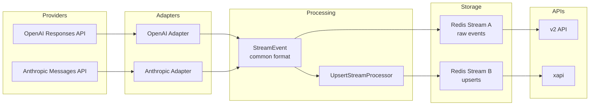
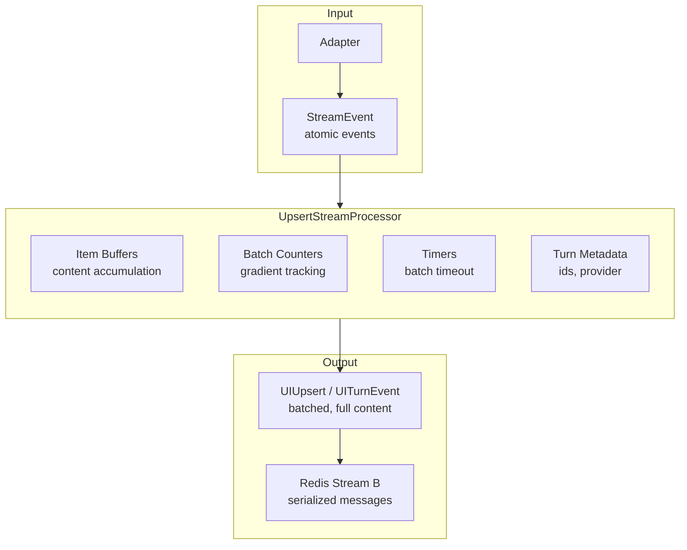

# Slice 001: UpsertStreamProcessor Interface Shapes

**Project:** 04-stream-management
**Slice:** 001-upsert-stream-processor-shapes
**Status:** In Progress

---

## High-Level Architecture

---

## What We Are Transforming and Why

The adapters normalize vendor-specific streaming formats into a common StreamEvent format. This format is designed for internal system use - atomic events that can be reduced to build complete Response objects. It works well for persistence and debugging but creates complexity for UI consumption.

The UI needs to render content as it streams. With the current format, the UI must track item state, handle origin changes mid-stream, buffer deltas, detect duplicates, and manage timing. This complexity has proven difficult for coding agents to maintain without introducing bugs.

The UpsertStreamProcessor transforms the atomic StreamEvent format into a UI-friendly UIUpsert format. Each upsert contains complete current state for an item - the UI simply binds the content without tracking deltas or managing state.

**Key benefits:**
- UI becomes stateless renderer - just bind what arrives
- Batching reduces event frequency while maintaining responsiveness
- Full content per upsert enables self-healing on missed events
- Server-side complexity is isolated and testable
- Same format works for streaming and persistence loading

---

## Core Data Flow

---

## Post-Adapter Format: StreamEvent

This is the input to the UpsertStreamProcessor. Already defined in the codebase, summarized here for reference.

**StreamEvent** - envelope for all events

| Attribute | Type | Description |
|-----------|------|-------------|
| event_id | string (uuid) | Unique identifier for this event |
| timestamp | number | Milliseconds since epoch |
| trace_context | TraceContext | Distributed tracing info |
| run_id | string (uuid) | Identifies the turn/run |
| type | string | Event type discriminator |
| payload | object | Type-specific payload |

**Payload Types:**

**response_start** - Turn is beginning

| Attribute | Type | Description |
|-----------|------|-------------|
| type | "response_start" | Discriminator |
| response_id | string (uuid) | Same as run_id |
| turn_id | string (uuid) | Turn identifier |
| thread_id | string (uuid) | Thread identifier |
| agent_id | string (uuid), optional | Agent identifier |
| model_id | string | Model identifier |
| provider_id | string | Provider (e.g., "anthropic", "openai") |
| created_at | number | Timestamp |

**item_start** - New output item beginning

| Attribute | Type | Description |
|-----------|------|-------------|
| type | "item_start" | Discriminator |
| item_id | string | Unique item identifier |
| item_type | string | One of: message, reasoning, function_call, function_call_output, error |
| initial_content | string, optional | Starting content if any |
| name | string, optional | Tool name for function_call |
| arguments | string, optional | Initial arguments for function_call |
| code | string, optional | For script_execution |

**item_delta** - Content chunk for an item

| Attribute | Type | Description |
|-----------|------|-------------|
| type | "item_delta" | Discriminator |
| item_id | string | Which item this delta belongs to |
| delta_content | string | The new content chunk |

**item_done** - Item is complete

| Attribute | Type | Description |
|-----------|------|-------------|
| type | "item_done" | Discriminator |
| item_id | string | Which item completed |
| final_item | OutputItem | Complete item with all fields |

**item_error** - Error on specific item

| Attribute | Type | Description |
|-----------|------|-------------|
| type | "item_error" | Discriminator |
| item_id | string | Which item errored |
| error | ErrorObject | Error details (code, message, stack) |

**response_done** - Turn is complete

| Attribute | Type | Description |
|-----------|------|-------------|
| type | "response_done" | Discriminator |
| response_id | string (uuid) | Which response completed |
| status | string | One of: complete, error, aborted |
| usage | object, optional | Token counts (prompt, completion, total) |
| finish_reason | string, nullable | Why generation stopped |

**response_error** - Turn-level error

| Attribute | Type | Description |
|-----------|------|-------------|
| type | "response_error" | Discriminator |
| response_id | string (uuid) | Which response errored |
| error | ErrorObject | Error details |

---

## Post-Processor Format: UIUpsert and UITurnEvent

These are the outputs from the UpsertStreamProcessor.

### UIUpsert - Item content update

| Attribute | Type | Description |
|-----------|------|-------------|
| type | "item_upsert" | Discriminator |
| turnId | string (uuid) | Turn this belongs to |
| threadId | string (uuid) | Thread this belongs to |
| itemId | string | Item identifier |
| itemType | string | One of: message, reasoning, tool_call, tool_output, error |
| changeType | string | One of: created, updated, completed |
| content | string | Full accumulated content up to this point |
| origin | string, optional | For messages: user, agent, or system |
| providerId | string, optional | For reasoning: which provider (for UI filtering) |
| toolName | string, optional | For tool_call: name of the tool |
| toolArguments | object, optional | For tool_call: parsed arguments |
| callId | string, optional | For tool_call and tool_output: links them together |
| toolOutput | object or string, optional | For tool_output: parsed result |
| success | boolean, optional | For tool_output: whether tool succeeded |
| errorCode | string, optional | For error: error code |
| errorMessage | string, optional | For error: error description |

### UITurnEvent - Turn lifecycle event

| Attribute | Type | Description |
|-----------|------|-------------|
| type | string | One of: turn_started, turn_completed, turn_error |
| turnId | string (uuid) | Turn identifier |
| threadId | string (uuid) | Thread identifier |
| modelId | string, optional | For turn_started: model being used |
| providerId | string, optional | For turn_started: provider being used |
| status | string, optional | For turn_completed: complete, error, or aborted |
| usage | object, optional | For turn_completed: promptTokens, completionTokens, totalTokens |
| error | object, optional | For turn_error: code and message |

### Redis Stream B Message - Envelope for Redis

| Attribute | Type | Description |
|-----------|------|-------------|
| eventId | string (uuid) | Unique identifier for this emission |
| timestamp | number | Milliseconds since epoch |
| turnId | string (uuid) | For stream key construction |
| payloadType | string | Either "item_upsert" or "turn_event" |
| payload | string | JSON serialized UIUpsert or UITurnEvent |

Stream key pattern: `codex:turn:{turnId}:upserts`

---

## UpsertStreamProcessor Methods

**constructor(options: UpsertStreamProcessorOptions)**

Creates a new processor instance for a single turn.

Options:
| Option | Type | Description |
|--------|------|-------------|
| turnId | string (uuid) | Turn identifier |
| threadId | string (uuid) | Thread identifier |
| batchGradient | number[] | Token counts per batch level, e.g., [10, 10, 20, 20, 50, ...] |
| batchTimeoutMs | number | Max milliseconds before forcing batch emit, default 1000 (safety fallback, not primary mechanism) |
| onEmit | function | Async callback receiving StreamBMessage to write to Redis |
| retryAttempts | number | Number of retry attempts on emit failure, default 3 |
| retryBaseMs | number | Base delay for exponential backoff, default 1000 |
| retryMaxMs | number | Maximum retry delay, default 10000 |

**processEvent(event: StreamEvent): Promise\<void\>**

Process a single incoming event. May buffer internally or emit immediately depending on event type and batch state.

**flush(): Promise\<void\>**

Force emit all pending buffered content. Called on turn completion or error.

**destroy(): void**

Cleanup all resources. Clears timers, releases buffers. Must be called when processor is no longer needed to prevent memory leaks.

**getBufferState(): Map\<string, BufferInfo\>**

Returns current buffer state for testing/debugging. BufferInfo contains itemId, tokenCount, content length, and batch index.

---

## Functional Description

The UpsertStreamProcessor maintains internal state for each item in a turn. When events arrive:

**On response_start:**
- Store turn metadata (turnId, threadId, modelId, providerId)
- Emit turn_started event immediately

**On item_start:**
- Create new item buffer
- If item is a user message (detected by item_id pattern or origin), mark as held
- If initial_content provided and not held, may emit created upsert

**On item_delta:**
- Append delta_content to item buffer
- Increment token count (estimated as character count divided by 4)
- Check if batch threshold reached (based on gradient and current batch index)
- If threshold reached, emit updated upsert with full accumulated content, advance batch index
- Reset batch timer

**On item_done:**
- If item was held (user message), emit single created+completed upsert with correct origin
- Otherwise emit completed upsert with final content
- Clear item buffer

**On item_error:**
- Emit error upsert for the item
- Clear item buffer

**On response_done:**
- Flush any remaining buffered content
- Emit turn_completed event with status and usage

**On response_error:**
- Flush any remaining buffered content
- Emit turn_error event

**Batch timing:**
- Each item has a batch timer (default 1000ms)
- Timer is a safety fallback, not the primary batching mechanism
- Normal flow: batch gradient thresholds or item_done trigger emits
- Timer only fires if stream stalls, packets lost, or provider delays
- Timer resets on each delta
- If timer fires, emit current buffered content as "updated"

**Retry logic:**
- If onEmit fails, retry up to retryAttempts times
- Use exponential backoff starting at retryBaseMs
- Cap delay at retryMaxMs
- If all retries fail, throw error

---

## Output Object Types

### Message Upsert (user)

Emitted once when user message item completes. Held until item_done to ensure correct origin.

| Field | Value |
|-------|-------|
| type | "item_upsert" |
| itemType | "message" |
| changeType | "completed" |
| origin | "user" |
| content | Full message text |

### Message Upsert (agent)

Emitted multiple times as content streams. First emission is "created", subsequent are "updated", final is "completed".

| Field | Value |
|-------|-------|
| type | "item_upsert" |
| itemType | "message" |
| changeType | "created" or "updated" or "completed" |
| origin | "agent" |
| content | Full accumulated text so far |

### Reasoning Upsert

Emitted for thinking/reasoning blocks. Includes providerId so UI can decide whether to display.

| Field | Value |
|-------|-------|
| type | "item_upsert" |
| itemType | "reasoning" |
| changeType | "created" or "updated" or "completed" |
| providerId | "anthropic" or "openai" etc |
| content | Full accumulated reasoning text |

### Tool Call Upsert

Emitted when function_call item completes. Not streamed (arguments come complete).

| Field | Value |
|-------|-------|
| type | "item_upsert" |
| itemType | "tool_call" |
| changeType | "completed" |
| toolName | Name of the tool |
| toolArguments | Parsed arguments object |
| callId | Identifier linking to output |

### Tool Output Upsert

Emitted when function_call_output item completes.

| Field | Value |
|-------|-------|
| type | "item_upsert" |
| itemType | "tool_output" |
| changeType | "completed" |
| callId | Links to corresponding tool_call |
| toolOutput | Parsed output object or string |
| success | Boolean indicating success |

### Error Upsert

Emitted on item_error.

| Field | Value |
|-------|-------|
| type | "item_upsert" |
| itemType | "error" |
| changeType | "completed" |
| errorCode | Error code string |
| errorMessage | Error description |

### Turn Started Event

Emitted immediately on response_start.

| Field | Value |
|-------|-------|
| type | "turn_started" |
| turnId | Turn identifier |
| threadId | Thread identifier |
| modelId | Model being used |
| providerId | Provider being used |

### Turn Completed Event

Emitted on response_done after flushing buffers.

| Field | Value |
|-------|-------|
| type | "turn_completed" |
| turnId | Turn identifier |
| threadId | Thread identifier |
| status | "complete" or "error" or "aborted" |
| usage | Token counts if available |

### Turn Error Event

Emitted on response_error.

| Field | Value |
|-------|-------|
| type | "turn_error" |
| turnId | Turn identifier |
| threadId | Thread identifier |
| error | Object with code and message |

---

## Functional Test Cases

### TC-01: Simple Agent Message

**Scenario:** Agent responds with a short message under one batch threshold.

**Input events:**
1. response_start with provider "anthropic"
2. item_start with item_id "msg-1", item_type "message"
3. item_delta with delta_content "Hello there!"
4. item_done with final_item containing content "Hello there!", origin "agent"
5. response_done with status "complete"

**Expected outputs:**
1. turn_started event with modelId, providerId
2. item_upsert: itemType "message", changeType "created", content "Hello there!", origin "agent"
3. item_upsert: itemType "message", changeType "completed", content "Hello there!", origin "agent"
4. turn_completed event with status "complete"

---

### TC-02: Agent Message With Batching

**Scenario:** Agent responds with content that exceeds first batch threshold (10 tokens).

**Input events:**
1. response_start
2. item_start with item_id "msg-1", item_type "message"
3. item_delta with 20 characters (~5 tokens) "Hello, how are you?"
4. item_delta with 30 characters (~8 tokens) " I hope you're having a great"
5. item_delta with 20 characters (~5 tokens) " day today!"
6. item_done with final content
7. response_done

**Expected outputs:**
1. turn_started
2. item_upsert: changeType "created", content "Hello, how are you?" (after first delta, under threshold)
3. item_upsert: changeType "updated", content "Hello, how are you? I hope you're having a great" (threshold crossed)
4. item_upsert: changeType "completed", content "Hello, how are you? I hope you're having a great day today!"
5. turn_completed

---

### TC-03: User Message (Held Until Complete)

**Scenario:** User message should not emit until item_done to ensure correct origin.

**Input events:**
1. response_start
2. item_start with item_id "run-123-user-prompt", item_type "message"
3. item_done with final_item containing content "What is the weather?", origin "user"
4. (agent response events...)
5. response_done

**Expected outputs:**
1. turn_started
2. item_upsert: itemType "message", changeType "completed", content "What is the weather?", origin "user"
3. (agent response upserts...)
4. turn_completed

Note: No "created" or "updated" emitted for user message - single "completed" emission.

---

### TC-04: Anthropic Reasoning Block

**Scenario:** Anthropic model emits thinking/reasoning before response.

**Input events:**
1. response_start with provider "anthropic"
2. item_start with item_type "reasoning"
3. item_delta with reasoning content (multiple deltas)
4. item_done for reasoning
5. item_start with item_type "message"
6. item_delta with message content
7. item_done for message
8. response_done

**Expected outputs:**
1. turn_started with providerId "anthropic"
2. item_upsert: itemType "reasoning", changeType "created", providerId "anthropic"
3. item_upsert: itemType "reasoning", changeType "updated" (if batching triggers)
4. item_upsert: itemType "reasoning", changeType "completed"
5. item_upsert: itemType "message", changeType "created"
6. item_upsert: itemType "message", changeType "completed"
7. turn_completed

---

### TC-05: Tool Call and Output

**Scenario:** Agent calls a tool and receives output.

**Input events:**
1. response_start
2. item_start with item_type "function_call", name "read_file"
3. item_done with final_item containing name "read_file", arguments '{"path": "/tmp/test.txt"}', call_id "call-1"
4. item_start with item_type "function_call_output"
5. item_done with final_item containing call_id "call-1", output '{"content": "file contents"}', success true
6. (agent continues with message...)
7. response_done

**Expected outputs:**
1. turn_started
2. item_upsert: itemType "tool_call", changeType "completed", toolName "read_file", toolArguments {path: "/tmp/test.txt"}, callId "call-1"
3. item_upsert: itemType "tool_output", changeType "completed", callId "call-1", toolOutput {content: "file contents"}, success true
4. (message upserts...)
5. turn_completed

---

### TC-06: Multiple Tool Calls in Sequence

**Scenario:** Agent calls multiple tools before responding.

**Input events:**
1. response_start
2. function_call "read_file" with call_id "call-1"
3. function_call_output for "call-1"
4. function_call "write_file" with call_id "call-2"
5. function_call_output for "call-2"
6. agent message
7. response_done

**Expected outputs:**
1. turn_started
2. tool_call upsert for "read_file"
3. tool_output upsert for call-1
4. tool_call upsert for "write_file"
5. tool_output upsert for call-2
6. message upserts
7. turn_completed

---

### TC-07: Item Error Mid-Stream

**Scenario:** An item encounters an error during processing.

**Input events:**
1. response_start
2. item_start for message
3. item_delta with partial content
4. item_error with error code "CONTENT_FILTER", message "Content blocked"
5. response_done with status "error"

**Expected outputs:**
1. turn_started
2. item_upsert: changeType "created" with partial content
3. item_upsert: itemType "error", errorCode "CONTENT_FILTER", errorMessage "Content blocked"
4. turn_completed with status "error"

---

### TC-08: Response Error

**Scenario:** Turn-level error occurs.

**Input events:**
1. response_start
2. response_error with error code "RATE_LIMIT", message "Too many requests"

**Expected outputs:**
1. turn_started
2. turn_error with error code "RATE_LIMIT", message "Too many requests"

---

### TC-09: Batch Timeout (Safety Fallback)

**Scenario:** Stream stalls, timeout forces emit of buffered content.

**Setup:**
- batchTimeoutMs set to 1000ms (or shorter for test)

**Input events:**
1. response_start
2. item_start for message
3. item_delta with 10 characters (~2 tokens)
4. (timeout period passes with no more deltas)
5. item_delta with 10 more characters
6. item_done

**Expected outputs:**
1. turn_started
2. item_upsert: changeType "created" with first delta content
3. item_upsert: changeType "updated" with accumulated content (after timeout fires)
4. item_upsert: changeType "updated" with more content (or merged with next)
5. item_upsert: changeType "completed"
6. turn_completed

Note: In normal operation, batch gradient or item_done triggers emits before timeout. This test verifies the safety fallback.

---

### TC-10: Batch Gradient Progression

**Scenario:** Long response exercises multiple batch gradient levels.

**Input events:**
1. response_start
2. item_start for message
3. Multiple item_deltas totaling ~500 tokens

**Expected outputs:**
1. turn_started
2. Upserts at approximately: 10, 20, 40, 60, 110, 160, 210, 260, 360, 460 tokens (following gradient)
3. Final completed upsert
4. turn_completed

Gradient: [10, 10, 20, 20, 50, 50, 50, 50, 100, 100, ...]
Cumulative thresholds: 10, 20, 40, 60, 110, 160, 210, 260, 360, 460, ...

---

### TC-11: Empty Content Item

**Scenario:** Item starts and completes with no content.

**Input events:**
1. response_start
2. item_start with item_type "message", no initial_content
3. item_done with empty content
4. response_done

**Expected outputs:**
1. turn_started
2. item_upsert: changeType "completed", content "" (empty string)
3. turn_completed

---

### TC-12: Flush on Destroy

**Scenario:** Processor destroyed with content still buffered.

**Input events:**
1. response_start
2. item_start for message
3. item_delta with content
4. (destroy() called without item_done or response_done)

**Expected behavior:**
- flush() should be called implicitly or explicitly before destroy()
- Any buffered content should be emitted
- Timers should be cleared
- No memory leaks

---

### TC-13: Redis Emit Retry

**Scenario:** First emit attempt fails, retry succeeds.

**Setup:**
- onEmit configured to fail once then succeed

**Input events:**
1. response_start

**Expected behavior:**
- First emit attempt fails
- Wait 1 second (retryBaseMs)
- Second emit attempt succeeds
- turn_started event eventually delivered

---

### TC-14: Redis Emit Retry Exhausted

**Scenario:** All retry attempts fail.

**Setup:**
- onEmit configured to always fail
- retryAttempts set to 3

**Input events:**
1. response_start

**Expected behavior:**
- Attempt 1 fails, wait 1s
- Attempt 2 fails, wait 2s
- Attempt 3 fails, wait 4s (capped at 10s)
- Attempt 4 fails
- processEvent throws error after retries exhausted

---

## Next Steps

1. Review SKELETON-BUILD.md for implementation details
2. Coder builds skeleton module with all types, classes, methods
3. All methods throw NotImplementedError (except noted exceptions)
4. Verify skeleton compiles with `bun run typecheck`
5. Add test harness in Slice 002
6. Implement methods incrementally with TDD
