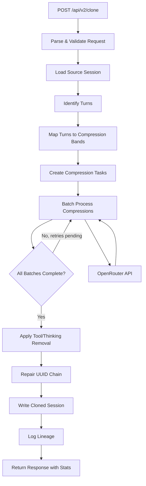
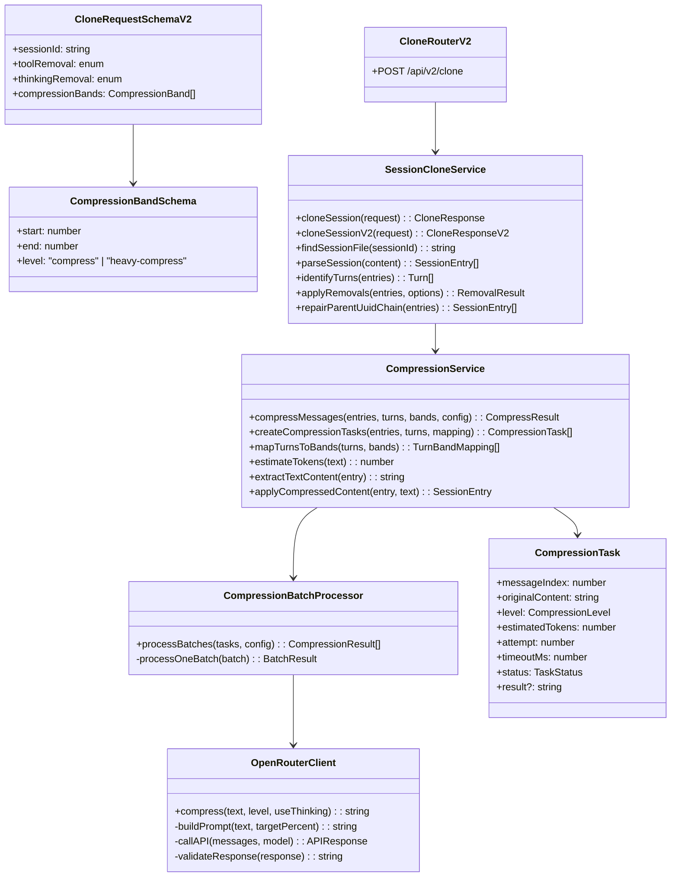
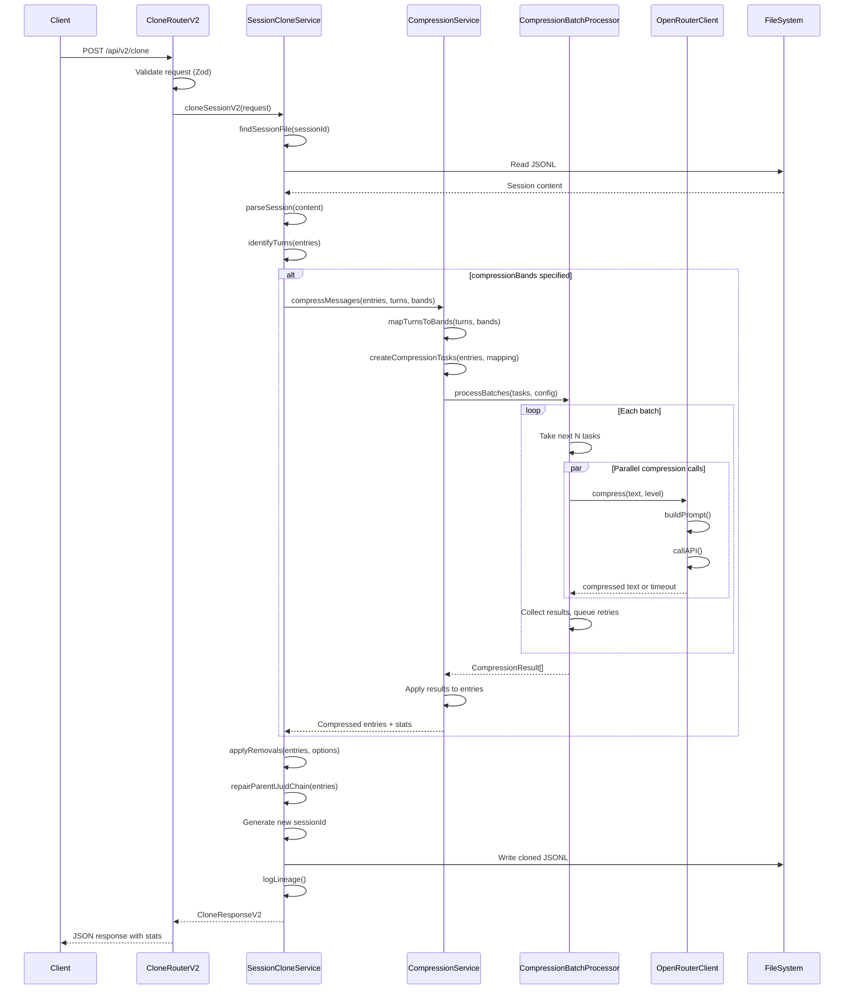

# Tech Design: Message Compression for Session Cloning

## 1. Feature Summary

### Overview

This feature extends the session cloning capability with LLM-based message compression. Users can specify percentage bands of conversation history, and messages within those bands are individually compressed via external LLM calls (OpenRouter). This enables significant context window reclamation while preserving semantic meaning.

### Functional Description

When a user calls `POST /api/v2/clone` with compression bands specified, the system:

1. Loads the source session and identifies turn boundaries
2. Maps turns to compression bands based on percentage positions
3. Wraps messages requiring compression in task objects with compression configuration
4. Processes compression tasks in parallel batches with timeout and retry handling
5. Replaces original message content with compressed content
6. Applies existing tool/thinking removal (independent of compression)
7. Writes the cloned session with compressed content and returns statistics

Compression targets ~10% for "heavy-compress" and ~30-40% for "compress" level. Messages under 20 tokens are skipped. Messages over 1000 tokens trigger thinking mode for that compression call.

---

## 2. Tech Overview

### Data Flow Diagram



### Process Steps

1. **Request Validation** - Validate incoming request including sessionId (UUID), optional compressionBands array, and existing toolRemoval/thinkingRemoval options. Reject overlapping bands.

2. **Load Source Session** - Find and load the JSONL session file from `~/.claude/projects/*/` directories.

3. **Identify Turns** - Scan entries for turn boundaries using existing `identifyTurns()` logic (user text content marks new turn).

4. **Map Turns to Bands** - Calculate which turns fall into which compression bands based on percentage ranges. Entire turns stay in one band.

5. **Create Compression Tasks** - For each message in a compression band (above minimum token threshold), create a task object containing: message reference, compression level, model config, estimated tokens, attempt count.

6. **Batch Process Compressions** - Process tasks in parallel batches (default concurrency 10). Each task has a timeout. Failed/timed-out tasks roll into next batch with increased timeout. After max retries (4), leave uncompressed and log warning.

7. **Apply Tool/Thinking Removal** - Apply existing removal logic independent of compression (unchanged from v1).

8. **Repair UUID Chain** - Fix parentUuid references broken by any deletions.

9. **Write Cloned Session** - Generate new sessionId, update entries, write to same project directory.

10. **Return Response** - Include all existing stats plus compression stats: messagesCompressed, originalTokens, compressedTokens, tokensRemoved, compressionFailures.

---

## 3. Module Architecture

### UML Class/Module Diagram



### Module Descriptions

- **CloneRouterV2** (`src/routes/clone-v2.ts`) - Express router for v2 endpoint. Validates request, calls service, formats response.

- **CloneRequestSchemaV2** (`src/schemas/clone-v2.ts`) - Zod schema extending v1 with compressionBands array. Includes validation for non-overlapping bands.

- **SessionCloneServiceV2** (`src/services/session-clone.ts`) - Adds `cloneSessionV2()` function to existing file. Orchestrates the clone operation with compression flow. Shared functions (`findSessionFile`, `parseSession`, etc.) are reused.

- **CompressionService** (`src/services/compression.ts`) - Creates compression tasks from entries/bands, delegates to batch processor, collects results.

- **CompressionBatchProcessor** (`src/services/compression-batch.ts`) - Handles parallel batch execution with timeout and retry logic.

- **OpenRouterClient** (`src/services/openrouter-client.ts`) - Encapsulates OpenRouter API calls. Builds prompts, handles JSON response parsing.

- **CompressionTask** (`src/types.ts`) - Type definition for compression work items including retry state.

---

## 4. Sequence Diagram



### Sequence Description

The sequence above illustrates the complete v2 clone operation with compression.

**Existing v1 code path** (unchanged):
- Request validation via Zod schema
- `findSessionFile()` searches project directories for session JSONL
- `parseSession()` converts JSONL to SessionEntry array
- `identifyTurns()` detects turn boundaries by finding user text content
- `applyRemovals()` removes tool_use/tool_result/thinking blocks based on percentage bands
- `repairParentUuidChain()` fixes broken parentUuid references after deletions
- New sessionId generated, entries updated, file written, lineage logged

**New compression additions** (not yet implemented):
- After turn identification, if `compressionBands` is specified, flow branches into compression
- `CompressionService.compressMessages()` orchestrates the compression process
- `mapTurnsToBands()` calculates which turns fall into which percentage bands, keeping entire turns together
- `createCompressionTasks()` wraps each message in a compression band into a task object (skipping messages under 20 tokens)
- `CompressionBatchProcessor.processBatches()` executes tasks in parallel batches
- Each batch runs `Promise.allSettled()` with configurable concurrency (default 10)
- Each task has a timeout (starting 5s, increasing on retry)
- `OpenRouterClient.compress()` makes the actual LLM call - builds prompt with target percentage, calls OpenRouter API, parses JSON response
- Failed/timed-out tasks get `attempt++` and `timeoutMs` increased, then go to next batch
- After max attempts (4), task is marked failed and original content preserved
- Results are collected and applied: compressed content replaces original in entries
- Statistics tracked throughout: messagesCompressed, originalTokens, compressedTokens, failures

---

## 5. Method Inventory

### New Types (`src/types.ts`)

```typescript
// Compression level determines target percentage
type CompressionLevel = "compress" | "heavy-compress";

// Band specification from request
interface CompressionBand {
  start: number;      // 0-100
  end: number;        // 0-100
  level: CompressionLevel;
}

// Task wrapper for compression work
interface CompressionTask {
  messageIndex: number;       // Index in entries array
  entryType: "user" | "assistant";
  originalContent: string;    // Text content to compress
  level: CompressionLevel;
  estimatedTokens: number;
  attempt: number;            // 0-3
  timeoutMs: number;          // 5000, 10000, 15000, 15000
  status: "pending" | "success" | "failed";
  result?: string;            // Compressed text when success
  error?: string;             // Error message when failed
}

// Mapping of turn to band
interface TurnBandMapping {
  turnIndex: number;
  band: CompressionBand | null;  // null = no compression
}

// Compression statistics
interface CompressionStats {
  messagesCompressed: number;
  messagesSkipped: number;      // Below token threshold
  messagesFailed: number;       // After max retries
  originalTokens: number;
  compressedTokens: number;
  tokensRemoved: number;
  reductionPercent: number;
}

// New error type (add to src/errors.ts)
class ConfigMissingError extends Error {
  constructor(configName: string) {
    super(`Required configuration missing: ${configName}`);
    this.name = "ConfigMissingError";
  }
}
```

### New Schema (`src/schemas/clone-v2.ts`)

```typescript
// Compression band schema
CompressionBandSchema = z.object({
  start: z.number().min(0).max(100),
  end: z.number().min(0).max(100),
  level: z.enum(["compress", "heavy-compress"]),
}).refine(data => data.start < data.end, "start must be less than end");

// V2 request extends V1 with compressionBands
CloneRequestSchemaV2 = z.object({
  sessionId: z.string().uuid(),
  toolRemoval: z.enum(["none", "50", "75", "100"]).default("none"),
  thinkingRemoval: z.enum(["none", "50", "75", "100"]).default("none"),
  compressionBands: z.array(CompressionBandSchema).optional(),
}).refine(validateNonOverlappingBands, "Compression bands must not overlap");

// Compression stats schema
CompressionStatsSchema = z.object({
  messagesCompressed: z.number(),
  messagesSkipped: z.number(),
  messagesFailed: z.number(),
  originalTokens: z.number(),
  compressedTokens: z.number(),
  tokensRemoved: z.number(),
  reductionPercent: z.number(),
});

// V2 response - full structure
CloneResponseSchemaV2 = z.object({
  success: z.boolean(),
  outputPath: z.string(),
  stats: z.object({
    originalTurnCount: z.number(),
    outputTurnCount: z.number(),
    toolCallsRemoved: z.number(),
    thinkingBlocksRemoved: z.number(),
    compression: CompressionStatsSchema.optional(),
  }),
});

// LLM compression response schema (for validating OpenRouter responses)
CompressionResponseSchema = z.object({
  text: z.string(),
});
```

### New Module: `src/services/compression.ts`

```typescript
// Main entry point for compression
async function compressMessages(
  entries: SessionEntry[],
  turns: Turn[],
  bands: CompressionBand[],
  config: CompressionConfig
): Promise<{ entries: SessionEntry[], stats: CompressionStats }>
// - Maps turns to bands
// - Creates compression tasks for messages in bands
// - Delegates to batch processor
// - Applies results to entries
// - Returns modified entries and stats

function mapTurnsToBands(
  turns: Turn[],
  bands: CompressionBand[]
): TurnBandMapping[]
// Turn-to-Band Mapping Algorithm:
// 1. For each turn, calculate position: turnPosition = (turnIndex / totalTurns) * 100
// 2. A turn falls within a band if: band.start <= turnPosition < band.end
// 3. Bands are non-overlapping (enforced by schema validation)
// 4. If turn doesn't fall in any band, mapping.band = null (no compression)
//
// Example: 10 turns, band [0, 50]
//   Turn 0: 0% → in band
//   Turn 4: 40% → in band
//   Turn 5: 50% → NOT in band (next band starts here)
//
// Edge cases:
//   - 0 turns: return empty array
//   - 1 turn: position = 0%, matches bands starting at 0

function createCompressionTasks(
  entries: SessionEntry[],
  turns: Turn[],
  mapping: TurnBandMapping[]
): CompressionTask[]
// - For each turn in a band, create tasks for user and assistant messages
// - Skip messages below minimum token threshold
// - Initialize task with attempt=0, timeoutMs=5000, status="pending"

function estimateTokens(text: string): number
// - Return ceil(text.length / 4)
// - Called on result of extractTextContent(), not raw entry
// - Used for: minimum threshold check (20 tokens), thinking mode threshold (1000 tokens)

function applyCompressionResults(
  entries: SessionEntry[],
  results: CompressionTask[]
): SessionEntry[]
// - For each successful task, call applyCompressedContent() to replace message content
// - For failed tasks, leave original content

function extractTextContent(entry: SessionEntry): string
// - If entry.message.content is a string, return it directly
// - If entry.message.content is an array:
//   - Filter to blocks where block.type === "text"
//   - Extract block.text from each text block
//   - Join with newlines
//   - Return joined string
// - If no text content found, return empty string

function applyCompressedContent(entry: SessionEntry, compressedText: string): SessionEntry
// - If entry.message.content is a string:
//   - Replace entry.message.content with compressedText
// - If entry.message.content is an array:
//   - Remove all blocks where block.type === "text"
//   - Add single new block: { type: "text", text: compressedText }
//   - Preserve non-text blocks (images, etc.) in their original positions
// - Return modified entry
```

### New Module: `src/services/compression-batch.ts`

```typescript
async function processBatches(
  tasks: CompressionTask[],
  config: BatchConfig
): Promise<CompressionTask[]>
// - Process tasks in batches of config.concurrency
// - Use Promise.allSettled for parallel execution
// - For each failed/timeout task:
//   - Increment task.attempt
//   - Set task.timeoutMs based on attempt: [5000, 10000, 15000, 15000][attempt]
//   - Add to next batch
// - After max attempts (4), mark task as failed, log warning
// - Return all tasks with final status

async function compressWithTimeout(
  task: CompressionTask,
  client: OpenRouterClient
): Promise<CompressionTask>
// - Create AbortController with timeout
// - Call client.compress()
// - Return task with result or error
```

### New Module: `src/services/openrouter-client.ts`

```typescript
class OpenRouterClient {
  constructor(config: OpenRouterConfig)
  // - Store API key, base URL, default model
  // - Throw ConfigMissingError if API key not provided

  async compress(
    text: string,
    level: CompressionLevel,
    useThinking: boolean
  ): Promise<string>
  // - Build prompt with target percentage
  // - Select model (append :thinking if useThinking)
  // - Call API
  // - Validate response with CompressionResponseSchema
  // - Return compressed text

  private buildPrompt(text: string, targetPercent: number): string
  // Prompt template (adapted from team-bruce TextCompressor):
  //
  // """
  // You are TextCompressor. Rewrite the text below to approximately {targetPercent}%
  // of its original length while preserving intent and factual meaning.
  //
  // Token estimation: tokens ≈ ceil(characters / 4)
  //
  // Rules:
  // - Preserve key entities, claims, and relationships
  // - Remove redundancy, filler, and hedging
  // - Keep fluent English
  // - If unsure about length, err shorter
  // - Do not include explanations or commentary outside the JSON
  // - Do not reference "I", "we", "user", "assistant", or conversation roles
  //
  // Return exactly one JSON object: {"text": "your compressed text"}
  //
  // Input text:
  // <<<CONTENT
  // {text}
  // CONTENT
  // """

  private async callAPI(
    messages: Message[],
    model: string,
    signal?: AbortSignal
  ): Promise<APIResponse>
  // - POST to OpenRouter /chat/completions
  // - Handle response parsing
  // - Throw on error

  private validateResponse(response: unknown): string
  // - Parse response as JSON if string
  // - Validate against CompressionResponseSchema
  // - If validation fails, throw error (will trigger retry)
  // - Return response.text
}
```

### New Router: `src/routes/clone-v2.ts`

```typescript
cloneRouterV2.post("/clone", ...)
// - Validate with CloneRequestSchemaV2 (includes overlapping bands rejection)
// - Call cloneSessionV2()
// - Handle errors:
//   - SessionNotFoundError → 404
//   - NotImplementedError → 501
//   - ConfigMissingError → 500 with message about missing config
//   - Other errors → 500
// - Return CloneResponseV2
```

### Modified: `src/services/session-clone.ts`

```typescript
// Add new function to existing file (alongside cloneSession v1)
async function cloneSessionV2(request: CloneRequestV2): Promise<CloneResponseV2>
// - Same flow as cloneSession() but:
// - After identifyTurns(), if compressionBands present:
//   - Call compressMessages(entries, turns, bands, config)
//   - Use returned entries for subsequent processing
// - Include compression stats in response
// - Call logLineage() with compression info

// Existing functions remain unchanged:
// - findSessionFile()
// - parseSession()
// - identifyTurns()
// - applyRemovals()
// - repairParentUuidChain()
// - cloneSession() (v1)
```

### Modified: `src/services/lineage-logger.ts`

```typescript
// Update LineageEntry interface to include compression info
interface LineageEntry {
  timestamp: string;
  targetId: string;
  targetPath: string;
  sourceId: string;
  sourcePath: string;
  toolRemoval: string;
  thinkingRemoval: string;
  // New fields for compression
  compressionBands?: CompressionBand[];
  compressionStats?: CompressionStats;
}
```

### Modified: `src/server.ts`

```typescript
// Add v2 router registration
import { cloneRouterV2 } from "./routes/clone-v2.js";

app.use("/api/v2", cloneRouterV2);
```

---

## 6. V1 vs V2 Considerations

### V1 Preservation Strategy

The existing `POST /api/clone` endpoint must remain completely unchanged. To achieve this:

1. **New Route File** - Create `src/routes/clone-v2.ts` rather than modifying `clone.ts`

2. **New Schema File** - Create `src/schemas/clone-v2.ts` rather than modifying `clone.ts`

3. **Service Approach** - Add `cloneSessionV2()` function to existing `session-clone.ts`. This keeps related logic together, avoids duplication, and leaves the v1 `cloneSession()` function unchanged.

4. **Shared Code** - The following functions are used by both v1 and v2:
   - `findSessionFile()`
   - `parseSession()`
   - `identifyTurns()`
   - `applyRemovals()`
   - `repairParentUuidChain()`
   - `logLineage()` (extended with optional compression fields)

   These remain in `session-clone.ts` and are called by both `cloneSession()` (v1) and `cloneSessionV2()` (v2).

5. **Type Additions** - New types are additive, won't break existing code

6. **Config Additions** - New environment variables for compression are optional; v1 doesn't use them

7. **Error Additions** - `ConfigMissingError` added to `errors.ts`; v1 doesn't throw it

---

## 7. Development Approach

### Testing Strategy: Service Mocks

Tests are structured as **service tests with external mocks**, not traditional unit tests. This means:

- **Entry Point**: Tests call the route handler or service function directly (e.g., `cloneSessionV2()`)
- **Exercise Full Code Path**: All internal logic executes - turn detection, band mapping, task creation, batch processing, result application
- **External Mocks**: Only external dependencies are mocked:
  - File system (`fs/promises`) - provide fixture data
  - OpenRouter API (`OpenRouterClient`) - return canned responses
  - UUID generation (`crypto.randomUUID`) - return predictable values
  - Timestamps (`Date.now`) - return fixed values

This approach validates that the entire code path works correctly without hitting external services.

### Test Framework

- **Vitest** - In-process test execution
- **vi.mock()** - For mocking modules
- **Fixtures** - JSONL session files with known content for predictable testing

### Work Sequencing

#### Phase 1: Skeleton (TDD Setup)

**Goal**: All new modules, types, and function signatures in place. Functions throw `NotImplementedError`. Tests can be written against the interfaces.

**Deliverables**:
- `src/types.ts` - Add new types (CompressionTask, CompressionBand, etc.)
- `src/schemas/clone-v2.ts` - V2 schema with compressionBands validation
- `src/routes/clone-v2.ts` - V2 router calling stub service
- `src/services/compression.ts` - All functions stubbed
- `src/services/compression-batch.ts` - All functions stubbed
- `src/services/openrouter-client.ts` - Class with stubbed methods
- `src/services/session-clone.ts` - Add `cloneSessionV2()` stub
- `src/server.ts` - Register v2 router
- `vitest.config.ts` - Ensure new test files included
- `test/fixtures/compression/` - Test fixtures for compression tests:
  - `session-10-turns.jsonl` - Session with 10 turns for band mapping tests
  - `session-mixed-lengths.jsonl` - Messages with varying token lengths (below/above thresholds)
  - `expected/` - Expected output files for golden-file comparison

**Verification**:
- `npm run dev` starts without errors
- `GET /health` works
- `POST /api/v2/clone` returns 501 Not Implemented
- `POST /api/clone` (v1) still works
- TC-11: Overlapping bands rejected with 400 (schema validation)

#### Phase 2: TDD Red - Core Compression Logic

**Goal**: Write tests for compression task creation, band mapping, and token estimation. Tests fail with `NotImplementedError`.

**Tests**:
- TC-04: Turn cohesion (turn straddling boundary stays together)
- TC-05: Minimum token threshold (messages <20 tokens skipped)
- TC-03: Multiple non-contiguous bands mapping
- TC-10: Empty compression bands (passes through to v1 behavior)

**Verification**: All tests fail with `NotImplementedError`

#### Phase 3: TDD Green - Core Compression Logic

**Goal**: Implement `mapTurnsToBands()`, `createCompressionTasks()`, `estimateTokens()`, band validation.

**Verification**: Phase 2 tests pass

#### Phase 4: TDD Red - Batch Processing

**Goal**: Write tests for batch processing with mocked OpenRouter client.

**Tests**:
- TC-01: Basic compression band (verify messages sent to LLM)
- TC-02: Heavy compression band (verify correct target percentage)
- TC-06: Compression timeout and retry
- TC-07: Maximum retry exceeded
- TC-13: Parallel batch processing

**Verification**: All tests fail appropriately (either NotImplemented or mock not wired)

#### Phase 5: TDD Green - Batch Processing

**Goal**: Implement `processBatches()`, `compressWithTimeout()`, timeout/retry logic.

**Verification**: Phase 4 tests pass

#### Phase 6: TDD Red - OpenRouter Client

**Goal**: Write tests for OpenRouter client with mocked HTTP.

**Tests**:
- TC-09: Thinking mode threshold (>1000 tokens uses `google/gemini-2.5-flash:thinking`)
- TC-14: API key missing (throws ConfigMissingError)
- TC-15: Malformed compression response (fails Zod validation, triggers retry)
- Prompt construction tests
- JSON response parsing tests

**Verification**: Tests fail appropriately

#### Phase 7: TDD Green - OpenRouter Client

**Goal**: Implement `OpenRouterClient` class with prompt building, API calls, and Zod response validation.

**Verification**: Phase 6 tests pass

#### Phase 8: TDD Red - End-to-End Integration

**Goal**: Write full integration tests with all mocks.

**Tests**:
- TC-08: Token statistics (verify counts are accurate)
- TC-12: Combined with tool removal

**Verification**: Tests fail appropriately

#### Phase 9: TDD Green - Integration

**Goal**: Implement `compressMessages()` and `cloneSessionV2()` orchestration.

**Verification**: All tests pass

#### Phase 10: Manual Verification

**Goal**: Test with real OpenRouter API against real sessions.

**Steps**:
1. Configure real API key
2. Clone a session with compression
3. Verify cloned session loads in Claude Code
4. Verify compression stats are accurate
5. Verify compressed content is coherent

---

## Appendix: Configuration Reference

```env
# OpenRouter
OPENROUTER_API_KEY=sk-or-...
OPENROUTER_MODEL=google/gemini-2.5-flash
OPENROUTER_MODEL_LITE=google/gemini-2.5-flash-lite

# Compression settings
COMPRESSION_CONCURRENCY=10
COMPRESSION_TIMEOUT_INITIAL=5000
COMPRESSION_TIMEOUT_INCREMENT=5000
COMPRESSION_MAX_ATTEMPTS=4
COMPRESSION_MIN_TOKENS=20
COMPRESSION_THINKING_THRESHOLD=1000

# Compression targets (percentages)
COMPRESSION_TARGET_HEAVY=10
COMPRESSION_TARGET_STANDARD=35
```
